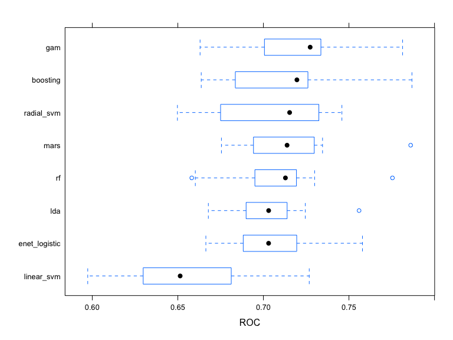
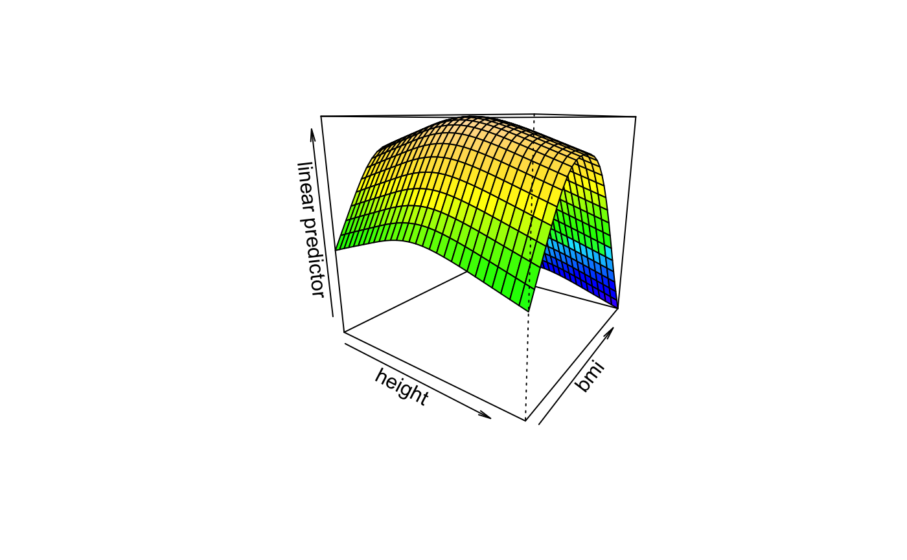

```{r setup, include=FALSE}
knitr::opts_chunk$set(echo = TRUE, 
                      message = FALSE, 
                      warning = FALSE, 
                      fig.align = "center",
                      fig.width = 8, 
                      fig.height = 6,
                      out.width = "90%")
```

\newpage
```{r, echo = FALSE}
library(gtsummary)
library(tidyverse)
```


# 1 Introduction

## 1.1 Background

To gain a better understanding of the factors that predict recovery time from COVID-19 illness, a study was designed to combine three existing cohort studies that have been tracking participants for several years. The study collects recovery information through questionnaires and medical records, and leverages existing data on personal characteristics prior to the pandemic. The ultimate goal is to develop a prediction model for recovery time and identify important risk factors for long recovery time.

## 1.2 Data Description

The dataset is a random sample of 3593 participants draw from `"recovery.RData` includes 16 variables and 3593 observations. 

Description of each variable:

- Gender (gender): 1 = Male, 0 = Female; 
- Race/ethnicity (race): 1 = White, 2 = Asian, 3 = Black, 4 = Hispanic; 
- Smoking (smoking): Smoking status; 0 = Never smoked, 1 = Former smoker, 2 = Current smoker;
- Height (height): Height (in centimeters);
- Weight (weight): Weight (in kilograms);
- BMI (bmi): Body Mass Index; BMI = weight (in kilograms) / height (in meters) squared;
- Hypertension (hypertension): 0 = No, 1 = Yes;
- Diabetes (diabetes): 0 = No, 1 = Yes;
- Systolic blood pressure (SBP): Systolic blood pressure (in mm/Hg);
- (10)LDL cholesterol (LDL): LDL (low-density lipoprotein) cholesterol (in mg/dL);
- Vaccination status at the time of infection (vaccine): 0 = Not vaccinated, 1 = Vaccinated;
- Severity of COVID-19 infection (severity): 0 = Not severe, 1= Severe;
- Study (study): The study (A/B/C) that the participant belongs to;
- Age: age of participants;
- Time to recovery (tt_recovery_time): Time from COVID-19 infection to recovery in days;
- ID: unique id of each participant.

## 1.3 Data Cleaning

Package `tidyverse` and `dplyr` are used for data cleaning, wrangling, and manipulation. Variable `ID` is omitted before data wrangling. Table 1 includes the summary of all variables including 6 continuous and 9 categorical predictors and 1 continuous response. Based on the summary, there is no missing data. Then, factor all the categorical data before data partition. Apply `caret` package to split the data into 70% train data and 30% test data. Based on the Table 1, the distribution of predictors are quite similar across different studies.

```{r, echo=FALSE}
# load data
load("data/covid_recovery.Rdata")

dat <- data %>% 
  mutate(gender = factor(gender),
         hypertension = factor(hypertension),
         diabetes = factor(diabetes),
         vaccine = factor(vaccine),
         severity = factor(severity),
         study = factor(study),
)


dat %>% select(age, height, weight, bmi, SBP, LDL, 
               recovery_time, gender, race, smoking, 
               hypertension, diabetes, vaccine, severity, 
               study) %>% tbl_summary(by = study) %>% modify_caption("**Summary of Dataset by Study Group**")
```


# 2 Exploratory analysis and data visualization:

We consider the EDA for the training data, which we will use later on to train our models. Recovery data contains 6 continuous predictors, namely age, height, weight, bmi, Systolic blood pressure (SBP) and LDL cholesterol (LDL), as well as 8 discrete/factor predictors, namely gender, race, smoking, hypertension, diabetes, vaccine status, Severity of COVID-19 infection and study which the data belongs to. The response value is the time for recovery. It is a continuous variable.

Distribution of data is included in appendix 1. In accordance to distribution of continuous variables, only the recovery time, which is the response, has a right skewed shape. All predictors are normally distributed with symmetric density plot.

The correlation plot (only considers continuous variable), calculated from Pearson Correlation in appendix 2, gives an insight of linear correlation between continuous predictors and transformed recovery time. It can be seen that bmi and weight have a relatively weak positive relation with log recovery time whereas height may have a weak negative linear correlation with log recovery time. While linear trend may be sufficient in some cases, some data may show a non-linear correlation with log recovery time. As shown in appendix 3, weight and bmi is likely to have a non-linear correlation with the response, suggesting a motivation to consider non-linear method. Box plot in appendix 4 illustrates that most data have a small difference in median. People with smoking is likely to have a higher recovery time as it has a higher median and people that are vaccinated has a lower median recovery time than the people without vaccination. Thus, we include these factors in our study of predicting recovery time.  


# 3 Model training for regression

This section describes the models used for predicting time to recovery from COVID-19. State the assumptions made by using the models and detailed description of the model training procedure and how to obtained the final model.
\
This project performs varies regression models on the dataset, including linear regression, K-Nearest Neighbors (KNN), elastic net, partial least squares (pls), generalized additive model (gam), Multivariate Adaptive Regression (mars), random forest, and boosting using 10-fold cross-validation results on train data. The model with the minimum mean of train RMSE from cross-validation results will be the optimal model. All models are implemented in `train()` function from `caret` package. To improve computation efficiency, parallel computing function from `doParallel` package is utilized.\
\
**1. Linear Model**: 

Linear model assumes a linear relationship between the predictor and response variables (linearity), and assumes that the errors are normally distributed (normality) and have constant variance (homoscedasticity), and that the observations are independent of each other. The linear model is the most basic and assumes a linear relationship between the variables, while the other models allow for more flexible relationships. A method = “lm” argument was used within the `train()` function to specify a linear model fit.\
\
**2. KNN (K-Nearest Neighbors)**:

KNN is a non-parametric machine learning algorithm that can be used for classification or regression tasks. The algorithm works by finding the K closest data points to a new input, and using their output values to predict the output value for the new input. It assume data points which exist in close proximity to each other are highly similar, while if a data point is far away from another group it's dissimilar to those data points. With `train()` function to specify the KNN model and use `expand.grid()` with sequence from 1 to 40 by 1.\
\
**3. Elastic Net Regression**:

Elastic Net combines the L1 and L2 regularization methods to prevent overfitting in the model by adding L1 and L2 penalties. Elastic net regression models have the same assumption as linear model. A method = “glmnet” argument was used within the `train() `function to specify model fit. Additionally, a grid of tuning parameters for these models were set using the "tuneGrid" argument within the `train()` function. The grid contains 100 values of the lambda parameter, ranging from exp(-10) to exp(-5) with equal intervals on the log scale for elastic net.\
\
**4. Partial Least Squares (PLS)**:

PLS is a multivariate regression method that is used to model the relationship between two sets of variables. The method works by finding the linear combination of the input variables that best explains the variation in the output variables. A method = “pls” argument was used within the `train()` function to specify a PLS model fit. Additionally, a tuning parameter for the model were set using the tuneGrid argument within the `train()` function. The tuneGrid object includes a data frame with a single column ncomp that ranges from 1 to 16, representing the number of components used in the model. It has the same assumptions as the linear model. The preProcess argument is set to “center” and “scale”, which means that the training data will be centered and scaled prior to model fitting.\
\
**5. Generalized Additive Model (GAM)**:

GAM is a type of regression model that can capture non-linear relationships between the input and output variables. The method works by modeling the input variables as a sum of smooth functions. It has the same assumptions as the linear model. A method = “gam” argument was used within the `train()` function to specify a GAM fit.\
\
**6. Multivariate Adaptive Regression Splines (MARS)**:

MARS can model non-linear relationships between the input and output variables. The method works by fitting piecewise linear or nonlinear functions to the data. It has the same assumptions as the linear model. A method = “earth” argument was used within the `train()` function to specify a MARS model fit. Additionally, the `expand.grid()` function is used to generate a grid of tuning parameters. The mars_grid object includes two arguments: degree is set to 1, 2, and 3, representing the number of possible product hinge functions in a single term, and nprune is set to integers between 2 and 20, representing the upper bound on the number of terms in the model. The tuneGrid argument in the `train()` function uses the mars_grid object to specify the parameters for model tuning.\
\
**7. Random Forest, and Boosting Regression**:

Random Forest used for regression and classification tasks. The algorithm works by training an ensemble of decision trees on different subsets of the training data and then combining their predictions. Boosting can be used to improve the accuracy of a model by combining weak learners into a strong learner. The method works by training a sequence of models on the training data, with each model focusing on the instances that were misclassified by the previous model. Use` randomForest()` function to fit Bagging and random forest models, and `train()` function for the boosting regression with `expand.grid()` function for generating a grid of tuning parameters. \
\


# 4 Results for regression

After resampling, 8 models share a common set of resampled datasets from train set. By 10-folds cross-validation, the boosting model has least mean value of RMSE. The RMSE of all eight model are showed below.
```{r, echo=FALSE, fig.cap="RMSE for all methods", out.width = '80%'}
knitr::include_graphics("model_result_008_files/figure-gfm/unnamed-chunk-11-2.png")
```
Therefore, We choose Boosting model with 15 trees, 2000 interaction.depth, 3 shrinkage and 0.005 n.minobsinnode as our final model as it has the strongest predictive ability for regression.


```{r, echo=FALSE, fig.cap="Variable Importance Plot", out.width = '80%'}
knitr::include_graphics("image/boosting_vip.png")
```
We also plot variable importance and partial dependence plots for interpretation. Variable importance plot indicates that the bmi, study and height are most influential in the model among all the predictors. On the other hand, partial dependence plots shows the the effect of each predictors on the response variable across all observations. It can be seen that they all have distinct features.

```{r, echo=FALSE, fig.cap="Partial Dependence Plot", out.width = '80%'}
knitr::include_graphics("image/boosting_pdp.png")
```

## Interpretions of some significant coefficients:
Hold other condition same, people have higher value of bmi, people who are in Study B and people have higher height are expected to have more recovery time.

## Train/Test performance

The RMSE of train error is 17.48103 and the RMSE of test error is 21.36644, which indicates that the model has good performance on training and test.

# 5 Model training for classification

In classification, we split the recovery time into long(>30) and short ($\leq 30$). We consider penalized logistic, GAM, MARS, LDA, RF, boosting as well as SVM. Most of models are similar to regression, except for that they are now predicting probabilities. With a set cut-off point, usually the probability of having long recovery time is greater than 0.5, we can obtained each individuals class based on their predicted probability. The parameter for training is exactly the same for GAM, MARS, RF and boosting, and penalized logistic is essentially the same as elastic net but with a logistic link. We now consider LDA and SVM in this section. 


**1.  (LDA)**:

Linear Discriminant Analysis, is a statistical method used for classification problems. The algorithm aims to find a linear combination of features that maximally separates different classes, with the usage of baye's theorem. LDA assumes that the covariance matrix in each class are the same. Additionally, LDA will pre-specify the distribution of likelihood $f_k(x)$. Normal distribution are likely to be selected but other distribution can also be used as the likelihood function. In R implementation, A method = "lda" argument was used within the `train()` function to specify a LDA model fit with metric ="ROC". The `lda()` function from `MASS` package is used for plotting linear discriminates. There is no tuning parameters needed for LDA model. 

**2. Support Vector Machine (SVM)**:

Support Vector Machine can be utilized in a classification problem. By constructing a boundary, it is able to classify into two categories based on predictors. A hard margin SVM assumes two classes are well separated but soft margin does not have such assumption. We will consider soft margin in our case so no strong assumptions is needed. During the training process, a soft margin SVM minimize $\frac{1}{2}||\beta^2+C\sum^n_{i=1}\xi_i$ where the optimal Cost parameter C can be chosen based on 10-fold CV. If inner product is used in predicting f(x), it is a Support vector classifier or linear SVM. It will become SVM with radial kernel if inner product is replaced bya kernel: $exp(-\gamma\sum^p_{j=1}(x_{ij}-x_{i’j}^2)$. In this case, optimal pair of cost and $\gamma$ can be obtained by 10-fold CV. Both cases are considered in our study. 


# 6 Results for classification

After resampling, 8 models share a common set of resampled datasets. The gam model has largest mean value of ROC. The ROC of all 8 model are showed below in appendix 4.

```{r, echo=FALSE, fig.cap="ROC for all classification models", out.width = '80%'}

```
Therefore, We choose GAM model as our final model as it has the strongest predictive ability for classification.
Formula of final GAM model:

\begin{align*}
log( \frac{p(RecoverytimeLong)}{1-p(RecoverytimeLong)}) =& -2.07377 +0.47457\times gender1+0.04810\times race2-0.06047\times race3+\\
&0.07020\times race4-0.33680\times smoking1-0.50352 \times smoking2-0.34676\times \\
&hypertension1 - 0.07480\times diabetes1+0.69695\times vaccine1 -0.61790\times \\
&severity1 + 1.18222\times study2+ 0.01115 \times study3 + s(age) + s(sbp) + \\
&s(ldl) + s(bmi) + s(height) + s(weight)
\end{align*}

Age, Systolic blood pressure (SBP), LDL cholesterol (LDL), BMI (bmi),height and weight are smoothing term in this model which have a smooth function for those variables. Their plots are in figure4. For race variable, the race1(White) was set as reference. For smoking variable, smoking0(never smoked) was set as reference. For study variable, study1(studyA) was set as the reference. Some variables have significance level over 0.05: gender, smoking1, smoking2, vaccine, hypertension, diabetes, severity, studyB, BMI and height.Those variables have greater impact on the outcome than others.

Heres is the partial dependence plots of BMI and height which are most significant variables for model. (figure 5)

```{r, echo=FALSE, fig.cap="A caption", out.width = '100%'}

```


## Interpretions of some significant coefficients:
Hold other condition same, people have higher value of bmi, people who are in Study B and people have higher height are expected to have more recovery time.

## Train/Test performance

We measure performance with error rate. The train error for GAM is calculated by mean of wrong prediction bt train dataset which is 0.266, the test error for GAM is calculated by mean of wrong prediction by test dataset which is 0.283,which indicates that the model has good performance on training and test.


\newpage 

# 7 Conclusions and discussion

By a random sample of 4000 participants from the dataset in ”recovery.RData”, two prediction model for length of recovery time and probability of long recovery time is trained by compare four candidate models. 

For the primary analysis on time to recovery, a prediction model for recovery time and identify important risk factors for length of recovery time is trained by compare eight candidate models. We selected boosting model as ithas lowest mean of RMSE in cross-validation. The BMI and heigh of patient, and the study they enroll in are most significantly associated with length of recovery time.

For secondary analysis, A prediction model for probability of long recovery time (>30 days) was developed and selected by highest training cross-validation accuracy. A generalized additive model (GAM model) has highest receiver operating characteristic (ROC) median and mean in our calculations which means it has best performance of a classification. Even though we tried a more complex and flexible model, the model with smooth terms and piecewise function seems have better performance than Support Vector Machine model, black-box ensemble methods and other complex model. Relationships discovered on data exploration may not be the same as those in the model. Smoking status, vaccinated status, whether infected severely and BMI are significantly associated with probability of long recovery time of patient on this data. 

Some limitations: For secondary analysis, this study only considers two response categories, which may not be suitable for practical situations. We only intercepted a part of the data for training, which may have biased if it uses to predict overall data.


# References

CDC Covid Data Tracker. (2021), Centers for Disease Control and Prevention.\
\
James, Gareth, e. a. (2021), An Introduction to Statistical Learning: With Applications in R., Springer.\
\
Pradhan, A. and Olsson., P.-E. (2021), ‘Sex differences in severity and mortality from covid- 19: are males more vulnerable?’, Biology of sex differences 11(1), 53.\
\

\newpage

# Appendix

## Appendix 1

\newpage

```{r,echo=FALSE}

library(caret)
library(corrplot)
library(tidyverse)
library(ggplot2)
library(dplyr)
library(gridExtra)

#load data
load("data/recovery.RData")

#get data from 2 team members uni
set.seed(3554)
dat1 <- dat[sample(1:10000, 2000),]
set.seed(4437)
dat2 <- dat[sample(1:10000, 2000),]

#combine the data and discard duplicates
dat_temp <- rbind(dat1, dat2)
dat <- dat_temp[!duplicated(dat_temp$id),]


# data manipulation
data = 
  dat %>% 
  mutate(study = factor(dat$study),
         gender = factor(dat$gender),
         hypertension = factor(dat$hypertension),
         diabetes = factor(dat$diabetes),
         vaccine = factor(dat$vaccine),
         severity = factor(dat$severity)) %>% 
  dplyr::select(-id)
# save(data, file = "data/covid_recovery.RData")

 
#Split data into 70-30, using the third member's uni
set.seed(2337)
indexTrain <- createDataPartition(y = data$recovery_time, p = 0.7, list = FALSE)

# training data
train_data <- data[indexTrain,]
# matrix of predictors
train_x <- model.matrix(recovery_time~.,train_data)[,-1]
# vector of response
train_y <- train_data$recovery_time

# test data
test_data <- data[-indexTrain,]
# matrix of predictors
test_x <- model.matrix(recovery_time~.,test_data)[,-1]
# vector of response
test_y <- test_data$recovery_time


#continuous
age_density = ggplot(train_data, aes(x = age))+geom_density()+labs(title="Distribution for age")
height_density = ggplot(train_data, aes(x = height))+geom_density()+labs(title="Distribution for height")
weight_density = ggplot(train_data, aes(x = weight))+geom_density()+labs(title="Distribution for weight")
bmi_density = ggplot(train_data, aes(x = bmi))+geom_density()+labs(title="Distribution for bmi")
SBP_density = ggplot(train_data, aes(x = SBP))+geom_density()+labs(title="Distribution for SBP")
LDL_density = ggplot(train_data, aes(x = LDL))+geom_density()+labs(title="Distribution for LDL")
recovery_density = ggplot(train_data, aes(x = recovery_time))+geom_density()+labs(title="Distribution for recovery_time")

grid.arrange(age_density, height_density, weight_density, bmi_density, ncol=2)
grid.arrange(SBP_density, LDL_density, recovery_density, ncol=2)

#discrete
gender_bar = ggplot(train_data) + geom_bar(aes(x=gender))+labs(title="Bar plot for different gender")
race_bar = ggplot(train_data) + geom_bar(aes(x=race))+labs(title="Bar plot for different race")
smoking_bar = ggplot(train_data) + geom_bar(aes(x=smoking))+labs(title="Bar plot for different smoking")
hypertension_bar = ggplot(train_data) + geom_bar(aes(x=hypertension))+labs(title="Bar plot for different hypertension")
diabetes_bar = ggplot(train_data) + geom_bar(aes(x=diabetes))+labs(title="Bar plot for different diabetes")
vaccine_bar = ggplot(train_data) + geom_bar(aes(x=vaccine))+labs(title="Bar plot for different vaccine")
severity_bar = ggplot(train_data) + geom_bar(aes(x=severity))+labs(title="Bar plot for different severity")
study_bar = ggplot(train_data) + geom_bar(aes(x=study))+labs(title="Bar plot for different study")


grid.arrange(gender_bar, race_bar, smoking_bar, hypertension_bar, ncol=2)
grid.arrange(diabetes_bar, vaccine_bar, severity_bar,study_bar, ncol=2)
```


## Appendix 2

```{r, echo=FALSE}
num_df <- 
  train_data %>% 
  dplyr::select(age, height, weight, bmi, SBP, LDL, recovery_time) 


# calulate the correlations
res <- cor(num_df, use="complete.obs")

corrplot(res, type = "upper", order = "hclust", 
         tl.col = "black", tl.srt = 45)
```

\newpage

## Appendix 3

\newpage

```{r,echo = FALSE}

recovery_age = ggplot(train_data, aes(x = age, y = recovery_time))+geom_point()+geom_smooth(method = 'gam', se = TRUE, color = 'red')+labs(title="Recovery time against age")
recovery_height = ggplot(train_data, aes(x = height, y = recovery_time))+geom_point()+geom_smooth(method = 'gam', se = TRUE, color = 'red')+labs(title="Recovery time against height")
recovery_weight = ggplot(train_data, aes(x = weight, y = recovery_time))+geom_point()+geom_smooth(method = 'gam', se = TRUE, color = 'red')+labs(title="Recovery time against weight")
recovery_bmi = ggplot(train_data, aes(x = bmi, y = recovery_time))+geom_point()+geom_smooth(method = 'gam', se = TRUE, color = 'red')+labs(title="Recovery time against bmi")
recovery_sbp = ggplot(train_data, aes(x = SBP, y = recovery_time))+geom_point()+geom_smooth(method = 'gam', se = TRUE, color = 'red')+labs(title="Recovery time against SBP")
recovery_ldl = ggplot(train_data, aes(x = LDL, y = recovery_time))+geom_point()+geom_smooth(method = 'gam', se = TRUE, color = 'red')+labs(title="Recovery time against LDL")

grid.arrange(recovery_age, recovery_height, recovery_weight, recovery_bmi, ncol=2)
grid.arrange(recovery_sbp, recovery_ldl,nrow = 2, ncol=2)
```


## Appendix4

\newpage


```{r, echo = FALSE}
gender_box = ggplot(data, aes(x = as.factor(gender), y = recovery_time))+geom_boxplot()+labs(title="Box plot for Recovery time with different gender")

race_box = ggplot(data, aes(x = as.factor(race), y = recovery_time))+geom_boxplot()+labs(title="Box plot for Recovery time with different race")

smoking_box = ggplot(data, aes(x = as.factor(smoking), y = recovery_time))+geom_boxplot()+labs(title="Box plot for Recovery time with different smoking")

hypertension_box = ggplot(data, aes(x = as.factor(hypertension), y = recovery_time))+geom_boxplot()+labs(title="Box plot for Recovery time with different hypertension")

diabete_box = ggplot(data, aes(x = as.factor(diabetes), y = recovery_time))+geom_boxplot()+labs(title="Box plot for Recovery time with different diabetes")

vaccine_box = ggplot(data, aes(x = as.factor(vaccine), y = recovery_time))+geom_boxplot()+labs(title="Box plot for Recovery time with different vaccine")

severity_box = ggplot(data, aes(x = as.factor(severity), y = recovery_time))+geom_boxplot()+labs(title="Box plot for Recovery time with different severity")

study_box = ggplot(data, aes(x = as.factor(study), y = recovery_time))+geom_boxplot()+labs(title="Box plot for Recovery time with different study")

grid.arrange(gender_box, race_box, smoking_box, hypertension_box, ncol=2)
grid.arrange(diabete_box, vaccine_box,severity_box, study_box, ncol=2)
```


