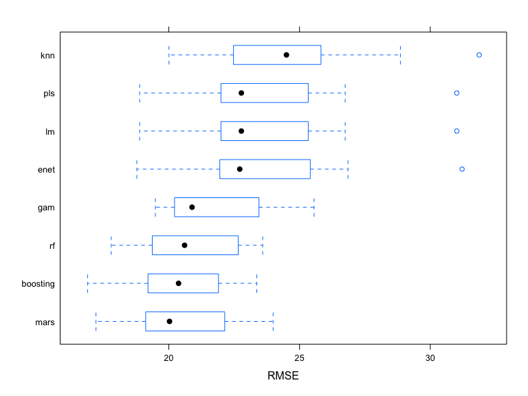
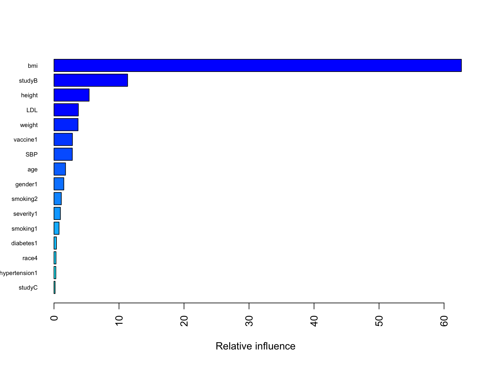
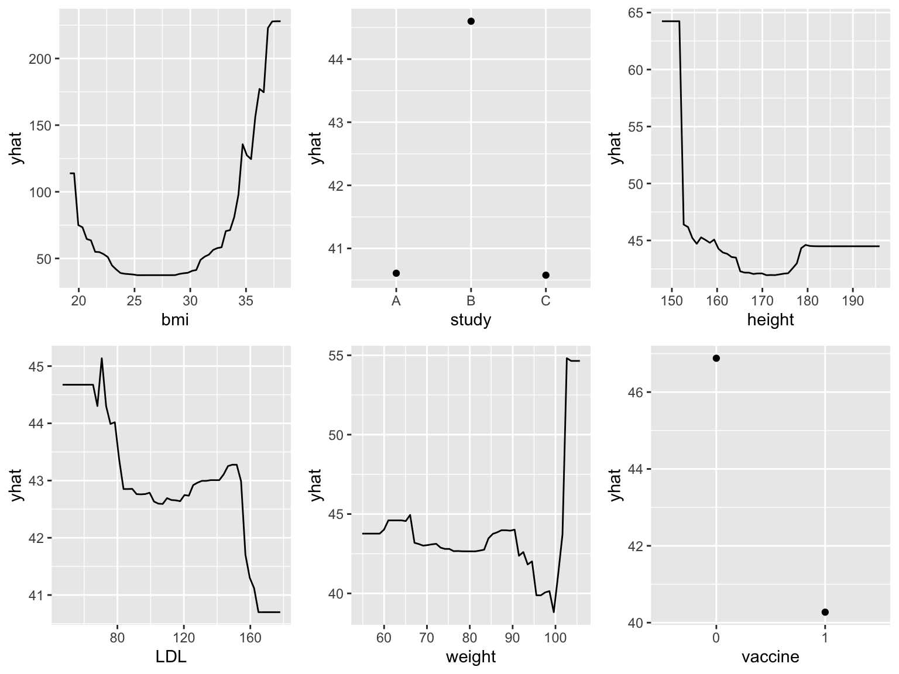
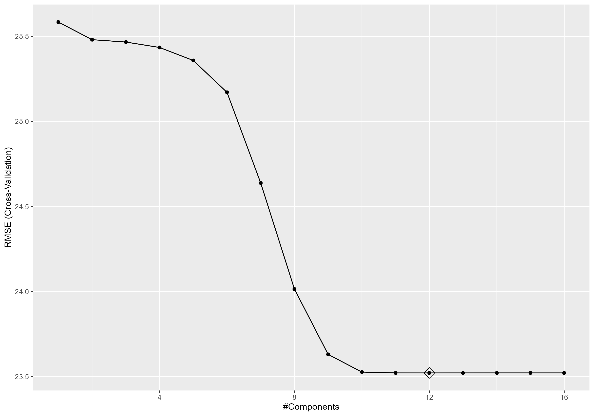

```{r setup, include=FALSE}
knitr::opts_chunk$set(echo = TRUE, 
                      message = FALSE, 
                      warning = FALSE, 
                      fig.align = "center",
                      fig.width = 8, 
                      fig.height = 6,
                      out.width = "90%")
```

\newpage
```{r, echo = FALSE}
library(gtsummary)
library(tidyverse)
```

# Abstract

This project applies varies regression and classfication methods to predict the recovery time of participants with Covid-19 to estimate the recovery time of these participants. The ultimate goal is to develop a prediction model for recovery time and identify important risk factors for long recovery time. The dataset is from a study that combines three existing cohort studies that have been tracking participants for several years.

# 1 Introduction

## 1.1 Background

To gain a better understanding of the factors that predict recovery time from COVID-19 illness, a study was designed to combine three existing cohort studies that have been tracking participants for several years. The study collects recovery information through questionnaires and medical records, and leverages existing data on personal characteristics prior to the pandemic. The ultimate goal is to develop a prediction model for recovery time and identify important risk factors for long recovery time.

## 1.2 Data Description

The dataset is a random sample of 3593 participants draw from `"recovery.RData` includes 16 variables and 3593 observations. 

Description of each variable:

- Gender (gender): 1 = Male, 0 = Female; 
- Race/ethnicity (race): 1 = White, 2 = Asian, 3 = Black, 4 = Hispanic; 
- Smoking (smoking): Smoking status; 0 = Never smoked, 1 = Former smoker, 2 = Current smoker;
- Height (height): Height (in centimeters);
- Weight (weight): Weight (in kilograms);
- BMI (bmi): Body Mass Index; BMI = weight (in kilograms) / height (in meters) squared;
- Hypertension (hypertension): 0 = No, 1 = Yes;
- Diabetes (diabetes): 0 = No, 1 = Yes;
- Systolic blood pressure (SBP): Systolic blood pressure (in mm/Hg);
- (10)LDL cholesterol (LDL): LDL (low-density lipoprotein) cholesterol (in mg/dL);
- Vaccination status at the time of infection (vaccine): 0 = Not vaccinated, 1 = Vaccinated;
- Severity of COVID-19 infection (severity): 0 = Not severe, 1= Severe;
- Study (study): The study (A/B/C) that the participant belongs to;
- Age: age of participants;
- Time to recovery (tt_recovery_time): Time from COVID-19 infection to recovery in days;
- ID: unique id of each participant.

## 1.3 Data Cleaning

```{r, echo=FALSE}
# load data
load("data/covid_recovery.Rdata")

dat <- data %>% 
  mutate(gender = factor(gender),
         hypertension = factor(hypertension),
         diabetes = factor(diabetes),
         vaccine = factor(vaccine),
         severity = factor(severity),
         study = factor(study),
)


dat %>% select(age, height, weight, bmi, SBP, LDL, 
               recovery_time, gender, race, smoking, 
               hypertension, diabetes, vaccine, severity, 
               study) %>% tbl_summary(by = study) %>% modify_caption("**Summary of Dataset by Study Group**")
```


# 2 Exploratory analysis and data visualization:

We consider the EDA for the training data, which we will use later on to train our models. Recovery data contains 6 continuous predictors, namely age, height, weight, bmi, Systolic blood pressure (SBP) and LDL cholesterol (LDL), as well as 8 discrete/factor predictors, namely gender, race, smoking, hypertension, diabetes, vaccine status, Severity of COVID-19 infection and study which the data belongs to. The response value is the time for recovery. It is a continuous variable.  \\

Distribution of data is included in appendix 1. In accordance to distribution of continuous variables, only the recovery time, which is the response, has a right skewed shape. All predictors are normally distributed with symmetric density plot. \\

The correlation plot (only considers continuous variable), calculated from Pearson Correlation in appendix 2, gives an insight of linear correlation between continuous predictors and transformed recovery time. It can be seen that bmi and weight have a relatively weak positive relation with log recovery time whereas height may have a weak negative linear correlation with log recovery time. While linear trend may be sufficient in some cases, some data may show a non-linear correlation with log recovery time. As shown in appendix 3, weight and bmi is likely to have a non-linear correlation with the response, suggesting a motivation to consider non-linear method. Box plot in appendix 4 illustrates that most data have a small difference in median. People with smoking is likely to have a higher recovery time as it has a higher median and people that are vaccinated has a lower median recovery time than the people without vaccination. Thus, we include these factors in our study of predicting recovery time.  


# 3 Model training for regression

This section describes the models used for predicting time to recovery from COVID-19. State the assumptions made by using the models and detailed description of the model training procedure and how to obtained the final model.


# 4 Results for regression

After resampling, 8 models share a common set of resampled datasets. The boosting model has least  mean value of RMSE. The RMSE of all four model are showed below.
```{r pressure, echo=FALSE, fig.cap="A caption", out.width = '100%'}

```
variable importance and partial dependence plots for interpretation. 
```{r pressure, echo=FALSE, fig.cap="A caption", out.width = '100%'}


```


# 5 Model training for classification

This section describes the models used for predicting time to recovery from COVID-19. State the assumptions made by using the models and detailed description of the model training procedure and how to obtained the final model.


# 6 Results for classification

In this section, report the final model that you built for predicting time to recovery from COVID-19. Interpret the results. Assess the model's training/test performance.


# 7 Conclusions and discussion


# References

CDC Covid Data Tracker. (2021), Centers for Disease Control and Prevention.\
\
James, Gareth, e. a. (2021), An Introduction to Statistical Learning: With Applications in R., Springer.\
\
Pradhan, A. and Olsson., P.-E. (2021), ‘Sex differences in severity and mortality from covid- 19: are males more vulnerable?’, Biology of sex differences 11(1), 53.\
\

\newpage

# Appendix

## Appendix 1

\newpage

```{r,echo=FALSE}

library(caret)
library(corrplot)
library(tidyverse)
library(ggplot2)
library(dplyr)
library(gridExtra)

#load data
load("data/recovery.RData")

#get data from 2 team members uni
set.seed(3554)
dat1 <- dat[sample(1:10000, 2000),]
set.seed(4437)
dat2 <- dat[sample(1:10000, 2000),]

#combine the data and discard duplicates
dat_temp <- rbind(dat1, dat2)
dat <- dat_temp[!duplicated(dat_temp$id),]


# data manipulation
data = 
  dat %>% 
  mutate(study = factor(dat$study),
         gender = factor(dat$gender),
         hypertension = factor(dat$hypertension),
         diabetes = factor(dat$diabetes),
         vaccine = factor(dat$vaccine),
         severity = factor(dat$severity)) %>% 
  dplyr::select(-id)
# save(data, file = "data/covid_recovery.RData")

 
#Split data into 70-30, using the third member's uni
set.seed(2337)
indexTrain <- createDataPartition(y = data$recovery_time, p = 0.7, list = FALSE)

# training data
train_data <- data[indexTrain,]
# matrix of predictors
train_x <- model.matrix(recovery_time~.,train_data)[,-1]
# vector of response
train_y <- train_data$recovery_time

# test data
test_data <- data[-indexTrain,]
# matrix of predictors
test_x <- model.matrix(recovery_time~.,test_data)[,-1]
# vector of response
test_y <- test_data$recovery_time


#continuous
age_density = ggplot(train_data, aes(x = age))+geom_density()+labs(title="Distribution for age")
height_density = ggplot(train_data, aes(x = height))+geom_density()+labs(title="Distribution for height")
weight_density = ggplot(train_data, aes(x = weight))+geom_density()+labs(title="Distribution for weight")
bmi_density = ggplot(train_data, aes(x = bmi))+geom_density()+labs(title="Distribution for bmi")
SBP_density = ggplot(train_data, aes(x = SBP))+geom_density()+labs(title="Distribution for SBP")
LDL_density = ggplot(train_data, aes(x = LDL))+geom_density()+labs(title="Distribution for LDL")
recovery_density = ggplot(train_data, aes(x = recovery_time))+geom_density()+labs(title="Distribution for recovery_time")

grid.arrange(age_density, height_density, weight_density, bmi_density, ncol=2)
grid.arrange(SBP_density, LDL_density, recovery_density, ncol=2)

#discrete
gender_bar = ggplot(train_data) + geom_bar(aes(x=gender))+labs(title="Bar plot for different gender")
race_bar = ggplot(train_data) + geom_bar(aes(x=race))+labs(title="Bar plot for different race")
smoking_bar = ggplot(train_data) + geom_bar(aes(x=smoking))+labs(title="Bar plot for different smoking")
hypertension_bar = ggplot(train_data) + geom_bar(aes(x=hypertension))+labs(title="Bar plot for different hypertension")
diabetes_bar = ggplot(train_data) + geom_bar(aes(x=diabetes))+labs(title="Bar plot for different diabetes")
vaccine_bar = ggplot(train_data) + geom_bar(aes(x=vaccine))+labs(title="Bar plot for different vaccine")
severity_bar = ggplot(train_data) + geom_bar(aes(x=severity))+labs(title="Bar plot for different severity")
study_bar = ggplot(train_data) + geom_bar(aes(x=study))+labs(title="Bar plot for different study")


grid.arrange(gender_bar, race_bar, smoking_bar, hypertension_bar, ncol=2)
grid.arrange(diabetes_bar, vaccine_bar, severity_bar,study_bar, ncol=2)
```


## Appendix 2

```{r, echo=FALSE}
num_df <- 
  train_data %>% 
  dplyr::select(age, height, weight, bmi, SBP, LDL, recovery_time) 


# calulate the correlations
res <- cor(num_df, use="complete.obs")

corrplot(res, type = "upper", order = "hclust", 
         tl.col = "black", tl.srt = 45)
```

\newpage

## Appendix 3

\newpage

```{r,echo = FALSE}

recovery_age = ggplot(train_data, aes(x = age, y = recovery_time))+geom_point()+geom_smooth(method = 'gam', se = TRUE, color = 'red')+labs(title="Recovery time against age")
recovery_height = ggplot(train_data, aes(x = height, y = recovery_time))+geom_point()+geom_smooth(method = 'gam', se = TRUE, color = 'red')+labs(title="Recovery time against height")
recovery_weight = ggplot(train_data, aes(x = weight, y = recovery_time))+geom_point()+geom_smooth(method = 'gam', se = TRUE, color = 'red')+labs(title="Recovery time against weight")
recovery_bmi = ggplot(train_data, aes(x = bmi, y = recovery_time))+geom_point()+geom_smooth(method = 'gam', se = TRUE, color = 'red')+labs(title="Recovery time against bmi")
recovery_sbp = ggplot(train_data, aes(x = SBP, y = recovery_time))+geom_point()+geom_smooth(method = 'gam', se = TRUE, color = 'red')+labs(title="Recovery time against SBP")
recovery_ldl = ggplot(train_data, aes(x = LDL, y = recovery_time))+geom_point()+geom_smooth(method = 'gam', se = TRUE, color = 'red')+labs(title="Recovery time against LDL")

grid.arrange(recovery_age, recovery_height, recovery_weight, recovery_bmi, ncol=2)
grid.arrange(recovery_sbp, recovery_ldl,nrow = 2, ncol=2)
```


## Appendix4

\newpage


```{r, echo = FALSE}
gender_box = ggplot(data, aes(x = as.factor(gender), y = recovery_time))+geom_boxplot()+labs(title="Box plot for Recovery time with different gender")

race_box = ggplot(data, aes(x = as.factor(race), y = recovery_time))+geom_boxplot()+labs(title="Box plot for Recovery time with different race")

smoking_box = ggplot(data, aes(x = as.factor(smoking), y = recovery_time))+geom_boxplot()+labs(title="Box plot for Recovery time with different smoking")

hypertension_box = ggplot(data, aes(x = as.factor(hypertension), y = recovery_time))+geom_boxplot()+labs(title="Box plot for Recovery time with different hypertension")

diabete_box = ggplot(data, aes(x = as.factor(diabetes), y = recovery_time))+geom_boxplot()+labs(title="Box plot for Recovery time with different diabetes")

vaccine_box = ggplot(data, aes(x = as.factor(vaccine), y = recovery_time))+geom_boxplot()+labs(title="Box plot for Recovery time with different vaccine")

severity_box = ggplot(data, aes(x = as.factor(severity), y = recovery_time))+geom_boxplot()+labs(title="Box plot for Recovery time with different severity")

study_box = ggplot(data, aes(x = as.factor(study), y = recovery_time))+geom_boxplot()+labs(title="Box plot for Recovery time with different study")

grid.arrange(gender_box, race_box, smoking_box, hypertension_box, ncol=2)
grid.arrange(diabete_box, vaccine_box,severity_box, study_box, ncol=2)
```


# A Appendix: Figure

{width=80%}


# B Appendix: Code
