model_result
================
Yi Huang
2023-05-09

## Load data, data partition

``` r
# load data
load("data/covid_recovery.Rdata")

#Split data into 70-300, using the third member's uni
set.seed(2337)
indexTrain <- createDataPartition(y = data$recovery_time, p = 0.7, list = FALSE)

# training data
train_data <- data[indexTrain,]
# matrix of predictors
train_x <- model.matrix(recovery_time~.,train_data)[,-1]
# vector of response
train_y <- train_data$recovery_time

# test data
test_data <- data[-indexTrain,]
# matrix of predictors
test_x <- model.matrix(recovery_time~.,test_data)[,-1]
# vector of response
test_y <- test_data$recovery_time

# 10-fold cv
ctrl <- trainControl(method = "cv",
                     number = 10)
```

## Exploratory Data Analysis on train data

Here is the exploratory analysis and data visualization from train data
set. we have 15 variables in total, 8 factors and 7 numeri from 1600
participants. Base on the underlay true of some variables, I had convert
character variable gender, race, smoking, hypertension, diabetes,
vaccine, severity and study into factors to add them into our model and
proceed with the analysis. Because id cannot be regarded as a predictor,
I removed it for analysis. Then we have 14 predictors for consideration
and recovery time is our outcome. Recovery time has a mean of 43.17
days, but some patients have very long recovery time.

``` r
#continuous
ggplot(train_data, aes(x = age))+geom_density()+labs(title="Distribution for age")
```

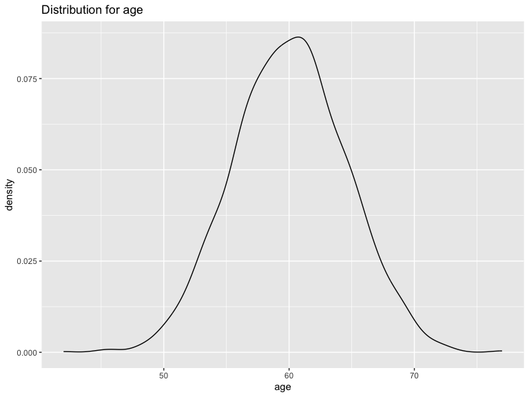

``` r
ggplot(train_data, aes(x = height))+geom_density()+labs(title="Distribution for height")
```

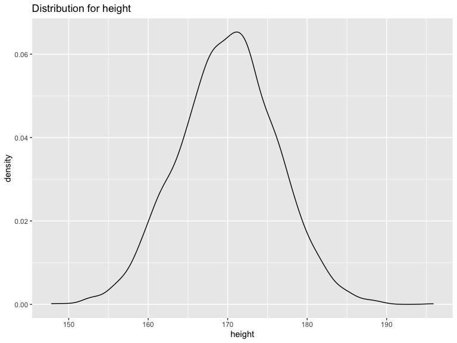

``` r
ggplot(train_data, aes(x = weight))+geom_density()+labs(title="Distribution for weight")
```


``` r
ggplot(train_data, aes(x = bmi))+geom_density()+labs(title="Distribution for bmi")
```

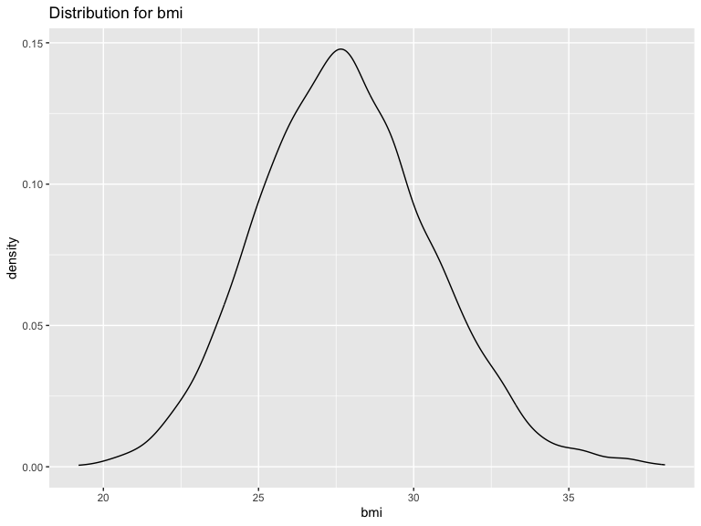

``` r
ggplot(train_data, aes(x = SBP))+geom_density()+labs(title="Distribution for SBP")
```

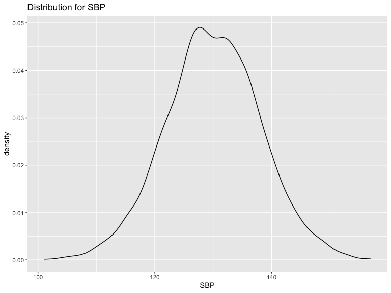

``` r
ggplot(train_data, aes(x = LDL))+geom_density()+labs(title="Distribution for LDL")
```

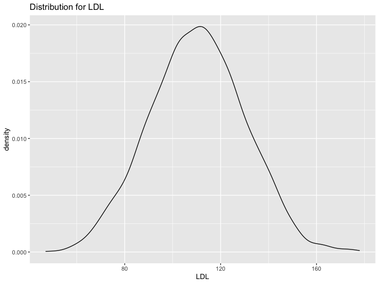

``` r
ggplot(train_data, aes(x = recovery_time))+geom_density()+labs(title="Distribution for recovery_time")
```

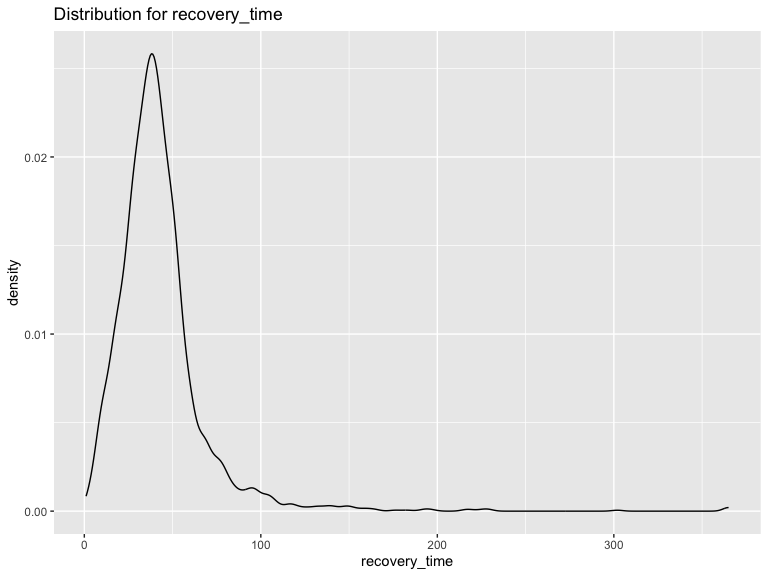

``` r
#discrete
ggplot(train_data) + geom_bar(aes(x=gender))+labs(title="Bar plot for different gender")
```

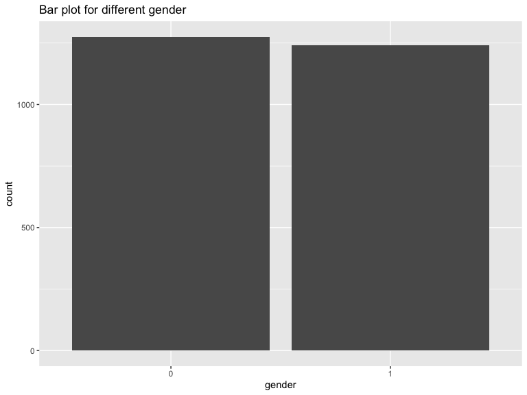

``` r
ggplot(train_data) + geom_bar(aes(x=race))+labs(title="Bar plot for different race")
```

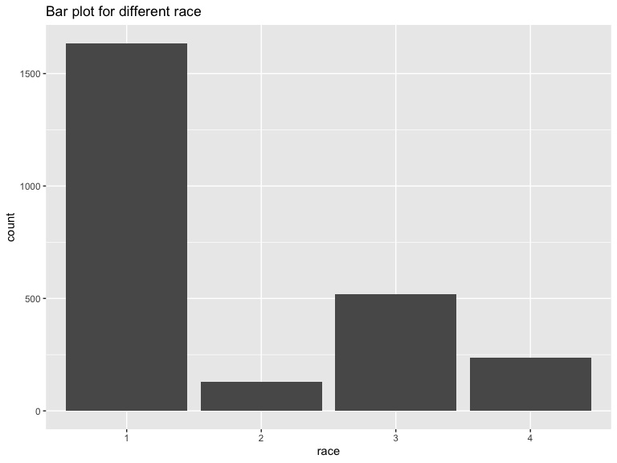

``` r
ggplot(train_data) + geom_bar(aes(x=smoking))+labs(title="Bar plot for different smoking")
```

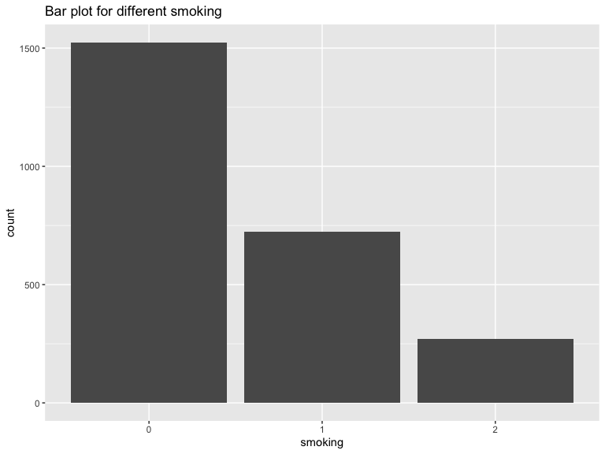

``` r
ggplot(train_data) + geom_bar(aes(x=hypertension))+labs(title="Bar plot for different hypertension")
```

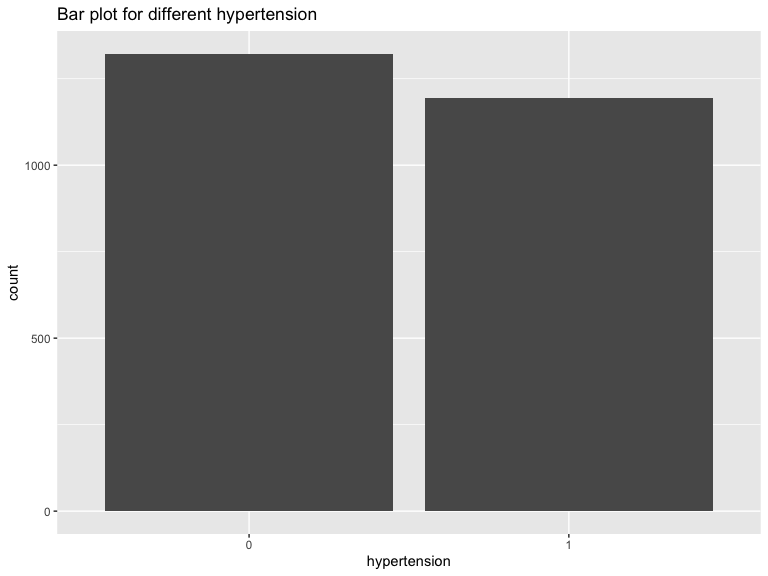

``` r
ggplot(train_data) + geom_bar(aes(x=diabetes))+labs(title="Bar plot for different diabetes")
```

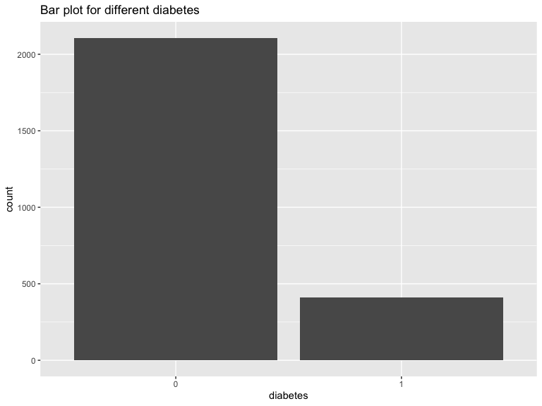

``` r
ggplot(train_data) + geom_bar(aes(x=vaccine))+labs(title="Bar plot for different vaccine")
```

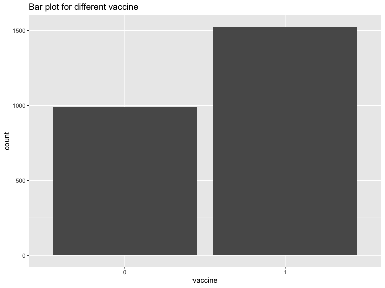

``` r
ggplot(train_data) + geom_bar(aes(x=severity))+labs(title="Bar plot for different severity")
```

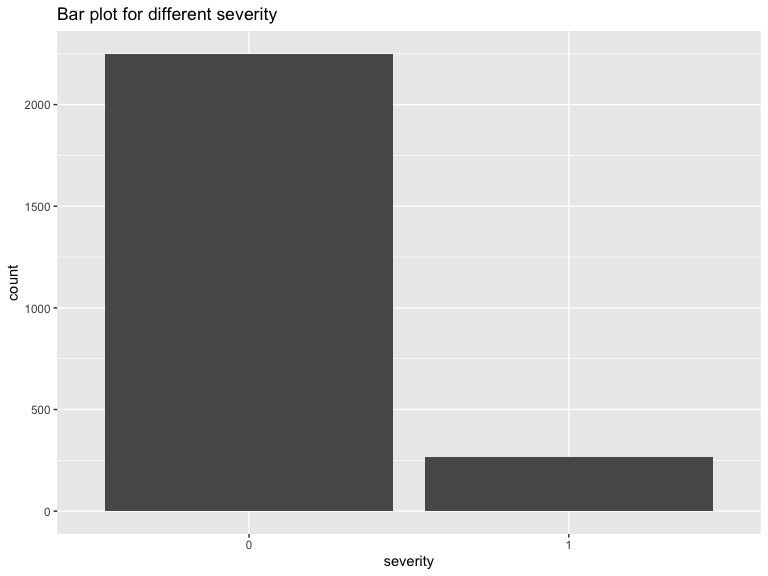

``` r
ggplot(train_data) + geom_bar(aes(x=study))+labs(title="Bar plot for different study")
```

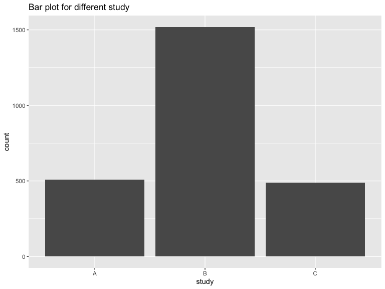

``` r
num_df <- 
  train_data %>% 
  dplyr::select(age, height, weight, bmi, SBP, LDL, recovery_time) 


# calulate the correlations
res <- cor(num_df, use="complete.obs")

corrplot(res, type = "upper", order = "hclust", 
         tl.col = "black", tl.srt = 45)
```

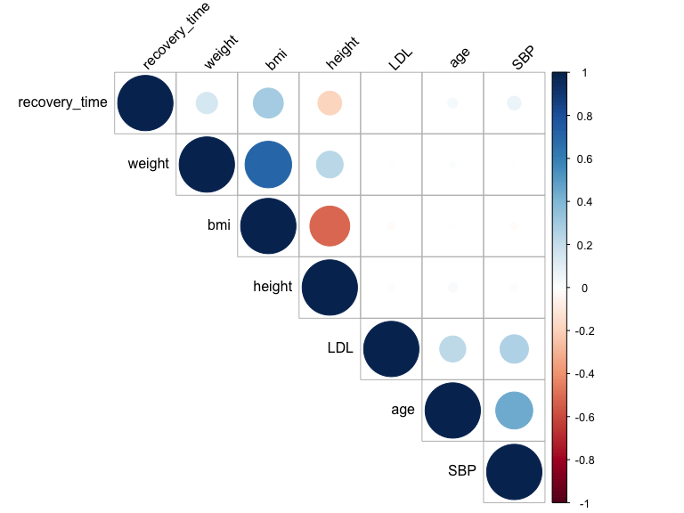

``` r
ggplot(train_data, aes(x = age, y = recovery_time))+geom_point()+geom_smooth(method = 'gam', se = TRUE, color = 'red')+labs(title="Recovery time against age")
```

    ## `geom_smooth()` using formula = 'y ~ s(x, bs = "cs")'


``` r
ggplot(train_data, aes(x = height, y = recovery_time))+geom_point()+geom_smooth(method = 'gam', se = TRUE, color = 'red')+labs(title="Recovery time against height")
```

    ## `geom_smooth()` using formula = 'y ~ s(x, bs = "cs")'

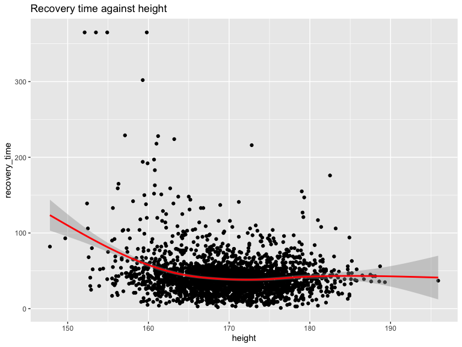

``` r
ggplot(train_data, aes(x = weight, y = recovery_time))+geom_point()+geom_smooth(method = 'gam', se = TRUE, color = 'red')+labs(title="Recovery time against weight")
```

    ## `geom_smooth()` using formula = 'y ~ s(x, bs = "cs")'

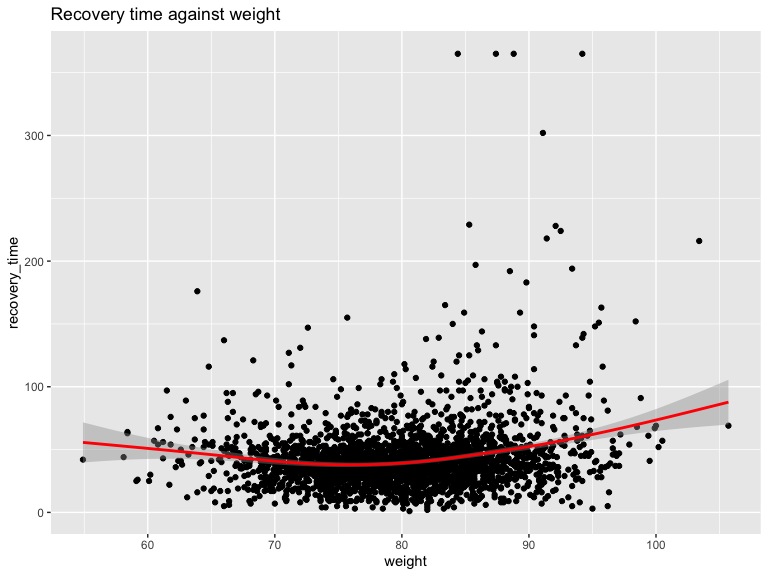

``` r
ggplot(train_data, aes(x = bmi, y = recovery_time))+geom_point()+geom_smooth(method = 'gam', se = TRUE, color = 'red')+labs(title="Recovery time against bmi")
```

    ## `geom_smooth()` using formula = 'y ~ s(x, bs = "cs")'

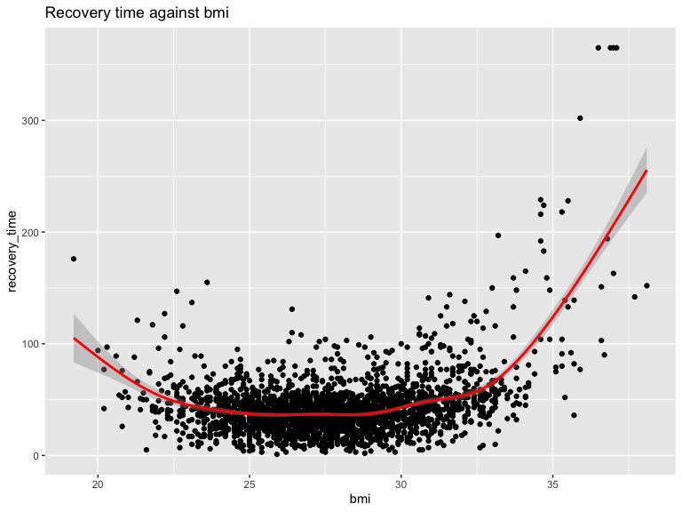

``` r
ggplot(train_data, aes(x = SBP, y = recovery_time))+geom_point()+geom_smooth(method = 'gam', se = TRUE, color = 'red')+labs(title="Recovery time against SBP")
```

    ## `geom_smooth()` using formula = 'y ~ s(x, bs = "cs")'

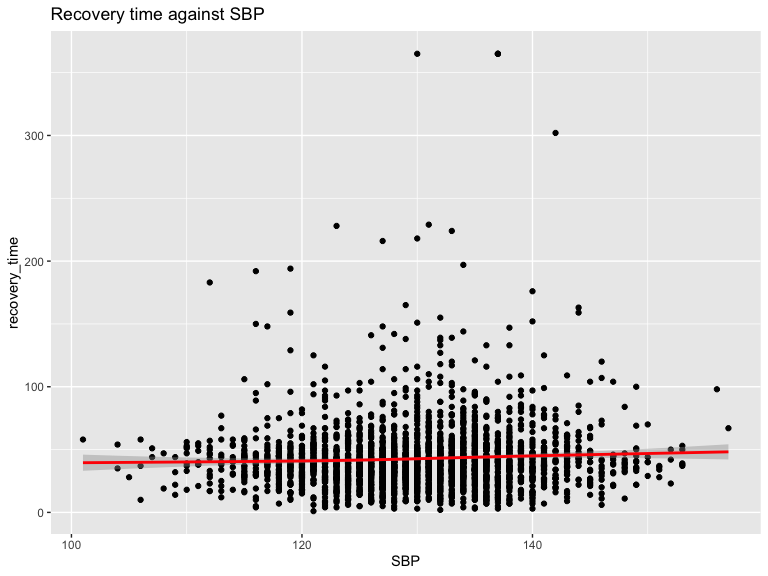

``` r
ggplot(train_data, aes(x = LDL, y = recovery_time))+geom_point()+geom_smooth(method = 'gam', se = TRUE, color = 'red')+labs(title="Recovery time against LDL")
```

    ## `geom_smooth()` using formula = 'y ~ s(x, bs = "cs")'

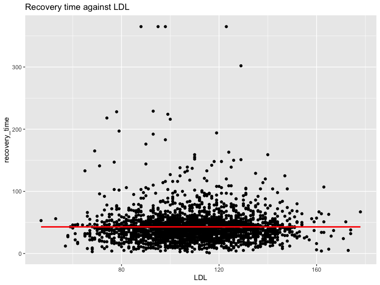

``` r
ggplot(data, aes(x = as.factor(gender), y = recovery_time))+geom_boxplot()+labs(title="Box plot for Recovery time with different gender")
```

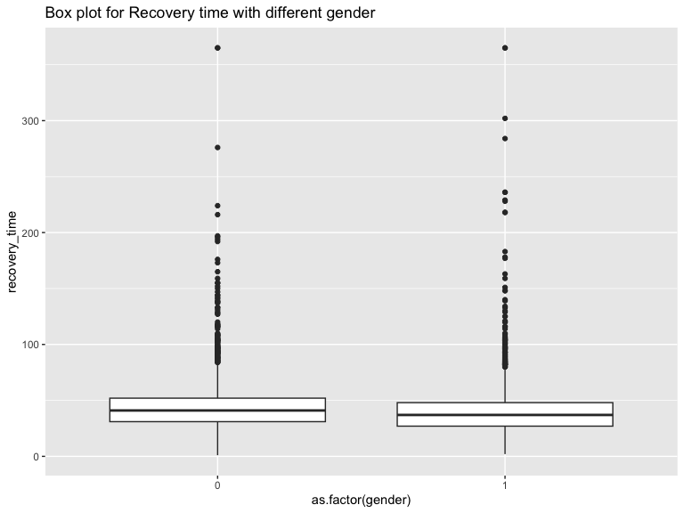

``` r
ggplot(data, aes(x = as.factor(race), y = recovery_time))+geom_boxplot()+labs(title="Box plot for Recovery time with different race")
```

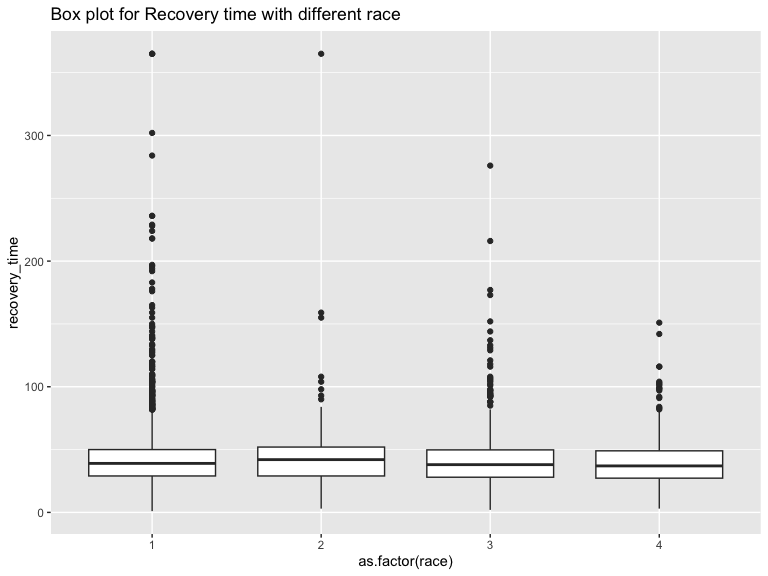

``` r
ggplot(data, aes(x = as.factor(smoking), y = recovery_time))+geom_boxplot()+labs(title="Box plot for Recovery time with different smoking")
```

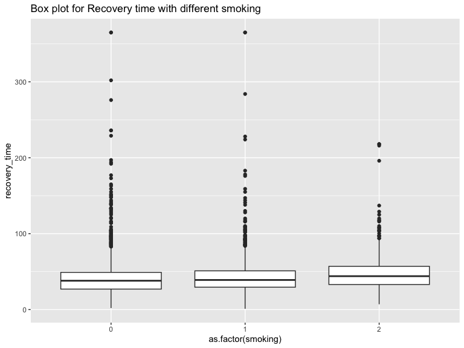

``` r
ggplot(data, aes(x = as.factor(hypertension), y = recovery_time))+geom_boxplot()+labs(title="Box plot for Recovery time with different hypertension")
```


``` r
ggplot(data, aes(x = as.factor(diabetes), y = recovery_time))+geom_boxplot()+labs(title="Box plot for Recovery time with different diabetes")
```

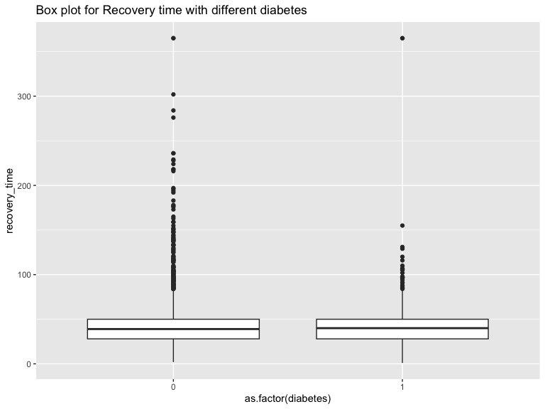

``` r
ggplot(data, aes(x = as.factor(vaccine), y = recovery_time))+geom_boxplot()+labs(title="Box plot for Recovery time with different vaccine")
```


``` r
ggplot(data, aes(x = as.factor(severity), y = recovery_time))+geom_boxplot()+labs(title="Box plot for Recovery time with different severity")
```


``` r
ggplot(data, aes(x = as.factor(study), y = recovery_time))+geom_boxplot()+labs(title="Box plot for Recovery time with different study")
```

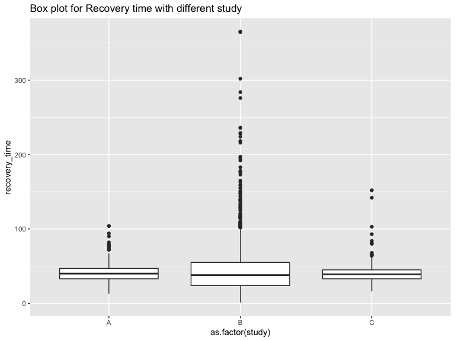

## Regression

## primary analysis (Regression)

- **Linear regression**
- **K-Nearest Neighbors (KNN)**
- **Elastic net**
- **Partial least squares (PLS)**
- **Generalized Additive Model (GAM)**
- **Multivariate Adaptive Regression Splines (MARS)**
- **Boosting**
- **Random forest**

### Linear regression

``` r
## fit linear model on train data
set.seed(2337)
linear_model <- train(train_x,
                      train_y,
                      method = "lm", 
                      trControl = ctrl)
summary(linear_model)
```

    ## 
    ## Call:
    ## lm(formula = .outcome ~ ., data = dat)
    ## 
    ## Residuals:
    ##     Min      1Q  Median      3Q     Max 
    ## -73.848 -13.472  -1.414   9.399 257.759 
    ## 
    ## Coefficients:
    ##                 Estimate Std. Error t value Pr(>|t|)    
    ## (Intercept)   -2.743e+03  1.295e+02 -21.171  < 2e-16 ***
    ## age           -1.353e-02  1.177e-01  -0.115 0.908505    
    ## gender1       -4.538e+00  9.432e-01  -4.812 1.59e-06 ***
    ## race2          5.460e-01  2.166e+00   0.252 0.800997    
    ## race3         -1.639e+00  1.193e+00  -1.374 0.169550    
    ## race4         -9.671e-01  1.653e+00  -0.585 0.558518    
    ## smoking1       3.052e+00  1.066e+00   2.863 0.004236 ** 
    ## smoking2       7.843e+00  1.563e+00   5.018 5.58e-07 ***
    ## height         1.608e+01  7.612e-01  21.120  < 2e-16 ***
    ## weight        -1.733e+01  8.043e-01 -21.541  < 2e-16 ***
    ## bmi            5.195e+01  2.300e+00  22.587  < 2e-16 ***
    ## hypertension1  3.229e+00  1.560e+00   2.070 0.038547 *  
    ## diabetes1     -2.210e-01  1.277e+00  -0.173 0.862608    
    ## SBP            3.232e-04  1.012e-01   0.003 0.997453    
    ## LDL           -1.013e-02  2.499e-02  -0.405 0.685287    
    ## vaccine1      -8.167e+00  9.684e-01  -8.434  < 2e-16 ***
    ## severity1      5.717e+00  1.534e+00   3.726 0.000199 ***
    ## studyB         4.315e+00  1.215e+00   3.552 0.000389 ***
    ## studyC        -3.479e-01  1.500e+00  -0.232 0.816566    
    ## ---
    ## Signif. codes:  0 '***' 0.001 '**' 0.01 '*' 0.05 '.' 0.1 ' ' 1
    ## 
    ## Residual standard error: 23.58 on 2498 degrees of freedom
    ## Multiple R-squared:  0.2754, Adjusted R-squared:  0.2702 
    ## F-statistic: 52.75 on 18 and 2498 DF,  p-value: < 2.2e-16

``` r
# view performance on the test set (RMSE)
lm_test_pred <- predict(linear_model, newdata = test_x) # test dataset
lm_test_rmse <- sqrt(mean((lm_test_pred - test_y)^2))
sprintf("test error for lm is: %.3f",lm_test_rmse)
```

    ## [1] "test error for lm is: 23.569"

### K-Nearest Neighbors (KNN)

``` r
# fit knn on train data use caret
kGrid <- expand.grid(k = seq(1, to = 40, by = 1))
knn_model <- train(train_x,
                   train_y,
                   method = "knn",
                   trControl = ctrl,
                   tuneGrid = kGrid)
ggplot(knn_model, highlight = TRUE)
```

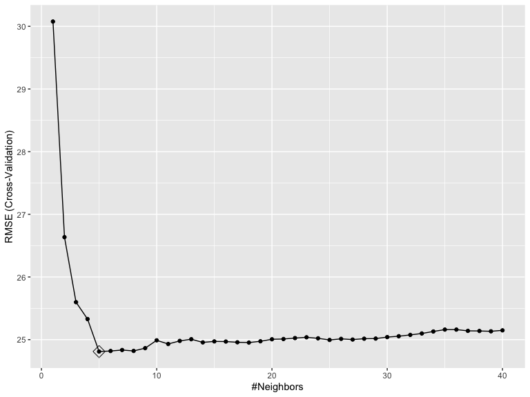

``` r
# knn with K = 18 was selected as the final model

# view performance on the test set (RMSE)
knn_test_pred <- predict(knn_model, newdata = test_x) # test dataset
knn_test_rmse <- sqrt(mean((knn_test_pred - test_y)^2))
sprintf("test error for K-Nearest Neighbors is: %.3f", knn_test_rmse)
```

    ## [1] "test error for K-Nearest Neighbors is: 25.277"

### Enet

``` r
#tuning glmnet alpha 0 and 0.05 have large RMSE. So alpha start from 0.1
set.seed(2337)
enet.fit.min <- train(train_x, train_y,
                  method = "glmnet",
                  tuneGrid = expand.grid(alpha = seq(0.1, 1, length = 21), 
                                         lambda = exp(seq(-10, -5, length = 100))),
                  trControl = ctrl)
enet.fit.min$bestTune
```

    ##     alpha      lambda
    ## 100   0.1 0.006737947

``` r
plot(enet.fit.min)
```

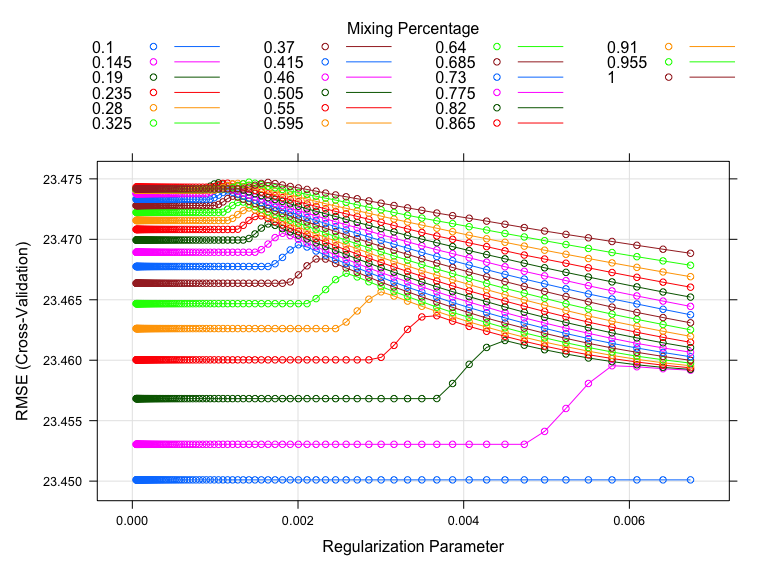

``` r
# view performance on the test set (RMSE)
enet_test_pred <- predict(enet.fit.min, newdata = test_x) # test dataset
enet_test_rmse <- sqrt(mean((enet_test_pred - test_y)^2))
sprintf("test error for enet is: %.3f",enet_test_rmse)
```

    ## [1] "test error for enet is: 23.498"

### PLS

``` r
set.seed(2337)
pls_model <- train(train_x,
                   train_y,
                   method = "pls",
                   tuneGrid = data.frame(ncomp = 1:16),
                   trControl = ctrl,
                   preProcess = c("center", "scale"))
ggplot(pls_model, highlight = TRUE)
```

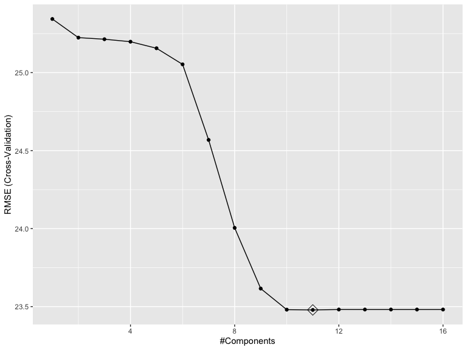

``` r
ggsave(file = "image/pls_number_of_component.png", width = 10, height = 7)

# view performance on the test set (RMSE)
pls_test_pred <- predict(pls_model, newdata = test_x) # test dataset
pls_test_rmse <- sqrt(mean((pls_test_pred - test_y)^2))
sprintf("test error for pls is: %.3f",pls_test_rmse)
```

    ## [1] "test error for pls is: 23.567"

### Generalised additive regression (GAM)

``` r
# gam use caret
# fit GAM model using all predictors
# parallel computing
no_cores <- detectCores() - 1
cl <- makePSOCKcluster(no_cores)
registerDoParallel(cl)
gam_model <- train(train_x, train_y, # training dataset
                   method = "gam",
                   trControl = ctrl,
                   control = gam.control(maxit = 200)) 
stopCluster(cl)
registerDoSEQ()

gam_model$bestTune
```

    ##   select method
    ## 2   TRUE GCV.Cp

``` r
gam_model$finalModel
```

    ## 
    ## Family: gaussian 
    ## Link function: identity 
    ## 
    ## Formula:
    ## .outcome ~ gender1 + race2 + race3 + race4 + smoking1 + smoking2 + 
    ##     hypertension1 + diabetes1 + vaccine1 + severity1 + studyB + 
    ##     studyC + s(age) + s(SBP) + s(LDL) + s(bmi) + s(height) + 
    ##     s(weight)
    ## 
    ## Estimated degrees of freedom:
    ## 0.00 0.00 0.00 7.78 2.65 4.50  total = 27.93 
    ## 
    ## GCV score: 448.2538

``` r
plot(gam_model)
```

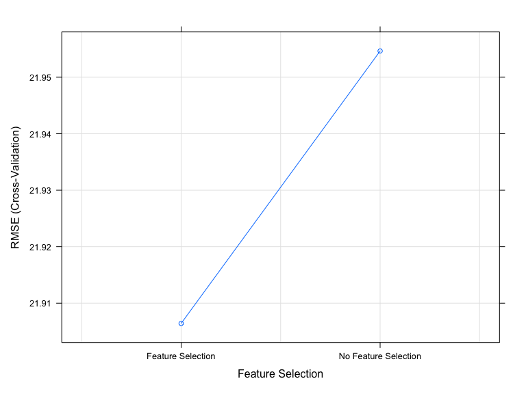

``` r
summary(gam_model$finalModel)
```

    ## 
    ## Family: gaussian 
    ## Link function: identity 
    ## 
    ## Formula:
    ## .outcome ~ gender1 + race2 + race3 + race4 + smoking1 + smoking2 + 
    ##     hypertension1 + diabetes1 + vaccine1 + severity1 + studyB + 
    ##     studyC + s(age) + s(SBP) + s(LDL) + s(bmi) + s(height) + 
    ##     s(weight)
    ## 
    ## Parametric coefficients:
    ##               Estimate Std. Error t value Pr(>|t|)    
    ## (Intercept)    43.7183     1.3232  33.040  < 2e-16 ***
    ## gender1        -4.6981     0.8434  -5.570 2.82e-08 ***
    ## race2           0.5405     1.9332   0.280 0.779829    
    ## race3          -1.5605     1.0659  -1.464 0.143332    
    ## race4          -2.6252     1.4791  -1.775 0.076054 .  
    ## smoking1        4.3355     0.9556   4.537 5.98e-06 ***
    ## smoking2        8.0325     1.3975   5.748 1.01e-08 ***
    ## hypertension1   3.0143     0.8471   3.558 0.000380 ***
    ## diabetes1       0.6857     1.1425   0.600 0.548453    
    ## vaccine1       -7.7120     0.8649  -8.916  < 2e-16 ***
    ## severity1       5.9722     1.3716   4.354 1.39e-05 ***
    ## studyB          4.1736     1.0846   3.848 0.000122 ***
    ## studyC         -0.6406     1.3400  -0.478 0.632678    
    ## ---
    ## Signif. codes:  0 '***' 0.001 '**' 0.01 '*' 0.05 '.' 0.1 ' ' 1
    ## 
    ## Approximate significance of smooth terms:
    ##                 edf Ref.df       F p-value    
    ## s(age)    1.123e-06      9   0.000 0.55847    
    ## s(SBP)    8.397e-07      9   0.000 0.68712    
    ## s(LDL)    1.176e-06      9   0.000 0.51661    
    ## s(bmi)    7.775e+00      9 111.700 < 2e-16 ***
    ## s(height) 2.649e+00      9   1.019 0.00269 ** 
    ## s(weight) 4.501e+00      9   1.049 0.04744 *  
    ## ---
    ## Signif. codes:  0 '***' 0.001 '**' 0.01 '*' 0.05 '.' 0.1 ' ' 1
    ## 
    ## R-sq.(adj) =  0.418   Deviance explained = 42.5%
    ## GCV = 448.25  Scale est. = 443.28    n = 2517

``` r
# view performance on the test set (RMSE)
gam_test_pred <- predict(gam_model, newdata = test_x) # test dataset
gam_test_rmse <- sqrt(mean((gam_test_pred - test_y)^2))
sprintf("test error for Generalised additive regression is: %.3f", knn_test_rmse)
```

    ## [1] "test error for Generalised additive regression is: 25.277"

### Multivariate adaptive regression

``` r
set.seed(2337)

# create dummy variables for categorical variables
df_dummies <- data.frame(model.matrix(~ . - 1, 
                                      # exclude ID and continuous variables
                                      data = data[, c("gender", "race", "smoking", "hypertension", "diabetes",
                                                     "vaccine", "severity", "study")]), 
                         # add continuous variables back to the data frame
                         age = data$age,
                         height = data$height,
                         weight = data$weight,
                         bmi = data$bmi,
                         SBP = data$SBP,
                         LDL = data$LDL,
                         recovery_time = data$recovery_time) 

# rename df_dummies dataset as dat
dat_mars <- df_dummies

# training data
dat_train_mars <- dat_mars[indexTrain, ]
x_mars <- model.matrix(recovery_time~.,dat_mars)[indexTrain,-1]
y_mars <- dat_mars$recovery_time[indexTrain]

# test data
dat_test_mars <- dat_mars[-indexTrain, ]
x2_mars <- model.matrix(recovery_time~.,dat_mars)[-indexTrain,-1]
y2_mars <- dat_mars$recovery_time[-indexTrain]


# create grid of all possible pairs that can take degree and nprune values
mars_grid <- expand.grid(degree = 1:3, # number of possible product hinge functions in 1 term
                         nprune = 2:20) # upper bound of number of terms in model
# parallel computing
no_cores <- detectCores() - 1
cl <- makePSOCKcluster(no_cores)
registerDoParallel(cl)

mars_model <- train(x_mars, y_mars, # training dataset
                  method = "earth",
                  tuneGrid = mars_grid,
                  trControl = ctrl)

stopCluster(cl)
registerDoSEQ()

ggplot(mars_model)
```


``` r
print(plot(mars_model))
```

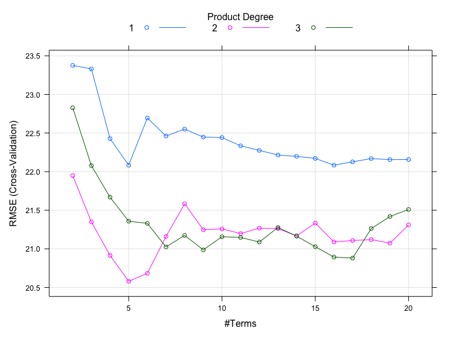

``` r
summary(mars_model$finalModel)
```

    ## Call: earth(x=matrix[2517,19], y=c(14,36,50,65,3...), keepxy=TRUE, degree=2,
    ##             nprune=5)
    ## 
    ##                      coefficients
    ## (Intercept)             -1.264634
    ## vaccine1                -7.897168
    ## h(bmi-25.9)              8.611315
    ## h(32.6-bmi)              5.699561
    ## studyB * h(bmi-32.6)    41.724058
    ## 
    ## Selected 5 of 24 terms, and 3 of 19 predictors (nprune=5)
    ## Termination condition: Reached nk 39
    ## Importance: studyB, bmi, vaccine1, gender0-unused, gender1-unused, ...
    ## Number of terms at each degree of interaction: 1 3 1
    ## GCV 413.5903    RSS 1031928    GRSq 0.4574914    RSq 0.4617953

``` r
# view performance on the test set (RMSE)
mars_test_pred <- predict(mars_model, newdata = x2_mars) # test dataset
mars_test_rmse <- sqrt(mean((mars_test_pred - test_y)^2))
sprintf("test error for MARS is: %.3f", mars_test_rmse)
```

    ## [1] "test error for MARS is: 22.586"

### Random Forest - Regression

``` r
set.seed(2337)
rf.grid <- expand.grid(mtry = 1:14,
                       splitrule = "variance",
                       min.node.size = seq(from = 1, to = 50, by = 5))

# parallel computing
no_cores <- detectCores() - 1
cl <- makePSOCKcluster(no_cores)
registerDoParallel(cl)

set.seed(2337)
rf_model <- train(recovery_time ~ . , 
                  train_data, 
                  method = "ranger",
                  tuneGrid = rf.grid,
                  trControl = ctrl)

stopCluster(cl)
registerDoSEQ()
ggplot(rf_model, highlight = TRUE)
```

    ## Warning: The shape palette can deal with a maximum of 6 discrete values because
    ## more than 6 becomes difficult to discriminate; you have 10. Consider
    ## specifying shapes manually if you must have them.

    ## Warning: Removed 56 rows containing missing values (`geom_point()`).


``` r
rf_model$bestTune
```

    ##     mtry splitrule min.node.size
    ## 102   11  variance             6

``` r
# variable importance
rf.final.per <- ranger(recovery_time ~ . , 
                       train_data,
                       mtry = rf_model$bestTune[[1]], 
                       splitrule = "variance",
                       min.node.size = rf_model$bestTune[[3]],
                       importance = "permutation",
                       scale.permutation.importance = TRUE) 

barplot(sort(ranger::importance(rf.final.per), decreasing = FALSE), 
        las = 2, horiz = TRUE, cex.names = 0.7,
        col = colorRampPalette(colors = c("cyan","blue"))(19))
```

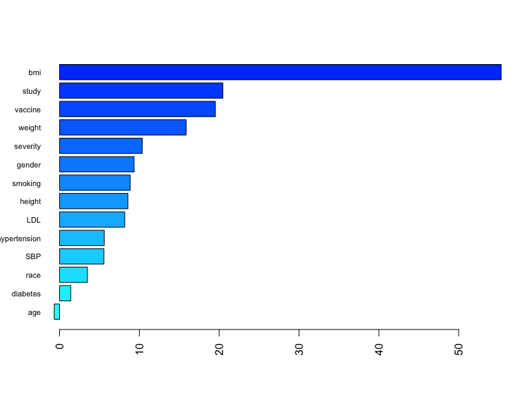

``` r
# view performance on the test set (RMSE)
rf_test_pred <- predict(rf_model, newdata = test_data) # test dataset
rf_test_rmse <- sqrt(mean((rf_test_pred - test_y)^2))
sprintf("test error for Random Forest is: %.3f", rf_test_rmse)
```

    ## [1] "test error for Random Forest is: 21.919"

### Boosting

``` r
gbm.grid <- expand.grid(n.trees = c(500,1000,2000,3000,4000,5000),
                        interaction.depth = 1:5,
                        shrinkage = c(0.005,0.01),
                        n.minobsinnode = c(1))
no_cores <- detectCores() - 1
cl <- makePSOCKcluster(no_cores)
registerDoParallel(cl)
set.seed(2337)
gbm.fit = train(recovery_time~. ,
                  train_data,
                  tuneGrid = gbm.grid,
                  trControl = ctrl,
                  method = "gbm",
                  verbose = FALSE)
stopCluster(cl)
registerDoSEQ()

ggplot(gbm.fit, highlight = TRUE)
```

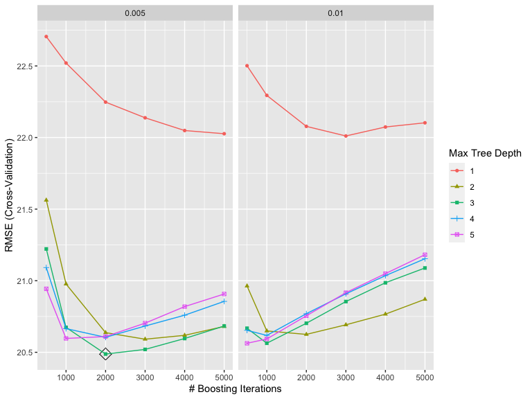

``` r
gbm.fit$bestTune
```

    ##    n.trees interaction.depth shrinkage n.minobsinnode
    ## 15    2000                 3     0.005              1

``` r
# test error
gbm.fit.predict = predict(gbm.fit, newdata = test_data)
RMSE(gbm.fit.predict, test_y)
```

    ## [1] 21.33985

## resampling on train

``` r
set.seed(2337)
resamp <- resamples(list(lm = linear_model,
                         knn = knn_model,
                         enet = enet.fit.min,
                         pls = pls_model,
                         gam = gam_model,
                         mars = mars_model,
                         rf = rf_model,
                         boosting = gbm.fit))
summary(resamp)
```

    ## 
    ## Call:
    ## summary.resamples(object = resamp)
    ## 
    ## Models: lm, knn, enet, pls, gam, mars, rf, boosting 
    ## Number of resamples: 10 
    ## 
    ## MAE 
    ##              Min.  1st Qu.   Median     Mean  3rd Qu.     Max. NA's
    ## lm       13.92045 14.83631 15.70615 15.86320 17.11461 17.98634    0
    ## knn      15.37075 16.08924 16.27729 16.43150 16.73887 18.30159    0
    ## enet     13.75661 14.78158 15.51474 15.72501 16.89604 18.07575    0
    ## pls      13.91136 14.83702 15.70282 15.86059 17.10895 17.98698    0
    ## gam      13.91937 14.22080 14.77448 14.71540 15.11166 15.73245    0
    ## mars     13.16081 13.78606 14.37446 14.40883 14.90154 16.14824    0
    ## rf       12.88480 13.25494 14.28194 14.35238 15.10200 16.81740    0
    ## boosting 12.87423 13.14708 13.93877 13.95774 14.40141 15.67332    0
    ## 
    ## RMSE 
    ##              Min.  1st Qu.   Median     Mean  3rd Qu.     Max. NA's
    ## lm       18.77627 20.33513 21.86867 23.48139 25.53443 35.65489    0
    ## knn      21.33260 22.70396 24.32635 24.80976 26.40794 30.60127    0
    ## enet     18.66444 20.35663 21.70232 23.45010 25.32954 36.20936    0
    ## pls      18.77159 20.33757 21.86645 23.47877 25.53555 35.65638    0
    ## gam      18.50087 20.64363 21.41164 21.59688 23.04463 24.37753    0
    ## mars     17.90391 19.23699 20.37222 20.57945 21.21665 25.56186    0
    ## rf       17.19551 18.55079 20.27562 20.91333 22.18751 29.98525    0
    ## boosting 17.59902 18.52951 19.77556 20.48785 21.51046 27.10191    0
    ## 
    ## Rsquared 
    ##                 Min.   1st Qu.    Median      Mean   3rd Qu.      Max. NA's
    ## lm       0.165660213 0.1862176 0.2236317 0.2579309 0.2907474 0.5119799    0
    ## knn      0.004646629 0.0681859 0.1452300 0.1781345 0.1917208 0.4966265    0
    ## enet     0.166425299 0.1896596 0.2246024 0.2562765 0.2874691 0.4928261    0
    ## pls      0.165927044 0.1863135 0.2240227 0.2580736 0.2908591 0.5118804    0
    ## gam      0.158119658 0.2623102 0.3796382 0.3702098 0.4633351 0.5898515    0
    ## mars     0.170545013 0.3371873 0.3535206 0.3990474 0.4869190 0.7315694    0
    ## rf       0.186380668 0.3111663 0.3864993 0.3927711 0.4373603 0.6420149    0
    ## boosting 0.240938777 0.3452425 0.3903808 0.4173522 0.4527714 0.7393036    0

``` r
parallelplot(resamp, metric = "RMSE")
```

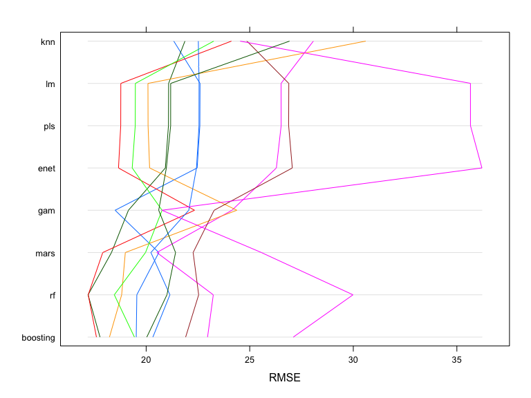

``` r
bwplot(resamp, metric = "RMSE")
```

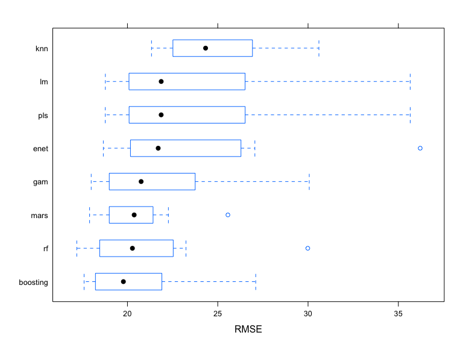

## Classification

### Data Manipulation

We consider time to recovery as a binary outcome as long(\>30 days) and
short (\<= 30 days).

``` r
#consider time to recovery as a binary outcome (>30 days vs. <= 30 days) and develop a prediction model for this binary outcome.
train_class = 
  train_data %>% 
  mutate(recovery_time = ifelse(recovery_time>30, "long", "short")) 
test_class = 
  test_data %>% 
  mutate(recovery_time = ifelse(recovery_time>30, "long", "short")) 

# matrix of predictors
x_train_class <- model.matrix(recovery_time~.,train_class)[,-1]
# vector of response
y_train_class <- train_class$recovery_time


# matrix of predictors
x_test_class <- model.matrix(recovery_time~.,test_class)[,-1]
# vector of response
y_test_class <- test_class$recovery_time


# ctrl for class
ctrl_class <- trainControl(method = "cv",
                     summaryFunction = twoClassSummary,
                     classProbs = TRUE)
```

#### Modeling Strategy

- **Penalized logistic regression**
- **Generalized additive model (GAM)**
- **Multivariate adaptive regression splines (MARS)**
- **Linear discriminant analysis (LDA)**
- **Classification and Regression Tree (CART)**
- **Random Forest**
- **Boosting**
- **Support Vector Machine (SVM with Linear and Radial Kernels)**

### Penalized logistic regression

``` r
glmnGrid <- expand.grid(.alpha = seq(0, 1, length = 21),
                        .lambda = exp(seq(-12, -7, length = 50)))
set.seed(2337)
model.glmn <- train(x = x_train_class,
                    y = y_train_class,
                    method = "glmnet",
                    tuneGrid = glmnGrid,
                    metric = "ROC",
                    trControl = ctrl_class)

model.glmn$bestTune
```

    ##     alpha       lambda
    ## 720   0.7 4.270372e-05

``` r
myCol<- rainbow(25)
myPar <- list(superpose.symbol = list(col = myCol),
              superpose.line = list(col = myCol))

plot(model.glmn, par.settings = myPar, xTrans = function(x) log(x))
```

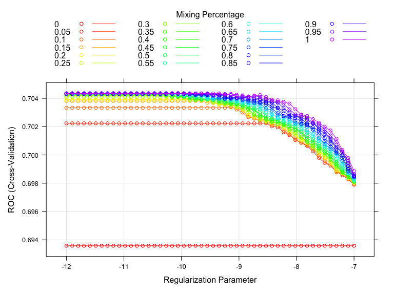

``` r
# view performance on the test set (accuracy)
glmn_class_test_pred <- predict(model.glmn, newdata=x_test_class) # test dataset
glmn_class_test_acc <- sum(glmn_class_test_pred==y_test_class)/length(y_test_class)
sprintf("test error for penalized logistic is: %.3f",1-glmn_class_test_acc)
```

    ## [1] "test error for penalized logistic is: 0.286"

Since the boundary value for $\lambda$ is exp(-10)=4.54e-5 and
exp(-5)=0.007, and the optimal lambda is not on the boundary. So local
minimum is achieved.

### Gam

``` r
# gam
set.seed(2337)
model.gam <- train(x = x_train_class,
                   y = y_train_class,
                   method = "gam",
                   tuneGrid = data.frame(method = "GCV.Cp", select = c(TRUE,FALSE)),
                   metric = "ROC",
                   trControl = ctrl_class)

model.gam$bestTune
```

    ##   select method
    ## 2   TRUE GCV.Cp

``` r
model.gam$finalModel
```

    ## 
    ## Family: binomial 
    ## Link function: logit 
    ## 
    ## Formula:
    ## .outcome ~ gender1 + race2 + race3 + race4 + smoking1 + smoking2 + 
    ##     hypertension1 + diabetes1 + vaccine1 + severity1 + studyB + 
    ##     studyC + s(age) + s(SBP) + s(LDL) + s(bmi) + s(height) + 
    ##     s(weight)
    ## 
    ## Estimated degrees of freedom:
    ## 0.0002 3.0898 0.1982 3.8717 1.9808 0.0001  total = 22.14 
    ## 
    ## UBRE score: 0.07604226

``` r
#discover bmi and recovery time
plot(model.gam$finalModel, select = 4)
```

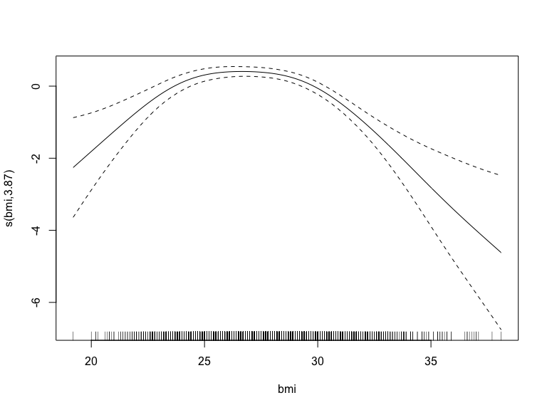

``` r
#train error
train.pred.gam <- predict(model.gam, newdata = x_train_class)
train.error.gam = 1-sum(train_class$recovery_time == train.pred.gam)/length(train_data$recovery_time)
sprintf("The train error for GAM is %.3f", train.error.gam)
```

    ## [1] "The train error for GAM is 0.266"

``` r
#test error
test.pred.gam <- predict(model.gam, newdata = x_test_class)
test.error.gam = 1-sum(test_class$recovery_time == test.pred.gam)/length(test_class$recovery_time)
sprintf("The test error for GAM is %.3f", test.error.gam)
```

    ## [1] "The test error for GAM is 0.283"

### MARS

``` r
set.seed(2337)
mars.fit = train(x = x_train_class,
                        y =  y_train_class,
                         method = "earth",
                         tuneGrid = expand.grid(degree = 1:3, 
                                                nprune = 2:20),
                         metric = "ROC",
                         trControl = ctrl_class)
```

    ## Warning: glm.fit: fitted probabilities numerically 0 or 1 occurred

    ## Warning: glm.fit: fitted probabilities numerically 0 or 1 occurred

    ## Warning: glm.fit: fitted probabilities numerically 0 or 1 occurred

    ## Warning: glm.fit: fitted probabilities numerically 0 or 1 occurred

    ## Warning: glm.fit: fitted probabilities numerically 0 or 1 occurred

    ## Warning: glm.fit: fitted probabilities numerically 0 or 1 occurred

    ## Warning: glm.fit: fitted probabilities numerically 0 or 1 occurred

    ## Warning: glm.fit: fitted probabilities numerically 0 or 1 occurred

    ## Warning: glm.fit: fitted probabilities numerically 0 or 1 occurred

    ## Warning: glm.fit: fitted probabilities numerically 0 or 1 occurred

    ## Warning: glm.fit: fitted probabilities numerically 0 or 1 occurred

    ## Warning: glm.fit: fitted probabilities numerically 0 or 1 occurred

    ## Warning: glm.fit: fitted probabilities numerically 0 or 1 occurred

    ## Warning: glm.fit: fitted probabilities numerically 0 or 1 occurred

    ## Warning: glm.fit: fitted probabilities numerically 0 or 1 occurred

    ## Warning: glm.fit: fitted probabilities numerically 0 or 1 occurred

    ## Warning: glm.fit: fitted probabilities numerically 0 or 1 occurred

    ## Warning: glm.fit: fitted probabilities numerically 0 or 1 occurred

    ## Warning: glm.fit: fitted probabilities numerically 0 or 1 occurred

``` r
plot(mars.fit)
```

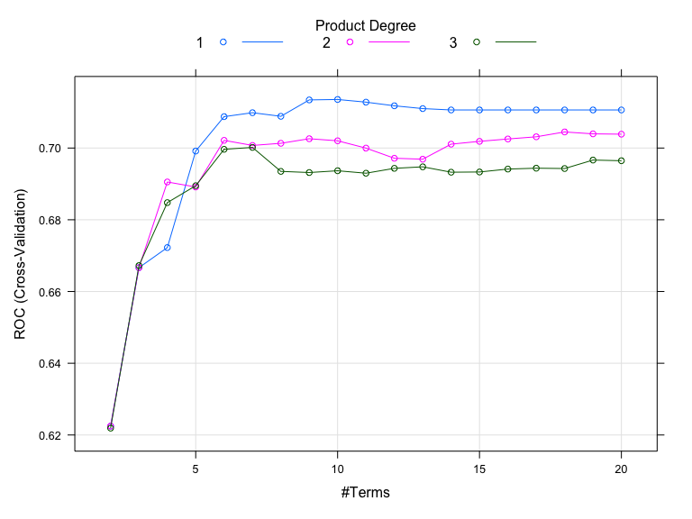

``` r
#train error
train.pred.mars = predict(mars.fit , newdata = x_train_class)
train.error.mars = 1-sum(train_class$recovery_time == train.pred.mars)/length(train_data$recovery_time)
sprintf("The train error for MARS is %.3f", train.error.mars)
```

    ## [1] "The train error for MARS is 0.270"

``` r
#test error
test.pred.mars = predict(mars.fit , newdata = x_test_class)
test.error.mars = 1-sum(test_class$recovery_time == test.pred.mars)/length(test_class$recovery_time)
sprintf("The test error for MARS is %.3f", test.error.mars)
```

    ## [1] "The test error for MARS is 0.274"

### Linear discriminant analysis (LDA)

``` r
set.seed(2337)
# Using MASS
lda.fit <- lda(recovery_time~., 
               data = train_class)
plot(lda.fit)
```

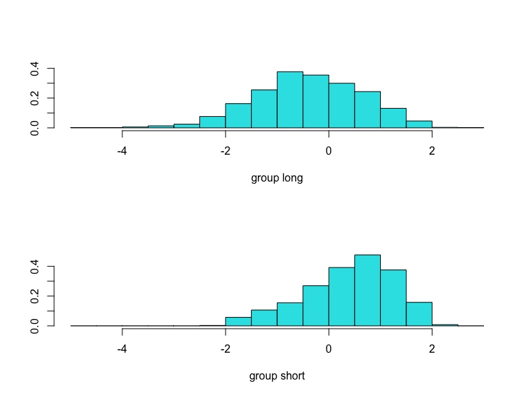

``` r
lda.fit$scaling
```

    ##                        LD1
    ## age           -0.005230071
    ## gender1        0.582852115
    ## race2          0.111644453
    ## race3         -0.015332625
    ## race4          0.078103928
    ## smoking1      -0.395459244
    ## smoking2      -0.628005874
    ## height        -0.497778576
    ## weight         0.538847538
    ## bmi           -1.636992668
    ## hypertension1 -0.368808467
    ## diabetes1     -0.053193708
    ## SBP            0.010681574
    ## LDL           -0.003381055
    ## vaccine1       0.854566384
    ## severity1     -0.726871127
    ## studyB         1.410574304
    ## studyC        -0.044449352

``` r
set.seed(2337)
# Using caret
lda_model <- train(x_train_class, #train x
                   y_train_class, #train y 
                   method = "lda", 
                   metric = "ROC", 
                   trControl = ctrl_class)
summary(lda_model)
```

    ##             Length Class      Mode     
    ## prior        2     -none-     numeric  
    ## counts       2     -none-     numeric  
    ## means       36     -none-     numeric  
    ## scaling     18     -none-     numeric  
    ## lev          2     -none-     character
    ## svd          1     -none-     numeric  
    ## N            1     -none-     numeric  
    ## call         3     -none-     call     
    ## xNames      18     -none-     character
    ## problemType  1     -none-     character
    ## tuneValue    1     data.frame list     
    ## obsLevels    2     -none-     character
    ## param        0     -none-     list

``` r
#train error
train.pred.lda <- predict(lda_model, newdata = x_train_class)
train.error.lda = 1 - sum(train_class$recovery_time == train.pred.lda)/length(train_data$recovery_time)
sprintf("The train error for LDA is %.3f", train.error.lda)
```

    ## [1] "The train error for LDA is 0.277"

``` r
#test error
test.pred.lda <- predict(lda_model, newdata = x_test_class)
test.error.lda = 1 - sum(test_class$recovery_time == test.pred.lda)/length(test_class$recovery_time)
sprintf("The test error for LDA is %.3f", test.error.lda)
```

    ## [1] "The test error for LDA is 0.287"

### Random Forest - Classification

``` r
set.seed(2337)
cl <- makePSOCKcluster(no_cores)
registerDoParallel(cl)
rf.grid <- expand.grid(mtry = 1:18,
                       splitrule = "gini",
                       min.node.size = seq(from = 1, to = 50, by = 5))

set.seed(2337)
rf_class_model <- train(x_train_class,
                        y_train_class,
                        method = "ranger",
                        importance = "permutation",
                        tuneGrid = rf.grid,
                        metric = "ROC",
                        trControl = ctrl_class)
stopCluster(cl)
registerDoSEQ()

ggplot(rf_class_model, highlight = TRUE)
```

    ## Warning: The shape palette can deal with a maximum of 6 discrete values because
    ## more than 6 becomes difficult to discriminate; you have 10. Consider
    ## specifying shapes manually if you must have them.

    ## Warning: Removed 72 rows containing missing values (`geom_point()`).

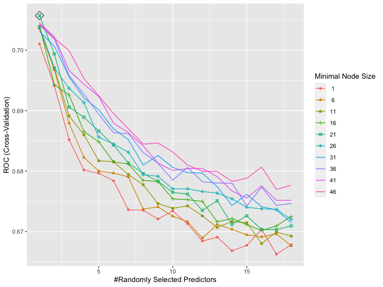

``` r
rf_class_model$bestTune
```

    ##   mtry splitrule min.node.size
    ## 5    1      gini            21

``` r
#train error
train.pred.rf <- predict(lda_model, newdata = x_train_class)
train.error.ef = 1 - sum(train_class$recovery_time == train.pred.lda)/length(train_data$recovery_time)
sprintf("The train error for LDA is %.3f", train.error.lda)
```

    ## [1] "The train error for LDA is 0.277"

``` r
#test error
test.pred.rf <- predict(rf_class_model, newdata = x_test_class)
test.error.rf = 1 - sum(test_class$recovery_time == test.pred.rf)/length(test_class$recovery_time)
sprintf("The test error for Random Forest is %.3f", test.error.rf)
```

    ## [1] "The test error for Random Forest is 0.293"

### Boosting

``` r
gbmA.grid = expand.grid(n.trees = c(10000,20000,30000,40000),
                         interaction.depth = 1:3,
                         shrinkage = c(0.0003,0.0005,0.001),
                         n.minobsinnode = 1)

cl <- makePSOCKcluster(no_cores)
registerDoParallel(cl)
set.seed(2337)
gbmA.fit = train(recovery_time~. ,
                  train_class,
                  tuneGrid = gbmA.grid,
                  trControl = ctrl_class,
                  method = "gbm",
                  distribution = "adaboost",
                  metric = "ROC",
                  verbose = FALSE)

stopCluster(cl)
registerDoSEQ()

ggplot(gbmA.fit, highlight = TRUE)
```

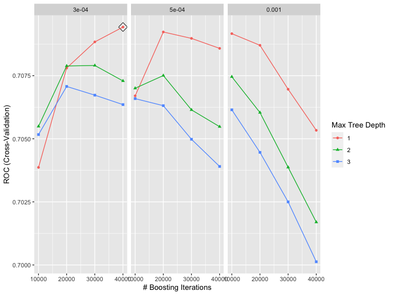

``` r
#train error
train.pred.boosting = predict(gbmA.fit , newdata = train_class, type = "raw")
train.error.boosting = 1-sum(train_class$recovery_time == train.pred.boosting)/length(train_data$recovery_time)
sprintf("The train error for boosting is %.3f", train.pred.boosting)
```

    ##    [1] "The train error for boosting is 2.000"
    ##    [2] "The train error for boosting is 1.000"
    ##    [3] "The train error for boosting is 1.000"
    ##    [4] "The train error for boosting is 1.000"
    ##    [5] "The train error for boosting is 1.000"
    ##    [6] "The train error for boosting is 1.000"
    ##    [7] "The train error for boosting is 1.000"
    ##    [8] "The train error for boosting is 1.000"
    ##    [9] "The train error for boosting is 1.000"
    ##   [10] "The train error for boosting is 1.000"
    ##   [11] "The train error for boosting is 1.000"
    ##   [12] "The train error for boosting is 1.000"
    ##   [13] "The train error for boosting is 1.000"
    ##   [14] "The train error for boosting is 2.000"
    ##   [15] "The train error for boosting is 1.000"
    ##   [16] "The train error for boosting is 1.000"
    ##   [17] "The train error for boosting is 1.000"
    ##   [18] "The train error for boosting is 1.000"
    ##   [19] "The train error for boosting is 1.000"
    ##   [20] "The train error for boosting is 1.000"
    ##   [21] "The train error for boosting is 1.000"
    ##   [22] "The train error for boosting is 2.000"
    ##   [23] "The train error for boosting is 1.000"
    ##   [24] "The train error for boosting is 1.000"
    ##   [25] "The train error for boosting is 1.000"
    ##   [26] "The train error for boosting is 1.000"
    ##   [27] "The train error for boosting is 1.000"
    ##   [28] "The train error for boosting is 1.000"
    ##   [29] "The train error for boosting is 1.000"
    ##   [30] "The train error for boosting is 1.000"
    ##   [31] "The train error for boosting is 1.000"
    ##   [32] "The train error for boosting is 1.000"
    ##   [33] "The train error for boosting is 1.000"
    ##   [34] "The train error for boosting is 1.000"
    ##   [35] "The train error for boosting is 2.000"
    ##   [36] "The train error for boosting is 1.000"
    ##   [37] "The train error for boosting is 1.000"
    ##   [38] "The train error for boosting is 1.000"
    ##   [39] "The train error for boosting is 1.000"
    ##   [40] "The train error for boosting is 1.000"
    ##   [41] "The train error for boosting is 1.000"
    ##   [42] "The train error for boosting is 1.000"
    ##   [43] "The train error for boosting is 1.000"
    ##   [44] "The train error for boosting is 1.000"
    ##   [45] "The train error for boosting is 1.000"
    ##   [46] "The train error for boosting is 1.000"
    ##   [47] "The train error for boosting is 1.000"
    ##   [48] "The train error for boosting is 1.000"
    ##   [49] "The train error for boosting is 1.000"
    ##   [50] "The train error for boosting is 1.000"
    ##   [51] "The train error for boosting is 1.000"
    ##   [52] "The train error for boosting is 1.000"
    ##   [53] "The train error for boosting is 1.000"
    ##   [54] "The train error for boosting is 1.000"
    ##   [55] "The train error for boosting is 1.000"
    ##   [56] "The train error for boosting is 1.000"
    ##   [57] "The train error for boosting is 1.000"
    ##   [58] "The train error for boosting is 1.000"
    ##   [59] "The train error for boosting is 1.000"
    ##   [60] "The train error for boosting is 1.000"
    ##   [61] "The train error for boosting is 1.000"
    ##   [62] "The train error for boosting is 1.000"
    ##   [63] "The train error for boosting is 1.000"
    ##   [64] "The train error for boosting is 1.000"
    ##   [65] "The train error for boosting is 1.000"
    ##   [66] "The train error for boosting is 1.000"
    ##   [67] "The train error for boosting is 1.000"
    ##   [68] "The train error for boosting is 1.000"
    ##   [69] "The train error for boosting is 1.000"
    ##   [70] "The train error for boosting is 1.000"
    ##   [71] "The train error for boosting is 1.000"
    ##   [72] "The train error for boosting is 2.000"
    ##   [73] "The train error for boosting is 1.000"
    ##   [74] "The train error for boosting is 1.000"
    ##   [75] "The train error for boosting is 1.000"
    ##   [76] "The train error for boosting is 1.000"
    ##   [77] "The train error for boosting is 1.000"
    ##   [78] "The train error for boosting is 1.000"
    ##   [79] "The train error for boosting is 1.000"
    ##   [80] "The train error for boosting is 2.000"
    ##   [81] "The train error for boosting is 1.000"
    ##   [82] "The train error for boosting is 1.000"
    ##   [83] "The train error for boosting is 1.000"
    ##   [84] "The train error for boosting is 1.000"
    ##   [85] "The train error for boosting is 1.000"
    ##   [86] "The train error for boosting is 1.000"
    ##   [87] "The train error for boosting is 1.000"
    ##   [88] "The train error for boosting is 1.000"
    ##   [89] "The train error for boosting is 1.000"
    ##   [90] "The train error for boosting is 1.000"
    ##   [91] "The train error for boosting is 1.000"
    ##   [92] "The train error for boosting is 1.000"
    ##   [93] "The train error for boosting is 1.000"
    ##   [94] "The train error for boosting is 1.000"
    ##   [95] "The train error for boosting is 1.000"
    ##   [96] "The train error for boosting is 1.000"
    ##   [97] "The train error for boosting is 1.000"
    ##   [98] "The train error for boosting is 1.000"
    ##   [99] "The train error for boosting is 1.000"
    ##  [100] "The train error for boosting is 1.000"
    ##  [101] "The train error for boosting is 1.000"
    ##  [102] "The train error for boosting is 1.000"
    ##  [103] "The train error for boosting is 1.000"
    ##  [104] "The train error for boosting is 1.000"
    ##  [105] "The train error for boosting is 1.000"
    ##  [106] "The train error for boosting is 1.000"
    ##  [107] "The train error for boosting is 1.000"
    ##  [108] "The train error for boosting is 1.000"
    ##  [109] "The train error for boosting is 1.000"
    ##  [110] "The train error for boosting is 1.000"
    ##  [111] "The train error for boosting is 1.000"
    ##  [112] "The train error for boosting is 1.000"
    ##  [113] "The train error for boosting is 1.000"
    ##  [114] "The train error for boosting is 1.000"
    ##  [115] "The train error for boosting is 1.000"
    ##  [116] "The train error for boosting is 2.000"
    ##  [117] "The train error for boosting is 1.000"
    ##  [118] "The train error for boosting is 1.000"
    ##  [119] "The train error for boosting is 1.000"
    ##  [120] "The train error for boosting is 1.000"
    ##  [121] "The train error for boosting is 1.000"
    ##  [122] "The train error for boosting is 2.000"
    ##  [123] "The train error for boosting is 1.000"
    ##  [124] "The train error for boosting is 1.000"
    ##  [125] "The train error for boosting is 1.000"
    ##  [126] "The train error for boosting is 1.000"
    ##  [127] "The train error for boosting is 2.000"
    ##  [128] "The train error for boosting is 1.000"
    ##  [129] "The train error for boosting is 1.000"
    ##  [130] "The train error for boosting is 1.000"
    ##  [131] "The train error for boosting is 1.000"
    ##  [132] "The train error for boosting is 1.000"
    ##  [133] "The train error for boosting is 1.000"
    ##  [134] "The train error for boosting is 1.000"
    ##  [135] "The train error for boosting is 1.000"
    ##  [136] "The train error for boosting is 1.000"
    ##  [137] "The train error for boosting is 2.000"
    ##  [138] "The train error for boosting is 1.000"
    ##  [139] "The train error for boosting is 1.000"
    ##  [140] "The train error for boosting is 1.000"
    ##  [141] "The train error for boosting is 1.000"
    ##  [142] "The train error for boosting is 1.000"
    ##  [143] "The train error for boosting is 1.000"
    ##  [144] "The train error for boosting is 1.000"
    ##  [145] "The train error for boosting is 1.000"
    ##  [146] "The train error for boosting is 1.000"
    ##  [147] "The train error for boosting is 1.000"
    ##  [148] "The train error for boosting is 1.000"
    ##  [149] "The train error for boosting is 1.000"
    ##  [150] "The train error for boosting is 1.000"
    ##  [151] "The train error for boosting is 1.000"
    ##  [152] "The train error for boosting is 1.000"
    ##  [153] "The train error for boosting is 1.000"
    ##  [154] "The train error for boosting is 1.000"
    ##  [155] "The train error for boosting is 1.000"
    ##  [156] "The train error for boosting is 1.000"
    ##  [157] "The train error for boosting is 1.000"
    ##  [158] "The train error for boosting is 2.000"
    ##  [159] "The train error for boosting is 1.000"
    ##  [160] "The train error for boosting is 1.000"
    ##  [161] "The train error for boosting is 1.000"
    ##  [162] "The train error for boosting is 1.000"
    ##  [163] "The train error for boosting is 1.000"
    ##  [164] "The train error for boosting is 1.000"
    ##  [165] "The train error for boosting is 1.000"
    ##  [166] "The train error for boosting is 1.000"
    ##  [167] "The train error for boosting is 1.000"
    ##  [168] "The train error for boosting is 1.000"
    ##  [169] "The train error for boosting is 1.000"
    ##  [170] "The train error for boosting is 1.000"
    ##  [171] "The train error for boosting is 1.000"
    ##  [172] "The train error for boosting is 1.000"
    ##  [173] "The train error for boosting is 1.000"
    ##  [174] "The train error for boosting is 1.000"
    ##  [175] "The train error for boosting is 1.000"
    ##  [176] "The train error for boosting is 1.000"
    ##  [177] "The train error for boosting is 1.000"
    ##  [178] "The train error for boosting is 1.000"
    ##  [179] "The train error for boosting is 1.000"
    ##  [180] "The train error for boosting is 1.000"
    ##  [181] "The train error for boosting is 1.000"
    ##  [182] "The train error for boosting is 2.000"
    ##  [183] "The train error for boosting is 1.000"
    ##  [184] "The train error for boosting is 1.000"
    ##  [185] "The train error for boosting is 1.000"
    ##  [186] "The train error for boosting is 1.000"
    ##  [187] "The train error for boosting is 1.000"
    ##  [188] "The train error for boosting is 1.000"
    ##  [189] "The train error for boosting is 1.000"
    ##  [190] "The train error for boosting is 1.000"
    ##  [191] "The train error for boosting is 1.000"
    ##  [192] "The train error for boosting is 1.000"
    ##  [193] "The train error for boosting is 1.000"
    ##  [194] "The train error for boosting is 1.000"
    ##  [195] "The train error for boosting is 1.000"
    ##  [196] "The train error for boosting is 1.000"
    ##  [197] "The train error for boosting is 1.000"
    ##  [198] "The train error for boosting is 1.000"
    ##  [199] "The train error for boosting is 1.000"
    ##  [200] "The train error for boosting is 1.000"
    ##  [201] "The train error for boosting is 1.000"
    ##  [202] "The train error for boosting is 1.000"
    ##  [203] "The train error for boosting is 2.000"
    ##  [204] "The train error for boosting is 1.000"
    ##  [205] "The train error for boosting is 2.000"
    ##  [206] "The train error for boosting is 1.000"
    ##  [207] "The train error for boosting is 1.000"
    ##  [208] "The train error for boosting is 2.000"
    ##  [209] "The train error for boosting is 1.000"
    ##  [210] "The train error for boosting is 1.000"
    ##  [211] "The train error for boosting is 1.000"
    ##  [212] "The train error for boosting is 1.000"
    ##  [213] "The train error for boosting is 1.000"
    ##  [214] "The train error for boosting is 1.000"
    ##  [215] "The train error for boosting is 1.000"
    ##  [216] "The train error for boosting is 1.000"
    ##  [217] "The train error for boosting is 1.000"
    ##  [218] "The train error for boosting is 1.000"
    ##  [219] "The train error for boosting is 1.000"
    ##  [220] "The train error for boosting is 1.000"
    ##  [221] "The train error for boosting is 1.000"
    ##  [222] "The train error for boosting is 1.000"
    ##  [223] "The train error for boosting is 1.000"
    ##  [224] "The train error for boosting is 1.000"
    ##  [225] "The train error for boosting is 1.000"
    ##  [226] "The train error for boosting is 1.000"
    ##  [227] "The train error for boosting is 2.000"
    ##  [228] "The train error for boosting is 1.000"
    ##  [229] "The train error for boosting is 1.000"
    ##  [230] "The train error for boosting is 1.000"
    ##  [231] "The train error for boosting is 1.000"
    ##  [232] "The train error for boosting is 1.000"
    ##  [233] "The train error for boosting is 2.000"
    ##  [234] "The train error for boosting is 2.000"
    ##  [235] "The train error for boosting is 1.000"
    ##  [236] "The train error for boosting is 1.000"
    ##  [237] "The train error for boosting is 2.000"
    ##  [238] "The train error for boosting is 1.000"
    ##  [239] "The train error for boosting is 1.000"
    ##  [240] "The train error for boosting is 2.000"
    ##  [241] "The train error for boosting is 1.000"
    ##  [242] "The train error for boosting is 1.000"
    ##  [243] "The train error for boosting is 1.000"
    ##  [244] "The train error for boosting is 1.000"
    ##  [245] "The train error for boosting is 1.000"
    ##  [246] "The train error for boosting is 1.000"
    ##  [247] "The train error for boosting is 1.000"
    ##  [248] "The train error for boosting is 1.000"
    ##  [249] "The train error for boosting is 1.000"
    ##  [250] "The train error for boosting is 1.000"
    ##  [251] "The train error for boosting is 1.000"
    ##  [252] "The train error for boosting is 1.000"
    ##  [253] "The train error for boosting is 1.000"
    ##  [254] "The train error for boosting is 1.000"
    ##  [255] "The train error for boosting is 1.000"
    ##  [256] "The train error for boosting is 1.000"
    ##  [257] "The train error for boosting is 1.000"
    ##  [258] "The train error for boosting is 1.000"
    ##  [259] "The train error for boosting is 1.000"
    ##  [260] "The train error for boosting is 1.000"
    ##  [261] "The train error for boosting is 1.000"
    ##  [262] "The train error for boosting is 1.000"
    ##  [263] "The train error for boosting is 2.000"
    ##  [264] "The train error for boosting is 1.000"
    ##  [265] "The train error for boosting is 1.000"
    ##  [266] "The train error for boosting is 1.000"
    ##  [267] "The train error for boosting is 1.000"
    ##  [268] "The train error for boosting is 1.000"
    ##  [269] "The train error for boosting is 1.000"
    ##  [270] "The train error for boosting is 1.000"
    ##  [271] "The train error for boosting is 1.000"
    ##  [272] "The train error for boosting is 1.000"
    ##  [273] "The train error for boosting is 1.000"
    ##  [274] "The train error for boosting is 1.000"
    ##  [275] "The train error for boosting is 1.000"
    ##  [276] "The train error for boosting is 1.000"
    ##  [277] "The train error for boosting is 2.000"
    ##  [278] "The train error for boosting is 1.000"
    ##  [279] "The train error for boosting is 1.000"
    ##  [280] "The train error for boosting is 1.000"
    ##  [281] "The train error for boosting is 1.000"
    ##  [282] "The train error for boosting is 1.000"
    ##  [283] "The train error for boosting is 1.000"
    ##  [284] "The train error for boosting is 1.000"
    ##  [285] "The train error for boosting is 2.000"
    ##  [286] "The train error for boosting is 1.000"
    ##  [287] "The train error for boosting is 1.000"
    ##  [288] "The train error for boosting is 1.000"
    ##  [289] "The train error for boosting is 1.000"
    ##  [290] "The train error for boosting is 2.000"
    ##  [291] "The train error for boosting is 1.000"
    ##  [292] "The train error for boosting is 1.000"
    ##  [293] "The train error for boosting is 1.000"
    ##  [294] "The train error for boosting is 1.000"
    ##  [295] "The train error for boosting is 1.000"
    ##  [296] "The train error for boosting is 1.000"
    ##  [297] "The train error for boosting is 1.000"
    ##  [298] "The train error for boosting is 1.000"
    ##  [299] "The train error for boosting is 1.000"
    ##  [300] "The train error for boosting is 1.000"
    ##  [301] "The train error for boosting is 1.000"
    ##  [302] "The train error for boosting is 1.000"
    ##  [303] "The train error for boosting is 2.000"
    ##  [304] "The train error for boosting is 1.000"
    ##  [305] "The train error for boosting is 2.000"
    ##  [306] "The train error for boosting is 1.000"
    ##  [307] "The train error for boosting is 1.000"
    ##  [308] "The train error for boosting is 1.000"
    ##  [309] "The train error for boosting is 1.000"
    ##  [310] "The train error for boosting is 2.000"
    ##  [311] "The train error for boosting is 1.000"
    ##  [312] "The train error for boosting is 1.000"
    ##  [313] "The train error for boosting is 1.000"
    ##  [314] "The train error for boosting is 1.000"
    ##  [315] "The train error for boosting is 1.000"
    ##  [316] "The train error for boosting is 1.000"
    ##  [317] "The train error for boosting is 1.000"
    ##  [318] "The train error for boosting is 1.000"
    ##  [319] "The train error for boosting is 1.000"
    ##  [320] "The train error for boosting is 1.000"
    ##  [321] "The train error for boosting is 1.000"
    ##  [322] "The train error for boosting is 1.000"
    ##  [323] "The train error for boosting is 1.000"
    ##  [324] "The train error for boosting is 1.000"
    ##  [325] "The train error for boosting is 1.000"
    ##  [326] "The train error for boosting is 1.000"
    ##  [327] "The train error for boosting is 1.000"
    ##  [328] "The train error for boosting is 1.000"
    ##  [329] "The train error for boosting is 1.000"
    ##  [330] "The train error for boosting is 2.000"
    ##  [331] "The train error for boosting is 1.000"
    ##  [332] "The train error for boosting is 1.000"
    ##  [333] "The train error for boosting is 1.000"
    ##  [334] "The train error for boosting is 1.000"
    ##  [335] "The train error for boosting is 1.000"
    ##  [336] "The train error for boosting is 1.000"
    ##  [337] "The train error for boosting is 1.000"
    ##  [338] "The train error for boosting is 1.000"
    ##  [339] "The train error for boosting is 1.000"
    ##  [340] "The train error for boosting is 2.000"
    ##  [341] "The train error for boosting is 1.000"
    ##  [342] "The train error for boosting is 1.000"
    ##  [343] "The train error for boosting is 1.000"
    ##  [344] "The train error for boosting is 2.000"
    ##  [345] "The train error for boosting is 1.000"
    ##  [346] "The train error for boosting is 1.000"
    ##  [347] "The train error for boosting is 1.000"
    ##  [348] "The train error for boosting is 1.000"
    ##  [349] "The train error for boosting is 1.000"
    ##  [350] "The train error for boosting is 1.000"
    ##  [351] "The train error for boosting is 1.000"
    ##  [352] "The train error for boosting is 1.000"
    ##  [353] "The train error for boosting is 1.000"
    ##  [354] "The train error for boosting is 1.000"
    ##  [355] "The train error for boosting is 1.000"
    ##  [356] "The train error for boosting is 1.000"
    ##  [357] "The train error for boosting is 2.000"
    ##  [358] "The train error for boosting is 1.000"
    ##  [359] "The train error for boosting is 1.000"
    ##  [360] "The train error for boosting is 1.000"
    ##  [361] "The train error for boosting is 1.000"
    ##  [362] "The train error for boosting is 1.000"
    ##  [363] "The train error for boosting is 2.000"
    ##  [364] "The train error for boosting is 2.000"
    ##  [365] "The train error for boosting is 1.000"
    ##  [366] "The train error for boosting is 1.000"
    ##  [367] "The train error for boosting is 1.000"
    ##  [368] "The train error for boosting is 1.000"
    ##  [369] "The train error for boosting is 1.000"
    ##  [370] "The train error for boosting is 1.000"
    ##  [371] "The train error for boosting is 2.000"
    ##  [372] "The train error for boosting is 1.000"
    ##  [373] "The train error for boosting is 1.000"
    ##  [374] "The train error for boosting is 1.000"
    ##  [375] "The train error for boosting is 1.000"
    ##  [376] "The train error for boosting is 1.000"
    ##  [377] "The train error for boosting is 1.000"
    ##  [378] "The train error for boosting is 1.000"
    ##  [379] "The train error for boosting is 1.000"
    ##  [380] "The train error for boosting is 1.000"
    ##  [381] "The train error for boosting is 1.000"
    ##  [382] "The train error for boosting is 1.000"
    ##  [383] "The train error for boosting is 2.000"
    ##  [384] "The train error for boosting is 1.000"
    ##  [385] "The train error for boosting is 1.000"
    ##  [386] "The train error for boosting is 2.000"
    ##  [387] "The train error for boosting is 1.000"
    ##  [388] "The train error for boosting is 1.000"
    ##  [389] "The train error for boosting is 1.000"
    ##  [390] "The train error for boosting is 1.000"
    ##  [391] "The train error for boosting is 1.000"
    ##  [392] "The train error for boosting is 1.000"
    ##  [393] "The train error for boosting is 1.000"
    ##  [394] "The train error for boosting is 1.000"
    ##  [395] "The train error for boosting is 1.000"
    ##  [396] "The train error for boosting is 1.000"
    ##  [397] "The train error for boosting is 1.000"
    ##  [398] "The train error for boosting is 1.000"
    ##  [399] "The train error for boosting is 1.000"
    ##  [400] "The train error for boosting is 1.000"
    ##  [401] "The train error for boosting is 2.000"
    ##  [402] "The train error for boosting is 1.000"
    ##  [403] "The train error for boosting is 1.000"
    ##  [404] "The train error for boosting is 1.000"
    ##  [405] "The train error for boosting is 1.000"
    ##  [406] "The train error for boosting is 1.000"
    ##  [407] "The train error for boosting is 1.000"
    ##  [408] "The train error for boosting is 1.000"
    ##  [409] "The train error for boosting is 1.000"
    ##  [410] "The train error for boosting is 1.000"
    ##  [411] "The train error for boosting is 1.000"
    ##  [412] "The train error for boosting is 1.000"
    ##  [413] "The train error for boosting is 1.000"
    ##  [414] "The train error for boosting is 1.000"
    ##  [415] "The train error for boosting is 1.000"
    ##  [416] "The train error for boosting is 1.000"
    ##  [417] "The train error for boosting is 1.000"
    ##  [418] "The train error for boosting is 1.000"
    ##  [419] "The train error for boosting is 1.000"
    ##  [420] "The train error for boosting is 1.000"
    ##  [421] "The train error for boosting is 1.000"
    ##  [422] "The train error for boosting is 1.000"
    ##  [423] "The train error for boosting is 1.000"
    ##  [424] "The train error for boosting is 1.000"
    ##  [425] "The train error for boosting is 1.000"
    ##  [426] "The train error for boosting is 1.000"
    ##  [427] "The train error for boosting is 1.000"
    ##  [428] "The train error for boosting is 1.000"
    ##  [429] "The train error for boosting is 1.000"
    ##  [430] "The train error for boosting is 1.000"
    ##  [431] "The train error for boosting is 1.000"
    ##  [432] "The train error for boosting is 2.000"
    ##  [433] "The train error for boosting is 2.000"
    ##  [434] "The train error for boosting is 1.000"
    ##  [435] "The train error for boosting is 1.000"
    ##  [436] "The train error for boosting is 1.000"
    ##  [437] "The train error for boosting is 1.000"
    ##  [438] "The train error for boosting is 1.000"
    ##  [439] "The train error for boosting is 1.000"
    ##  [440] "The train error for boosting is 1.000"
    ##  [441] "The train error for boosting is 1.000"
    ##  [442] "The train error for boosting is 1.000"
    ##  [443] "The train error for boosting is 1.000"
    ##  [444] "The train error for boosting is 1.000"
    ##  [445] "The train error for boosting is 1.000"
    ##  [446] "The train error for boosting is 2.000"
    ##  [447] "The train error for boosting is 1.000"
    ##  [448] "The train error for boosting is 1.000"
    ##  [449] "The train error for boosting is 1.000"
    ##  [450] "The train error for boosting is 1.000"
    ##  [451] "The train error for boosting is 1.000"
    ##  [452] "The train error for boosting is 1.000"
    ##  [453] "The train error for boosting is 2.000"
    ##  [454] "The train error for boosting is 1.000"
    ##  [455] "The train error for boosting is 1.000"
    ##  [456] "The train error for boosting is 1.000"
    ##  [457] "The train error for boosting is 1.000"
    ##  [458] "The train error for boosting is 1.000"
    ##  [459] "The train error for boosting is 1.000"
    ##  [460] "The train error for boosting is 1.000"
    ##  [461] "The train error for boosting is 1.000"
    ##  [462] "The train error for boosting is 1.000"
    ##  [463] "The train error for boosting is 1.000"
    ##  [464] "The train error for boosting is 1.000"
    ##  [465] "The train error for boosting is 1.000"
    ##  [466] "The train error for boosting is 1.000"
    ##  [467] "The train error for boosting is 1.000"
    ##  [468] "The train error for boosting is 1.000"
    ##  [469] "The train error for boosting is 1.000"
    ##  [470] "The train error for boosting is 1.000"
    ##  [471] "The train error for boosting is 1.000"
    ##  [472] "The train error for boosting is 1.000"
    ##  [473] "The train error for boosting is 1.000"
    ##  [474] "The train error for boosting is 1.000"
    ##  [475] "The train error for boosting is 1.000"
    ##  [476] "The train error for boosting is 1.000"
    ##  [477] "The train error for boosting is 1.000"
    ##  [478] "The train error for boosting is 2.000"
    ##  [479] "The train error for boosting is 1.000"
    ##  [480] "The train error for boosting is 2.000"
    ##  [481] "The train error for boosting is 1.000"
    ##  [482] "The train error for boosting is 1.000"
    ##  [483] "The train error for boosting is 1.000"
    ##  [484] "The train error for boosting is 1.000"
    ##  [485] "The train error for boosting is 1.000"
    ##  [486] "The train error for boosting is 1.000"
    ##  [487] "The train error for boosting is 1.000"
    ##  [488] "The train error for boosting is 1.000"
    ##  [489] "The train error for boosting is 1.000"
    ##  [490] "The train error for boosting is 1.000"
    ##  [491] "The train error for boosting is 1.000"
    ##  [492] "The train error for boosting is 1.000"
    ##  [493] "The train error for boosting is 1.000"
    ##  [494] "The train error for boosting is 1.000"
    ##  [495] "The train error for boosting is 1.000"
    ##  [496] "The train error for boosting is 1.000"
    ##  [497] "The train error for boosting is 1.000"
    ##  [498] "The train error for boosting is 1.000"
    ##  [499] "The train error for boosting is 1.000"
    ##  [500] "The train error for boosting is 1.000"
    ##  [501] "The train error for boosting is 1.000"
    ##  [502] "The train error for boosting is 2.000"
    ##  [503] "The train error for boosting is 1.000"
    ##  [504] "The train error for boosting is 1.000"
    ##  [505] "The train error for boosting is 1.000"
    ##  [506] "The train error for boosting is 1.000"
    ##  [507] "The train error for boosting is 1.000"
    ##  [508] "The train error for boosting is 1.000"
    ##  [509] "The train error for boosting is 1.000"
    ##  [510] "The train error for boosting is 1.000"
    ##  [511] "The train error for boosting is 1.000"
    ##  [512] "The train error for boosting is 1.000"
    ##  [513] "The train error for boosting is 1.000"
    ##  [514] "The train error for boosting is 2.000"
    ##  [515] "The train error for boosting is 1.000"
    ##  [516] "The train error for boosting is 2.000"
    ##  [517] "The train error for boosting is 1.000"
    ##  [518] "The train error for boosting is 1.000"
    ##  [519] "The train error for boosting is 1.000"
    ##  [520] "The train error for boosting is 1.000"
    ##  [521] "The train error for boosting is 1.000"
    ##  [522] "The train error for boosting is 1.000"
    ##  [523] "The train error for boosting is 1.000"
    ##  [524] "The train error for boosting is 1.000"
    ##  [525] "The train error for boosting is 1.000"
    ##  [526] "The train error for boosting is 1.000"
    ##  [527] "The train error for boosting is 1.000"
    ##  [528] "The train error for boosting is 1.000"
    ##  [529] "The train error for boosting is 1.000"
    ##  [530] "The train error for boosting is 1.000"
    ##  [531] "The train error for boosting is 1.000"
    ##  [532] "The train error for boosting is 1.000"
    ##  [533] "The train error for boosting is 1.000"
    ##  [534] "The train error for boosting is 1.000"
    ##  [535] "The train error for boosting is 1.000"
    ##  [536] "The train error for boosting is 1.000"
    ##  [537] "The train error for boosting is 1.000"
    ##  [538] "The train error for boosting is 1.000"
    ##  [539] "The train error for boosting is 1.000"
    ##  [540] "The train error for boosting is 1.000"
    ##  [541] "The train error for boosting is 1.000"
    ##  [542] "The train error for boosting is 1.000"
    ##  [543] "The train error for boosting is 1.000"
    ##  [544] "The train error for boosting is 1.000"
    ##  [545] "The train error for boosting is 1.000"
    ##  [546] "The train error for boosting is 1.000"
    ##  [547] "The train error for boosting is 1.000"
    ##  [548] "The train error for boosting is 1.000"
    ##  [549] "The train error for boosting is 1.000"
    ##  [550] "The train error for boosting is 1.000"
    ##  [551] "The train error for boosting is 1.000"
    ##  [552] "The train error for boosting is 1.000"
    ##  [553] "The train error for boosting is 1.000"
    ##  [554] "The train error for boosting is 1.000"
    ##  [555] "The train error for boosting is 1.000"
    ##  [556] "The train error for boosting is 1.000"
    ##  [557] "The train error for boosting is 1.000"
    ##  [558] "The train error for boosting is 1.000"
    ##  [559] "The train error for boosting is 1.000"
    ##  [560] "The train error for boosting is 1.000"
    ##  [561] "The train error for boosting is 2.000"
    ##  [562] "The train error for boosting is 1.000"
    ##  [563] "The train error for boosting is 1.000"
    ##  [564] "The train error for boosting is 1.000"
    ##  [565] "The train error for boosting is 1.000"
    ##  [566] "The train error for boosting is 1.000"
    ##  [567] "The train error for boosting is 1.000"
    ##  [568] "The train error for boosting is 2.000"
    ##  [569] "The train error for boosting is 1.000"
    ##  [570] "The train error for boosting is 1.000"
    ##  [571] "The train error for boosting is 2.000"
    ##  [572] "The train error for boosting is 1.000"
    ##  [573] "The train error for boosting is 2.000"
    ##  [574] "The train error for boosting is 2.000"
    ##  [575] "The train error for boosting is 1.000"
    ##  [576] "The train error for boosting is 1.000"
    ##  [577] "The train error for boosting is 1.000"
    ##  [578] "The train error for boosting is 1.000"
    ##  [579] "The train error for boosting is 1.000"
    ##  [580] "The train error for boosting is 1.000"
    ##  [581] "The train error for boosting is 1.000"
    ##  [582] "The train error for boosting is 1.000"
    ##  [583] "The train error for boosting is 1.000"
    ##  [584] "The train error for boosting is 1.000"
    ##  [585] "The train error for boosting is 1.000"
    ##  [586] "The train error for boosting is 1.000"
    ##  [587] "The train error for boosting is 1.000"
    ##  [588] "The train error for boosting is 1.000"
    ##  [589] "The train error for boosting is 1.000"
    ##  [590] "The train error for boosting is 2.000"
    ##  [591] "The train error for boosting is 1.000"
    ##  [592] "The train error for boosting is 1.000"
    ##  [593] "The train error for boosting is 2.000"
    ##  [594] "The train error for boosting is 1.000"
    ##  [595] "The train error for boosting is 1.000"
    ##  [596] "The train error for boosting is 1.000"
    ##  [597] "The train error for boosting is 1.000"
    ##  [598] "The train error for boosting is 1.000"
    ##  [599] "The train error for boosting is 1.000"
    ##  [600] "The train error for boosting is 1.000"
    ##  [601] "The train error for boosting is 1.000"
    ##  [602] "The train error for boosting is 2.000"
    ##  [603] "The train error for boosting is 1.000"
    ##  [604] "The train error for boosting is 1.000"
    ##  [605] "The train error for boosting is 1.000"
    ##  [606] "The train error for boosting is 1.000"
    ##  [607] "The train error for boosting is 1.000"
    ##  [608] "The train error for boosting is 1.000"
    ##  [609] "The train error for boosting is 1.000"
    ##  [610] "The train error for boosting is 1.000"
    ##  [611] "The train error for boosting is 1.000"
    ##  [612] "The train error for boosting is 1.000"
    ##  [613] "The train error for boosting is 1.000"
    ##  [614] "The train error for boosting is 2.000"
    ##  [615] "The train error for boosting is 1.000"
    ##  [616] "The train error for boosting is 1.000"
    ##  [617] "The train error for boosting is 1.000"
    ##  [618] "The train error for boosting is 1.000"
    ##  [619] "The train error for boosting is 2.000"
    ##  [620] "The train error for boosting is 1.000"
    ##  [621] "The train error for boosting is 1.000"
    ##  [622] "The train error for boosting is 1.000"
    ##  [623] "The train error for boosting is 1.000"
    ##  [624] "The train error for boosting is 1.000"
    ##  [625] "The train error for boosting is 1.000"
    ##  [626] "The train error for boosting is 1.000"
    ##  [627] "The train error for boosting is 2.000"
    ##  [628] "The train error for boosting is 1.000"
    ##  [629] "The train error for boosting is 1.000"
    ##  [630] "The train error for boosting is 1.000"
    ##  [631] "The train error for boosting is 1.000"
    ##  [632] "The train error for boosting is 1.000"
    ##  [633] "The train error for boosting is 1.000"
    ##  [634] "The train error for boosting is 1.000"
    ##  [635] "The train error for boosting is 1.000"
    ##  [636] "The train error for boosting is 1.000"
    ##  [637] "The train error for boosting is 1.000"
    ##  [638] "The train error for boosting is 1.000"
    ##  [639] "The train error for boosting is 1.000"
    ##  [640] "The train error for boosting is 1.000"
    ##  [641] "The train error for boosting is 1.000"
    ##  [642] "The train error for boosting is 1.000"
    ##  [643] "The train error for boosting is 1.000"
    ##  [644] "The train error for boosting is 1.000"
    ##  [645] "The train error for boosting is 1.000"
    ##  [646] "The train error for boosting is 1.000"
    ##  [647] "The train error for boosting is 1.000"
    ##  [648] "The train error for boosting is 2.000"
    ##  [649] "The train error for boosting is 1.000"
    ##  [650] "The train error for boosting is 1.000"
    ##  [651] "The train error for boosting is 1.000"
    ##  [652] "The train error for boosting is 1.000"
    ##  [653] "The train error for boosting is 1.000"
    ##  [654] "The train error for boosting is 1.000"
    ##  [655] "The train error for boosting is 1.000"
    ##  [656] "The train error for boosting is 2.000"
    ##  [657] "The train error for boosting is 1.000"
    ##  [658] "The train error for boosting is 1.000"
    ##  [659] "The train error for boosting is 1.000"
    ##  [660] "The train error for boosting is 2.000"
    ##  [661] "The train error for boosting is 2.000"
    ##  [662] "The train error for boosting is 1.000"
    ##  [663] "The train error for boosting is 1.000"
    ##  [664] "The train error for boosting is 1.000"
    ##  [665] "The train error for boosting is 1.000"
    ##  [666] "The train error for boosting is 1.000"
    ##  [667] "The train error for boosting is 1.000"
    ##  [668] "The train error for boosting is 1.000"
    ##  [669] "The train error for boosting is 1.000"
    ##  [670] "The train error for boosting is 1.000"
    ##  [671] "The train error for boosting is 1.000"
    ##  [672] "The train error for boosting is 1.000"
    ##  [673] "The train error for boosting is 1.000"
    ##  [674] "The train error for boosting is 1.000"
    ##  [675] "The train error for boosting is 1.000"
    ##  [676] "The train error for boosting is 1.000"
    ##  [677] "The train error for boosting is 1.000"
    ##  [678] "The train error for boosting is 1.000"
    ##  [679] "The train error for boosting is 1.000"
    ##  [680] "The train error for boosting is 2.000"
    ##  [681] "The train error for boosting is 1.000"
    ##  [682] "The train error for boosting is 1.000"
    ##  [683] "The train error for boosting is 1.000"
    ##  [684] "The train error for boosting is 1.000"
    ##  [685] "The train error for boosting is 1.000"
    ##  [686] "The train error for boosting is 1.000"
    ##  [687] "The train error for boosting is 1.000"
    ##  [688] "The train error for boosting is 1.000"
    ##  [689] "The train error for boosting is 1.000"
    ##  [690] "The train error for boosting is 1.000"
    ##  [691] "The train error for boosting is 1.000"
    ##  [692] "The train error for boosting is 1.000"
    ##  [693] "The train error for boosting is 1.000"
    ##  [694] "The train error for boosting is 1.000"
    ##  [695] "The train error for boosting is 1.000"
    ##  [696] "The train error for boosting is 1.000"
    ##  [697] "The train error for boosting is 1.000"
    ##  [698] "The train error for boosting is 1.000"
    ##  [699] "The train error for boosting is 1.000"
    ##  [700] "The train error for boosting is 1.000"
    ##  [701] "The train error for boosting is 1.000"
    ##  [702] "The train error for boosting is 1.000"
    ##  [703] "The train error for boosting is 1.000"
    ##  [704] "The train error for boosting is 1.000"
    ##  [705] "The train error for boosting is 1.000"
    ##  [706] "The train error for boosting is 2.000"
    ##  [707] "The train error for boosting is 1.000"
    ##  [708] "The train error for boosting is 1.000"
    ##  [709] "The train error for boosting is 1.000"
    ##  [710] "The train error for boosting is 1.000"
    ##  [711] "The train error for boosting is 1.000"
    ##  [712] "The train error for boosting is 1.000"
    ##  [713] "The train error for boosting is 1.000"
    ##  [714] "The train error for boosting is 1.000"
    ##  [715] "The train error for boosting is 1.000"
    ##  [716] "The train error for boosting is 1.000"
    ##  [717] "The train error for boosting is 1.000"
    ##  [718] "The train error for boosting is 1.000"
    ##  [719] "The train error for boosting is 2.000"
    ##  [720] "The train error for boosting is 1.000"
    ##  [721] "The train error for boosting is 1.000"
    ##  [722] "The train error for boosting is 1.000"
    ##  [723] "The train error for boosting is 1.000"
    ##  [724] "The train error for boosting is 1.000"
    ##  [725] "The train error for boosting is 2.000"
    ##  [726] "The train error for boosting is 1.000"
    ##  [727] "The train error for boosting is 1.000"
    ##  [728] "The train error for boosting is 1.000"
    ##  [729] "The train error for boosting is 1.000"
    ##  [730] "The train error for boosting is 1.000"
    ##  [731] "The train error for boosting is 1.000"
    ##  [732] "The train error for boosting is 1.000"
    ##  [733] "The train error for boosting is 1.000"
    ##  [734] "The train error for boosting is 1.000"
    ##  [735] "The train error for boosting is 2.000"
    ##  [736] "The train error for boosting is 1.000"
    ##  [737] "The train error for boosting is 1.000"
    ##  [738] "The train error for boosting is 1.000"
    ##  [739] "The train error for boosting is 1.000"
    ##  [740] "The train error for boosting is 1.000"
    ##  [741] "The train error for boosting is 1.000"
    ##  [742] "The train error for boosting is 1.000"
    ##  [743] "The train error for boosting is 1.000"
    ##  [744] "The train error for boosting is 1.000"
    ##  [745] "The train error for boosting is 1.000"
    ##  [746] "The train error for boosting is 1.000"
    ##  [747] "The train error for boosting is 1.000"
    ##  [748] "The train error for boosting is 1.000"
    ##  [749] "The train error for boosting is 1.000"
    ##  [750] "The train error for boosting is 1.000"
    ##  [751] "The train error for boosting is 1.000"
    ##  [752] "The train error for boosting is 1.000"
    ##  [753] "The train error for boosting is 1.000"
    ##  [754] "The train error for boosting is 1.000"
    ##  [755] "The train error for boosting is 1.000"
    ##  [756] "The train error for boosting is 1.000"
    ##  [757] "The train error for boosting is 1.000"
    ##  [758] "The train error for boosting is 1.000"
    ##  [759] "The train error for boosting is 1.000"
    ##  [760] "The train error for boosting is 1.000"
    ##  [761] "The train error for boosting is 1.000"
    ##  [762] "The train error for boosting is 1.000"
    ##  [763] "The train error for boosting is 1.000"
    ##  [764] "The train error for boosting is 1.000"
    ##  [765] "The train error for boosting is 1.000"
    ##  [766] "The train error for boosting is 1.000"
    ##  [767] "The train error for boosting is 2.000"
    ##  [768] "The train error for boosting is 1.000"
    ##  [769] "The train error for boosting is 1.000"
    ##  [770] "The train error for boosting is 2.000"
    ##  [771] "The train error for boosting is 1.000"
    ##  [772] "The train error for boosting is 1.000"
    ##  [773] "The train error for boosting is 1.000"
    ##  [774] "The train error for boosting is 1.000"
    ##  [775] "The train error for boosting is 1.000"
    ##  [776] "The train error for boosting is 1.000"
    ##  [777] "The train error for boosting is 2.000"
    ##  [778] "The train error for boosting is 1.000"
    ##  [779] "The train error for boosting is 1.000"
    ##  [780] "The train error for boosting is 1.000"
    ##  [781] "The train error for boosting is 2.000"
    ##  [782] "The train error for boosting is 1.000"
    ##  [783] "The train error for boosting is 1.000"
    ##  [784] "The train error for boosting is 1.000"
    ##  [785] "The train error for boosting is 1.000"
    ##  [786] "The train error for boosting is 1.000"
    ##  [787] "The train error for boosting is 1.000"
    ##  [788] "The train error for boosting is 1.000"
    ##  [789] "The train error for boosting is 1.000"
    ##  [790] "The train error for boosting is 1.000"
    ##  [791] "The train error for boosting is 1.000"
    ##  [792] "The train error for boosting is 2.000"
    ##  [793] "The train error for boosting is 1.000"
    ##  [794] "The train error for boosting is 1.000"
    ##  [795] "The train error for boosting is 1.000"
    ##  [796] "The train error for boosting is 1.000"
    ##  [797] "The train error for boosting is 1.000"
    ##  [798] "The train error for boosting is 1.000"
    ##  [799] "The train error for boosting is 1.000"
    ##  [800] "The train error for boosting is 1.000"
    ##  [801] "The train error for boosting is 1.000"
    ##  [802] "The train error for boosting is 1.000"
    ##  [803] "The train error for boosting is 1.000"
    ##  [804] "The train error for boosting is 2.000"
    ##  [805] "The train error for boosting is 1.000"
    ##  [806] "The train error for boosting is 1.000"
    ##  [807] "The train error for boosting is 1.000"
    ##  [808] "The train error for boosting is 1.000"
    ##  [809] "The train error for boosting is 2.000"
    ##  [810] "The train error for boosting is 1.000"
    ##  [811] "The train error for boosting is 1.000"
    ##  [812] "The train error for boosting is 1.000"
    ##  [813] "The train error for boosting is 1.000"
    ##  [814] "The train error for boosting is 1.000"
    ##  [815] "The train error for boosting is 1.000"
    ##  [816] "The train error for boosting is 1.000"
    ##  [817] "The train error for boosting is 1.000"
    ##  [818] "The train error for boosting is 1.000"
    ##  [819] "The train error for boosting is 1.000"
    ##  [820] "The train error for boosting is 1.000"
    ##  [821] "The train error for boosting is 1.000"
    ##  [822] "The train error for boosting is 1.000"
    ##  [823] "The train error for boosting is 1.000"
    ##  [824] "The train error for boosting is 1.000"
    ##  [825] "The train error for boosting is 1.000"
    ##  [826] "The train error for boosting is 1.000"
    ##  [827] "The train error for boosting is 1.000"
    ##  [828] "The train error for boosting is 1.000"
    ##  [829] "The train error for boosting is 1.000"
    ##  [830] "The train error for boosting is 1.000"
    ##  [831] "The train error for boosting is 1.000"
    ##  [832] "The train error for boosting is 1.000"
    ##  [833] "The train error for boosting is 1.000"
    ##  [834] "The train error for boosting is 1.000"
    ##  [835] "The train error for boosting is 1.000"
    ##  [836] "The train error for boosting is 1.000"
    ##  [837] "The train error for boosting is 1.000"
    ##  [838] "The train error for boosting is 1.000"
    ##  [839] "The train error for boosting is 1.000"
    ##  [840] "The train error for boosting is 1.000"
    ##  [841] "The train error for boosting is 1.000"
    ##  [842] "The train error for boosting is 1.000"
    ##  [843] "The train error for boosting is 1.000"
    ##  [844] "The train error for boosting is 1.000"
    ##  [845] "The train error for boosting is 1.000"
    ##  [846] "The train error for boosting is 1.000"
    ##  [847] "The train error for boosting is 1.000"
    ##  [848] "The train error for boosting is 1.000"
    ##  [849] "The train error for boosting is 1.000"
    ##  [850] "The train error for boosting is 1.000"
    ##  [851] "The train error for boosting is 1.000"
    ##  [852] "The train error for boosting is 1.000"
    ##  [853] "The train error for boosting is 1.000"
    ##  [854] "The train error for boosting is 1.000"
    ##  [855] "The train error for boosting is 1.000"
    ##  [856] "The train error for boosting is 1.000"
    ##  [857] "The train error for boosting is 1.000"
    ##  [858] "The train error for boosting is 2.000"
    ##  [859] "The train error for boosting is 1.000"
    ##  [860] "The train error for boosting is 1.000"
    ##  [861] "The train error for boosting is 1.000"
    ##  [862] "The train error for boosting is 1.000"
    ##  [863] "The train error for boosting is 1.000"
    ##  [864] "The train error for boosting is 1.000"
    ##  [865] "The train error for boosting is 1.000"
    ##  [866] "The train error for boosting is 1.000"
    ##  [867] "The train error for boosting is 1.000"
    ##  [868] "The train error for boosting is 1.000"
    ##  [869] "The train error for boosting is 1.000"
    ##  [870] "The train error for boosting is 1.000"
    ##  [871] "The train error for boosting is 1.000"
    ##  [872] "The train error for boosting is 1.000"
    ##  [873] "The train error for boosting is 1.000"
    ##  [874] "The train error for boosting is 1.000"
    ##  [875] "The train error for boosting is 1.000"
    ##  [876] "The train error for boosting is 1.000"
    ##  [877] "The train error for boosting is 1.000"
    ##  [878] "The train error for boosting is 1.000"
    ##  [879] "The train error for boosting is 1.000"
    ##  [880] "The train error for boosting is 1.000"
    ##  [881] "The train error for boosting is 1.000"
    ##  [882] "The train error for boosting is 1.000"
    ##  [883] "The train error for boosting is 1.000"
    ##  [884] "The train error for boosting is 1.000"
    ##  [885] "The train error for boosting is 1.000"
    ##  [886] "The train error for boosting is 1.000"
    ##  [887] "The train error for boosting is 1.000"
    ##  [888] "The train error for boosting is 1.000"
    ##  [889] "The train error for boosting is 1.000"
    ##  [890] "The train error for boosting is 1.000"
    ##  [891] "The train error for boosting is 1.000"
    ##  [892] "The train error for boosting is 1.000"
    ##  [893] "The train error for boosting is 1.000"
    ##  [894] "The train error for boosting is 1.000"
    ##  [895] "The train error for boosting is 1.000"
    ##  [896] "The train error for boosting is 1.000"
    ##  [897] "The train error for boosting is 1.000"
    ##  [898] "The train error for boosting is 1.000"
    ##  [899] "The train error for boosting is 1.000"
    ##  [900] "The train error for boosting is 1.000"
    ##  [901] "The train error for boosting is 1.000"
    ##  [902] "The train error for boosting is 1.000"
    ##  [903] "The train error for boosting is 1.000"
    ##  [904] "The train error for boosting is 1.000"
    ##  [905] "The train error for boosting is 1.000"
    ##  [906] "The train error for boosting is 1.000"
    ##  [907] "The train error for boosting is 1.000"
    ##  [908] "The train error for boosting is 1.000"
    ##  [909] "The train error for boosting is 1.000"
    ##  [910] "The train error for boosting is 1.000"
    ##  [911] "The train error for boosting is 1.000"
    ##  [912] "The train error for boosting is 1.000"
    ##  [913] "The train error for boosting is 1.000"
    ##  [914] "The train error for boosting is 1.000"
    ##  [915] "The train error for boosting is 1.000"
    ##  [916] "The train error for boosting is 1.000"
    ##  [917] "The train error for boosting is 1.000"
    ##  [918] "The train error for boosting is 2.000"
    ##  [919] "The train error for boosting is 1.000"
    ##  [920] "The train error for boosting is 2.000"
    ##  [921] "The train error for boosting is 1.000"
    ##  [922] "The train error for boosting is 1.000"
    ##  [923] "The train error for boosting is 1.000"
    ##  [924] "The train error for boosting is 1.000"
    ##  [925] "The train error for boosting is 1.000"
    ##  [926] "The train error for boosting is 2.000"
    ##  [927] "The train error for boosting is 1.000"
    ##  [928] "The train error for boosting is 1.000"
    ##  [929] "The train error for boosting is 1.000"
    ##  [930] "The train error for boosting is 1.000"
    ##  [931] "The train error for boosting is 1.000"
    ##  [932] "The train error for boosting is 1.000"
    ##  [933] "The train error for boosting is 2.000"
    ##  [934] "The train error for boosting is 1.000"
    ##  [935] "The train error for boosting is 2.000"
    ##  [936] "The train error for boosting is 1.000"
    ##  [937] "The train error for boosting is 1.000"
    ##  [938] "The train error for boosting is 1.000"
    ##  [939] "The train error for boosting is 1.000"
    ##  [940] "The train error for boosting is 1.000"
    ##  [941] "The train error for boosting is 1.000"
    ##  [942] "The train error for boosting is 2.000"
    ##  [943] "The train error for boosting is 1.000"
    ##  [944] "The train error for boosting is 1.000"
    ##  [945] "The train error for boosting is 1.000"
    ##  [946] "The train error for boosting is 1.000"
    ##  [947] "The train error for boosting is 1.000"
    ##  [948] "The train error for boosting is 1.000"
    ##  [949] "The train error for boosting is 1.000"
    ##  [950] "The train error for boosting is 1.000"
    ##  [951] "The train error for boosting is 1.000"
    ##  [952] "The train error for boosting is 1.000"
    ##  [953] "The train error for boosting is 1.000"
    ##  [954] "The train error for boosting is 1.000"
    ##  [955] "The train error for boosting is 1.000"
    ##  [956] "The train error for boosting is 1.000"
    ##  [957] "The train error for boosting is 2.000"
    ##  [958] "The train error for boosting is 1.000"
    ##  [959] "The train error for boosting is 1.000"
    ##  [960] "The train error for boosting is 1.000"
    ##  [961] "The train error for boosting is 1.000"
    ##  [962] "The train error for boosting is 2.000"
    ##  [963] "The train error for boosting is 1.000"
    ##  [964] "The train error for boosting is 1.000"
    ##  [965] "The train error for boosting is 1.000"
    ##  [966] "The train error for boosting is 1.000"
    ##  [967] "The train error for boosting is 1.000"
    ##  [968] "The train error for boosting is 1.000"
    ##  [969] "The train error for boosting is 1.000"
    ##  [970] "The train error for boosting is 2.000"
    ##  [971] "The train error for boosting is 1.000"
    ##  [972] "The train error for boosting is 1.000"
    ##  [973] "The train error for boosting is 2.000"
    ##  [974] "The train error for boosting is 1.000"
    ##  [975] "The train error for boosting is 1.000"
    ##  [976] "The train error for boosting is 1.000"
    ##  [977] "The train error for boosting is 1.000"
    ##  [978] "The train error for boosting is 1.000"
    ##  [979] "The train error for boosting is 1.000"
    ##  [980] "The train error for boosting is 1.000"
    ##  [981] "The train error for boosting is 1.000"
    ##  [982] "The train error for boosting is 2.000"
    ##  [983] "The train error for boosting is 1.000"
    ##  [984] "The train error for boosting is 1.000"
    ##  [985] "The train error for boosting is 1.000"
    ##  [986] "The train error for boosting is 1.000"
    ##  [987] "The train error for boosting is 1.000"
    ##  [988] "The train error for boosting is 1.000"
    ##  [989] "The train error for boosting is 1.000"
    ##  [990] "The train error for boosting is 2.000"
    ##  [991] "The train error for boosting is 1.000"
    ##  [992] "The train error for boosting is 1.000"
    ##  [993] "The train error for boosting is 1.000"
    ##  [994] "The train error for boosting is 1.000"
    ##  [995] "The train error for boosting is 1.000"
    ##  [996] "The train error for boosting is 1.000"
    ##  [997] "The train error for boosting is 1.000"
    ##  [998] "The train error for boosting is 2.000"
    ##  [999] "The train error for boosting is 1.000"
    ## [1000] "The train error for boosting is 1.000"
    ## [1001] "The train error for boosting is 1.000"
    ## [1002] "The train error for boosting is 1.000"
    ## [1003] "The train error for boosting is 1.000"
    ## [1004] "The train error for boosting is 1.000"
    ## [1005] "The train error for boosting is 1.000"
    ## [1006] "The train error for boosting is 1.000"
    ## [1007] "The train error for boosting is 1.000"
    ## [1008] "The train error for boosting is 1.000"
    ## [1009] "The train error for boosting is 1.000"
    ## [1010] "The train error for boosting is 1.000"
    ## [1011] "The train error for boosting is 1.000"
    ## [1012] "The train error for boosting is 1.000"
    ## [1013] "The train error for boosting is 1.000"
    ## [1014] "The train error for boosting is 1.000"
    ## [1015] "The train error for boosting is 1.000"
    ## [1016] "The train error for boosting is 1.000"
    ## [1017] "The train error for boosting is 1.000"
    ## [1018] "The train error for boosting is 1.000"
    ## [1019] "The train error for boosting is 1.000"
    ## [1020] "The train error for boosting is 1.000"
    ## [1021] "The train error for boosting is 1.000"
    ## [1022] "The train error for boosting is 1.000"
    ## [1023] "The train error for boosting is 1.000"
    ## [1024] "The train error for boosting is 1.000"
    ## [1025] "The train error for boosting is 1.000"
    ## [1026] "The train error for boosting is 1.000"
    ## [1027] "The train error for boosting is 1.000"
    ## [1028] "The train error for boosting is 2.000"
    ## [1029] "The train error for boosting is 2.000"
    ## [1030] "The train error for boosting is 1.000"
    ## [1031] "The train error for boosting is 1.000"
    ## [1032] "The train error for boosting is 1.000"
    ## [1033] "The train error for boosting is 1.000"
    ## [1034] "The train error for boosting is 1.000"
    ## [1035] "The train error for boosting is 1.000"
    ## [1036] "The train error for boosting is 1.000"
    ## [1037] "The train error for boosting is 1.000"
    ## [1038] "The train error for boosting is 1.000"
    ## [1039] "The train error for boosting is 1.000"
    ## [1040] "The train error for boosting is 1.000"
    ## [1041] "The train error for boosting is 1.000"
    ## [1042] "The train error for boosting is 1.000"
    ## [1043] "The train error for boosting is 1.000"
    ## [1044] "The train error for boosting is 1.000"
    ## [1045] "The train error for boosting is 2.000"
    ## [1046] "The train error for boosting is 2.000"
    ## [1047] "The train error for boosting is 1.000"
    ## [1048] "The train error for boosting is 1.000"
    ## [1049] "The train error for boosting is 1.000"
    ## [1050] "The train error for boosting is 1.000"
    ## [1051] "The train error for boosting is 1.000"
    ## [1052] "The train error for boosting is 1.000"
    ## [1053] "The train error for boosting is 1.000"
    ## [1054] "The train error for boosting is 1.000"
    ## [1055] "The train error for boosting is 1.000"
    ## [1056] "The train error for boosting is 1.000"
    ## [1057] "The train error for boosting is 1.000"
    ## [1058] "The train error for boosting is 1.000"
    ## [1059] "The train error for boosting is 1.000"
    ## [1060] "The train error for boosting is 1.000"
    ## [1061] "The train error for boosting is 1.000"
    ## [1062] "The train error for boosting is 1.000"
    ## [1063] "The train error for boosting is 1.000"
    ## [1064] "The train error for boosting is 1.000"
    ## [1065] "The train error for boosting is 1.000"
    ## [1066] "The train error for boosting is 1.000"
    ## [1067] "The train error for boosting is 1.000"
    ## [1068] "The train error for boosting is 1.000"
    ## [1069] "The train error for boosting is 1.000"
    ## [1070] "The train error for boosting is 1.000"
    ## [1071] "The train error for boosting is 1.000"
    ## [1072] "The train error for boosting is 2.000"
    ## [1073] "The train error for boosting is 1.000"
    ## [1074] "The train error for boosting is 1.000"
    ## [1075] "The train error for boosting is 1.000"
    ## [1076] "The train error for boosting is 1.000"
    ## [1077] "The train error for boosting is 2.000"
    ## [1078] "The train error for boosting is 1.000"
    ## [1079] "The train error for boosting is 1.000"
    ## [1080] "The train error for boosting is 2.000"
    ## [1081] "The train error for boosting is 1.000"
    ## [1082] "The train error for boosting is 1.000"
    ## [1083] "The train error for boosting is 1.000"
    ## [1084] "The train error for boosting is 1.000"
    ## [1085] "The train error for boosting is 1.000"
    ## [1086] "The train error for boosting is 1.000"
    ## [1087] "The train error for boosting is 1.000"
    ## [1088] "The train error for boosting is 1.000"
    ## [1089] "The train error for boosting is 1.000"
    ## [1090] "The train error for boosting is 1.000"
    ## [1091] "The train error for boosting is 1.000"
    ## [1092] "The train error for boosting is 1.000"
    ## [1093] "The train error for boosting is 1.000"
    ## [1094] "The train error for boosting is 1.000"
    ## [1095] "The train error for boosting is 1.000"
    ## [1096] "The train error for boosting is 1.000"
    ## [1097] "The train error for boosting is 1.000"
    ## [1098] "The train error for boosting is 1.000"
    ## [1099] "The train error for boosting is 2.000"
    ## [1100] "The train error for boosting is 1.000"
    ## [1101] "The train error for boosting is 1.000"
    ## [1102] "The train error for boosting is 1.000"
    ## [1103] "The train error for boosting is 1.000"
    ## [1104] "The train error for boosting is 1.000"
    ## [1105] "The train error for boosting is 1.000"
    ## [1106] "The train error for boosting is 2.000"
    ## [1107] "The train error for boosting is 1.000"
    ## [1108] "The train error for boosting is 1.000"
    ## [1109] "The train error for boosting is 1.000"
    ## [1110] "The train error for boosting is 1.000"
    ## [1111] "The train error for boosting is 2.000"
    ## [1112] "The train error for boosting is 1.000"
    ## [1113] "The train error for boosting is 1.000"
    ## [1114] "The train error for boosting is 1.000"
    ## [1115] "The train error for boosting is 1.000"
    ## [1116] "The train error for boosting is 2.000"
    ## [1117] "The train error for boosting is 1.000"
    ## [1118] "The train error for boosting is 1.000"
    ## [1119] "The train error for boosting is 1.000"
    ## [1120] "The train error for boosting is 1.000"
    ## [1121] "The train error for boosting is 1.000"
    ## [1122] "The train error for boosting is 1.000"
    ## [1123] "The train error for boosting is 1.000"
    ## [1124] "The train error for boosting is 1.000"
    ## [1125] "The train error for boosting is 1.000"
    ## [1126] "The train error for boosting is 1.000"
    ## [1127] "The train error for boosting is 1.000"
    ## [1128] "The train error for boosting is 1.000"
    ## [1129] "The train error for boosting is 2.000"
    ## [1130] "The train error for boosting is 1.000"
    ## [1131] "The train error for boosting is 2.000"
    ## [1132] "The train error for boosting is 1.000"
    ## [1133] "The train error for boosting is 2.000"
    ## [1134] "The train error for boosting is 1.000"
    ## [1135] "The train error for boosting is 2.000"
    ## [1136] "The train error for boosting is 1.000"
    ## [1137] "The train error for boosting is 1.000"
    ## [1138] "The train error for boosting is 2.000"
    ## [1139] "The train error for boosting is 1.000"
    ## [1140] "The train error for boosting is 1.000"
    ## [1141] "The train error for boosting is 1.000"
    ## [1142] "The train error for boosting is 1.000"
    ## [1143] "The train error for boosting is 1.000"
    ## [1144] "The train error for boosting is 1.000"
    ## [1145] "The train error for boosting is 1.000"
    ## [1146] "The train error for boosting is 1.000"
    ## [1147] "The train error for boosting is 1.000"
    ## [1148] "The train error for boosting is 1.000"
    ## [1149] "The train error for boosting is 1.000"
    ## [1150] "The train error for boosting is 1.000"
    ## [1151] "The train error for boosting is 1.000"
    ## [1152] "The train error for boosting is 1.000"
    ## [1153] "The train error for boosting is 1.000"
    ## [1154] "The train error for boosting is 1.000"
    ## [1155] "The train error for boosting is 1.000"
    ## [1156] "The train error for boosting is 1.000"
    ## [1157] "The train error for boosting is 1.000"
    ## [1158] "The train error for boosting is 1.000"
    ## [1159] "The train error for boosting is 1.000"
    ## [1160] "The train error for boosting is 2.000"
    ## [1161] "The train error for boosting is 1.000"
    ## [1162] "The train error for boosting is 2.000"
    ## [1163] "The train error for boosting is 1.000"
    ## [1164] "The train error for boosting is 1.000"
    ## [1165] "The train error for boosting is 1.000"
    ## [1166] "The train error for boosting is 1.000"
    ## [1167] "The train error for boosting is 1.000"
    ## [1168] "The train error for boosting is 1.000"
    ## [1169] "The train error for boosting is 1.000"
    ## [1170] "The train error for boosting is 1.000"
    ## [1171] "The train error for boosting is 1.000"
    ## [1172] "The train error for boosting is 1.000"
    ## [1173] "The train error for boosting is 1.000"
    ## [1174] "The train error for boosting is 1.000"
    ## [1175] "The train error for boosting is 1.000"
    ## [1176] "The train error for boosting is 1.000"
    ## [1177] "The train error for boosting is 1.000"
    ## [1178] "The train error for boosting is 1.000"
    ## [1179] "The train error for boosting is 1.000"
    ## [1180] "The train error for boosting is 2.000"
    ## [1181] "The train error for boosting is 1.000"
    ## [1182] "The train error for boosting is 1.000"
    ## [1183] "The train error for boosting is 1.000"
    ## [1184] "The train error for boosting is 1.000"
    ## [1185] "The train error for boosting is 1.000"
    ## [1186] "The train error for boosting is 1.000"
    ## [1187] "The train error for boosting is 1.000"
    ## [1188] "The train error for boosting is 2.000"
    ## [1189] "The train error for boosting is 1.000"
    ## [1190] "The train error for boosting is 1.000"
    ## [1191] "The train error for boosting is 1.000"
    ## [1192] "The train error for boosting is 1.000"
    ## [1193] "The train error for boosting is 1.000"
    ## [1194] "The train error for boosting is 1.000"
    ## [1195] "The train error for boosting is 1.000"
    ## [1196] "The train error for boosting is 1.000"
    ## [1197] "The train error for boosting is 1.000"
    ## [1198] "The train error for boosting is 1.000"
    ## [1199] "The train error for boosting is 2.000"
    ## [1200] "The train error for boosting is 1.000"
    ## [1201] "The train error for boosting is 1.000"
    ## [1202] "The train error for boosting is 1.000"
    ## [1203] "The train error for boosting is 1.000"
    ## [1204] "The train error for boosting is 1.000"
    ## [1205] "The train error for boosting is 1.000"
    ## [1206] "The train error for boosting is 1.000"
    ## [1207] "The train error for boosting is 1.000"
    ## [1208] "The train error for boosting is 1.000"
    ## [1209] "The train error for boosting is 1.000"
    ## [1210] "The train error for boosting is 1.000"
    ## [1211] "The train error for boosting is 1.000"
    ## [1212] "The train error for boosting is 1.000"
    ## [1213] "The train error for boosting is 1.000"
    ## [1214] "The train error for boosting is 1.000"
    ## [1215] "The train error for boosting is 2.000"
    ## [1216] "The train error for boosting is 1.000"
    ## [1217] "The train error for boosting is 1.000"
    ## [1218] "The train error for boosting is 1.000"
    ## [1219] "The train error for boosting is 1.000"
    ## [1220] "The train error for boosting is 1.000"
    ## [1221] "The train error for boosting is 1.000"
    ## [1222] "The train error for boosting is 1.000"
    ## [1223] "The train error for boosting is 1.000"
    ## [1224] "The train error for boosting is 1.000"
    ## [1225] "The train error for boosting is 1.000"
    ## [1226] "The train error for boosting is 1.000"
    ## [1227] "The train error for boosting is 1.000"
    ## [1228] "The train error for boosting is 1.000"
    ## [1229] "The train error for boosting is 1.000"
    ## [1230] "The train error for boosting is 1.000"
    ## [1231] "The train error for boosting is 1.000"
    ## [1232] "The train error for boosting is 1.000"
    ## [1233] "The train error for boosting is 1.000"
    ## [1234] "The train error for boosting is 1.000"
    ## [1235] "The train error for boosting is 1.000"
    ## [1236] "The train error for boosting is 1.000"
    ## [1237] "The train error for boosting is 1.000"
    ## [1238] "The train error for boosting is 1.000"
    ## [1239] "The train error for boosting is 1.000"
    ## [1240] "The train error for boosting is 1.000"
    ## [1241] "The train error for boosting is 1.000"
    ## [1242] "The train error for boosting is 1.000"
    ## [1243] "The train error for boosting is 1.000"
    ## [1244] "The train error for boosting is 1.000"
    ## [1245] "The train error for boosting is 1.000"
    ## [1246] "The train error for boosting is 1.000"
    ## [1247] "The train error for boosting is 1.000"
    ## [1248] "The train error for boosting is 1.000"
    ## [1249] "The train error for boosting is 1.000"
    ## [1250] "The train error for boosting is 1.000"
    ## [1251] "The train error for boosting is 1.000"
    ## [1252] "The train error for boosting is 1.000"
    ## [1253] "The train error for boosting is 1.000"
    ## [1254] "The train error for boosting is 1.000"
    ## [1255] "The train error for boosting is 1.000"
    ## [1256] "The train error for boosting is 1.000"
    ## [1257] "The train error for boosting is 1.000"
    ## [1258] "The train error for boosting is 1.000"
    ## [1259] "The train error for boosting is 1.000"
    ## [1260] "The train error for boosting is 1.000"
    ## [1261] "The train error for boosting is 1.000"
    ## [1262] "The train error for boosting is 1.000"
    ## [1263] "The train error for boosting is 1.000"
    ## [1264] "The train error for boosting is 1.000"
    ## [1265] "The train error for boosting is 1.000"
    ## [1266] "The train error for boosting is 1.000"
    ## [1267] "The train error for boosting is 1.000"
    ## [1268] "The train error for boosting is 1.000"
    ## [1269] "The train error for boosting is 1.000"
    ## [1270] "The train error for boosting is 1.000"
    ## [1271] "The train error for boosting is 1.000"
    ## [1272] "The train error for boosting is 1.000"
    ## [1273] "The train error for boosting is 1.000"
    ## [1274] "The train error for boosting is 1.000"
    ## [1275] "The train error for boosting is 1.000"
    ## [1276] "The train error for boosting is 1.000"
    ## [1277] "The train error for boosting is 1.000"
    ## [1278] "The train error for boosting is 1.000"
    ## [1279] "The train error for boosting is 1.000"
    ## [1280] "The train error for boosting is 1.000"
    ## [1281] "The train error for boosting is 1.000"
    ## [1282] "The train error for boosting is 1.000"
    ## [1283] "The train error for boosting is 1.000"
    ## [1284] "The train error for boosting is 1.000"
    ## [1285] "The train error for boosting is 1.000"
    ## [1286] "The train error for boosting is 1.000"
    ## [1287] "The train error for boosting is 1.000"
    ## [1288] "The train error for boosting is 2.000"
    ## [1289] "The train error for boosting is 1.000"
    ## [1290] "The train error for boosting is 1.000"
    ## [1291] "The train error for boosting is 1.000"
    ## [1292] "The train error for boosting is 1.000"
    ## [1293] "The train error for boosting is 1.000"
    ## [1294] "The train error for boosting is 1.000"
    ## [1295] "The train error for boosting is 1.000"
    ## [1296] "The train error for boosting is 1.000"
    ## [1297] "The train error for boosting is 1.000"
    ## [1298] "The train error for boosting is 1.000"
    ## [1299] "The train error for boosting is 2.000"
    ## [1300] "The train error for boosting is 1.000"
    ## [1301] "The train error for boosting is 1.000"
    ## [1302] "The train error for boosting is 1.000"
    ## [1303] "The train error for boosting is 2.000"
    ## [1304] "The train error for boosting is 1.000"
    ## [1305] "The train error for boosting is 1.000"
    ## [1306] "The train error for boosting is 2.000"
    ## [1307] "The train error for boosting is 1.000"
    ## [1308] "The train error for boosting is 1.000"
    ## [1309] "The train error for boosting is 1.000"
    ## [1310] "The train error for boosting is 1.000"
    ## [1311] "The train error for boosting is 1.000"
    ## [1312] "The train error for boosting is 1.000"
    ## [1313] "The train error for boosting is 1.000"
    ## [1314] "The train error for boosting is 1.000"
    ## [1315] "The train error for boosting is 1.000"
    ## [1316] "The train error for boosting is 1.000"
    ## [1317] "The train error for boosting is 1.000"
    ## [1318] "The train error for boosting is 1.000"
    ## [1319] "The train error for boosting is 2.000"
    ## [1320] "The train error for boosting is 1.000"
    ## [1321] "The train error for boosting is 1.000"
    ## [1322] "The train error for boosting is 1.000"
    ## [1323] "The train error for boosting is 1.000"
    ## [1324] "The train error for boosting is 1.000"
    ## [1325] "The train error for boosting is 1.000"
    ## [1326] "The train error for boosting is 1.000"
    ## [1327] "The train error for boosting is 1.000"
    ## [1328] "The train error for boosting is 1.000"
    ## [1329] "The train error for boosting is 1.000"
    ## [1330] "The train error for boosting is 1.000"
    ## [1331] "The train error for boosting is 1.000"
    ## [1332] "The train error for boosting is 1.000"
    ## [1333] "The train error for boosting is 1.000"
    ## [1334] "The train error for boosting is 1.000"
    ## [1335] "The train error for boosting is 1.000"
    ## [1336] "The train error for boosting is 2.000"
    ## [1337] "The train error for boosting is 1.000"
    ## [1338] "The train error for boosting is 1.000"
    ## [1339] "The train error for boosting is 1.000"
    ## [1340] "The train error for boosting is 1.000"
    ## [1341] "The train error for boosting is 1.000"
    ## [1342] "The train error for boosting is 1.000"
    ## [1343] "The train error for boosting is 1.000"
    ## [1344] "The train error for boosting is 1.000"
    ## [1345] "The train error for boosting is 1.000"
    ## [1346] "The train error for boosting is 1.000"
    ## [1347] "The train error for boosting is 1.000"
    ## [1348] "The train error for boosting is 1.000"
    ## [1349] "The train error for boosting is 1.000"
    ## [1350] "The train error for boosting is 1.000"
    ## [1351] "The train error for boosting is 1.000"
    ## [1352] "The train error for boosting is 1.000"
    ## [1353] "The train error for boosting is 1.000"
    ## [1354] "The train error for boosting is 1.000"
    ## [1355] "The train error for boosting is 1.000"
    ## [1356] "The train error for boosting is 1.000"
    ## [1357] "The train error for boosting is 1.000"
    ## [1358] "The train error for boosting is 1.000"
    ## [1359] "The train error for boosting is 1.000"
    ## [1360] "The train error for boosting is 1.000"
    ## [1361] "The train error for boosting is 1.000"
    ## [1362] "The train error for boosting is 2.000"
    ## [1363] "The train error for boosting is 1.000"
    ## [1364] "The train error for boosting is 1.000"
    ## [1365] "The train error for boosting is 1.000"
    ## [1366] "The train error for boosting is 1.000"
    ## [1367] "The train error for boosting is 2.000"
    ## [1368] "The train error for boosting is 1.000"
    ## [1369] "The train error for boosting is 1.000"
    ## [1370] "The train error for boosting is 1.000"
    ## [1371] "The train error for boosting is 1.000"
    ## [1372] "The train error for boosting is 1.000"
    ## [1373] "The train error for boosting is 2.000"
    ## [1374] "The train error for boosting is 1.000"
    ## [1375] "The train error for boosting is 1.000"
    ## [1376] "The train error for boosting is 1.000"
    ## [1377] "The train error for boosting is 1.000"
    ## [1378] "The train error for boosting is 1.000"
    ## [1379] "The train error for boosting is 1.000"
    ## [1380] "The train error for boosting is 1.000"
    ## [1381] "The train error for boosting is 1.000"
    ## [1382] "The train error for boosting is 1.000"
    ## [1383] "The train error for boosting is 1.000"
    ## [1384] "The train error for boosting is 1.000"
    ## [1385] "The train error for boosting is 2.000"
    ## [1386] "The train error for boosting is 1.000"
    ## [1387] "The train error for boosting is 1.000"
    ## [1388] "The train error for boosting is 1.000"
    ## [1389] "The train error for boosting is 1.000"
    ## [1390] "The train error for boosting is 1.000"
    ## [1391] "The train error for boosting is 1.000"
    ## [1392] "The train error for boosting is 1.000"
    ## [1393] "The train error for boosting is 1.000"
    ## [1394] "The train error for boosting is 1.000"
    ## [1395] "The train error for boosting is 1.000"
    ## [1396] "The train error for boosting is 1.000"
    ## [1397] "The train error for boosting is 1.000"
    ## [1398] "The train error for boosting is 1.000"
    ## [1399] "The train error for boosting is 1.000"
    ## [1400] "The train error for boosting is 1.000"
    ## [1401] "The train error for boosting is 1.000"
    ## [1402] "The train error for boosting is 1.000"
    ## [1403] "The train error for boosting is 1.000"
    ## [1404] "The train error for boosting is 1.000"
    ## [1405] "The train error for boosting is 1.000"
    ## [1406] "The train error for boosting is 1.000"
    ## [1407] "The train error for boosting is 1.000"
    ## [1408] "The train error for boosting is 1.000"
    ## [1409] "The train error for boosting is 1.000"
    ## [1410] "The train error for boosting is 1.000"
    ## [1411] "The train error for boosting is 1.000"
    ## [1412] "The train error for boosting is 1.000"
    ## [1413] "The train error for boosting is 1.000"
    ## [1414] "The train error for boosting is 1.000"
    ## [1415] "The train error for boosting is 1.000"
    ## [1416] "The train error for boosting is 1.000"
    ## [1417] "The train error for boosting is 1.000"
    ## [1418] "The train error for boosting is 1.000"
    ## [1419] "The train error for boosting is 1.000"
    ## [1420] "The train error for boosting is 1.000"
    ## [1421] "The train error for boosting is 1.000"
    ## [1422] "The train error for boosting is 2.000"
    ## [1423] "The train error for boosting is 1.000"
    ## [1424] "The train error for boosting is 1.000"
    ## [1425] "The train error for boosting is 2.000"
    ## [1426] "The train error for boosting is 1.000"
    ## [1427] "The train error for boosting is 1.000"
    ## [1428] "The train error for boosting is 1.000"
    ## [1429] "The train error for boosting is 1.000"
    ## [1430] "The train error for boosting is 1.000"
    ## [1431] "The train error for boosting is 1.000"
    ## [1432] "The train error for boosting is 1.000"
    ## [1433] "The train error for boosting is 1.000"
    ## [1434] "The train error for boosting is 1.000"
    ## [1435] "The train error for boosting is 1.000"
    ## [1436] "The train error for boosting is 2.000"
    ## [1437] "The train error for boosting is 1.000"
    ## [1438] "The train error for boosting is 1.000"
    ## [1439] "The train error for boosting is 1.000"
    ## [1440] "The train error for boosting is 2.000"
    ## [1441] "The train error for boosting is 1.000"
    ## [1442] "The train error for boosting is 1.000"
    ## [1443] "The train error for boosting is 1.000"
    ## [1444] "The train error for boosting is 1.000"
    ## [1445] "The train error for boosting is 1.000"
    ## [1446] "The train error for boosting is 1.000"
    ## [1447] "The train error for boosting is 1.000"
    ## [1448] "The train error for boosting is 1.000"
    ## [1449] "The train error for boosting is 2.000"
    ## [1450] "The train error for boosting is 1.000"
    ## [1451] "The train error for boosting is 1.000"
    ## [1452] "The train error for boosting is 1.000"
    ## [1453] "The train error for boosting is 1.000"
    ## [1454] "The train error for boosting is 1.000"
    ## [1455] "The train error for boosting is 1.000"
    ## [1456] "The train error for boosting is 1.000"
    ## [1457] "The train error for boosting is 1.000"
    ## [1458] "The train error for boosting is 1.000"
    ## [1459] "The train error for boosting is 1.000"
    ## [1460] "The train error for boosting is 1.000"
    ## [1461] "The train error for boosting is 2.000"
    ## [1462] "The train error for boosting is 1.000"
    ## [1463] "The train error for boosting is 2.000"
    ## [1464] "The train error for boosting is 1.000"
    ## [1465] "The train error for boosting is 1.000"
    ## [1466] "The train error for boosting is 1.000"
    ## [1467] "The train error for boosting is 1.000"
    ## [1468] "The train error for boosting is 1.000"
    ## [1469] "The train error for boosting is 1.000"
    ## [1470] "The train error for boosting is 1.000"
    ## [1471] "The train error for boosting is 1.000"
    ## [1472] "The train error for boosting is 1.000"
    ## [1473] "The train error for boosting is 1.000"
    ## [1474] "The train error for boosting is 1.000"
    ## [1475] "The train error for boosting is 1.000"
    ## [1476] "The train error for boosting is 1.000"
    ## [1477] "The train error for boosting is 1.000"
    ## [1478] "The train error for boosting is 1.000"
    ## [1479] "The train error for boosting is 2.000"
    ## [1480] "The train error for boosting is 1.000"
    ## [1481] "The train error for boosting is 1.000"
    ## [1482] "The train error for boosting is 1.000"
    ## [1483] "The train error for boosting is 1.000"
    ## [1484] "The train error for boosting is 1.000"
    ## [1485] "The train error for boosting is 2.000"
    ## [1486] "The train error for boosting is 1.000"
    ## [1487] "The train error for boosting is 1.000"
    ## [1488] "The train error for boosting is 1.000"
    ## [1489] "The train error for boosting is 1.000"
    ## [1490] "The train error for boosting is 1.000"
    ## [1491] "The train error for boosting is 1.000"
    ## [1492] "The train error for boosting is 1.000"
    ## [1493] "The train error for boosting is 2.000"
    ## [1494] "The train error for boosting is 1.000"
    ## [1495] "The train error for boosting is 1.000"
    ## [1496] "The train error for boosting is 1.000"
    ## [1497] "The train error for boosting is 1.000"
    ## [1498] "The train error for boosting is 1.000"
    ## [1499] "The train error for boosting is 2.000"
    ## [1500] "The train error for boosting is 1.000"
    ## [1501] "The train error for boosting is 1.000"
    ## [1502] "The train error for boosting is 1.000"
    ## [1503] "The train error for boosting is 1.000"
    ## [1504] "The train error for boosting is 1.000"
    ## [1505] "The train error for boosting is 1.000"
    ## [1506] "The train error for boosting is 1.000"
    ## [1507] "The train error for boosting is 2.000"
    ## [1508] "The train error for boosting is 1.000"
    ## [1509] "The train error for boosting is 1.000"
    ## [1510] "The train error for boosting is 1.000"
    ## [1511] "The train error for boosting is 1.000"
    ## [1512] "The train error for boosting is 1.000"
    ## [1513] "The train error for boosting is 1.000"
    ## [1514] "The train error for boosting is 1.000"
    ## [1515] "The train error for boosting is 1.000"
    ## [1516] "The train error for boosting is 1.000"
    ## [1517] "The train error for boosting is 1.000"
    ## [1518] "The train error for boosting is 1.000"
    ## [1519] "The train error for boosting is 1.000"
    ## [1520] "The train error for boosting is 2.000"
    ## [1521] "The train error for boosting is 1.000"
    ## [1522] "The train error for boosting is 1.000"
    ## [1523] "The train error for boosting is 1.000"
    ## [1524] "The train error for boosting is 1.000"
    ## [1525] "The train error for boosting is 1.000"
    ## [1526] "The train error for boosting is 1.000"
    ## [1527] "The train error for boosting is 1.000"
    ## [1528] "The train error for boosting is 1.000"
    ## [1529] "The train error for boosting is 1.000"
    ## [1530] "The train error for boosting is 1.000"
    ## [1531] "The train error for boosting is 2.000"
    ## [1532] "The train error for boosting is 1.000"
    ## [1533] "The train error for boosting is 1.000"
    ## [1534] "The train error for boosting is 1.000"
    ## [1535] "The train error for boosting is 1.000"
    ## [1536] "The train error for boosting is 1.000"
    ## [1537] "The train error for boosting is 1.000"
    ## [1538] "The train error for boosting is 1.000"
    ## [1539] "The train error for boosting is 1.000"
    ## [1540] "The train error for boosting is 1.000"
    ## [1541] "The train error for boosting is 1.000"
    ## [1542] "The train error for boosting is 1.000"
    ## [1543] "The train error for boosting is 1.000"
    ## [1544] "The train error for boosting is 2.000"
    ## [1545] "The train error for boosting is 1.000"
    ## [1546] "The train error for boosting is 1.000"
    ## [1547] "The train error for boosting is 1.000"
    ## [1548] "The train error for boosting is 1.000"
    ## [1549] "The train error for boosting is 2.000"
    ## [1550] "The train error for boosting is 1.000"
    ## [1551] "The train error for boosting is 1.000"
    ## [1552] "The train error for boosting is 1.000"
    ## [1553] "The train error for boosting is 1.000"
    ## [1554] "The train error for boosting is 1.000"
    ## [1555] "The train error for boosting is 1.000"
    ## [1556] "The train error for boosting is 1.000"
    ## [1557] "The train error for boosting is 1.000"
    ## [1558] "The train error for boosting is 1.000"
    ## [1559] "The train error for boosting is 1.000"
    ## [1560] "The train error for boosting is 1.000"
    ## [1561] "The train error for boosting is 1.000"
    ## [1562] "The train error for boosting is 1.000"
    ## [1563] "The train error for boosting is 1.000"
    ## [1564] "The train error for boosting is 2.000"
    ## [1565] "The train error for boosting is 1.000"
    ## [1566] "The train error for boosting is 1.000"
    ## [1567] "The train error for boosting is 1.000"
    ## [1568] "The train error for boosting is 1.000"
    ## [1569] "The train error for boosting is 1.000"
    ## [1570] "The train error for boosting is 1.000"
    ## [1571] "The train error for boosting is 1.000"
    ## [1572] "The train error for boosting is 1.000"
    ## [1573] "The train error for boosting is 1.000"
    ## [1574] "The train error for boosting is 1.000"
    ## [1575] "The train error for boosting is 1.000"
    ## [1576] "The train error for boosting is 1.000"
    ## [1577] "The train error for boosting is 1.000"
    ## [1578] "The train error for boosting is 1.000"
    ## [1579] "The train error for boosting is 1.000"
    ## [1580] "The train error for boosting is 1.000"
    ## [1581] "The train error for boosting is 1.000"
    ## [1582] "The train error for boosting is 1.000"
    ## [1583] "The train error for boosting is 2.000"
    ## [1584] "The train error for boosting is 1.000"
    ## [1585] "The train error for boosting is 1.000"
    ## [1586] "The train error for boosting is 2.000"
    ## [1587] "The train error for boosting is 1.000"
    ## [1588] "The train error for boosting is 1.000"
    ## [1589] "The train error for boosting is 1.000"
    ## [1590] "The train error for boosting is 1.000"
    ## [1591] "The train error for boosting is 1.000"
    ## [1592] "The train error for boosting is 1.000"
    ## [1593] "The train error for boosting is 1.000"
    ## [1594] "The train error for boosting is 1.000"
    ## [1595] "The train error for boosting is 2.000"
    ## [1596] "The train error for boosting is 1.000"
    ## [1597] "The train error for boosting is 2.000"
    ## [1598] "The train error for boosting is 1.000"
    ## [1599] "The train error for boosting is 1.000"
    ## [1600] "The train error for boosting is 1.000"
    ## [1601] "The train error for boosting is 1.000"
    ## [1602] "The train error for boosting is 1.000"
    ## [1603] "The train error for boosting is 1.000"
    ## [1604] "The train error for boosting is 1.000"
    ## [1605] "The train error for boosting is 1.000"
    ## [1606] "The train error for boosting is 1.000"
    ## [1607] "The train error for boosting is 1.000"
    ## [1608] "The train error for boosting is 1.000"
    ## [1609] "The train error for boosting is 1.000"
    ## [1610] "The train error for boosting is 1.000"
    ## [1611] "The train error for boosting is 1.000"
    ## [1612] "The train error for boosting is 1.000"
    ## [1613] "The train error for boosting is 1.000"
    ## [1614] "The train error for boosting is 2.000"
    ## [1615] "The train error for boosting is 1.000"
    ## [1616] "The train error for boosting is 1.000"
    ## [1617] "The train error for boosting is 1.000"
    ## [1618] "The train error for boosting is 1.000"
    ## [1619] "The train error for boosting is 1.000"
    ## [1620] "The train error for boosting is 1.000"
    ## [1621] "The train error for boosting is 1.000"
    ## [1622] "The train error for boosting is 1.000"
    ## [1623] "The train error for boosting is 1.000"
    ## [1624] "The train error for boosting is 1.000"
    ## [1625] "The train error for boosting is 1.000"
    ## [1626] "The train error for boosting is 1.000"
    ## [1627] "The train error for boosting is 1.000"
    ## [1628] "The train error for boosting is 1.000"
    ## [1629] "The train error for boosting is 1.000"
    ## [1630] "The train error for boosting is 1.000"
    ## [1631] "The train error for boosting is 1.000"
    ## [1632] "The train error for boosting is 1.000"
    ## [1633] "The train error for boosting is 1.000"
    ## [1634] "The train error for boosting is 1.000"
    ## [1635] "The train error for boosting is 1.000"
    ## [1636] "The train error for boosting is 1.000"
    ## [1637] "The train error for boosting is 1.000"
    ## [1638] "The train error for boosting is 1.000"
    ## [1639] "The train error for boosting is 1.000"
    ## [1640] "The train error for boosting is 1.000"
    ## [1641] "The train error for boosting is 1.000"
    ## [1642] "The train error for boosting is 1.000"
    ## [1643] "The train error for boosting is 1.000"
    ## [1644] "The train error for boosting is 1.000"
    ## [1645] "The train error for boosting is 1.000"
    ## [1646] "The train error for boosting is 1.000"
    ## [1647] "The train error for boosting is 1.000"
    ## [1648] "The train error for boosting is 1.000"
    ## [1649] "The train error for boosting is 2.000"
    ## [1650] "The train error for boosting is 1.000"
    ## [1651] "The train error for boosting is 1.000"
    ## [1652] "The train error for boosting is 1.000"
    ## [1653] "The train error for boosting is 1.000"
    ## [1654] "The train error for boosting is 2.000"
    ## [1655] "The train error for boosting is 1.000"
    ## [1656] "The train error for boosting is 1.000"
    ## [1657] "The train error for boosting is 1.000"
    ## [1658] "The train error for boosting is 1.000"
    ## [1659] "The train error for boosting is 1.000"
    ## [1660] "The train error for boosting is 1.000"
    ## [1661] "The train error for boosting is 1.000"
    ## [1662] "The train error for boosting is 2.000"
    ## [1663] "The train error for boosting is 1.000"
    ## [1664] "The train error for boosting is 1.000"
    ## [1665] "The train error for boosting is 1.000"
    ## [1666] "The train error for boosting is 1.000"
    ## [1667] "The train error for boosting is 1.000"
    ## [1668] "The train error for boosting is 1.000"
    ## [1669] "The train error for boosting is 1.000"
    ## [1670] "The train error for boosting is 1.000"
    ## [1671] "The train error for boosting is 1.000"
    ## [1672] "The train error for boosting is 1.000"
    ## [1673] "The train error for boosting is 1.000"
    ## [1674] "The train error for boosting is 2.000"
    ## [1675] "The train error for boosting is 1.000"
    ## [1676] "The train error for boosting is 1.000"
    ## [1677] "The train error for boosting is 1.000"
    ## [1678] "The train error for boosting is 1.000"
    ## [1679] "The train error for boosting is 1.000"
    ## [1680] "The train error for boosting is 1.000"
    ## [1681] "The train error for boosting is 1.000"
    ## [1682] "The train error for boosting is 1.000"
    ## [1683] "The train error for boosting is 1.000"
    ## [1684] "The train error for boosting is 1.000"
    ## [1685] "The train error for boosting is 1.000"
    ## [1686] "The train error for boosting is 1.000"
    ## [1687] "The train error for boosting is 1.000"
    ## [1688] "The train error for boosting is 1.000"
    ## [1689] "The train error for boosting is 1.000"
    ## [1690] "The train error for boosting is 1.000"
    ## [1691] "The train error for boosting is 1.000"
    ## [1692] "The train error for boosting is 1.000"
    ## [1693] "The train error for boosting is 1.000"
    ## [1694] "The train error for boosting is 1.000"
    ## [1695] "The train error for boosting is 1.000"
    ## [1696] "The train error for boosting is 1.000"
    ## [1697] "The train error for boosting is 1.000"
    ## [1698] "The train error for boosting is 1.000"
    ## [1699] "The train error for boosting is 1.000"
    ## [1700] "The train error for boosting is 1.000"
    ## [1701] "The train error for boosting is 1.000"
    ## [1702] "The train error for boosting is 1.000"
    ## [1703] "The train error for boosting is 1.000"
    ## [1704] "The train error for boosting is 1.000"
    ## [1705] "The train error for boosting is 1.000"
    ## [1706] "The train error for boosting is 1.000"
    ## [1707] "The train error for boosting is 1.000"
    ## [1708] "The train error for boosting is 1.000"
    ## [1709] "The train error for boosting is 1.000"
    ## [1710] "The train error for boosting is 1.000"
    ## [1711] "The train error for boosting is 1.000"
    ## [1712] "The train error for boosting is 1.000"
    ## [1713] "The train error for boosting is 1.000"
    ## [1714] "The train error for boosting is 1.000"
    ## [1715] "The train error for boosting is 1.000"
    ## [1716] "The train error for boosting is 1.000"
    ## [1717] "The train error for boosting is 1.000"
    ## [1718] "The train error for boosting is 1.000"
    ## [1719] "The train error for boosting is 1.000"
    ## [1720] "The train error for boosting is 1.000"
    ## [1721] "The train error for boosting is 1.000"
    ## [1722] "The train error for boosting is 1.000"
    ## [1723] "The train error for boosting is 1.000"
    ## [1724] "The train error for boosting is 1.000"
    ## [1725] "The train error for boosting is 2.000"
    ## [1726] "The train error for boosting is 1.000"
    ## [1727] "The train error for boosting is 1.000"
    ## [1728] "The train error for boosting is 1.000"
    ## [1729] "The train error for boosting is 1.000"
    ## [1730] "The train error for boosting is 1.000"
    ## [1731] "The train error for boosting is 1.000"
    ## [1732] "The train error for boosting is 1.000"
    ## [1733] "The train error for boosting is 1.000"
    ## [1734] "The train error for boosting is 1.000"
    ## [1735] "The train error for boosting is 1.000"
    ## [1736] "The train error for boosting is 1.000"
    ## [1737] "The train error for boosting is 1.000"
    ## [1738] "The train error for boosting is 1.000"
    ## [1739] "The train error for boosting is 1.000"
    ## [1740] "The train error for boosting is 1.000"
    ## [1741] "The train error for boosting is 1.000"
    ## [1742] "The train error for boosting is 1.000"
    ## [1743] "The train error for boosting is 1.000"
    ## [1744] "The train error for boosting is 2.000"
    ## [1745] "The train error for boosting is 1.000"
    ## [1746] "The train error for boosting is 1.000"
    ## [1747] "The train error for boosting is 1.000"
    ## [1748] "The train error for boosting is 1.000"
    ## [1749] "The train error for boosting is 1.000"
    ## [1750] "The train error for boosting is 2.000"
    ## [1751] "The train error for boosting is 1.000"
    ## [1752] "The train error for boosting is 1.000"
    ## [1753] "The train error for boosting is 1.000"
    ## [1754] "The train error for boosting is 1.000"
    ## [1755] "The train error for boosting is 1.000"
    ## [1756] "The train error for boosting is 1.000"
    ## [1757] "The train error for boosting is 1.000"
    ## [1758] "The train error for boosting is 1.000"
    ## [1759] "The train error for boosting is 1.000"
    ## [1760] "The train error for boosting is 1.000"
    ## [1761] "The train error for boosting is 1.000"
    ## [1762] "The train error for boosting is 1.000"
    ## [1763] "The train error for boosting is 1.000"
    ## [1764] "The train error for boosting is 1.000"
    ## [1765] "The train error for boosting is 1.000"
    ## [1766] "The train error for boosting is 1.000"
    ## [1767] "The train error for boosting is 1.000"
    ## [1768] "The train error for boosting is 1.000"
    ## [1769] "The train error for boosting is 1.000"
    ## [1770] "The train error for boosting is 2.000"
    ## [1771] "The train error for boosting is 1.000"
    ## [1772] "The train error for boosting is 1.000"
    ## [1773] "The train error for boosting is 1.000"
    ## [1774] "The train error for boosting is 1.000"
    ## [1775] "The train error for boosting is 2.000"
    ## [1776] "The train error for boosting is 1.000"
    ## [1777] "The train error for boosting is 1.000"
    ## [1778] "The train error for boosting is 1.000"
    ## [1779] "The train error for boosting is 1.000"
    ## [1780] "The train error for boosting is 1.000"
    ## [1781] "The train error for boosting is 2.000"
    ## [1782] "The train error for boosting is 1.000"
    ## [1783] "The train error for boosting is 1.000"
    ## [1784] "The train error for boosting is 1.000"
    ## [1785] "The train error for boosting is 1.000"
    ## [1786] "The train error for boosting is 1.000"
    ## [1787] "The train error for boosting is 1.000"
    ## [1788] "The train error for boosting is 1.000"
    ## [1789] "The train error for boosting is 1.000"
    ## [1790] "The train error for boosting is 2.000"
    ## [1791] "The train error for boosting is 1.000"
    ## [1792] "The train error for boosting is 2.000"
    ## [1793] "The train error for boosting is 1.000"
    ## [1794] "The train error for boosting is 1.000"
    ## [1795] "The train error for boosting is 1.000"
    ## [1796] "The train error for boosting is 1.000"
    ## [1797] "The train error for boosting is 1.000"
    ## [1798] "The train error for boosting is 1.000"
    ## [1799] "The train error for boosting is 1.000"
    ## [1800] "The train error for boosting is 1.000"
    ## [1801] "The train error for boosting is 1.000"
    ## [1802] "The train error for boosting is 1.000"
    ## [1803] "The train error for boosting is 1.000"
    ## [1804] "The train error for boosting is 1.000"
    ## [1805] "The train error for boosting is 1.000"
    ## [1806] "The train error for boosting is 2.000"
    ## [1807] "The train error for boosting is 1.000"
    ## [1808] "The train error for boosting is 1.000"
    ## [1809] "The train error for boosting is 1.000"
    ## [1810] "The train error for boosting is 1.000"
    ## [1811] "The train error for boosting is 2.000"
    ## [1812] "The train error for boosting is 1.000"
    ## [1813] "The train error for boosting is 1.000"
    ## [1814] "The train error for boosting is 1.000"
    ## [1815] "The train error for boosting is 1.000"
    ## [1816] "The train error for boosting is 1.000"
    ## [1817] "The train error for boosting is 1.000"
    ## [1818] "The train error for boosting is 2.000"
    ## [1819] "The train error for boosting is 1.000"
    ## [1820] "The train error for boosting is 1.000"
    ## [1821] "The train error for boosting is 1.000"
    ## [1822] "The train error for boosting is 1.000"
    ## [1823] "The train error for boosting is 1.000"
    ## [1824] "The train error for boosting is 1.000"
    ## [1825] "The train error for boosting is 1.000"
    ## [1826] "The train error for boosting is 2.000"
    ## [1827] "The train error for boosting is 1.000"
    ## [1828] "The train error for boosting is 1.000"
    ## [1829] "The train error for boosting is 1.000"
    ## [1830] "The train error for boosting is 1.000"
    ## [1831] "The train error for boosting is 1.000"
    ## [1832] "The train error for boosting is 1.000"
    ## [1833] "The train error for boosting is 1.000"
    ## [1834] "The train error for boosting is 1.000"
    ## [1835] "The train error for boosting is 1.000"
    ## [1836] "The train error for boosting is 1.000"
    ## [1837] "The train error for boosting is 1.000"
    ## [1838] "The train error for boosting is 1.000"
    ## [1839] "The train error for boosting is 1.000"
    ## [1840] "The train error for boosting is 1.000"
    ## [1841] "The train error for boosting is 1.000"
    ## [1842] "The train error for boosting is 1.000"
    ## [1843] "The train error for boosting is 1.000"
    ## [1844] "The train error for boosting is 2.000"
    ## [1845] "The train error for boosting is 1.000"
    ## [1846] "The train error for boosting is 1.000"
    ## [1847] "The train error for boosting is 1.000"
    ## [1848] "The train error for boosting is 1.000"
    ## [1849] "The train error for boosting is 1.000"
    ## [1850] "The train error for boosting is 1.000"
    ## [1851] "The train error for boosting is 1.000"
    ## [1852] "The train error for boosting is 1.000"
    ## [1853] "The train error for boosting is 1.000"
    ## [1854] "The train error for boosting is 1.000"
    ## [1855] "The train error for boosting is 1.000"
    ## [1856] "The train error for boosting is 1.000"
    ## [1857] "The train error for boosting is 1.000"
    ## [1858] "The train error for boosting is 1.000"
    ## [1859] "The train error for boosting is 1.000"
    ## [1860] "The train error for boosting is 1.000"
    ## [1861] "The train error for boosting is 1.000"
    ## [1862] "The train error for boosting is 2.000"
    ## [1863] "The train error for boosting is 1.000"
    ## [1864] "The train error for boosting is 1.000"
    ## [1865] "The train error for boosting is 1.000"
    ## [1866] "The train error for boosting is 1.000"
    ## [1867] "The train error for boosting is 1.000"
    ## [1868] "The train error for boosting is 1.000"
    ## [1869] "The train error for boosting is 1.000"
    ## [1870] "The train error for boosting is 1.000"
    ## [1871] "The train error for boosting is 1.000"
    ## [1872] "The train error for boosting is 1.000"
    ## [1873] "The train error for boosting is 1.000"
    ## [1874] "The train error for boosting is 1.000"
    ## [1875] "The train error for boosting is 1.000"
    ## [1876] "The train error for boosting is 1.000"
    ## [1877] "The train error for boosting is 1.000"
    ## [1878] "The train error for boosting is 1.000"
    ## [1879] "The train error for boosting is 1.000"
    ## [1880] "The train error for boosting is 1.000"
    ## [1881] "The train error for boosting is 1.000"
    ## [1882] "The train error for boosting is 2.000"
    ## [1883] "The train error for boosting is 1.000"
    ## [1884] "The train error for boosting is 1.000"
    ## [1885] "The train error for boosting is 1.000"
    ## [1886] "The train error for boosting is 1.000"
    ## [1887] "The train error for boosting is 1.000"
    ## [1888] "The train error for boosting is 2.000"
    ## [1889] "The train error for boosting is 1.000"
    ## [1890] "The train error for boosting is 2.000"
    ## [1891] "The train error for boosting is 1.000"
    ## [1892] "The train error for boosting is 1.000"
    ## [1893] "The train error for boosting is 1.000"
    ## [1894] "The train error for boosting is 1.000"
    ## [1895] "The train error for boosting is 1.000"
    ## [1896] "The train error for boosting is 1.000"
    ## [1897] "The train error for boosting is 1.000"
    ## [1898] "The train error for boosting is 1.000"
    ## [1899] "The train error for boosting is 1.000"
    ## [1900] "The train error for boosting is 1.000"
    ## [1901] "The train error for boosting is 1.000"
    ## [1902] "The train error for boosting is 2.000"
    ## [1903] "The train error for boosting is 1.000"
    ## [1904] "The train error for boosting is 1.000"
    ## [1905] "The train error for boosting is 1.000"
    ## [1906] "The train error for boosting is 1.000"
    ## [1907] "The train error for boosting is 1.000"
    ## [1908] "The train error for boosting is 1.000"
    ## [1909] "The train error for boosting is 1.000"
    ## [1910] "The train error for boosting is 1.000"
    ## [1911] "The train error for boosting is 2.000"
    ## [1912] "The train error for boosting is 1.000"
    ## [1913] "The train error for boosting is 1.000"
    ## [1914] "The train error for boosting is 2.000"
    ## [1915] "The train error for boosting is 1.000"
    ## [1916] "The train error for boosting is 2.000"
    ## [1917] "The train error for boosting is 1.000"
    ## [1918] "The train error for boosting is 1.000"
    ## [1919] "The train error for boosting is 1.000"
    ## [1920] "The train error for boosting is 1.000"
    ## [1921] "The train error for boosting is 2.000"
    ## [1922] "The train error for boosting is 1.000"
    ## [1923] "The train error for boosting is 1.000"
    ## [1924] "The train error for boosting is 1.000"
    ## [1925] "The train error for boosting is 1.000"
    ## [1926] "The train error for boosting is 1.000"
    ## [1927] "The train error for boosting is 1.000"
    ## [1928] "The train error for boosting is 1.000"
    ## [1929] "The train error for boosting is 1.000"
    ## [1930] "The train error for boosting is 1.000"
    ## [1931] "The train error for boosting is 1.000"
    ## [1932] "The train error for boosting is 1.000"
    ## [1933] "The train error for boosting is 1.000"
    ## [1934] "The train error for boosting is 2.000"
    ## [1935] "The train error for boosting is 1.000"
    ## [1936] "The train error for boosting is 1.000"
    ## [1937] "The train error for boosting is 1.000"
    ## [1938] "The train error for boosting is 1.000"
    ## [1939] "The train error for boosting is 1.000"
    ## [1940] "The train error for boosting is 1.000"
    ## [1941] "The train error for boosting is 1.000"
    ## [1942] "The train error for boosting is 1.000"
    ## [1943] "The train error for boosting is 1.000"
    ## [1944] "The train error for boosting is 1.000"
    ## [1945] "The train error for boosting is 1.000"
    ## [1946] "The train error for boosting is 1.000"
    ## [1947] "The train error for boosting is 1.000"
    ## [1948] "The train error for boosting is 1.000"
    ## [1949] "The train error for boosting is 1.000"
    ## [1950] "The train error for boosting is 1.000"
    ## [1951] "The train error for boosting is 1.000"
    ## [1952] "The train error for boosting is 1.000"
    ## [1953] "The train error for boosting is 1.000"
    ## [1954] "The train error for boosting is 1.000"
    ## [1955] "The train error for boosting is 1.000"
    ## [1956] "The train error for boosting is 1.000"
    ## [1957] "The train error for boosting is 1.000"
    ## [1958] "The train error for boosting is 1.000"
    ## [1959] "The train error for boosting is 1.000"
    ## [1960] "The train error for boosting is 1.000"
    ## [1961] "The train error for boosting is 1.000"
    ## [1962] "The train error for boosting is 1.000"
    ## [1963] "The train error for boosting is 1.000"
    ## [1964] "The train error for boosting is 1.000"
    ## [1965] "The train error for boosting is 2.000"
    ## [1966] "The train error for boosting is 1.000"
    ## [1967] "The train error for boosting is 1.000"
    ## [1968] "The train error for boosting is 1.000"
    ## [1969] "The train error for boosting is 1.000"
    ## [1970] "The train error for boosting is 1.000"
    ## [1971] "The train error for boosting is 1.000"
    ## [1972] "The train error for boosting is 1.000"
    ## [1973] "The train error for boosting is 1.000"
    ## [1974] "The train error for boosting is 1.000"
    ## [1975] "The train error for boosting is 1.000"
    ## [1976] "The train error for boosting is 2.000"
    ## [1977] "The train error for boosting is 1.000"
    ## [1978] "The train error for boosting is 1.000"
    ## [1979] "The train error for boosting is 1.000"
    ## [1980] "The train error for boosting is 1.000"
    ## [1981] "The train error for boosting is 1.000"
    ## [1982] "The train error for boosting is 1.000"
    ## [1983] "The train error for boosting is 1.000"
    ## [1984] "The train error for boosting is 1.000"
    ## [1985] "The train error for boosting is 1.000"
    ## [1986] "The train error for boosting is 1.000"
    ## [1987] "The train error for boosting is 1.000"
    ## [1988] "The train error for boosting is 1.000"
    ## [1989] "The train error for boosting is 1.000"
    ## [1990] "The train error for boosting is 1.000"
    ## [1991] "The train error for boosting is 1.000"
    ## [1992] "The train error for boosting is 1.000"
    ## [1993] "The train error for boosting is 1.000"
    ## [1994] "The train error for boosting is 1.000"
    ## [1995] "The train error for boosting is 1.000"
    ## [1996] "The train error for boosting is 1.000"
    ## [1997] "The train error for boosting is 1.000"
    ## [1998] "The train error for boosting is 1.000"
    ## [1999] "The train error for boosting is 2.000"
    ## [2000] "The train error for boosting is 1.000"
    ## [2001] "The train error for boosting is 1.000"
    ## [2002] "The train error for boosting is 1.000"
    ## [2003] "The train error for boosting is 1.000"
    ## [2004] "The train error for boosting is 1.000"
    ## [2005] "The train error for boosting is 1.000"
    ## [2006] "The train error for boosting is 1.000"
    ## [2007] "The train error for boosting is 1.000"
    ## [2008] "The train error for boosting is 1.000"
    ## [2009] "The train error for boosting is 1.000"
    ## [2010] "The train error for boosting is 1.000"
    ## [2011] "The train error for boosting is 1.000"
    ## [2012] "The train error for boosting is 1.000"
    ## [2013] "The train error for boosting is 1.000"
    ## [2014] "The train error for boosting is 1.000"
    ## [2015] "The train error for boosting is 1.000"
    ## [2016] "The train error for boosting is 1.000"
    ## [2017] "The train error for boosting is 2.000"
    ## [2018] "The train error for boosting is 1.000"
    ## [2019] "The train error for boosting is 1.000"
    ## [2020] "The train error for boosting is 1.000"
    ## [2021] "The train error for boosting is 2.000"
    ## [2022] "The train error for boosting is 1.000"
    ## [2023] "The train error for boosting is 1.000"
    ## [2024] "The train error for boosting is 1.000"
    ## [2025] "The train error for boosting is 1.000"
    ## [2026] "The train error for boosting is 1.000"
    ## [2027] "The train error for boosting is 1.000"
    ## [2028] "The train error for boosting is 1.000"
    ## [2029] "The train error for boosting is 1.000"
    ## [2030] "The train error for boosting is 2.000"
    ## [2031] "The train error for boosting is 1.000"
    ## [2032] "The train error for boosting is 1.000"
    ## [2033] "The train error for boosting is 1.000"
    ## [2034] "The train error for boosting is 1.000"
    ## [2035] "The train error for boosting is 1.000"
    ## [2036] "The train error for boosting is 1.000"
    ## [2037] "The train error for boosting is 1.000"
    ## [2038] "The train error for boosting is 1.000"
    ## [2039] "The train error for boosting is 1.000"
    ## [2040] "The train error for boosting is 1.000"
    ## [2041] "The train error for boosting is 1.000"
    ## [2042] "The train error for boosting is 1.000"
    ## [2043] "The train error for boosting is 2.000"
    ## [2044] "The train error for boosting is 1.000"
    ## [2045] "The train error for boosting is 1.000"
    ## [2046] "The train error for boosting is 1.000"
    ## [2047] "The train error for boosting is 1.000"
    ## [2048] "The train error for boosting is 1.000"
    ## [2049] "The train error for boosting is 1.000"
    ## [2050] "The train error for boosting is 1.000"
    ## [2051] "The train error for boosting is 1.000"
    ## [2052] "The train error for boosting is 1.000"
    ## [2053] "The train error for boosting is 1.000"
    ## [2054] "The train error for boosting is 1.000"
    ## [2055] "The train error for boosting is 1.000"
    ## [2056] "The train error for boosting is 1.000"
    ## [2057] "The train error for boosting is 1.000"
    ## [2058] "The train error for boosting is 2.000"
    ## [2059] "The train error for boosting is 1.000"
    ## [2060] "The train error for boosting is 1.000"
    ## [2061] "The train error for boosting is 2.000"
    ## [2062] "The train error for boosting is 1.000"
    ## [2063] "The train error for boosting is 1.000"
    ## [2064] "The train error for boosting is 1.000"
    ## [2065] "The train error for boosting is 1.000"
    ## [2066] "The train error for boosting is 1.000"
    ## [2067] "The train error for boosting is 1.000"
    ## [2068] "The train error for boosting is 1.000"
    ## [2069] "The train error for boosting is 1.000"
    ## [2070] "The train error for boosting is 1.000"
    ## [2071] "The train error for boosting is 1.000"
    ## [2072] "The train error for boosting is 1.000"
    ## [2073] "The train error for boosting is 1.000"
    ## [2074] "The train error for boosting is 1.000"
    ## [2075] "The train error for boosting is 1.000"
    ## [2076] "The train error for boosting is 1.000"
    ## [2077] "The train error for boosting is 1.000"
    ## [2078] "The train error for boosting is 1.000"
    ## [2079] "The train error for boosting is 2.000"
    ## [2080] "The train error for boosting is 1.000"
    ## [2081] "The train error for boosting is 1.000"
    ## [2082] "The train error for boosting is 1.000"
    ## [2083] "The train error for boosting is 1.000"
    ## [2084] "The train error for boosting is 1.000"
    ## [2085] "The train error for boosting is 1.000"
    ## [2086] "The train error for boosting is 2.000"
    ## [2087] "The train error for boosting is 1.000"
    ## [2088] "The train error for boosting is 1.000"
    ## [2089] "The train error for boosting is 2.000"
    ## [2090] "The train error for boosting is 1.000"
    ## [2091] "The train error for boosting is 1.000"
    ## [2092] "The train error for boosting is 1.000"
    ## [2093] "The train error for boosting is 1.000"
    ## [2094] "The train error for boosting is 1.000"
    ## [2095] "The train error for boosting is 1.000"
    ## [2096] "The train error for boosting is 1.000"
    ## [2097] "The train error for boosting is 1.000"
    ## [2098] "The train error for boosting is 1.000"
    ## [2099] "The train error for boosting is 1.000"
    ## [2100] "The train error for boosting is 2.000"
    ## [2101] "The train error for boosting is 1.000"
    ## [2102] "The train error for boosting is 1.000"
    ## [2103] "The train error for boosting is 1.000"
    ## [2104] "The train error for boosting is 1.000"
    ## [2105] "The train error for boosting is 1.000"
    ## [2106] "The train error for boosting is 1.000"
    ## [2107] "The train error for boosting is 1.000"
    ## [2108] "The train error for boosting is 1.000"
    ## [2109] "The train error for boosting is 1.000"
    ## [2110] "The train error for boosting is 2.000"
    ## [2111] "The train error for boosting is 1.000"
    ## [2112] "The train error for boosting is 1.000"
    ## [2113] "The train error for boosting is 1.000"
    ## [2114] "The train error for boosting is 1.000"
    ## [2115] "The train error for boosting is 1.000"
    ## [2116] "The train error for boosting is 1.000"
    ## [2117] "The train error for boosting is 1.000"
    ## [2118] "The train error for boosting is 1.000"
    ## [2119] "The train error for boosting is 2.000"
    ## [2120] "The train error for boosting is 2.000"
    ## [2121] "The train error for boosting is 1.000"
    ## [2122] "The train error for boosting is 1.000"
    ## [2123] "The train error for boosting is 1.000"
    ## [2124] "The train error for boosting is 2.000"
    ## [2125] "The train error for boosting is 1.000"
    ## [2126] "The train error for boosting is 1.000"
    ## [2127] "The train error for boosting is 2.000"
    ## [2128] "The train error for boosting is 2.000"
    ## [2129] "The train error for boosting is 1.000"
    ## [2130] "The train error for boosting is 1.000"
    ## [2131] "The train error for boosting is 1.000"
    ## [2132] "The train error for boosting is 1.000"
    ## [2133] "The train error for boosting is 1.000"
    ## [2134] "The train error for boosting is 1.000"
    ## [2135] "The train error for boosting is 1.000"
    ## [2136] "The train error for boosting is 1.000"
    ## [2137] "The train error for boosting is 1.000"
    ## [2138] "The train error for boosting is 1.000"
    ## [2139] "The train error for boosting is 1.000"
    ## [2140] "The train error for boosting is 1.000"
    ## [2141] "The train error for boosting is 1.000"
    ## [2142] "The train error for boosting is 1.000"
    ## [2143] "The train error for boosting is 2.000"
    ## [2144] "The train error for boosting is 1.000"
    ## [2145] "The train error for boosting is 1.000"
    ## [2146] "The train error for boosting is 1.000"
    ## [2147] "The train error for boosting is 1.000"
    ## [2148] "The train error for boosting is 1.000"
    ## [2149] "The train error for boosting is 1.000"
    ## [2150] "The train error for boosting is 2.000"
    ## [2151] "The train error for boosting is 1.000"
    ## [2152] "The train error for boosting is 1.000"
    ## [2153] "The train error for boosting is 1.000"
    ## [2154] "The train error for boosting is 2.000"
    ## [2155] "The train error for boosting is 1.000"
    ## [2156] "The train error for boosting is 1.000"
    ## [2157] "The train error for boosting is 1.000"
    ## [2158] "The train error for boosting is 1.000"
    ## [2159] "The train error for boosting is 1.000"
    ## [2160] "The train error for boosting is 1.000"
    ## [2161] "The train error for boosting is 1.000"
    ## [2162] "The train error for boosting is 1.000"
    ## [2163] "The train error for boosting is 1.000"
    ## [2164] "The train error for boosting is 2.000"
    ## [2165] "The train error for boosting is 1.000"
    ## [2166] "The train error for boosting is 1.000"
    ## [2167] "The train error for boosting is 1.000"
    ## [2168] "The train error for boosting is 1.000"
    ## [2169] "The train error for boosting is 1.000"
    ## [2170] "The train error for boosting is 1.000"
    ## [2171] "The train error for boosting is 1.000"
    ## [2172] "The train error for boosting is 1.000"
    ## [2173] "The train error for boosting is 1.000"
    ## [2174] "The train error for boosting is 1.000"
    ## [2175] "The train error for boosting is 1.000"
    ## [2176] "The train error for boosting is 1.000"
    ## [2177] "The train error for boosting is 1.000"
    ## [2178] "The train error for boosting is 2.000"
    ## [2179] "The train error for boosting is 1.000"
    ## [2180] "The train error for boosting is 1.000"
    ## [2181] "The train error for boosting is 1.000"
    ## [2182] "The train error for boosting is 2.000"
    ## [2183] "The train error for boosting is 1.000"
    ## [2184] "The train error for boosting is 1.000"
    ## [2185] "The train error for boosting is 1.000"
    ## [2186] "The train error for boosting is 1.000"
    ## [2187] "The train error for boosting is 2.000"
    ## [2188] "The train error for boosting is 1.000"
    ## [2189] "The train error for boosting is 1.000"
    ## [2190] "The train error for boosting is 1.000"
    ## [2191] "The train error for boosting is 1.000"
    ## [2192] "The train error for boosting is 1.000"
    ## [2193] "The train error for boosting is 1.000"
    ## [2194] "The train error for boosting is 1.000"
    ## [2195] "The train error for boosting is 2.000"
    ## [2196] "The train error for boosting is 1.000"
    ## [2197] "The train error for boosting is 1.000"
    ## [2198] "The train error for boosting is 1.000"
    ## [2199] "The train error for boosting is 1.000"
    ## [2200] "The train error for boosting is 1.000"
    ## [2201] "The train error for boosting is 1.000"
    ## [2202] "The train error for boosting is 1.000"
    ## [2203] "The train error for boosting is 1.000"
    ## [2204] "The train error for boosting is 1.000"
    ## [2205] "The train error for boosting is 1.000"
    ## [2206] "The train error for boosting is 1.000"
    ## [2207] "The train error for boosting is 1.000"
    ## [2208] "The train error for boosting is 1.000"
    ## [2209] "The train error for boosting is 1.000"
    ## [2210] "The train error for boosting is 1.000"
    ## [2211] "The train error for boosting is 1.000"
    ## [2212] "The train error for boosting is 1.000"
    ## [2213] "The train error for boosting is 1.000"
    ## [2214] "The train error for boosting is 1.000"
    ## [2215] "The train error for boosting is 1.000"
    ## [2216] "The train error for boosting is 1.000"
    ## [2217] "The train error for boosting is 1.000"
    ## [2218] "The train error for boosting is 1.000"
    ## [2219] "The train error for boosting is 1.000"
    ## [2220] "The train error for boosting is 1.000"
    ## [2221] "The train error for boosting is 1.000"
    ## [2222] "The train error for boosting is 1.000"
    ## [2223] "The train error for boosting is 1.000"
    ## [2224] "The train error for boosting is 1.000"
    ## [2225] "The train error for boosting is 1.000"
    ## [2226] "The train error for boosting is 1.000"
    ## [2227] "The train error for boosting is 1.000"
    ## [2228] "The train error for boosting is 1.000"
    ## [2229] "The train error for boosting is 1.000"
    ## [2230] "The train error for boosting is 1.000"
    ## [2231] "The train error for boosting is 1.000"
    ## [2232] "The train error for boosting is 1.000"
    ## [2233] "The train error for boosting is 1.000"
    ## [2234] "The train error for boosting is 1.000"
    ## [2235] "The train error for boosting is 2.000"
    ## [2236] "The train error for boosting is 1.000"
    ## [2237] "The train error for boosting is 1.000"
    ## [2238] "The train error for boosting is 1.000"
    ## [2239] "The train error for boosting is 1.000"
    ## [2240] "The train error for boosting is 1.000"
    ## [2241] "The train error for boosting is 1.000"
    ## [2242] "The train error for boosting is 1.000"
    ## [2243] "The train error for boosting is 2.000"
    ## [2244] "The train error for boosting is 1.000"
    ## [2245] "The train error for boosting is 1.000"
    ## [2246] "The train error for boosting is 1.000"
    ## [2247] "The train error for boosting is 1.000"
    ## [2248] "The train error for boosting is 1.000"
    ## [2249] "The train error for boosting is 1.000"
    ## [2250] "The train error for boosting is 1.000"
    ## [2251] "The train error for boosting is 1.000"
    ## [2252] "The train error for boosting is 1.000"
    ## [2253] "The train error for boosting is 1.000"
    ## [2254] "The train error for boosting is 1.000"
    ## [2255] "The train error for boosting is 1.000"
    ## [2256] "The train error for boosting is 1.000"
    ## [2257] "The train error for boosting is 1.000"
    ## [2258] "The train error for boosting is 1.000"
    ## [2259] "The train error for boosting is 1.000"
    ## [2260] "The train error for boosting is 1.000"
    ## [2261] "The train error for boosting is 1.000"
    ## [2262] "The train error for boosting is 1.000"
    ## [2263] "The train error for boosting is 1.000"
    ## [2264] "The train error for boosting is 1.000"
    ## [2265] "The train error for boosting is 1.000"
    ## [2266] "The train error for boosting is 1.000"
    ## [2267] "The train error for boosting is 1.000"
    ## [2268] "The train error for boosting is 1.000"
    ## [2269] "The train error for boosting is 1.000"
    ## [2270] "The train error for boosting is 1.000"
    ## [2271] "The train error for boosting is 1.000"
    ## [2272] "The train error for boosting is 1.000"
    ## [2273] "The train error for boosting is 1.000"
    ## [2274] "The train error for boosting is 2.000"
    ## [2275] "The train error for boosting is 2.000"
    ## [2276] "The train error for boosting is 1.000"
    ## [2277] "The train error for boosting is 1.000"
    ## [2278] "The train error for boosting is 1.000"
    ## [2279] "The train error for boosting is 1.000"
    ## [2280] "The train error for boosting is 1.000"
    ## [2281] "The train error for boosting is 1.000"
    ## [2282] "The train error for boosting is 1.000"
    ## [2283] "The train error for boosting is 1.000"
    ## [2284] "The train error for boosting is 1.000"
    ## [2285] "The train error for boosting is 1.000"
    ## [2286] "The train error for boosting is 1.000"
    ## [2287] "The train error for boosting is 1.000"
    ## [2288] "The train error for boosting is 1.000"
    ## [2289] "The train error for boosting is 1.000"
    ## [2290] "The train error for boosting is 2.000"
    ## [2291] "The train error for boosting is 1.000"
    ## [2292] "The train error for boosting is 2.000"
    ## [2293] "The train error for boosting is 1.000"
    ## [2294] "The train error for boosting is 1.000"
    ## [2295] "The train error for boosting is 1.000"
    ## [2296] "The train error for boosting is 1.000"
    ## [2297] "The train error for boosting is 2.000"
    ## [2298] "The train error for boosting is 1.000"
    ## [2299] "The train error for boosting is 1.000"
    ## [2300] "The train error for boosting is 1.000"
    ## [2301] "The train error for boosting is 1.000"
    ## [2302] "The train error for boosting is 1.000"
    ## [2303] "The train error for boosting is 1.000"
    ## [2304] "The train error for boosting is 1.000"
    ## [2305] "The train error for boosting is 1.000"
    ## [2306] "The train error for boosting is 1.000"
    ## [2307] "The train error for boosting is 1.000"
    ## [2308] "The train error for boosting is 1.000"
    ## [2309] "The train error for boosting is 1.000"
    ## [2310] "The train error for boosting is 1.000"
    ## [2311] "The train error for boosting is 1.000"
    ## [2312] "The train error for boosting is 1.000"
    ## [2313] "The train error for boosting is 1.000"
    ## [2314] "The train error for boosting is 1.000"
    ## [2315] "The train error for boosting is 1.000"
    ## [2316] "The train error for boosting is 1.000"
    ## [2317] "The train error for boosting is 1.000"
    ## [2318] "The train error for boosting is 1.000"
    ## [2319] "The train error for boosting is 1.000"
    ## [2320] "The train error for boosting is 2.000"
    ## [2321] "The train error for boosting is 2.000"
    ## [2322] "The train error for boosting is 1.000"
    ## [2323] "The train error for boosting is 1.000"
    ## [2324] "The train error for boosting is 1.000"
    ## [2325] "The train error for boosting is 1.000"
    ## [2326] "The train error for boosting is 1.000"
    ## [2327] "The train error for boosting is 1.000"
    ## [2328] "The train error for boosting is 1.000"
    ## [2329] "The train error for boosting is 1.000"
    ## [2330] "The train error for boosting is 1.000"
    ## [2331] "The train error for boosting is 1.000"
    ## [2332] "The train error for boosting is 1.000"
    ## [2333] "The train error for boosting is 1.000"
    ## [2334] "The train error for boosting is 1.000"
    ## [2335] "The train error for boosting is 1.000"
    ## [2336] "The train error for boosting is 1.000"
    ## [2337] "The train error for boosting is 1.000"
    ## [2338] "The train error for boosting is 1.000"
    ## [2339] "The train error for boosting is 1.000"
    ## [2340] "The train error for boosting is 1.000"
    ## [2341] "The train error for boosting is 2.000"
    ## [2342] "The train error for boosting is 1.000"
    ## [2343] "The train error for boosting is 1.000"
    ## [2344] "The train error for boosting is 1.000"
    ## [2345] "The train error for boosting is 1.000"
    ## [2346] "The train error for boosting is 1.000"
    ## [2347] "The train error for boosting is 1.000"
    ## [2348] "The train error for boosting is 1.000"
    ## [2349] "The train error for boosting is 1.000"
    ## [2350] "The train error for boosting is 1.000"
    ## [2351] "The train error for boosting is 1.000"
    ## [2352] "The train error for boosting is 1.000"
    ## [2353] "The train error for boosting is 1.000"
    ## [2354] "The train error for boosting is 1.000"
    ## [2355] "The train error for boosting is 1.000"
    ## [2356] "The train error for boosting is 1.000"
    ## [2357] "The train error for boosting is 1.000"
    ## [2358] "The train error for boosting is 1.000"
    ## [2359] "The train error for boosting is 1.000"
    ## [2360] "The train error for boosting is 1.000"
    ## [2361] "The train error for boosting is 1.000"
    ## [2362] "The train error for boosting is 1.000"
    ## [2363] "The train error for boosting is 1.000"
    ## [2364] "The train error for boosting is 1.000"
    ## [2365] "The train error for boosting is 1.000"
    ## [2366] "The train error for boosting is 1.000"
    ## [2367] "The train error for boosting is 1.000"
    ## [2368] "The train error for boosting is 1.000"
    ## [2369] "The train error for boosting is 1.000"
    ## [2370] "The train error for boosting is 1.000"
    ## [2371] "The train error for boosting is 1.000"
    ## [2372] "The train error for boosting is 1.000"
    ## [2373] "The train error for boosting is 2.000"
    ## [2374] "The train error for boosting is 1.000"
    ## [2375] "The train error for boosting is 2.000"
    ## [2376] "The train error for boosting is 1.000"
    ## [2377] "The train error for boosting is 1.000"
    ## [2378] "The train error for boosting is 1.000"
    ## [2379] "The train error for boosting is 1.000"
    ## [2380] "The train error for boosting is 1.000"
    ## [2381] "The train error for boosting is 1.000"
    ## [2382] "The train error for boosting is 1.000"
    ## [2383] "The train error for boosting is 1.000"
    ## [2384] "The train error for boosting is 1.000"
    ## [2385] "The train error for boosting is 1.000"
    ## [2386] "The train error for boosting is 1.000"
    ## [2387] "The train error for boosting is 1.000"
    ## [2388] "The train error for boosting is 1.000"
    ## [2389] "The train error for boosting is 1.000"
    ## [2390] "The train error for boosting is 1.000"
    ## [2391] "The train error for boosting is 1.000"
    ## [2392] "The train error for boosting is 2.000"
    ## [2393] "The train error for boosting is 1.000"
    ## [2394] "The train error for boosting is 1.000"
    ## [2395] "The train error for boosting is 1.000"
    ## [2396] "The train error for boosting is 2.000"
    ## [2397] "The train error for boosting is 1.000"
    ## [2398] "The train error for boosting is 1.000"
    ## [2399] "The train error for boosting is 1.000"
    ## [2400] "The train error for boosting is 1.000"
    ## [2401] "The train error for boosting is 1.000"
    ## [2402] "The train error for boosting is 1.000"
    ## [2403] "The train error for boosting is 1.000"
    ## [2404] "The train error for boosting is 1.000"
    ## [2405] "The train error for boosting is 1.000"
    ## [2406] "The train error for boosting is 1.000"
    ## [2407] "The train error for boosting is 1.000"
    ## [2408] "The train error for boosting is 1.000"
    ## [2409] "The train error for boosting is 1.000"
    ## [2410] "The train error for boosting is 1.000"
    ## [2411] "The train error for boosting is 1.000"
    ## [2412] "The train error for boosting is 1.000"
    ## [2413] "The train error for boosting is 1.000"
    ## [2414] "The train error for boosting is 1.000"
    ## [2415] "The train error for boosting is 2.000"
    ## [2416] "The train error for boosting is 1.000"
    ## [2417] "The train error for boosting is 1.000"
    ## [2418] "The train error for boosting is 1.000"
    ## [2419] "The train error for boosting is 1.000"
    ## [2420] "The train error for boosting is 1.000"
    ## [2421] "The train error for boosting is 1.000"
    ## [2422] "The train error for boosting is 2.000"
    ## [2423] "The train error for boosting is 1.000"
    ## [2424] "The train error for boosting is 1.000"
    ## [2425] "The train error for boosting is 1.000"
    ## [2426] "The train error for boosting is 1.000"
    ## [2427] "The train error for boosting is 1.000"
    ## [2428] "The train error for boosting is 1.000"
    ## [2429] "The train error for boosting is 2.000"
    ## [2430] "The train error for boosting is 1.000"
    ## [2431] "The train error for boosting is 1.000"
    ## [2432] "The train error for boosting is 1.000"
    ## [2433] "The train error for boosting is 1.000"
    ## [2434] "The train error for boosting is 1.000"
    ## [2435] "The train error for boosting is 1.000"
    ## [2436] "The train error for boosting is 1.000"
    ## [2437] "The train error for boosting is 1.000"
    ## [2438] "The train error for boosting is 1.000"
    ## [2439] "The train error for boosting is 1.000"
    ## [2440] "The train error for boosting is 1.000"
    ## [2441] "The train error for boosting is 1.000"
    ## [2442] "The train error for boosting is 1.000"
    ## [2443] "The train error for boosting is 1.000"
    ## [2444] "The train error for boosting is 1.000"
    ## [2445] "The train error for boosting is 1.000"
    ## [2446] "The train error for boosting is 1.000"
    ## [2447] "The train error for boosting is 2.000"
    ## [2448] "The train error for boosting is 1.000"
    ## [2449] "The train error for boosting is 1.000"
    ## [2450] "The train error for boosting is 1.000"
    ## [2451] "The train error for boosting is 1.000"
    ## [2452] "The train error for boosting is 1.000"
    ## [2453] "The train error for boosting is 1.000"
    ## [2454] "The train error for boosting is 1.000"
    ## [2455] "The train error for boosting is 1.000"
    ## [2456] "The train error for boosting is 1.000"
    ## [2457] "The train error for boosting is 1.000"
    ## [2458] "The train error for boosting is 1.000"
    ## [2459] "The train error for boosting is 1.000"
    ## [2460] "The train error for boosting is 1.000"
    ## [2461] "The train error for boosting is 1.000"
    ## [2462] "The train error for boosting is 1.000"
    ## [2463] "The train error for boosting is 1.000"
    ## [2464] "The train error for boosting is 1.000"
    ## [2465] "The train error for boosting is 1.000"
    ## [2466] "The train error for boosting is 1.000"
    ## [2467] "The train error for boosting is 1.000"
    ## [2468] "The train error for boosting is 1.000"
    ## [2469] "The train error for boosting is 1.000"
    ## [2470] "The train error for boosting is 1.000"
    ## [2471] "The train error for boosting is 1.000"
    ## [2472] "The train error for boosting is 1.000"
    ## [2473] "The train error for boosting is 1.000"
    ## [2474] "The train error for boosting is 1.000"
    ## [2475] "The train error for boosting is 1.000"
    ## [2476] "The train error for boosting is 1.000"
    ## [2477] "The train error for boosting is 1.000"
    ## [2478] "The train error for boosting is 1.000"
    ## [2479] "The train error for boosting is 1.000"
    ## [2480] "The train error for boosting is 1.000"
    ## [2481] "The train error for boosting is 1.000"
    ## [2482] "The train error for boosting is 1.000"
    ## [2483] "The train error for boosting is 1.000"
    ## [2484] "The train error for boosting is 1.000"
    ## [2485] "The train error for boosting is 1.000"
    ## [2486] "The train error for boosting is 1.000"
    ## [2487] "The train error for boosting is 1.000"
    ## [2488] "The train error for boosting is 2.000"
    ## [2489] "The train error for boosting is 1.000"
    ## [2490] "The train error for boosting is 1.000"
    ## [2491] "The train error for boosting is 2.000"
    ## [2492] "The train error for boosting is 1.000"
    ## [2493] "The train error for boosting is 1.000"
    ## [2494] "The train error for boosting is 1.000"
    ## [2495] "The train error for boosting is 1.000"
    ## [2496] "The train error for boosting is 2.000"
    ## [2497] "The train error for boosting is 1.000"
    ## [2498] "The train error for boosting is 1.000"
    ## [2499] "The train error for boosting is 2.000"
    ## [2500] "The train error for boosting is 1.000"
    ## [2501] "The train error for boosting is 1.000"
    ## [2502] "The train error for boosting is 1.000"
    ## [2503] "The train error for boosting is 1.000"
    ## [2504] "The train error for boosting is 1.000"
    ## [2505] "The train error for boosting is 1.000"
    ## [2506] "The train error for boosting is 1.000"
    ## [2507] "The train error for boosting is 1.000"
    ## [2508] "The train error for boosting is 1.000"
    ## [2509] "The train error for boosting is 1.000"
    ## [2510] "The train error for boosting is 1.000"
    ## [2511] "The train error for boosting is 1.000"
    ## [2512] "The train error for boosting is 1.000"
    ## [2513] "The train error for boosting is 1.000"
    ## [2514] "The train error for boosting is 2.000"
    ## [2515] "The train error for boosting is 1.000"
    ## [2516] "The train error for boosting is 1.000"
    ## [2517] "The train error for boosting is 1.000"

``` r
#test error
test.pred.boosting = predict(gbmA.fit , newdata = test_class, type = "raw")
test.error.boosting = 1-sum(test_class$recovery_time == test.pred.boosting)/length(test_class$recovery_time)
sprintf("The train error for boosting is %.3f", train.pred.boosting)
```

    ##    [1] "The train error for boosting is 2.000"
    ##    [2] "The train error for boosting is 1.000"
    ##    [3] "The train error for boosting is 1.000"
    ##    [4] "The train error for boosting is 1.000"
    ##    [5] "The train error for boosting is 1.000"
    ##    [6] "The train error for boosting is 1.000"
    ##    [7] "The train error for boosting is 1.000"
    ##    [8] "The train error for boosting is 1.000"
    ##    [9] "The train error for boosting is 1.000"
    ##   [10] "The train error for boosting is 1.000"
    ##   [11] "The train error for boosting is 1.000"
    ##   [12] "The train error for boosting is 1.000"
    ##   [13] "The train error for boosting is 1.000"
    ##   [14] "The train error for boosting is 2.000"
    ##   [15] "The train error for boosting is 1.000"
    ##   [16] "The train error for boosting is 1.000"
    ##   [17] "The train error for boosting is 1.000"
    ##   [18] "The train error for boosting is 1.000"
    ##   [19] "The train error for boosting is 1.000"
    ##   [20] "The train error for boosting is 1.000"
    ##   [21] "The train error for boosting is 1.000"
    ##   [22] "The train error for boosting is 2.000"
    ##   [23] "The train error for boosting is 1.000"
    ##   [24] "The train error for boosting is 1.000"
    ##   [25] "The train error for boosting is 1.000"
    ##   [26] "The train error for boosting is 1.000"
    ##   [27] "The train error for boosting is 1.000"
    ##   [28] "The train error for boosting is 1.000"
    ##   [29] "The train error for boosting is 1.000"
    ##   [30] "The train error for boosting is 1.000"
    ##   [31] "The train error for boosting is 1.000"
    ##   [32] "The train error for boosting is 1.000"
    ##   [33] "The train error for boosting is 1.000"
    ##   [34] "The train error for boosting is 1.000"
    ##   [35] "The train error for boosting is 2.000"
    ##   [36] "The train error for boosting is 1.000"
    ##   [37] "The train error for boosting is 1.000"
    ##   [38] "The train error for boosting is 1.000"
    ##   [39] "The train error for boosting is 1.000"
    ##   [40] "The train error for boosting is 1.000"
    ##   [41] "The train error for boosting is 1.000"
    ##   [42] "The train error for boosting is 1.000"
    ##   [43] "The train error for boosting is 1.000"
    ##   [44] "The train error for boosting is 1.000"
    ##   [45] "The train error for boosting is 1.000"
    ##   [46] "The train error for boosting is 1.000"
    ##   [47] "The train error for boosting is 1.000"
    ##   [48] "The train error for boosting is 1.000"
    ##   [49] "The train error for boosting is 1.000"
    ##   [50] "The train error for boosting is 1.000"
    ##   [51] "The train error for boosting is 1.000"
    ##   [52] "The train error for boosting is 1.000"
    ##   [53] "The train error for boosting is 1.000"
    ##   [54] "The train error for boosting is 1.000"
    ##   [55] "The train error for boosting is 1.000"
    ##   [56] "The train error for boosting is 1.000"
    ##   [57] "The train error for boosting is 1.000"
    ##   [58] "The train error for boosting is 1.000"
    ##   [59] "The train error for boosting is 1.000"
    ##   [60] "The train error for boosting is 1.000"
    ##   [61] "The train error for boosting is 1.000"
    ##   [62] "The train error for boosting is 1.000"
    ##   [63] "The train error for boosting is 1.000"
    ##   [64] "The train error for boosting is 1.000"
    ##   [65] "The train error for boosting is 1.000"
    ##   [66] "The train error for boosting is 1.000"
    ##   [67] "The train error for boosting is 1.000"
    ##   [68] "The train error for boosting is 1.000"
    ##   [69] "The train error for boosting is 1.000"
    ##   [70] "The train error for boosting is 1.000"
    ##   [71] "The train error for boosting is 1.000"
    ##   [72] "The train error for boosting is 2.000"
    ##   [73] "The train error for boosting is 1.000"
    ##   [74] "The train error for boosting is 1.000"
    ##   [75] "The train error for boosting is 1.000"
    ##   [76] "The train error for boosting is 1.000"
    ##   [77] "The train error for boosting is 1.000"
    ##   [78] "The train error for boosting is 1.000"
    ##   [79] "The train error for boosting is 1.000"
    ##   [80] "The train error for boosting is 2.000"
    ##   [81] "The train error for boosting is 1.000"
    ##   [82] "The train error for boosting is 1.000"
    ##   [83] "The train error for boosting is 1.000"
    ##   [84] "The train error for boosting is 1.000"
    ##   [85] "The train error for boosting is 1.000"
    ##   [86] "The train error for boosting is 1.000"
    ##   [87] "The train error for boosting is 1.000"
    ##   [88] "The train error for boosting is 1.000"
    ##   [89] "The train error for boosting is 1.000"
    ##   [90] "The train error for boosting is 1.000"
    ##   [91] "The train error for boosting is 1.000"
    ##   [92] "The train error for boosting is 1.000"
    ##   [93] "The train error for boosting is 1.000"
    ##   [94] "The train error for boosting is 1.000"
    ##   [95] "The train error for boosting is 1.000"
    ##   [96] "The train error for boosting is 1.000"
    ##   [97] "The train error for boosting is 1.000"
    ##   [98] "The train error for boosting is 1.000"
    ##   [99] "The train error for boosting is 1.000"
    ##  [100] "The train error for boosting is 1.000"
    ##  [101] "The train error for boosting is 1.000"
    ##  [102] "The train error for boosting is 1.000"
    ##  [103] "The train error for boosting is 1.000"
    ##  [104] "The train error for boosting is 1.000"
    ##  [105] "The train error for boosting is 1.000"
    ##  [106] "The train error for boosting is 1.000"
    ##  [107] "The train error for boosting is 1.000"
    ##  [108] "The train error for boosting is 1.000"
    ##  [109] "The train error for boosting is 1.000"
    ##  [110] "The train error for boosting is 1.000"
    ##  [111] "The train error for boosting is 1.000"
    ##  [112] "The train error for boosting is 1.000"
    ##  [113] "The train error for boosting is 1.000"
    ##  [114] "The train error for boosting is 1.000"
    ##  [115] "The train error for boosting is 1.000"
    ##  [116] "The train error for boosting is 2.000"
    ##  [117] "The train error for boosting is 1.000"
    ##  [118] "The train error for boosting is 1.000"
    ##  [119] "The train error for boosting is 1.000"
    ##  [120] "The train error for boosting is 1.000"
    ##  [121] "The train error for boosting is 1.000"
    ##  [122] "The train error for boosting is 2.000"
    ##  [123] "The train error for boosting is 1.000"
    ##  [124] "The train error for boosting is 1.000"
    ##  [125] "The train error for boosting is 1.000"
    ##  [126] "The train error for boosting is 1.000"
    ##  [127] "The train error for boosting is 2.000"
    ##  [128] "The train error for boosting is 1.000"
    ##  [129] "The train error for boosting is 1.000"
    ##  [130] "The train error for boosting is 1.000"
    ##  [131] "The train error for boosting is 1.000"
    ##  [132] "The train error for boosting is 1.000"
    ##  [133] "The train error for boosting is 1.000"
    ##  [134] "The train error for boosting is 1.000"
    ##  [135] "The train error for boosting is 1.000"
    ##  [136] "The train error for boosting is 1.000"
    ##  [137] "The train error for boosting is 2.000"
    ##  [138] "The train error for boosting is 1.000"
    ##  [139] "The train error for boosting is 1.000"
    ##  [140] "The train error for boosting is 1.000"
    ##  [141] "The train error for boosting is 1.000"
    ##  [142] "The train error for boosting is 1.000"
    ##  [143] "The train error for boosting is 1.000"
    ##  [144] "The train error for boosting is 1.000"
    ##  [145] "The train error for boosting is 1.000"
    ##  [146] "The train error for boosting is 1.000"
    ##  [147] "The train error for boosting is 1.000"
    ##  [148] "The train error for boosting is 1.000"
    ##  [149] "The train error for boosting is 1.000"
    ##  [150] "The train error for boosting is 1.000"
    ##  [151] "The train error for boosting is 1.000"
    ##  [152] "The train error for boosting is 1.000"
    ##  [153] "The train error for boosting is 1.000"
    ##  [154] "The train error for boosting is 1.000"
    ##  [155] "The train error for boosting is 1.000"
    ##  [156] "The train error for boosting is 1.000"
    ##  [157] "The train error for boosting is 1.000"
    ##  [158] "The train error for boosting is 2.000"
    ##  [159] "The train error for boosting is 1.000"
    ##  [160] "The train error for boosting is 1.000"
    ##  [161] "The train error for boosting is 1.000"
    ##  [162] "The train error for boosting is 1.000"
    ##  [163] "The train error for boosting is 1.000"
    ##  [164] "The train error for boosting is 1.000"
    ##  [165] "The train error for boosting is 1.000"
    ##  [166] "The train error for boosting is 1.000"
    ##  [167] "The train error for boosting is 1.000"
    ##  [168] "The train error for boosting is 1.000"
    ##  [169] "The train error for boosting is 1.000"
    ##  [170] "The train error for boosting is 1.000"
    ##  [171] "The train error for boosting is 1.000"
    ##  [172] "The train error for boosting is 1.000"
    ##  [173] "The train error for boosting is 1.000"
    ##  [174] "The train error for boosting is 1.000"
    ##  [175] "The train error for boosting is 1.000"
    ##  [176] "The train error for boosting is 1.000"
    ##  [177] "The train error for boosting is 1.000"
    ##  [178] "The train error for boosting is 1.000"
    ##  [179] "The train error for boosting is 1.000"
    ##  [180] "The train error for boosting is 1.000"
    ##  [181] "The train error for boosting is 1.000"
    ##  [182] "The train error for boosting is 2.000"
    ##  [183] "The train error for boosting is 1.000"
    ##  [184] "The train error for boosting is 1.000"
    ##  [185] "The train error for boosting is 1.000"
    ##  [186] "The train error for boosting is 1.000"
    ##  [187] "The train error for boosting is 1.000"
    ##  [188] "The train error for boosting is 1.000"
    ##  [189] "The train error for boosting is 1.000"
    ##  [190] "The train error for boosting is 1.000"
    ##  [191] "The train error for boosting is 1.000"
    ##  [192] "The train error for boosting is 1.000"
    ##  [193] "The train error for boosting is 1.000"
    ##  [194] "The train error for boosting is 1.000"
    ##  [195] "The train error for boosting is 1.000"
    ##  [196] "The train error for boosting is 1.000"
    ##  [197] "The train error for boosting is 1.000"
    ##  [198] "The train error for boosting is 1.000"
    ##  [199] "The train error for boosting is 1.000"
    ##  [200] "The train error for boosting is 1.000"
    ##  [201] "The train error for boosting is 1.000"
    ##  [202] "The train error for boosting is 1.000"
    ##  [203] "The train error for boosting is 2.000"
    ##  [204] "The train error for boosting is 1.000"
    ##  [205] "The train error for boosting is 2.000"
    ##  [206] "The train error for boosting is 1.000"
    ##  [207] "The train error for boosting is 1.000"
    ##  [208] "The train error for boosting is 2.000"
    ##  [209] "The train error for boosting is 1.000"
    ##  [210] "The train error for boosting is 1.000"
    ##  [211] "The train error for boosting is 1.000"
    ##  [212] "The train error for boosting is 1.000"
    ##  [213] "The train error for boosting is 1.000"
    ##  [214] "The train error for boosting is 1.000"
    ##  [215] "The train error for boosting is 1.000"
    ##  [216] "The train error for boosting is 1.000"
    ##  [217] "The train error for boosting is 1.000"
    ##  [218] "The train error for boosting is 1.000"
    ##  [219] "The train error for boosting is 1.000"
    ##  [220] "The train error for boosting is 1.000"
    ##  [221] "The train error for boosting is 1.000"
    ##  [222] "The train error for boosting is 1.000"
    ##  [223] "The train error for boosting is 1.000"
    ##  [224] "The train error for boosting is 1.000"
    ##  [225] "The train error for boosting is 1.000"
    ##  [226] "The train error for boosting is 1.000"
    ##  [227] "The train error for boosting is 2.000"
    ##  [228] "The train error for boosting is 1.000"
    ##  [229] "The train error for boosting is 1.000"
    ##  [230] "The train error for boosting is 1.000"
    ##  [231] "The train error for boosting is 1.000"
    ##  [232] "The train error for boosting is 1.000"
    ##  [233] "The train error for boosting is 2.000"
    ##  [234] "The train error for boosting is 2.000"
    ##  [235] "The train error for boosting is 1.000"
    ##  [236] "The train error for boosting is 1.000"
    ##  [237] "The train error for boosting is 2.000"
    ##  [238] "The train error for boosting is 1.000"
    ##  [239] "The train error for boosting is 1.000"
    ##  [240] "The train error for boosting is 2.000"
    ##  [241] "The train error for boosting is 1.000"
    ##  [242] "The train error for boosting is 1.000"
    ##  [243] "The train error for boosting is 1.000"
    ##  [244] "The train error for boosting is 1.000"
    ##  [245] "The train error for boosting is 1.000"
    ##  [246] "The train error for boosting is 1.000"
    ##  [247] "The train error for boosting is 1.000"
    ##  [248] "The train error for boosting is 1.000"
    ##  [249] "The train error for boosting is 1.000"
    ##  [250] "The train error for boosting is 1.000"
    ##  [251] "The train error for boosting is 1.000"
    ##  [252] "The train error for boosting is 1.000"
    ##  [253] "The train error for boosting is 1.000"
    ##  [254] "The train error for boosting is 1.000"
    ##  [255] "The train error for boosting is 1.000"
    ##  [256] "The train error for boosting is 1.000"
    ##  [257] "The train error for boosting is 1.000"
    ##  [258] "The train error for boosting is 1.000"
    ##  [259] "The train error for boosting is 1.000"
    ##  [260] "The train error for boosting is 1.000"
    ##  [261] "The train error for boosting is 1.000"
    ##  [262] "The train error for boosting is 1.000"
    ##  [263] "The train error for boosting is 2.000"
    ##  [264] "The train error for boosting is 1.000"
    ##  [265] "The train error for boosting is 1.000"
    ##  [266] "The train error for boosting is 1.000"
    ##  [267] "The train error for boosting is 1.000"
    ##  [268] "The train error for boosting is 1.000"
    ##  [269] "The train error for boosting is 1.000"
    ##  [270] "The train error for boosting is 1.000"
    ##  [271] "The train error for boosting is 1.000"
    ##  [272] "The train error for boosting is 1.000"
    ##  [273] "The train error for boosting is 1.000"
    ##  [274] "The train error for boosting is 1.000"
    ##  [275] "The train error for boosting is 1.000"
    ##  [276] "The train error for boosting is 1.000"
    ##  [277] "The train error for boosting is 2.000"
    ##  [278] "The train error for boosting is 1.000"
    ##  [279] "The train error for boosting is 1.000"
    ##  [280] "The train error for boosting is 1.000"
    ##  [281] "The train error for boosting is 1.000"
    ##  [282] "The train error for boosting is 1.000"
    ##  [283] "The train error for boosting is 1.000"
    ##  [284] "The train error for boosting is 1.000"
    ##  [285] "The train error for boosting is 2.000"
    ##  [286] "The train error for boosting is 1.000"
    ##  [287] "The train error for boosting is 1.000"
    ##  [288] "The train error for boosting is 1.000"
    ##  [289] "The train error for boosting is 1.000"
    ##  [290] "The train error for boosting is 2.000"
    ##  [291] "The train error for boosting is 1.000"
    ##  [292] "The train error for boosting is 1.000"
    ##  [293] "The train error for boosting is 1.000"
    ##  [294] "The train error for boosting is 1.000"
    ##  [295] "The train error for boosting is 1.000"
    ##  [296] "The train error for boosting is 1.000"
    ##  [297] "The train error for boosting is 1.000"
    ##  [298] "The train error for boosting is 1.000"
    ##  [299] "The train error for boosting is 1.000"
    ##  [300] "The train error for boosting is 1.000"
    ##  [301] "The train error for boosting is 1.000"
    ##  [302] "The train error for boosting is 1.000"
    ##  [303] "The train error for boosting is 2.000"
    ##  [304] "The train error for boosting is 1.000"
    ##  [305] "The train error for boosting is 2.000"
    ##  [306] "The train error for boosting is 1.000"
    ##  [307] "The train error for boosting is 1.000"
    ##  [308] "The train error for boosting is 1.000"
    ##  [309] "The train error for boosting is 1.000"
    ##  [310] "The train error for boosting is 2.000"
    ##  [311] "The train error for boosting is 1.000"
    ##  [312] "The train error for boosting is 1.000"
    ##  [313] "The train error for boosting is 1.000"
    ##  [314] "The train error for boosting is 1.000"
    ##  [315] "The train error for boosting is 1.000"
    ##  [316] "The train error for boosting is 1.000"
    ##  [317] "The train error for boosting is 1.000"
    ##  [318] "The train error for boosting is 1.000"
    ##  [319] "The train error for boosting is 1.000"
    ##  [320] "The train error for boosting is 1.000"
    ##  [321] "The train error for boosting is 1.000"
    ##  [322] "The train error for boosting is 1.000"
    ##  [323] "The train error for boosting is 1.000"
    ##  [324] "The train error for boosting is 1.000"
    ##  [325] "The train error for boosting is 1.000"
    ##  [326] "The train error for boosting is 1.000"
    ##  [327] "The train error for boosting is 1.000"
    ##  [328] "The train error for boosting is 1.000"
    ##  [329] "The train error for boosting is 1.000"
    ##  [330] "The train error for boosting is 2.000"
    ##  [331] "The train error for boosting is 1.000"
    ##  [332] "The train error for boosting is 1.000"
    ##  [333] "The train error for boosting is 1.000"
    ##  [334] "The train error for boosting is 1.000"
    ##  [335] "The train error for boosting is 1.000"
    ##  [336] "The train error for boosting is 1.000"
    ##  [337] "The train error for boosting is 1.000"
    ##  [338] "The train error for boosting is 1.000"
    ##  [339] "The train error for boosting is 1.000"
    ##  [340] "The train error for boosting is 2.000"
    ##  [341] "The train error for boosting is 1.000"
    ##  [342] "The train error for boosting is 1.000"
    ##  [343] "The train error for boosting is 1.000"
    ##  [344] "The train error for boosting is 2.000"
    ##  [345] "The train error for boosting is 1.000"
    ##  [346] "The train error for boosting is 1.000"
    ##  [347] "The train error for boosting is 1.000"
    ##  [348] "The train error for boosting is 1.000"
    ##  [349] "The train error for boosting is 1.000"
    ##  [350] "The train error for boosting is 1.000"
    ##  [351] "The train error for boosting is 1.000"
    ##  [352] "The train error for boosting is 1.000"
    ##  [353] "The train error for boosting is 1.000"
    ##  [354] "The train error for boosting is 1.000"
    ##  [355] "The train error for boosting is 1.000"
    ##  [356] "The train error for boosting is 1.000"
    ##  [357] "The train error for boosting is 2.000"
    ##  [358] "The train error for boosting is 1.000"
    ##  [359] "The train error for boosting is 1.000"
    ##  [360] "The train error for boosting is 1.000"
    ##  [361] "The train error for boosting is 1.000"
    ##  [362] "The train error for boosting is 1.000"
    ##  [363] "The train error for boosting is 2.000"
    ##  [364] "The train error for boosting is 2.000"
    ##  [365] "The train error for boosting is 1.000"
    ##  [366] "The train error for boosting is 1.000"
    ##  [367] "The train error for boosting is 1.000"
    ##  [368] "The train error for boosting is 1.000"
    ##  [369] "The train error for boosting is 1.000"
    ##  [370] "The train error for boosting is 1.000"
    ##  [371] "The train error for boosting is 2.000"
    ##  [372] "The train error for boosting is 1.000"
    ##  [373] "The train error for boosting is 1.000"
    ##  [374] "The train error for boosting is 1.000"
    ##  [375] "The train error for boosting is 1.000"
    ##  [376] "The train error for boosting is 1.000"
    ##  [377] "The train error for boosting is 1.000"
    ##  [378] "The train error for boosting is 1.000"
    ##  [379] "The train error for boosting is 1.000"
    ##  [380] "The train error for boosting is 1.000"
    ##  [381] "The train error for boosting is 1.000"
    ##  [382] "The train error for boosting is 1.000"
    ##  [383] "The train error for boosting is 2.000"
    ##  [384] "The train error for boosting is 1.000"
    ##  [385] "The train error for boosting is 1.000"
    ##  [386] "The train error for boosting is 2.000"
    ##  [387] "The train error for boosting is 1.000"
    ##  [388] "The train error for boosting is 1.000"
    ##  [389] "The train error for boosting is 1.000"
    ##  [390] "The train error for boosting is 1.000"
    ##  [391] "The train error for boosting is 1.000"
    ##  [392] "The train error for boosting is 1.000"
    ##  [393] "The train error for boosting is 1.000"
    ##  [394] "The train error for boosting is 1.000"
    ##  [395] "The train error for boosting is 1.000"
    ##  [396] "The train error for boosting is 1.000"
    ##  [397] "The train error for boosting is 1.000"
    ##  [398] "The train error for boosting is 1.000"
    ##  [399] "The train error for boosting is 1.000"
    ##  [400] "The train error for boosting is 1.000"
    ##  [401] "The train error for boosting is 2.000"
    ##  [402] "The train error for boosting is 1.000"
    ##  [403] "The train error for boosting is 1.000"
    ##  [404] "The train error for boosting is 1.000"
    ##  [405] "The train error for boosting is 1.000"
    ##  [406] "The train error for boosting is 1.000"
    ##  [407] "The train error for boosting is 1.000"
    ##  [408] "The train error for boosting is 1.000"
    ##  [409] "The train error for boosting is 1.000"
    ##  [410] "The train error for boosting is 1.000"
    ##  [411] "The train error for boosting is 1.000"
    ##  [412] "The train error for boosting is 1.000"
    ##  [413] "The train error for boosting is 1.000"
    ##  [414] "The train error for boosting is 1.000"
    ##  [415] "The train error for boosting is 1.000"
    ##  [416] "The train error for boosting is 1.000"
    ##  [417] "The train error for boosting is 1.000"
    ##  [418] "The train error for boosting is 1.000"
    ##  [419] "The train error for boosting is 1.000"
    ##  [420] "The train error for boosting is 1.000"
    ##  [421] "The train error for boosting is 1.000"
    ##  [422] "The train error for boosting is 1.000"
    ##  [423] "The train error for boosting is 1.000"
    ##  [424] "The train error for boosting is 1.000"
    ##  [425] "The train error for boosting is 1.000"
    ##  [426] "The train error for boosting is 1.000"
    ##  [427] "The train error for boosting is 1.000"
    ##  [428] "The train error for boosting is 1.000"
    ##  [429] "The train error for boosting is 1.000"
    ##  [430] "The train error for boosting is 1.000"
    ##  [431] "The train error for boosting is 1.000"
    ##  [432] "The train error for boosting is 2.000"
    ##  [433] "The train error for boosting is 2.000"
    ##  [434] "The train error for boosting is 1.000"
    ##  [435] "The train error for boosting is 1.000"
    ##  [436] "The train error for boosting is 1.000"
    ##  [437] "The train error for boosting is 1.000"
    ##  [438] "The train error for boosting is 1.000"
    ##  [439] "The train error for boosting is 1.000"
    ##  [440] "The train error for boosting is 1.000"
    ##  [441] "The train error for boosting is 1.000"
    ##  [442] "The train error for boosting is 1.000"
    ##  [443] "The train error for boosting is 1.000"
    ##  [444] "The train error for boosting is 1.000"
    ##  [445] "The train error for boosting is 1.000"
    ##  [446] "The train error for boosting is 2.000"
    ##  [447] "The train error for boosting is 1.000"
    ##  [448] "The train error for boosting is 1.000"
    ##  [449] "The train error for boosting is 1.000"
    ##  [450] "The train error for boosting is 1.000"
    ##  [451] "The train error for boosting is 1.000"
    ##  [452] "The train error for boosting is 1.000"
    ##  [453] "The train error for boosting is 2.000"
    ##  [454] "The train error for boosting is 1.000"
    ##  [455] "The train error for boosting is 1.000"
    ##  [456] "The train error for boosting is 1.000"
    ##  [457] "The train error for boosting is 1.000"
    ##  [458] "The train error for boosting is 1.000"
    ##  [459] "The train error for boosting is 1.000"
    ##  [460] "The train error for boosting is 1.000"
    ##  [461] "The train error for boosting is 1.000"
    ##  [462] "The train error for boosting is 1.000"
    ##  [463] "The train error for boosting is 1.000"
    ##  [464] "The train error for boosting is 1.000"
    ##  [465] "The train error for boosting is 1.000"
    ##  [466] "The train error for boosting is 1.000"
    ##  [467] "The train error for boosting is 1.000"
    ##  [468] "The train error for boosting is 1.000"
    ##  [469] "The train error for boosting is 1.000"
    ##  [470] "The train error for boosting is 1.000"
    ##  [471] "The train error for boosting is 1.000"
    ##  [472] "The train error for boosting is 1.000"
    ##  [473] "The train error for boosting is 1.000"
    ##  [474] "The train error for boosting is 1.000"
    ##  [475] "The train error for boosting is 1.000"
    ##  [476] "The train error for boosting is 1.000"
    ##  [477] "The train error for boosting is 1.000"
    ##  [478] "The train error for boosting is 2.000"
    ##  [479] "The train error for boosting is 1.000"
    ##  [480] "The train error for boosting is 2.000"
    ##  [481] "The train error for boosting is 1.000"
    ##  [482] "The train error for boosting is 1.000"
    ##  [483] "The train error for boosting is 1.000"
    ##  [484] "The train error for boosting is 1.000"
    ##  [485] "The train error for boosting is 1.000"
    ##  [486] "The train error for boosting is 1.000"
    ##  [487] "The train error for boosting is 1.000"
    ##  [488] "The train error for boosting is 1.000"
    ##  [489] "The train error for boosting is 1.000"
    ##  [490] "The train error for boosting is 1.000"
    ##  [491] "The train error for boosting is 1.000"
    ##  [492] "The train error for boosting is 1.000"
    ##  [493] "The train error for boosting is 1.000"
    ##  [494] "The train error for boosting is 1.000"
    ##  [495] "The train error for boosting is 1.000"
    ##  [496] "The train error for boosting is 1.000"
    ##  [497] "The train error for boosting is 1.000"
    ##  [498] "The train error for boosting is 1.000"
    ##  [499] "The train error for boosting is 1.000"
    ##  [500] "The train error for boosting is 1.000"
    ##  [501] "The train error for boosting is 1.000"
    ##  [502] "The train error for boosting is 2.000"
    ##  [503] "The train error for boosting is 1.000"
    ##  [504] "The train error for boosting is 1.000"
    ##  [505] "The train error for boosting is 1.000"
    ##  [506] "The train error for boosting is 1.000"
    ##  [507] "The train error for boosting is 1.000"
    ##  [508] "The train error for boosting is 1.000"
    ##  [509] "The train error for boosting is 1.000"
    ##  [510] "The train error for boosting is 1.000"
    ##  [511] "The train error for boosting is 1.000"
    ##  [512] "The train error for boosting is 1.000"
    ##  [513] "The train error for boosting is 1.000"
    ##  [514] "The train error for boosting is 2.000"
    ##  [515] "The train error for boosting is 1.000"
    ##  [516] "The train error for boosting is 2.000"
    ##  [517] "The train error for boosting is 1.000"
    ##  [518] "The train error for boosting is 1.000"
    ##  [519] "The train error for boosting is 1.000"
    ##  [520] "The train error for boosting is 1.000"
    ##  [521] "The train error for boosting is 1.000"
    ##  [522] "The train error for boosting is 1.000"
    ##  [523] "The train error for boosting is 1.000"
    ##  [524] "The train error for boosting is 1.000"
    ##  [525] "The train error for boosting is 1.000"
    ##  [526] "The train error for boosting is 1.000"
    ##  [527] "The train error for boosting is 1.000"
    ##  [528] "The train error for boosting is 1.000"
    ##  [529] "The train error for boosting is 1.000"
    ##  [530] "The train error for boosting is 1.000"
    ##  [531] "The train error for boosting is 1.000"
    ##  [532] "The train error for boosting is 1.000"
    ##  [533] "The train error for boosting is 1.000"
    ##  [534] "The train error for boosting is 1.000"
    ##  [535] "The train error for boosting is 1.000"
    ##  [536] "The train error for boosting is 1.000"
    ##  [537] "The train error for boosting is 1.000"
    ##  [538] "The train error for boosting is 1.000"
    ##  [539] "The train error for boosting is 1.000"
    ##  [540] "The train error for boosting is 1.000"
    ##  [541] "The train error for boosting is 1.000"
    ##  [542] "The train error for boosting is 1.000"
    ##  [543] "The train error for boosting is 1.000"
    ##  [544] "The train error for boosting is 1.000"
    ##  [545] "The train error for boosting is 1.000"
    ##  [546] "The train error for boosting is 1.000"
    ##  [547] "The train error for boosting is 1.000"
    ##  [548] "The train error for boosting is 1.000"
    ##  [549] "The train error for boosting is 1.000"
    ##  [550] "The train error for boosting is 1.000"
    ##  [551] "The train error for boosting is 1.000"
    ##  [552] "The train error for boosting is 1.000"
    ##  [553] "The train error for boosting is 1.000"
    ##  [554] "The train error for boosting is 1.000"
    ##  [555] "The train error for boosting is 1.000"
    ##  [556] "The train error for boosting is 1.000"
    ##  [557] "The train error for boosting is 1.000"
    ##  [558] "The train error for boosting is 1.000"
    ##  [559] "The train error for boosting is 1.000"
    ##  [560] "The train error for boosting is 1.000"
    ##  [561] "The train error for boosting is 2.000"
    ##  [562] "The train error for boosting is 1.000"
    ##  [563] "The train error for boosting is 1.000"
    ##  [564] "The train error for boosting is 1.000"
    ##  [565] "The train error for boosting is 1.000"
    ##  [566] "The train error for boosting is 1.000"
    ##  [567] "The train error for boosting is 1.000"
    ##  [568] "The train error for boosting is 2.000"
    ##  [569] "The train error for boosting is 1.000"
    ##  [570] "The train error for boosting is 1.000"
    ##  [571] "The train error for boosting is 2.000"
    ##  [572] "The train error for boosting is 1.000"
    ##  [573] "The train error for boosting is 2.000"
    ##  [574] "The train error for boosting is 2.000"
    ##  [575] "The train error for boosting is 1.000"
    ##  [576] "The train error for boosting is 1.000"
    ##  [577] "The train error for boosting is 1.000"
    ##  [578] "The train error for boosting is 1.000"
    ##  [579] "The train error for boosting is 1.000"
    ##  [580] "The train error for boosting is 1.000"
    ##  [581] "The train error for boosting is 1.000"
    ##  [582] "The train error for boosting is 1.000"
    ##  [583] "The train error for boosting is 1.000"
    ##  [584] "The train error for boosting is 1.000"
    ##  [585] "The train error for boosting is 1.000"
    ##  [586] "The train error for boosting is 1.000"
    ##  [587] "The train error for boosting is 1.000"
    ##  [588] "The train error for boosting is 1.000"
    ##  [589] "The train error for boosting is 1.000"
    ##  [590] "The train error for boosting is 2.000"
    ##  [591] "The train error for boosting is 1.000"
    ##  [592] "The train error for boosting is 1.000"
    ##  [593] "The train error for boosting is 2.000"
    ##  [594] "The train error for boosting is 1.000"
    ##  [595] "The train error for boosting is 1.000"
    ##  [596] "The train error for boosting is 1.000"
    ##  [597] "The train error for boosting is 1.000"
    ##  [598] "The train error for boosting is 1.000"
    ##  [599] "The train error for boosting is 1.000"
    ##  [600] "The train error for boosting is 1.000"
    ##  [601] "The train error for boosting is 1.000"
    ##  [602] "The train error for boosting is 2.000"
    ##  [603] "The train error for boosting is 1.000"
    ##  [604] "The train error for boosting is 1.000"
    ##  [605] "The train error for boosting is 1.000"
    ##  [606] "The train error for boosting is 1.000"
    ##  [607] "The train error for boosting is 1.000"
    ##  [608] "The train error for boosting is 1.000"
    ##  [609] "The train error for boosting is 1.000"
    ##  [610] "The train error for boosting is 1.000"
    ##  [611] "The train error for boosting is 1.000"
    ##  [612] "The train error for boosting is 1.000"
    ##  [613] "The train error for boosting is 1.000"
    ##  [614] "The train error for boosting is 2.000"
    ##  [615] "The train error for boosting is 1.000"
    ##  [616] "The train error for boosting is 1.000"
    ##  [617] "The train error for boosting is 1.000"
    ##  [618] "The train error for boosting is 1.000"
    ##  [619] "The train error for boosting is 2.000"
    ##  [620] "The train error for boosting is 1.000"
    ##  [621] "The train error for boosting is 1.000"
    ##  [622] "The train error for boosting is 1.000"
    ##  [623] "The train error for boosting is 1.000"
    ##  [624] "The train error for boosting is 1.000"
    ##  [625] "The train error for boosting is 1.000"
    ##  [626] "The train error for boosting is 1.000"
    ##  [627] "The train error for boosting is 2.000"
    ##  [628] "The train error for boosting is 1.000"
    ##  [629] "The train error for boosting is 1.000"
    ##  [630] "The train error for boosting is 1.000"
    ##  [631] "The train error for boosting is 1.000"
    ##  [632] "The train error for boosting is 1.000"
    ##  [633] "The train error for boosting is 1.000"
    ##  [634] "The train error for boosting is 1.000"
    ##  [635] "The train error for boosting is 1.000"
    ##  [636] "The train error for boosting is 1.000"
    ##  [637] "The train error for boosting is 1.000"
    ##  [638] "The train error for boosting is 1.000"
    ##  [639] "The train error for boosting is 1.000"
    ##  [640] "The train error for boosting is 1.000"
    ##  [641] "The train error for boosting is 1.000"
    ##  [642] "The train error for boosting is 1.000"
    ##  [643] "The train error for boosting is 1.000"
    ##  [644] "The train error for boosting is 1.000"
    ##  [645] "The train error for boosting is 1.000"
    ##  [646] "The train error for boosting is 1.000"
    ##  [647] "The train error for boosting is 1.000"
    ##  [648] "The train error for boosting is 2.000"
    ##  [649] "The train error for boosting is 1.000"
    ##  [650] "The train error for boosting is 1.000"
    ##  [651] "The train error for boosting is 1.000"
    ##  [652] "The train error for boosting is 1.000"
    ##  [653] "The train error for boosting is 1.000"
    ##  [654] "The train error for boosting is 1.000"
    ##  [655] "The train error for boosting is 1.000"
    ##  [656] "The train error for boosting is 2.000"
    ##  [657] "The train error for boosting is 1.000"
    ##  [658] "The train error for boosting is 1.000"
    ##  [659] "The train error for boosting is 1.000"
    ##  [660] "The train error for boosting is 2.000"
    ##  [661] "The train error for boosting is 2.000"
    ##  [662] "The train error for boosting is 1.000"
    ##  [663] "The train error for boosting is 1.000"
    ##  [664] "The train error for boosting is 1.000"
    ##  [665] "The train error for boosting is 1.000"
    ##  [666] "The train error for boosting is 1.000"
    ##  [667] "The train error for boosting is 1.000"
    ##  [668] "The train error for boosting is 1.000"
    ##  [669] "The train error for boosting is 1.000"
    ##  [670] "The train error for boosting is 1.000"
    ##  [671] "The train error for boosting is 1.000"
    ##  [672] "The train error for boosting is 1.000"
    ##  [673] "The train error for boosting is 1.000"
    ##  [674] "The train error for boosting is 1.000"
    ##  [675] "The train error for boosting is 1.000"
    ##  [676] "The train error for boosting is 1.000"
    ##  [677] "The train error for boosting is 1.000"
    ##  [678] "The train error for boosting is 1.000"
    ##  [679] "The train error for boosting is 1.000"
    ##  [680] "The train error for boosting is 2.000"
    ##  [681] "The train error for boosting is 1.000"
    ##  [682] "The train error for boosting is 1.000"
    ##  [683] "The train error for boosting is 1.000"
    ##  [684] "The train error for boosting is 1.000"
    ##  [685] "The train error for boosting is 1.000"
    ##  [686] "The train error for boosting is 1.000"
    ##  [687] "The train error for boosting is 1.000"
    ##  [688] "The train error for boosting is 1.000"
    ##  [689] "The train error for boosting is 1.000"
    ##  [690] "The train error for boosting is 1.000"
    ##  [691] "The train error for boosting is 1.000"
    ##  [692] "The train error for boosting is 1.000"
    ##  [693] "The train error for boosting is 1.000"
    ##  [694] "The train error for boosting is 1.000"
    ##  [695] "The train error for boosting is 1.000"
    ##  [696] "The train error for boosting is 1.000"
    ##  [697] "The train error for boosting is 1.000"
    ##  [698] "The train error for boosting is 1.000"
    ##  [699] "The train error for boosting is 1.000"
    ##  [700] "The train error for boosting is 1.000"
    ##  [701] "The train error for boosting is 1.000"
    ##  [702] "The train error for boosting is 1.000"
    ##  [703] "The train error for boosting is 1.000"
    ##  [704] "The train error for boosting is 1.000"
    ##  [705] "The train error for boosting is 1.000"
    ##  [706] "The train error for boosting is 2.000"
    ##  [707] "The train error for boosting is 1.000"
    ##  [708] "The train error for boosting is 1.000"
    ##  [709] "The train error for boosting is 1.000"
    ##  [710] "The train error for boosting is 1.000"
    ##  [711] "The train error for boosting is 1.000"
    ##  [712] "The train error for boosting is 1.000"
    ##  [713] "The train error for boosting is 1.000"
    ##  [714] "The train error for boosting is 1.000"
    ##  [715] "The train error for boosting is 1.000"
    ##  [716] "The train error for boosting is 1.000"
    ##  [717] "The train error for boosting is 1.000"
    ##  [718] "The train error for boosting is 1.000"
    ##  [719] "The train error for boosting is 2.000"
    ##  [720] "The train error for boosting is 1.000"
    ##  [721] "The train error for boosting is 1.000"
    ##  [722] "The train error for boosting is 1.000"
    ##  [723] "The train error for boosting is 1.000"
    ##  [724] "The train error for boosting is 1.000"
    ##  [725] "The train error for boosting is 2.000"
    ##  [726] "The train error for boosting is 1.000"
    ##  [727] "The train error for boosting is 1.000"
    ##  [728] "The train error for boosting is 1.000"
    ##  [729] "The train error for boosting is 1.000"
    ##  [730] "The train error for boosting is 1.000"
    ##  [731] "The train error for boosting is 1.000"
    ##  [732] "The train error for boosting is 1.000"
    ##  [733] "The train error for boosting is 1.000"
    ##  [734] "The train error for boosting is 1.000"
    ##  [735] "The train error for boosting is 2.000"
    ##  [736] "The train error for boosting is 1.000"
    ##  [737] "The train error for boosting is 1.000"
    ##  [738] "The train error for boosting is 1.000"
    ##  [739] "The train error for boosting is 1.000"
    ##  [740] "The train error for boosting is 1.000"
    ##  [741] "The train error for boosting is 1.000"
    ##  [742] "The train error for boosting is 1.000"
    ##  [743] "The train error for boosting is 1.000"
    ##  [744] "The train error for boosting is 1.000"
    ##  [745] "The train error for boosting is 1.000"
    ##  [746] "The train error for boosting is 1.000"
    ##  [747] "The train error for boosting is 1.000"
    ##  [748] "The train error for boosting is 1.000"
    ##  [749] "The train error for boosting is 1.000"
    ##  [750] "The train error for boosting is 1.000"
    ##  [751] "The train error for boosting is 1.000"
    ##  [752] "The train error for boosting is 1.000"
    ##  [753] "The train error for boosting is 1.000"
    ##  [754] "The train error for boosting is 1.000"
    ##  [755] "The train error for boosting is 1.000"
    ##  [756] "The train error for boosting is 1.000"
    ##  [757] "The train error for boosting is 1.000"
    ##  [758] "The train error for boosting is 1.000"
    ##  [759] "The train error for boosting is 1.000"
    ##  [760] "The train error for boosting is 1.000"
    ##  [761] "The train error for boosting is 1.000"
    ##  [762] "The train error for boosting is 1.000"
    ##  [763] "The train error for boosting is 1.000"
    ##  [764] "The train error for boosting is 1.000"
    ##  [765] "The train error for boosting is 1.000"
    ##  [766] "The train error for boosting is 1.000"
    ##  [767] "The train error for boosting is 2.000"
    ##  [768] "The train error for boosting is 1.000"
    ##  [769] "The train error for boosting is 1.000"
    ##  [770] "The train error for boosting is 2.000"
    ##  [771] "The train error for boosting is 1.000"
    ##  [772] "The train error for boosting is 1.000"
    ##  [773] "The train error for boosting is 1.000"
    ##  [774] "The train error for boosting is 1.000"
    ##  [775] "The train error for boosting is 1.000"
    ##  [776] "The train error for boosting is 1.000"
    ##  [777] "The train error for boosting is 2.000"
    ##  [778] "The train error for boosting is 1.000"
    ##  [779] "The train error for boosting is 1.000"
    ##  [780] "The train error for boosting is 1.000"
    ##  [781] "The train error for boosting is 2.000"
    ##  [782] "The train error for boosting is 1.000"
    ##  [783] "The train error for boosting is 1.000"
    ##  [784] "The train error for boosting is 1.000"
    ##  [785] "The train error for boosting is 1.000"
    ##  [786] "The train error for boosting is 1.000"
    ##  [787] "The train error for boosting is 1.000"
    ##  [788] "The train error for boosting is 1.000"
    ##  [789] "The train error for boosting is 1.000"
    ##  [790] "The train error for boosting is 1.000"
    ##  [791] "The train error for boosting is 1.000"
    ##  [792] "The train error for boosting is 2.000"
    ##  [793] "The train error for boosting is 1.000"
    ##  [794] "The train error for boosting is 1.000"
    ##  [795] "The train error for boosting is 1.000"
    ##  [796] "The train error for boosting is 1.000"
    ##  [797] "The train error for boosting is 1.000"
    ##  [798] "The train error for boosting is 1.000"
    ##  [799] "The train error for boosting is 1.000"
    ##  [800] "The train error for boosting is 1.000"
    ##  [801] "The train error for boosting is 1.000"
    ##  [802] "The train error for boosting is 1.000"
    ##  [803] "The train error for boosting is 1.000"
    ##  [804] "The train error for boosting is 2.000"
    ##  [805] "The train error for boosting is 1.000"
    ##  [806] "The train error for boosting is 1.000"
    ##  [807] "The train error for boosting is 1.000"
    ##  [808] "The train error for boosting is 1.000"
    ##  [809] "The train error for boosting is 2.000"
    ##  [810] "The train error for boosting is 1.000"
    ##  [811] "The train error for boosting is 1.000"
    ##  [812] "The train error for boosting is 1.000"
    ##  [813] "The train error for boosting is 1.000"
    ##  [814] "The train error for boosting is 1.000"
    ##  [815] "The train error for boosting is 1.000"
    ##  [816] "The train error for boosting is 1.000"
    ##  [817] "The train error for boosting is 1.000"
    ##  [818] "The train error for boosting is 1.000"
    ##  [819] "The train error for boosting is 1.000"
    ##  [820] "The train error for boosting is 1.000"
    ##  [821] "The train error for boosting is 1.000"
    ##  [822] "The train error for boosting is 1.000"
    ##  [823] "The train error for boosting is 1.000"
    ##  [824] "The train error for boosting is 1.000"
    ##  [825] "The train error for boosting is 1.000"
    ##  [826] "The train error for boosting is 1.000"
    ##  [827] "The train error for boosting is 1.000"
    ##  [828] "The train error for boosting is 1.000"
    ##  [829] "The train error for boosting is 1.000"
    ##  [830] "The train error for boosting is 1.000"
    ##  [831] "The train error for boosting is 1.000"
    ##  [832] "The train error for boosting is 1.000"
    ##  [833] "The train error for boosting is 1.000"
    ##  [834] "The train error for boosting is 1.000"
    ##  [835] "The train error for boosting is 1.000"
    ##  [836] "The train error for boosting is 1.000"
    ##  [837] "The train error for boosting is 1.000"
    ##  [838] "The train error for boosting is 1.000"
    ##  [839] "The train error for boosting is 1.000"
    ##  [840] "The train error for boosting is 1.000"
    ##  [841] "The train error for boosting is 1.000"
    ##  [842] "The train error for boosting is 1.000"
    ##  [843] "The train error for boosting is 1.000"
    ##  [844] "The train error for boosting is 1.000"
    ##  [845] "The train error for boosting is 1.000"
    ##  [846] "The train error for boosting is 1.000"
    ##  [847] "The train error for boosting is 1.000"
    ##  [848] "The train error for boosting is 1.000"
    ##  [849] "The train error for boosting is 1.000"
    ##  [850] "The train error for boosting is 1.000"
    ##  [851] "The train error for boosting is 1.000"
    ##  [852] "The train error for boosting is 1.000"
    ##  [853] "The train error for boosting is 1.000"
    ##  [854] "The train error for boosting is 1.000"
    ##  [855] "The train error for boosting is 1.000"
    ##  [856] "The train error for boosting is 1.000"
    ##  [857] "The train error for boosting is 1.000"
    ##  [858] "The train error for boosting is 2.000"
    ##  [859] "The train error for boosting is 1.000"
    ##  [860] "The train error for boosting is 1.000"
    ##  [861] "The train error for boosting is 1.000"
    ##  [862] "The train error for boosting is 1.000"
    ##  [863] "The train error for boosting is 1.000"
    ##  [864] "The train error for boosting is 1.000"
    ##  [865] "The train error for boosting is 1.000"
    ##  [866] "The train error for boosting is 1.000"
    ##  [867] "The train error for boosting is 1.000"
    ##  [868] "The train error for boosting is 1.000"
    ##  [869] "The train error for boosting is 1.000"
    ##  [870] "The train error for boosting is 1.000"
    ##  [871] "The train error for boosting is 1.000"
    ##  [872] "The train error for boosting is 1.000"
    ##  [873] "The train error for boosting is 1.000"
    ##  [874] "The train error for boosting is 1.000"
    ##  [875] "The train error for boosting is 1.000"
    ##  [876] "The train error for boosting is 1.000"
    ##  [877] "The train error for boosting is 1.000"
    ##  [878] "The train error for boosting is 1.000"
    ##  [879] "The train error for boosting is 1.000"
    ##  [880] "The train error for boosting is 1.000"
    ##  [881] "The train error for boosting is 1.000"
    ##  [882] "The train error for boosting is 1.000"
    ##  [883] "The train error for boosting is 1.000"
    ##  [884] "The train error for boosting is 1.000"
    ##  [885] "The train error for boosting is 1.000"
    ##  [886] "The train error for boosting is 1.000"
    ##  [887] "The train error for boosting is 1.000"
    ##  [888] "The train error for boosting is 1.000"
    ##  [889] "The train error for boosting is 1.000"
    ##  [890] "The train error for boosting is 1.000"
    ##  [891] "The train error for boosting is 1.000"
    ##  [892] "The train error for boosting is 1.000"
    ##  [893] "The train error for boosting is 1.000"
    ##  [894] "The train error for boosting is 1.000"
    ##  [895] "The train error for boosting is 1.000"
    ##  [896] "The train error for boosting is 1.000"
    ##  [897] "The train error for boosting is 1.000"
    ##  [898] "The train error for boosting is 1.000"
    ##  [899] "The train error for boosting is 1.000"
    ##  [900] "The train error for boosting is 1.000"
    ##  [901] "The train error for boosting is 1.000"
    ##  [902] "The train error for boosting is 1.000"
    ##  [903] "The train error for boosting is 1.000"
    ##  [904] "The train error for boosting is 1.000"
    ##  [905] "The train error for boosting is 1.000"
    ##  [906] "The train error for boosting is 1.000"
    ##  [907] "The train error for boosting is 1.000"
    ##  [908] "The train error for boosting is 1.000"
    ##  [909] "The train error for boosting is 1.000"
    ##  [910] "The train error for boosting is 1.000"
    ##  [911] "The train error for boosting is 1.000"
    ##  [912] "The train error for boosting is 1.000"
    ##  [913] "The train error for boosting is 1.000"
    ##  [914] "The train error for boosting is 1.000"
    ##  [915] "The train error for boosting is 1.000"
    ##  [916] "The train error for boosting is 1.000"
    ##  [917] "The train error for boosting is 1.000"
    ##  [918] "The train error for boosting is 2.000"
    ##  [919] "The train error for boosting is 1.000"
    ##  [920] "The train error for boosting is 2.000"
    ##  [921] "The train error for boosting is 1.000"
    ##  [922] "The train error for boosting is 1.000"
    ##  [923] "The train error for boosting is 1.000"
    ##  [924] "The train error for boosting is 1.000"
    ##  [925] "The train error for boosting is 1.000"
    ##  [926] "The train error for boosting is 2.000"
    ##  [927] "The train error for boosting is 1.000"
    ##  [928] "The train error for boosting is 1.000"
    ##  [929] "The train error for boosting is 1.000"
    ##  [930] "The train error for boosting is 1.000"
    ##  [931] "The train error for boosting is 1.000"
    ##  [932] "The train error for boosting is 1.000"
    ##  [933] "The train error for boosting is 2.000"
    ##  [934] "The train error for boosting is 1.000"
    ##  [935] "The train error for boosting is 2.000"
    ##  [936] "The train error for boosting is 1.000"
    ##  [937] "The train error for boosting is 1.000"
    ##  [938] "The train error for boosting is 1.000"
    ##  [939] "The train error for boosting is 1.000"
    ##  [940] "The train error for boosting is 1.000"
    ##  [941] "The train error for boosting is 1.000"
    ##  [942] "The train error for boosting is 2.000"
    ##  [943] "The train error for boosting is 1.000"
    ##  [944] "The train error for boosting is 1.000"
    ##  [945] "The train error for boosting is 1.000"
    ##  [946] "The train error for boosting is 1.000"
    ##  [947] "The train error for boosting is 1.000"
    ##  [948] "The train error for boosting is 1.000"
    ##  [949] "The train error for boosting is 1.000"
    ##  [950] "The train error for boosting is 1.000"
    ##  [951] "The train error for boosting is 1.000"
    ##  [952] "The train error for boosting is 1.000"
    ##  [953] "The train error for boosting is 1.000"
    ##  [954] "The train error for boosting is 1.000"
    ##  [955] "The train error for boosting is 1.000"
    ##  [956] "The train error for boosting is 1.000"
    ##  [957] "The train error for boosting is 2.000"
    ##  [958] "The train error for boosting is 1.000"
    ##  [959] "The train error for boosting is 1.000"
    ##  [960] "The train error for boosting is 1.000"
    ##  [961] "The train error for boosting is 1.000"
    ##  [962] "The train error for boosting is 2.000"
    ##  [963] "The train error for boosting is 1.000"
    ##  [964] "The train error for boosting is 1.000"
    ##  [965] "The train error for boosting is 1.000"
    ##  [966] "The train error for boosting is 1.000"
    ##  [967] "The train error for boosting is 1.000"
    ##  [968] "The train error for boosting is 1.000"
    ##  [969] "The train error for boosting is 1.000"
    ##  [970] "The train error for boosting is 2.000"
    ##  [971] "The train error for boosting is 1.000"
    ##  [972] "The train error for boosting is 1.000"
    ##  [973] "The train error for boosting is 2.000"
    ##  [974] "The train error for boosting is 1.000"
    ##  [975] "The train error for boosting is 1.000"
    ##  [976] "The train error for boosting is 1.000"
    ##  [977] "The train error for boosting is 1.000"
    ##  [978] "The train error for boosting is 1.000"
    ##  [979] "The train error for boosting is 1.000"
    ##  [980] "The train error for boosting is 1.000"
    ##  [981] "The train error for boosting is 1.000"
    ##  [982] "The train error for boosting is 2.000"
    ##  [983] "The train error for boosting is 1.000"
    ##  [984] "The train error for boosting is 1.000"
    ##  [985] "The train error for boosting is 1.000"
    ##  [986] "The train error for boosting is 1.000"
    ##  [987] "The train error for boosting is 1.000"
    ##  [988] "The train error for boosting is 1.000"
    ##  [989] "The train error for boosting is 1.000"
    ##  [990] "The train error for boosting is 2.000"
    ##  [991] "The train error for boosting is 1.000"
    ##  [992] "The train error for boosting is 1.000"
    ##  [993] "The train error for boosting is 1.000"
    ##  [994] "The train error for boosting is 1.000"
    ##  [995] "The train error for boosting is 1.000"
    ##  [996] "The train error for boosting is 1.000"
    ##  [997] "The train error for boosting is 1.000"
    ##  [998] "The train error for boosting is 2.000"
    ##  [999] "The train error for boosting is 1.000"
    ## [1000] "The train error for boosting is 1.000"
    ## [1001] "The train error for boosting is 1.000"
    ## [1002] "The train error for boosting is 1.000"
    ## [1003] "The train error for boosting is 1.000"
    ## [1004] "The train error for boosting is 1.000"
    ## [1005] "The train error for boosting is 1.000"
    ## [1006] "The train error for boosting is 1.000"
    ## [1007] "The train error for boosting is 1.000"
    ## [1008] "The train error for boosting is 1.000"
    ## [1009] "The train error for boosting is 1.000"
    ## [1010] "The train error for boosting is 1.000"
    ## [1011] "The train error for boosting is 1.000"
    ## [1012] "The train error for boosting is 1.000"
    ## [1013] "The train error for boosting is 1.000"
    ## [1014] "The train error for boosting is 1.000"
    ## [1015] "The train error for boosting is 1.000"
    ## [1016] "The train error for boosting is 1.000"
    ## [1017] "The train error for boosting is 1.000"
    ## [1018] "The train error for boosting is 1.000"
    ## [1019] "The train error for boosting is 1.000"
    ## [1020] "The train error for boosting is 1.000"
    ## [1021] "The train error for boosting is 1.000"
    ## [1022] "The train error for boosting is 1.000"
    ## [1023] "The train error for boosting is 1.000"
    ## [1024] "The train error for boosting is 1.000"
    ## [1025] "The train error for boosting is 1.000"
    ## [1026] "The train error for boosting is 1.000"
    ## [1027] "The train error for boosting is 1.000"
    ## [1028] "The train error for boosting is 2.000"
    ## [1029] "The train error for boosting is 2.000"
    ## [1030] "The train error for boosting is 1.000"
    ## [1031] "The train error for boosting is 1.000"
    ## [1032] "The train error for boosting is 1.000"
    ## [1033] "The train error for boosting is 1.000"
    ## [1034] "The train error for boosting is 1.000"
    ## [1035] "The train error for boosting is 1.000"
    ## [1036] "The train error for boosting is 1.000"
    ## [1037] "The train error for boosting is 1.000"
    ## [1038] "The train error for boosting is 1.000"
    ## [1039] "The train error for boosting is 1.000"
    ## [1040] "The train error for boosting is 1.000"
    ## [1041] "The train error for boosting is 1.000"
    ## [1042] "The train error for boosting is 1.000"
    ## [1043] "The train error for boosting is 1.000"
    ## [1044] "The train error for boosting is 1.000"
    ## [1045] "The train error for boosting is 2.000"
    ## [1046] "The train error for boosting is 2.000"
    ## [1047] "The train error for boosting is 1.000"
    ## [1048] "The train error for boosting is 1.000"
    ## [1049] "The train error for boosting is 1.000"
    ## [1050] "The train error for boosting is 1.000"
    ## [1051] "The train error for boosting is 1.000"
    ## [1052] "The train error for boosting is 1.000"
    ## [1053] "The train error for boosting is 1.000"
    ## [1054] "The train error for boosting is 1.000"
    ## [1055] "The train error for boosting is 1.000"
    ## [1056] "The train error for boosting is 1.000"
    ## [1057] "The train error for boosting is 1.000"
    ## [1058] "The train error for boosting is 1.000"
    ## [1059] "The train error for boosting is 1.000"
    ## [1060] "The train error for boosting is 1.000"
    ## [1061] "The train error for boosting is 1.000"
    ## [1062] "The train error for boosting is 1.000"
    ## [1063] "The train error for boosting is 1.000"
    ## [1064] "The train error for boosting is 1.000"
    ## [1065] "The train error for boosting is 1.000"
    ## [1066] "The train error for boosting is 1.000"
    ## [1067] "The train error for boosting is 1.000"
    ## [1068] "The train error for boosting is 1.000"
    ## [1069] "The train error for boosting is 1.000"
    ## [1070] "The train error for boosting is 1.000"
    ## [1071] "The train error for boosting is 1.000"
    ## [1072] "The train error for boosting is 2.000"
    ## [1073] "The train error for boosting is 1.000"
    ## [1074] "The train error for boosting is 1.000"
    ## [1075] "The train error for boosting is 1.000"
    ## [1076] "The train error for boosting is 1.000"
    ## [1077] "The train error for boosting is 2.000"
    ## [1078] "The train error for boosting is 1.000"
    ## [1079] "The train error for boosting is 1.000"
    ## [1080] "The train error for boosting is 2.000"
    ## [1081] "The train error for boosting is 1.000"
    ## [1082] "The train error for boosting is 1.000"
    ## [1083] "The train error for boosting is 1.000"
    ## [1084] "The train error for boosting is 1.000"
    ## [1085] "The train error for boosting is 1.000"
    ## [1086] "The train error for boosting is 1.000"
    ## [1087] "The train error for boosting is 1.000"
    ## [1088] "The train error for boosting is 1.000"
    ## [1089] "The train error for boosting is 1.000"
    ## [1090] "The train error for boosting is 1.000"
    ## [1091] "The train error for boosting is 1.000"
    ## [1092] "The train error for boosting is 1.000"
    ## [1093] "The train error for boosting is 1.000"
    ## [1094] "The train error for boosting is 1.000"
    ## [1095] "The train error for boosting is 1.000"
    ## [1096] "The train error for boosting is 1.000"
    ## [1097] "The train error for boosting is 1.000"
    ## [1098] "The train error for boosting is 1.000"
    ## [1099] "The train error for boosting is 2.000"
    ## [1100] "The train error for boosting is 1.000"
    ## [1101] "The train error for boosting is 1.000"
    ## [1102] "The train error for boosting is 1.000"
    ## [1103] "The train error for boosting is 1.000"
    ## [1104] "The train error for boosting is 1.000"
    ## [1105] "The train error for boosting is 1.000"
    ## [1106] "The train error for boosting is 2.000"
    ## [1107] "The train error for boosting is 1.000"
    ## [1108] "The train error for boosting is 1.000"
    ## [1109] "The train error for boosting is 1.000"
    ## [1110] "The train error for boosting is 1.000"
    ## [1111] "The train error for boosting is 2.000"
    ## [1112] "The train error for boosting is 1.000"
    ## [1113] "The train error for boosting is 1.000"
    ## [1114] "The train error for boosting is 1.000"
    ## [1115] "The train error for boosting is 1.000"
    ## [1116] "The train error for boosting is 2.000"
    ## [1117] "The train error for boosting is 1.000"
    ## [1118] "The train error for boosting is 1.000"
    ## [1119] "The train error for boosting is 1.000"
    ## [1120] "The train error for boosting is 1.000"
    ## [1121] "The train error for boosting is 1.000"
    ## [1122] "The train error for boosting is 1.000"
    ## [1123] "The train error for boosting is 1.000"
    ## [1124] "The train error for boosting is 1.000"
    ## [1125] "The train error for boosting is 1.000"
    ## [1126] "The train error for boosting is 1.000"
    ## [1127] "The train error for boosting is 1.000"
    ## [1128] "The train error for boosting is 1.000"
    ## [1129] "The train error for boosting is 2.000"
    ## [1130] "The train error for boosting is 1.000"
    ## [1131] "The train error for boosting is 2.000"
    ## [1132] "The train error for boosting is 1.000"
    ## [1133] "The train error for boosting is 2.000"
    ## [1134] "The train error for boosting is 1.000"
    ## [1135] "The train error for boosting is 2.000"
    ## [1136] "The train error for boosting is 1.000"
    ## [1137] "The train error for boosting is 1.000"
    ## [1138] "The train error for boosting is 2.000"
    ## [1139] "The train error for boosting is 1.000"
    ## [1140] "The train error for boosting is 1.000"
    ## [1141] "The train error for boosting is 1.000"
    ## [1142] "The train error for boosting is 1.000"
    ## [1143] "The train error for boosting is 1.000"
    ## [1144] "The train error for boosting is 1.000"
    ## [1145] "The train error for boosting is 1.000"
    ## [1146] "The train error for boosting is 1.000"
    ## [1147] "The train error for boosting is 1.000"
    ## [1148] "The train error for boosting is 1.000"
    ## [1149] "The train error for boosting is 1.000"
    ## [1150] "The train error for boosting is 1.000"
    ## [1151] "The train error for boosting is 1.000"
    ## [1152] "The train error for boosting is 1.000"
    ## [1153] "The train error for boosting is 1.000"
    ## [1154] "The train error for boosting is 1.000"
    ## [1155] "The train error for boosting is 1.000"
    ## [1156] "The train error for boosting is 1.000"
    ## [1157] "The train error for boosting is 1.000"
    ## [1158] "The train error for boosting is 1.000"
    ## [1159] "The train error for boosting is 1.000"
    ## [1160] "The train error for boosting is 2.000"
    ## [1161] "The train error for boosting is 1.000"
    ## [1162] "The train error for boosting is 2.000"
    ## [1163] "The train error for boosting is 1.000"
    ## [1164] "The train error for boosting is 1.000"
    ## [1165] "The train error for boosting is 1.000"
    ## [1166] "The train error for boosting is 1.000"
    ## [1167] "The train error for boosting is 1.000"
    ## [1168] "The train error for boosting is 1.000"
    ## [1169] "The train error for boosting is 1.000"
    ## [1170] "The train error for boosting is 1.000"
    ## [1171] "The train error for boosting is 1.000"
    ## [1172] "The train error for boosting is 1.000"
    ## [1173] "The train error for boosting is 1.000"
    ## [1174] "The train error for boosting is 1.000"
    ## [1175] "The train error for boosting is 1.000"
    ## [1176] "The train error for boosting is 1.000"
    ## [1177] "The train error for boosting is 1.000"
    ## [1178] "The train error for boosting is 1.000"
    ## [1179] "The train error for boosting is 1.000"
    ## [1180] "The train error for boosting is 2.000"
    ## [1181] "The train error for boosting is 1.000"
    ## [1182] "The train error for boosting is 1.000"
    ## [1183] "The train error for boosting is 1.000"
    ## [1184] "The train error for boosting is 1.000"
    ## [1185] "The train error for boosting is 1.000"
    ## [1186] "The train error for boosting is 1.000"
    ## [1187] "The train error for boosting is 1.000"
    ## [1188] "The train error for boosting is 2.000"
    ## [1189] "The train error for boosting is 1.000"
    ## [1190] "The train error for boosting is 1.000"
    ## [1191] "The train error for boosting is 1.000"
    ## [1192] "The train error for boosting is 1.000"
    ## [1193] "The train error for boosting is 1.000"
    ## [1194] "The train error for boosting is 1.000"
    ## [1195] "The train error for boosting is 1.000"
    ## [1196] "The train error for boosting is 1.000"
    ## [1197] "The train error for boosting is 1.000"
    ## [1198] "The train error for boosting is 1.000"
    ## [1199] "The train error for boosting is 2.000"
    ## [1200] "The train error for boosting is 1.000"
    ## [1201] "The train error for boosting is 1.000"
    ## [1202] "The train error for boosting is 1.000"
    ## [1203] "The train error for boosting is 1.000"
    ## [1204] "The train error for boosting is 1.000"
    ## [1205] "The train error for boosting is 1.000"
    ## [1206] "The train error for boosting is 1.000"
    ## [1207] "The train error for boosting is 1.000"
    ## [1208] "The train error for boosting is 1.000"
    ## [1209] "The train error for boosting is 1.000"
    ## [1210] "The train error for boosting is 1.000"
    ## [1211] "The train error for boosting is 1.000"
    ## [1212] "The train error for boosting is 1.000"
    ## [1213] "The train error for boosting is 1.000"
    ## [1214] "The train error for boosting is 1.000"
    ## [1215] "The train error for boosting is 2.000"
    ## [1216] "The train error for boosting is 1.000"
    ## [1217] "The train error for boosting is 1.000"
    ## [1218] "The train error for boosting is 1.000"
    ## [1219] "The train error for boosting is 1.000"
    ## [1220] "The train error for boosting is 1.000"
    ## [1221] "The train error for boosting is 1.000"
    ## [1222] "The train error for boosting is 1.000"
    ## [1223] "The train error for boosting is 1.000"
    ## [1224] "The train error for boosting is 1.000"
    ## [1225] "The train error for boosting is 1.000"
    ## [1226] "The train error for boosting is 1.000"
    ## [1227] "The train error for boosting is 1.000"
    ## [1228] "The train error for boosting is 1.000"
    ## [1229] "The train error for boosting is 1.000"
    ## [1230] "The train error for boosting is 1.000"
    ## [1231] "The train error for boosting is 1.000"
    ## [1232] "The train error for boosting is 1.000"
    ## [1233] "The train error for boosting is 1.000"
    ## [1234] "The train error for boosting is 1.000"
    ## [1235] "The train error for boosting is 1.000"
    ## [1236] "The train error for boosting is 1.000"
    ## [1237] "The train error for boosting is 1.000"
    ## [1238] "The train error for boosting is 1.000"
    ## [1239] "The train error for boosting is 1.000"
    ## [1240] "The train error for boosting is 1.000"
    ## [1241] "The train error for boosting is 1.000"
    ## [1242] "The train error for boosting is 1.000"
    ## [1243] "The train error for boosting is 1.000"
    ## [1244] "The train error for boosting is 1.000"
    ## [1245] "The train error for boosting is 1.000"
    ## [1246] "The train error for boosting is 1.000"
    ## [1247] "The train error for boosting is 1.000"
    ## [1248] "The train error for boosting is 1.000"
    ## [1249] "The train error for boosting is 1.000"
    ## [1250] "The train error for boosting is 1.000"
    ## [1251] "The train error for boosting is 1.000"
    ## [1252] "The train error for boosting is 1.000"
    ## [1253] "The train error for boosting is 1.000"
    ## [1254] "The train error for boosting is 1.000"
    ## [1255] "The train error for boosting is 1.000"
    ## [1256] "The train error for boosting is 1.000"
    ## [1257] "The train error for boosting is 1.000"
    ## [1258] "The train error for boosting is 1.000"
    ## [1259] "The train error for boosting is 1.000"
    ## [1260] "The train error for boosting is 1.000"
    ## [1261] "The train error for boosting is 1.000"
    ## [1262] "The train error for boosting is 1.000"
    ## [1263] "The train error for boosting is 1.000"
    ## [1264] "The train error for boosting is 1.000"
    ## [1265] "The train error for boosting is 1.000"
    ## [1266] "The train error for boosting is 1.000"
    ## [1267] "The train error for boosting is 1.000"
    ## [1268] "The train error for boosting is 1.000"
    ## [1269] "The train error for boosting is 1.000"
    ## [1270] "The train error for boosting is 1.000"
    ## [1271] "The train error for boosting is 1.000"
    ## [1272] "The train error for boosting is 1.000"
    ## [1273] "The train error for boosting is 1.000"
    ## [1274] "The train error for boosting is 1.000"
    ## [1275] "The train error for boosting is 1.000"
    ## [1276] "The train error for boosting is 1.000"
    ## [1277] "The train error for boosting is 1.000"
    ## [1278] "The train error for boosting is 1.000"
    ## [1279] "The train error for boosting is 1.000"
    ## [1280] "The train error for boosting is 1.000"
    ## [1281] "The train error for boosting is 1.000"
    ## [1282] "The train error for boosting is 1.000"
    ## [1283] "The train error for boosting is 1.000"
    ## [1284] "The train error for boosting is 1.000"
    ## [1285] "The train error for boosting is 1.000"
    ## [1286] "The train error for boosting is 1.000"
    ## [1287] "The train error for boosting is 1.000"
    ## [1288] "The train error for boosting is 2.000"
    ## [1289] "The train error for boosting is 1.000"
    ## [1290] "The train error for boosting is 1.000"
    ## [1291] "The train error for boosting is 1.000"
    ## [1292] "The train error for boosting is 1.000"
    ## [1293] "The train error for boosting is 1.000"
    ## [1294] "The train error for boosting is 1.000"
    ## [1295] "The train error for boosting is 1.000"
    ## [1296] "The train error for boosting is 1.000"
    ## [1297] "The train error for boosting is 1.000"
    ## [1298] "The train error for boosting is 1.000"
    ## [1299] "The train error for boosting is 2.000"
    ## [1300] "The train error for boosting is 1.000"
    ## [1301] "The train error for boosting is 1.000"
    ## [1302] "The train error for boosting is 1.000"
    ## [1303] "The train error for boosting is 2.000"
    ## [1304] "The train error for boosting is 1.000"
    ## [1305] "The train error for boosting is 1.000"
    ## [1306] "The train error for boosting is 2.000"
    ## [1307] "The train error for boosting is 1.000"
    ## [1308] "The train error for boosting is 1.000"
    ## [1309] "The train error for boosting is 1.000"
    ## [1310] "The train error for boosting is 1.000"
    ## [1311] "The train error for boosting is 1.000"
    ## [1312] "The train error for boosting is 1.000"
    ## [1313] "The train error for boosting is 1.000"
    ## [1314] "The train error for boosting is 1.000"
    ## [1315] "The train error for boosting is 1.000"
    ## [1316] "The train error for boosting is 1.000"
    ## [1317] "The train error for boosting is 1.000"
    ## [1318] "The train error for boosting is 1.000"
    ## [1319] "The train error for boosting is 2.000"
    ## [1320] "The train error for boosting is 1.000"
    ## [1321] "The train error for boosting is 1.000"
    ## [1322] "The train error for boosting is 1.000"
    ## [1323] "The train error for boosting is 1.000"
    ## [1324] "The train error for boosting is 1.000"
    ## [1325] "The train error for boosting is 1.000"
    ## [1326] "The train error for boosting is 1.000"
    ## [1327] "The train error for boosting is 1.000"
    ## [1328] "The train error for boosting is 1.000"
    ## [1329] "The train error for boosting is 1.000"
    ## [1330] "The train error for boosting is 1.000"
    ## [1331] "The train error for boosting is 1.000"
    ## [1332] "The train error for boosting is 1.000"
    ## [1333] "The train error for boosting is 1.000"
    ## [1334] "The train error for boosting is 1.000"
    ## [1335] "The train error for boosting is 1.000"
    ## [1336] "The train error for boosting is 2.000"
    ## [1337] "The train error for boosting is 1.000"
    ## [1338] "The train error for boosting is 1.000"
    ## [1339] "The train error for boosting is 1.000"
    ## [1340] "The train error for boosting is 1.000"
    ## [1341] "The train error for boosting is 1.000"
    ## [1342] "The train error for boosting is 1.000"
    ## [1343] "The train error for boosting is 1.000"
    ## [1344] "The train error for boosting is 1.000"
    ## [1345] "The train error for boosting is 1.000"
    ## [1346] "The train error for boosting is 1.000"
    ## [1347] "The train error for boosting is 1.000"
    ## [1348] "The train error for boosting is 1.000"
    ## [1349] "The train error for boosting is 1.000"
    ## [1350] "The train error for boosting is 1.000"
    ## [1351] "The train error for boosting is 1.000"
    ## [1352] "The train error for boosting is 1.000"
    ## [1353] "The train error for boosting is 1.000"
    ## [1354] "The train error for boosting is 1.000"
    ## [1355] "The train error for boosting is 1.000"
    ## [1356] "The train error for boosting is 1.000"
    ## [1357] "The train error for boosting is 1.000"
    ## [1358] "The train error for boosting is 1.000"
    ## [1359] "The train error for boosting is 1.000"
    ## [1360] "The train error for boosting is 1.000"
    ## [1361] "The train error for boosting is 1.000"
    ## [1362] "The train error for boosting is 2.000"
    ## [1363] "The train error for boosting is 1.000"
    ## [1364] "The train error for boosting is 1.000"
    ## [1365] "The train error for boosting is 1.000"
    ## [1366] "The train error for boosting is 1.000"
    ## [1367] "The train error for boosting is 2.000"
    ## [1368] "The train error for boosting is 1.000"
    ## [1369] "The train error for boosting is 1.000"
    ## [1370] "The train error for boosting is 1.000"
    ## [1371] "The train error for boosting is 1.000"
    ## [1372] "The train error for boosting is 1.000"
    ## [1373] "The train error for boosting is 2.000"
    ## [1374] "The train error for boosting is 1.000"
    ## [1375] "The train error for boosting is 1.000"
    ## [1376] "The train error for boosting is 1.000"
    ## [1377] "The train error for boosting is 1.000"
    ## [1378] "The train error for boosting is 1.000"
    ## [1379] "The train error for boosting is 1.000"
    ## [1380] "The train error for boosting is 1.000"
    ## [1381] "The train error for boosting is 1.000"
    ## [1382] "The train error for boosting is 1.000"
    ## [1383] "The train error for boosting is 1.000"
    ## [1384] "The train error for boosting is 1.000"
    ## [1385] "The train error for boosting is 2.000"
    ## [1386] "The train error for boosting is 1.000"
    ## [1387] "The train error for boosting is 1.000"
    ## [1388] "The train error for boosting is 1.000"
    ## [1389] "The train error for boosting is 1.000"
    ## [1390] "The train error for boosting is 1.000"
    ## [1391] "The train error for boosting is 1.000"
    ## [1392] "The train error for boosting is 1.000"
    ## [1393] "The train error for boosting is 1.000"
    ## [1394] "The train error for boosting is 1.000"
    ## [1395] "The train error for boosting is 1.000"
    ## [1396] "The train error for boosting is 1.000"
    ## [1397] "The train error for boosting is 1.000"
    ## [1398] "The train error for boosting is 1.000"
    ## [1399] "The train error for boosting is 1.000"
    ## [1400] "The train error for boosting is 1.000"
    ## [1401] "The train error for boosting is 1.000"
    ## [1402] "The train error for boosting is 1.000"
    ## [1403] "The train error for boosting is 1.000"
    ## [1404] "The train error for boosting is 1.000"
    ## [1405] "The train error for boosting is 1.000"
    ## [1406] "The train error for boosting is 1.000"
    ## [1407] "The train error for boosting is 1.000"
    ## [1408] "The train error for boosting is 1.000"
    ## [1409] "The train error for boosting is 1.000"
    ## [1410] "The train error for boosting is 1.000"
    ## [1411] "The train error for boosting is 1.000"
    ## [1412] "The train error for boosting is 1.000"
    ## [1413] "The train error for boosting is 1.000"
    ## [1414] "The train error for boosting is 1.000"
    ## [1415] "The train error for boosting is 1.000"
    ## [1416] "The train error for boosting is 1.000"
    ## [1417] "The train error for boosting is 1.000"
    ## [1418] "The train error for boosting is 1.000"
    ## [1419] "The train error for boosting is 1.000"
    ## [1420] "The train error for boosting is 1.000"
    ## [1421] "The train error for boosting is 1.000"
    ## [1422] "The train error for boosting is 2.000"
    ## [1423] "The train error for boosting is 1.000"
    ## [1424] "The train error for boosting is 1.000"
    ## [1425] "The train error for boosting is 2.000"
    ## [1426] "The train error for boosting is 1.000"
    ## [1427] "The train error for boosting is 1.000"
    ## [1428] "The train error for boosting is 1.000"
    ## [1429] "The train error for boosting is 1.000"
    ## [1430] "The train error for boosting is 1.000"
    ## [1431] "The train error for boosting is 1.000"
    ## [1432] "The train error for boosting is 1.000"
    ## [1433] "The train error for boosting is 1.000"
    ## [1434] "The train error for boosting is 1.000"
    ## [1435] "The train error for boosting is 1.000"
    ## [1436] "The train error for boosting is 2.000"
    ## [1437] "The train error for boosting is 1.000"
    ## [1438] "The train error for boosting is 1.000"
    ## [1439] "The train error for boosting is 1.000"
    ## [1440] "The train error for boosting is 2.000"
    ## [1441] "The train error for boosting is 1.000"
    ## [1442] "The train error for boosting is 1.000"
    ## [1443] "The train error for boosting is 1.000"
    ## [1444] "The train error for boosting is 1.000"
    ## [1445] "The train error for boosting is 1.000"
    ## [1446] "The train error for boosting is 1.000"
    ## [1447] "The train error for boosting is 1.000"
    ## [1448] "The train error for boosting is 1.000"
    ## [1449] "The train error for boosting is 2.000"
    ## [1450] "The train error for boosting is 1.000"
    ## [1451] "The train error for boosting is 1.000"
    ## [1452] "The train error for boosting is 1.000"
    ## [1453] "The train error for boosting is 1.000"
    ## [1454] "The train error for boosting is 1.000"
    ## [1455] "The train error for boosting is 1.000"
    ## [1456] "The train error for boosting is 1.000"
    ## [1457] "The train error for boosting is 1.000"
    ## [1458] "The train error for boosting is 1.000"
    ## [1459] "The train error for boosting is 1.000"
    ## [1460] "The train error for boosting is 1.000"
    ## [1461] "The train error for boosting is 2.000"
    ## [1462] "The train error for boosting is 1.000"
    ## [1463] "The train error for boosting is 2.000"
    ## [1464] "The train error for boosting is 1.000"
    ## [1465] "The train error for boosting is 1.000"
    ## [1466] "The train error for boosting is 1.000"
    ## [1467] "The train error for boosting is 1.000"
    ## [1468] "The train error for boosting is 1.000"
    ## [1469] "The train error for boosting is 1.000"
    ## [1470] "The train error for boosting is 1.000"
    ## [1471] "The train error for boosting is 1.000"
    ## [1472] "The train error for boosting is 1.000"
    ## [1473] "The train error for boosting is 1.000"
    ## [1474] "The train error for boosting is 1.000"
    ## [1475] "The train error for boosting is 1.000"
    ## [1476] "The train error for boosting is 1.000"
    ## [1477] "The train error for boosting is 1.000"
    ## [1478] "The train error for boosting is 1.000"
    ## [1479] "The train error for boosting is 2.000"
    ## [1480] "The train error for boosting is 1.000"
    ## [1481] "The train error for boosting is 1.000"
    ## [1482] "The train error for boosting is 1.000"
    ## [1483] "The train error for boosting is 1.000"
    ## [1484] "The train error for boosting is 1.000"
    ## [1485] "The train error for boosting is 2.000"
    ## [1486] "The train error for boosting is 1.000"
    ## [1487] "The train error for boosting is 1.000"
    ## [1488] "The train error for boosting is 1.000"
    ## [1489] "The train error for boosting is 1.000"
    ## [1490] "The train error for boosting is 1.000"
    ## [1491] "The train error for boosting is 1.000"
    ## [1492] "The train error for boosting is 1.000"
    ## [1493] "The train error for boosting is 2.000"
    ## [1494] "The train error for boosting is 1.000"
    ## [1495] "The train error for boosting is 1.000"
    ## [1496] "The train error for boosting is 1.000"
    ## [1497] "The train error for boosting is 1.000"
    ## [1498] "The train error for boosting is 1.000"
    ## [1499] "The train error for boosting is 2.000"
    ## [1500] "The train error for boosting is 1.000"
    ## [1501] "The train error for boosting is 1.000"
    ## [1502] "The train error for boosting is 1.000"
    ## [1503] "The train error for boosting is 1.000"
    ## [1504] "The train error for boosting is 1.000"
    ## [1505] "The train error for boosting is 1.000"
    ## [1506] "The train error for boosting is 1.000"
    ## [1507] "The train error for boosting is 2.000"
    ## [1508] "The train error for boosting is 1.000"
    ## [1509] "The train error for boosting is 1.000"
    ## [1510] "The train error for boosting is 1.000"
    ## [1511] "The train error for boosting is 1.000"
    ## [1512] "The train error for boosting is 1.000"
    ## [1513] "The train error for boosting is 1.000"
    ## [1514] "The train error for boosting is 1.000"
    ## [1515] "The train error for boosting is 1.000"
    ## [1516] "The train error for boosting is 1.000"
    ## [1517] "The train error for boosting is 1.000"
    ## [1518] "The train error for boosting is 1.000"
    ## [1519] "The train error for boosting is 1.000"
    ## [1520] "The train error for boosting is 2.000"
    ## [1521] "The train error for boosting is 1.000"
    ## [1522] "The train error for boosting is 1.000"
    ## [1523] "The train error for boosting is 1.000"
    ## [1524] "The train error for boosting is 1.000"
    ## [1525] "The train error for boosting is 1.000"
    ## [1526] "The train error for boosting is 1.000"
    ## [1527] "The train error for boosting is 1.000"
    ## [1528] "The train error for boosting is 1.000"
    ## [1529] "The train error for boosting is 1.000"
    ## [1530] "The train error for boosting is 1.000"
    ## [1531] "The train error for boosting is 2.000"
    ## [1532] "The train error for boosting is 1.000"
    ## [1533] "The train error for boosting is 1.000"
    ## [1534] "The train error for boosting is 1.000"
    ## [1535] "The train error for boosting is 1.000"
    ## [1536] "The train error for boosting is 1.000"
    ## [1537] "The train error for boosting is 1.000"
    ## [1538] "The train error for boosting is 1.000"
    ## [1539] "The train error for boosting is 1.000"
    ## [1540] "The train error for boosting is 1.000"
    ## [1541] "The train error for boosting is 1.000"
    ## [1542] "The train error for boosting is 1.000"
    ## [1543] "The train error for boosting is 1.000"
    ## [1544] "The train error for boosting is 2.000"
    ## [1545] "The train error for boosting is 1.000"
    ## [1546] "The train error for boosting is 1.000"
    ## [1547] "The train error for boosting is 1.000"
    ## [1548] "The train error for boosting is 1.000"
    ## [1549] "The train error for boosting is 2.000"
    ## [1550] "The train error for boosting is 1.000"
    ## [1551] "The train error for boosting is 1.000"
    ## [1552] "The train error for boosting is 1.000"
    ## [1553] "The train error for boosting is 1.000"
    ## [1554] "The train error for boosting is 1.000"
    ## [1555] "The train error for boosting is 1.000"
    ## [1556] "The train error for boosting is 1.000"
    ## [1557] "The train error for boosting is 1.000"
    ## [1558] "The train error for boosting is 1.000"
    ## [1559] "The train error for boosting is 1.000"
    ## [1560] "The train error for boosting is 1.000"
    ## [1561] "The train error for boosting is 1.000"
    ## [1562] "The train error for boosting is 1.000"
    ## [1563] "The train error for boosting is 1.000"
    ## [1564] "The train error for boosting is 2.000"
    ## [1565] "The train error for boosting is 1.000"
    ## [1566] "The train error for boosting is 1.000"
    ## [1567] "The train error for boosting is 1.000"
    ## [1568] "The train error for boosting is 1.000"
    ## [1569] "The train error for boosting is 1.000"
    ## [1570] "The train error for boosting is 1.000"
    ## [1571] "The train error for boosting is 1.000"
    ## [1572] "The train error for boosting is 1.000"
    ## [1573] "The train error for boosting is 1.000"
    ## [1574] "The train error for boosting is 1.000"
    ## [1575] "The train error for boosting is 1.000"
    ## [1576] "The train error for boosting is 1.000"
    ## [1577] "The train error for boosting is 1.000"
    ## [1578] "The train error for boosting is 1.000"
    ## [1579] "The train error for boosting is 1.000"
    ## [1580] "The train error for boosting is 1.000"
    ## [1581] "The train error for boosting is 1.000"
    ## [1582] "The train error for boosting is 1.000"
    ## [1583] "The train error for boosting is 2.000"
    ## [1584] "The train error for boosting is 1.000"
    ## [1585] "The train error for boosting is 1.000"
    ## [1586] "The train error for boosting is 2.000"
    ## [1587] "The train error for boosting is 1.000"
    ## [1588] "The train error for boosting is 1.000"
    ## [1589] "The train error for boosting is 1.000"
    ## [1590] "The train error for boosting is 1.000"
    ## [1591] "The train error for boosting is 1.000"
    ## [1592] "The train error for boosting is 1.000"
    ## [1593] "The train error for boosting is 1.000"
    ## [1594] "The train error for boosting is 1.000"
    ## [1595] "The train error for boosting is 2.000"
    ## [1596] "The train error for boosting is 1.000"
    ## [1597] "The train error for boosting is 2.000"
    ## [1598] "The train error for boosting is 1.000"
    ## [1599] "The train error for boosting is 1.000"
    ## [1600] "The train error for boosting is 1.000"
    ## [1601] "The train error for boosting is 1.000"
    ## [1602] "The train error for boosting is 1.000"
    ## [1603] "The train error for boosting is 1.000"
    ## [1604] "The train error for boosting is 1.000"
    ## [1605] "The train error for boosting is 1.000"
    ## [1606] "The train error for boosting is 1.000"
    ## [1607] "The train error for boosting is 1.000"
    ## [1608] "The train error for boosting is 1.000"
    ## [1609] "The train error for boosting is 1.000"
    ## [1610] "The train error for boosting is 1.000"
    ## [1611] "The train error for boosting is 1.000"
    ## [1612] "The train error for boosting is 1.000"
    ## [1613] "The train error for boosting is 1.000"
    ## [1614] "The train error for boosting is 2.000"
    ## [1615] "The train error for boosting is 1.000"
    ## [1616] "The train error for boosting is 1.000"
    ## [1617] "The train error for boosting is 1.000"
    ## [1618] "The train error for boosting is 1.000"
    ## [1619] "The train error for boosting is 1.000"
    ## [1620] "The train error for boosting is 1.000"
    ## [1621] "The train error for boosting is 1.000"
    ## [1622] "The train error for boosting is 1.000"
    ## [1623] "The train error for boosting is 1.000"
    ## [1624] "The train error for boosting is 1.000"
    ## [1625] "The train error for boosting is 1.000"
    ## [1626] "The train error for boosting is 1.000"
    ## [1627] "The train error for boosting is 1.000"
    ## [1628] "The train error for boosting is 1.000"
    ## [1629] "The train error for boosting is 1.000"
    ## [1630] "The train error for boosting is 1.000"
    ## [1631] "The train error for boosting is 1.000"
    ## [1632] "The train error for boosting is 1.000"
    ## [1633] "The train error for boosting is 1.000"
    ## [1634] "The train error for boosting is 1.000"
    ## [1635] "The train error for boosting is 1.000"
    ## [1636] "The train error for boosting is 1.000"
    ## [1637] "The train error for boosting is 1.000"
    ## [1638] "The train error for boosting is 1.000"
    ## [1639] "The train error for boosting is 1.000"
    ## [1640] "The train error for boosting is 1.000"
    ## [1641] "The train error for boosting is 1.000"
    ## [1642] "The train error for boosting is 1.000"
    ## [1643] "The train error for boosting is 1.000"
    ## [1644] "The train error for boosting is 1.000"
    ## [1645] "The train error for boosting is 1.000"
    ## [1646] "The train error for boosting is 1.000"
    ## [1647] "The train error for boosting is 1.000"
    ## [1648] "The train error for boosting is 1.000"
    ## [1649] "The train error for boosting is 2.000"
    ## [1650] "The train error for boosting is 1.000"
    ## [1651] "The train error for boosting is 1.000"
    ## [1652] "The train error for boosting is 1.000"
    ## [1653] "The train error for boosting is 1.000"
    ## [1654] "The train error for boosting is 2.000"
    ## [1655] "The train error for boosting is 1.000"
    ## [1656] "The train error for boosting is 1.000"
    ## [1657] "The train error for boosting is 1.000"
    ## [1658] "The train error for boosting is 1.000"
    ## [1659] "The train error for boosting is 1.000"
    ## [1660] "The train error for boosting is 1.000"
    ## [1661] "The train error for boosting is 1.000"
    ## [1662] "The train error for boosting is 2.000"
    ## [1663] "The train error for boosting is 1.000"
    ## [1664] "The train error for boosting is 1.000"
    ## [1665] "The train error for boosting is 1.000"
    ## [1666] "The train error for boosting is 1.000"
    ## [1667] "The train error for boosting is 1.000"
    ## [1668] "The train error for boosting is 1.000"
    ## [1669] "The train error for boosting is 1.000"
    ## [1670] "The train error for boosting is 1.000"
    ## [1671] "The train error for boosting is 1.000"
    ## [1672] "The train error for boosting is 1.000"
    ## [1673] "The train error for boosting is 1.000"
    ## [1674] "The train error for boosting is 2.000"
    ## [1675] "The train error for boosting is 1.000"
    ## [1676] "The train error for boosting is 1.000"
    ## [1677] "The train error for boosting is 1.000"
    ## [1678] "The train error for boosting is 1.000"
    ## [1679] "The train error for boosting is 1.000"
    ## [1680] "The train error for boosting is 1.000"
    ## [1681] "The train error for boosting is 1.000"
    ## [1682] "The train error for boosting is 1.000"
    ## [1683] "The train error for boosting is 1.000"
    ## [1684] "The train error for boosting is 1.000"
    ## [1685] "The train error for boosting is 1.000"
    ## [1686] "The train error for boosting is 1.000"
    ## [1687] "The train error for boosting is 1.000"
    ## [1688] "The train error for boosting is 1.000"
    ## [1689] "The train error for boosting is 1.000"
    ## [1690] "The train error for boosting is 1.000"
    ## [1691] "The train error for boosting is 1.000"
    ## [1692] "The train error for boosting is 1.000"
    ## [1693] "The train error for boosting is 1.000"
    ## [1694] "The train error for boosting is 1.000"
    ## [1695] "The train error for boosting is 1.000"
    ## [1696] "The train error for boosting is 1.000"
    ## [1697] "The train error for boosting is 1.000"
    ## [1698] "The train error for boosting is 1.000"
    ## [1699] "The train error for boosting is 1.000"
    ## [1700] "The train error for boosting is 1.000"
    ## [1701] "The train error for boosting is 1.000"
    ## [1702] "The train error for boosting is 1.000"
    ## [1703] "The train error for boosting is 1.000"
    ## [1704] "The train error for boosting is 1.000"
    ## [1705] "The train error for boosting is 1.000"
    ## [1706] "The train error for boosting is 1.000"
    ## [1707] "The train error for boosting is 1.000"
    ## [1708] "The train error for boosting is 1.000"
    ## [1709] "The train error for boosting is 1.000"
    ## [1710] "The train error for boosting is 1.000"
    ## [1711] "The train error for boosting is 1.000"
    ## [1712] "The train error for boosting is 1.000"
    ## [1713] "The train error for boosting is 1.000"
    ## [1714] "The train error for boosting is 1.000"
    ## [1715] "The train error for boosting is 1.000"
    ## [1716] "The train error for boosting is 1.000"
    ## [1717] "The train error for boosting is 1.000"
    ## [1718] "The train error for boosting is 1.000"
    ## [1719] "The train error for boosting is 1.000"
    ## [1720] "The train error for boosting is 1.000"
    ## [1721] "The train error for boosting is 1.000"
    ## [1722] "The train error for boosting is 1.000"
    ## [1723] "The train error for boosting is 1.000"
    ## [1724] "The train error for boosting is 1.000"
    ## [1725] "The train error for boosting is 2.000"
    ## [1726] "The train error for boosting is 1.000"
    ## [1727] "The train error for boosting is 1.000"
    ## [1728] "The train error for boosting is 1.000"
    ## [1729] "The train error for boosting is 1.000"
    ## [1730] "The train error for boosting is 1.000"
    ## [1731] "The train error for boosting is 1.000"
    ## [1732] "The train error for boosting is 1.000"
    ## [1733] "The train error for boosting is 1.000"
    ## [1734] "The train error for boosting is 1.000"
    ## [1735] "The train error for boosting is 1.000"
    ## [1736] "The train error for boosting is 1.000"
    ## [1737] "The train error for boosting is 1.000"
    ## [1738] "The train error for boosting is 1.000"
    ## [1739] "The train error for boosting is 1.000"
    ## [1740] "The train error for boosting is 1.000"
    ## [1741] "The train error for boosting is 1.000"
    ## [1742] "The train error for boosting is 1.000"
    ## [1743] "The train error for boosting is 1.000"
    ## [1744] "The train error for boosting is 2.000"
    ## [1745] "The train error for boosting is 1.000"
    ## [1746] "The train error for boosting is 1.000"
    ## [1747] "The train error for boosting is 1.000"
    ## [1748] "The train error for boosting is 1.000"
    ## [1749] "The train error for boosting is 1.000"
    ## [1750] "The train error for boosting is 2.000"
    ## [1751] "The train error for boosting is 1.000"
    ## [1752] "The train error for boosting is 1.000"
    ## [1753] "The train error for boosting is 1.000"
    ## [1754] "The train error for boosting is 1.000"
    ## [1755] "The train error for boosting is 1.000"
    ## [1756] "The train error for boosting is 1.000"
    ## [1757] "The train error for boosting is 1.000"
    ## [1758] "The train error for boosting is 1.000"
    ## [1759] "The train error for boosting is 1.000"
    ## [1760] "The train error for boosting is 1.000"
    ## [1761] "The train error for boosting is 1.000"
    ## [1762] "The train error for boosting is 1.000"
    ## [1763] "The train error for boosting is 1.000"
    ## [1764] "The train error for boosting is 1.000"
    ## [1765] "The train error for boosting is 1.000"
    ## [1766] "The train error for boosting is 1.000"
    ## [1767] "The train error for boosting is 1.000"
    ## [1768] "The train error for boosting is 1.000"
    ## [1769] "The train error for boosting is 1.000"
    ## [1770] "The train error for boosting is 2.000"
    ## [1771] "The train error for boosting is 1.000"
    ## [1772] "The train error for boosting is 1.000"
    ## [1773] "The train error for boosting is 1.000"
    ## [1774] "The train error for boosting is 1.000"
    ## [1775] "The train error for boosting is 2.000"
    ## [1776] "The train error for boosting is 1.000"
    ## [1777] "The train error for boosting is 1.000"
    ## [1778] "The train error for boosting is 1.000"
    ## [1779] "The train error for boosting is 1.000"
    ## [1780] "The train error for boosting is 1.000"
    ## [1781] "The train error for boosting is 2.000"
    ## [1782] "The train error for boosting is 1.000"
    ## [1783] "The train error for boosting is 1.000"
    ## [1784] "The train error for boosting is 1.000"
    ## [1785] "The train error for boosting is 1.000"
    ## [1786] "The train error for boosting is 1.000"
    ## [1787] "The train error for boosting is 1.000"
    ## [1788] "The train error for boosting is 1.000"
    ## [1789] "The train error for boosting is 1.000"
    ## [1790] "The train error for boosting is 2.000"
    ## [1791] "The train error for boosting is 1.000"
    ## [1792] "The train error for boosting is 2.000"
    ## [1793] "The train error for boosting is 1.000"
    ## [1794] "The train error for boosting is 1.000"
    ## [1795] "The train error for boosting is 1.000"
    ## [1796] "The train error for boosting is 1.000"
    ## [1797] "The train error for boosting is 1.000"
    ## [1798] "The train error for boosting is 1.000"
    ## [1799] "The train error for boosting is 1.000"
    ## [1800] "The train error for boosting is 1.000"
    ## [1801] "The train error for boosting is 1.000"
    ## [1802] "The train error for boosting is 1.000"
    ## [1803] "The train error for boosting is 1.000"
    ## [1804] "The train error for boosting is 1.000"
    ## [1805] "The train error for boosting is 1.000"
    ## [1806] "The train error for boosting is 2.000"
    ## [1807] "The train error for boosting is 1.000"
    ## [1808] "The train error for boosting is 1.000"
    ## [1809] "The train error for boosting is 1.000"
    ## [1810] "The train error for boosting is 1.000"
    ## [1811] "The train error for boosting is 2.000"
    ## [1812] "The train error for boosting is 1.000"
    ## [1813] "The train error for boosting is 1.000"
    ## [1814] "The train error for boosting is 1.000"
    ## [1815] "The train error for boosting is 1.000"
    ## [1816] "The train error for boosting is 1.000"
    ## [1817] "The train error for boosting is 1.000"
    ## [1818] "The train error for boosting is 2.000"
    ## [1819] "The train error for boosting is 1.000"
    ## [1820] "The train error for boosting is 1.000"
    ## [1821] "The train error for boosting is 1.000"
    ## [1822] "The train error for boosting is 1.000"
    ## [1823] "The train error for boosting is 1.000"
    ## [1824] "The train error for boosting is 1.000"
    ## [1825] "The train error for boosting is 1.000"
    ## [1826] "The train error for boosting is 2.000"
    ## [1827] "The train error for boosting is 1.000"
    ## [1828] "The train error for boosting is 1.000"
    ## [1829] "The train error for boosting is 1.000"
    ## [1830] "The train error for boosting is 1.000"
    ## [1831] "The train error for boosting is 1.000"
    ## [1832] "The train error for boosting is 1.000"
    ## [1833] "The train error for boosting is 1.000"
    ## [1834] "The train error for boosting is 1.000"
    ## [1835] "The train error for boosting is 1.000"
    ## [1836] "The train error for boosting is 1.000"
    ## [1837] "The train error for boosting is 1.000"
    ## [1838] "The train error for boosting is 1.000"
    ## [1839] "The train error for boosting is 1.000"
    ## [1840] "The train error for boosting is 1.000"
    ## [1841] "The train error for boosting is 1.000"
    ## [1842] "The train error for boosting is 1.000"
    ## [1843] "The train error for boosting is 1.000"
    ## [1844] "The train error for boosting is 2.000"
    ## [1845] "The train error for boosting is 1.000"
    ## [1846] "The train error for boosting is 1.000"
    ## [1847] "The train error for boosting is 1.000"
    ## [1848] "The train error for boosting is 1.000"
    ## [1849] "The train error for boosting is 1.000"
    ## [1850] "The train error for boosting is 1.000"
    ## [1851] "The train error for boosting is 1.000"
    ## [1852] "The train error for boosting is 1.000"
    ## [1853] "The train error for boosting is 1.000"
    ## [1854] "The train error for boosting is 1.000"
    ## [1855] "The train error for boosting is 1.000"
    ## [1856] "The train error for boosting is 1.000"
    ## [1857] "The train error for boosting is 1.000"
    ## [1858] "The train error for boosting is 1.000"
    ## [1859] "The train error for boosting is 1.000"
    ## [1860] "The train error for boosting is 1.000"
    ## [1861] "The train error for boosting is 1.000"
    ## [1862] "The train error for boosting is 2.000"
    ## [1863] "The train error for boosting is 1.000"
    ## [1864] "The train error for boosting is 1.000"
    ## [1865] "The train error for boosting is 1.000"
    ## [1866] "The train error for boosting is 1.000"
    ## [1867] "The train error for boosting is 1.000"
    ## [1868] "The train error for boosting is 1.000"
    ## [1869] "The train error for boosting is 1.000"
    ## [1870] "The train error for boosting is 1.000"
    ## [1871] "The train error for boosting is 1.000"
    ## [1872] "The train error for boosting is 1.000"
    ## [1873] "The train error for boosting is 1.000"
    ## [1874] "The train error for boosting is 1.000"
    ## [1875] "The train error for boosting is 1.000"
    ## [1876] "The train error for boosting is 1.000"
    ## [1877] "The train error for boosting is 1.000"
    ## [1878] "The train error for boosting is 1.000"
    ## [1879] "The train error for boosting is 1.000"
    ## [1880] "The train error for boosting is 1.000"
    ## [1881] "The train error for boosting is 1.000"
    ## [1882] "The train error for boosting is 2.000"
    ## [1883] "The train error for boosting is 1.000"
    ## [1884] "The train error for boosting is 1.000"
    ## [1885] "The train error for boosting is 1.000"
    ## [1886] "The train error for boosting is 1.000"
    ## [1887] "The train error for boosting is 1.000"
    ## [1888] "The train error for boosting is 2.000"
    ## [1889] "The train error for boosting is 1.000"
    ## [1890] "The train error for boosting is 2.000"
    ## [1891] "The train error for boosting is 1.000"
    ## [1892] "The train error for boosting is 1.000"
    ## [1893] "The train error for boosting is 1.000"
    ## [1894] "The train error for boosting is 1.000"
    ## [1895] "The train error for boosting is 1.000"
    ## [1896] "The train error for boosting is 1.000"
    ## [1897] "The train error for boosting is 1.000"
    ## [1898] "The train error for boosting is 1.000"
    ## [1899] "The train error for boosting is 1.000"
    ## [1900] "The train error for boosting is 1.000"
    ## [1901] "The train error for boosting is 1.000"
    ## [1902] "The train error for boosting is 2.000"
    ## [1903] "The train error for boosting is 1.000"
    ## [1904] "The train error for boosting is 1.000"
    ## [1905] "The train error for boosting is 1.000"
    ## [1906] "The train error for boosting is 1.000"
    ## [1907] "The train error for boosting is 1.000"
    ## [1908] "The train error for boosting is 1.000"
    ## [1909] "The train error for boosting is 1.000"
    ## [1910] "The train error for boosting is 1.000"
    ## [1911] "The train error for boosting is 2.000"
    ## [1912] "The train error for boosting is 1.000"
    ## [1913] "The train error for boosting is 1.000"
    ## [1914] "The train error for boosting is 2.000"
    ## [1915] "The train error for boosting is 1.000"
    ## [1916] "The train error for boosting is 2.000"
    ## [1917] "The train error for boosting is 1.000"
    ## [1918] "The train error for boosting is 1.000"
    ## [1919] "The train error for boosting is 1.000"
    ## [1920] "The train error for boosting is 1.000"
    ## [1921] "The train error for boosting is 2.000"
    ## [1922] "The train error for boosting is 1.000"
    ## [1923] "The train error for boosting is 1.000"
    ## [1924] "The train error for boosting is 1.000"
    ## [1925] "The train error for boosting is 1.000"
    ## [1926] "The train error for boosting is 1.000"
    ## [1927] "The train error for boosting is 1.000"
    ## [1928] "The train error for boosting is 1.000"
    ## [1929] "The train error for boosting is 1.000"
    ## [1930] "The train error for boosting is 1.000"
    ## [1931] "The train error for boosting is 1.000"
    ## [1932] "The train error for boosting is 1.000"
    ## [1933] "The train error for boosting is 1.000"
    ## [1934] "The train error for boosting is 2.000"
    ## [1935] "The train error for boosting is 1.000"
    ## [1936] "The train error for boosting is 1.000"
    ## [1937] "The train error for boosting is 1.000"
    ## [1938] "The train error for boosting is 1.000"
    ## [1939] "The train error for boosting is 1.000"
    ## [1940] "The train error for boosting is 1.000"
    ## [1941] "The train error for boosting is 1.000"
    ## [1942] "The train error for boosting is 1.000"
    ## [1943] "The train error for boosting is 1.000"
    ## [1944] "The train error for boosting is 1.000"
    ## [1945] "The train error for boosting is 1.000"
    ## [1946] "The train error for boosting is 1.000"
    ## [1947] "The train error for boosting is 1.000"
    ## [1948] "The train error for boosting is 1.000"
    ## [1949] "The train error for boosting is 1.000"
    ## [1950] "The train error for boosting is 1.000"
    ## [1951] "The train error for boosting is 1.000"
    ## [1952] "The train error for boosting is 1.000"
    ## [1953] "The train error for boosting is 1.000"
    ## [1954] "The train error for boosting is 1.000"
    ## [1955] "The train error for boosting is 1.000"
    ## [1956] "The train error for boosting is 1.000"
    ## [1957] "The train error for boosting is 1.000"
    ## [1958] "The train error for boosting is 1.000"
    ## [1959] "The train error for boosting is 1.000"
    ## [1960] "The train error for boosting is 1.000"
    ## [1961] "The train error for boosting is 1.000"
    ## [1962] "The train error for boosting is 1.000"
    ## [1963] "The train error for boosting is 1.000"
    ## [1964] "The train error for boosting is 1.000"
    ## [1965] "The train error for boosting is 2.000"
    ## [1966] "The train error for boosting is 1.000"
    ## [1967] "The train error for boosting is 1.000"
    ## [1968] "The train error for boosting is 1.000"
    ## [1969] "The train error for boosting is 1.000"
    ## [1970] "The train error for boosting is 1.000"
    ## [1971] "The train error for boosting is 1.000"
    ## [1972] "The train error for boosting is 1.000"
    ## [1973] "The train error for boosting is 1.000"
    ## [1974] "The train error for boosting is 1.000"
    ## [1975] "The train error for boosting is 1.000"
    ## [1976] "The train error for boosting is 2.000"
    ## [1977] "The train error for boosting is 1.000"
    ## [1978] "The train error for boosting is 1.000"
    ## [1979] "The train error for boosting is 1.000"
    ## [1980] "The train error for boosting is 1.000"
    ## [1981] "The train error for boosting is 1.000"
    ## [1982] "The train error for boosting is 1.000"
    ## [1983] "The train error for boosting is 1.000"
    ## [1984] "The train error for boosting is 1.000"
    ## [1985] "The train error for boosting is 1.000"
    ## [1986] "The train error for boosting is 1.000"
    ## [1987] "The train error for boosting is 1.000"
    ## [1988] "The train error for boosting is 1.000"
    ## [1989] "The train error for boosting is 1.000"
    ## [1990] "The train error for boosting is 1.000"
    ## [1991] "The train error for boosting is 1.000"
    ## [1992] "The train error for boosting is 1.000"
    ## [1993] "The train error for boosting is 1.000"
    ## [1994] "The train error for boosting is 1.000"
    ## [1995] "The train error for boosting is 1.000"
    ## [1996] "The train error for boosting is 1.000"
    ## [1997] "The train error for boosting is 1.000"
    ## [1998] "The train error for boosting is 1.000"
    ## [1999] "The train error for boosting is 2.000"
    ## [2000] "The train error for boosting is 1.000"
    ## [2001] "The train error for boosting is 1.000"
    ## [2002] "The train error for boosting is 1.000"
    ## [2003] "The train error for boosting is 1.000"
    ## [2004] "The train error for boosting is 1.000"
    ## [2005] "The train error for boosting is 1.000"
    ## [2006] "The train error for boosting is 1.000"
    ## [2007] "The train error for boosting is 1.000"
    ## [2008] "The train error for boosting is 1.000"
    ## [2009] "The train error for boosting is 1.000"
    ## [2010] "The train error for boosting is 1.000"
    ## [2011] "The train error for boosting is 1.000"
    ## [2012] "The train error for boosting is 1.000"
    ## [2013] "The train error for boosting is 1.000"
    ## [2014] "The train error for boosting is 1.000"
    ## [2015] "The train error for boosting is 1.000"
    ## [2016] "The train error for boosting is 1.000"
    ## [2017] "The train error for boosting is 2.000"
    ## [2018] "The train error for boosting is 1.000"
    ## [2019] "The train error for boosting is 1.000"
    ## [2020] "The train error for boosting is 1.000"
    ## [2021] "The train error for boosting is 2.000"
    ## [2022] "The train error for boosting is 1.000"
    ## [2023] "The train error for boosting is 1.000"
    ## [2024] "The train error for boosting is 1.000"
    ## [2025] "The train error for boosting is 1.000"
    ## [2026] "The train error for boosting is 1.000"
    ## [2027] "The train error for boosting is 1.000"
    ## [2028] "The train error for boosting is 1.000"
    ## [2029] "The train error for boosting is 1.000"
    ## [2030] "The train error for boosting is 2.000"
    ## [2031] "The train error for boosting is 1.000"
    ## [2032] "The train error for boosting is 1.000"
    ## [2033] "The train error for boosting is 1.000"
    ## [2034] "The train error for boosting is 1.000"
    ## [2035] "The train error for boosting is 1.000"
    ## [2036] "The train error for boosting is 1.000"
    ## [2037] "The train error for boosting is 1.000"
    ## [2038] "The train error for boosting is 1.000"
    ## [2039] "The train error for boosting is 1.000"
    ## [2040] "The train error for boosting is 1.000"
    ## [2041] "The train error for boosting is 1.000"
    ## [2042] "The train error for boosting is 1.000"
    ## [2043] "The train error for boosting is 2.000"
    ## [2044] "The train error for boosting is 1.000"
    ## [2045] "The train error for boosting is 1.000"
    ## [2046] "The train error for boosting is 1.000"
    ## [2047] "The train error for boosting is 1.000"
    ## [2048] "The train error for boosting is 1.000"
    ## [2049] "The train error for boosting is 1.000"
    ## [2050] "The train error for boosting is 1.000"
    ## [2051] "The train error for boosting is 1.000"
    ## [2052] "The train error for boosting is 1.000"
    ## [2053] "The train error for boosting is 1.000"
    ## [2054] "The train error for boosting is 1.000"
    ## [2055] "The train error for boosting is 1.000"
    ## [2056] "The train error for boosting is 1.000"
    ## [2057] "The train error for boosting is 1.000"
    ## [2058] "The train error for boosting is 2.000"
    ## [2059] "The train error for boosting is 1.000"
    ## [2060] "The train error for boosting is 1.000"
    ## [2061] "The train error for boosting is 2.000"
    ## [2062] "The train error for boosting is 1.000"
    ## [2063] "The train error for boosting is 1.000"
    ## [2064] "The train error for boosting is 1.000"
    ## [2065] "The train error for boosting is 1.000"
    ## [2066] "The train error for boosting is 1.000"
    ## [2067] "The train error for boosting is 1.000"
    ## [2068] "The train error for boosting is 1.000"
    ## [2069] "The train error for boosting is 1.000"
    ## [2070] "The train error for boosting is 1.000"
    ## [2071] "The train error for boosting is 1.000"
    ## [2072] "The train error for boosting is 1.000"
    ## [2073] "The train error for boosting is 1.000"
    ## [2074] "The train error for boosting is 1.000"
    ## [2075] "The train error for boosting is 1.000"
    ## [2076] "The train error for boosting is 1.000"
    ## [2077] "The train error for boosting is 1.000"
    ## [2078] "The train error for boosting is 1.000"
    ## [2079] "The train error for boosting is 2.000"
    ## [2080] "The train error for boosting is 1.000"
    ## [2081] "The train error for boosting is 1.000"
    ## [2082] "The train error for boosting is 1.000"
    ## [2083] "The train error for boosting is 1.000"
    ## [2084] "The train error for boosting is 1.000"
    ## [2085] "The train error for boosting is 1.000"
    ## [2086] "The train error for boosting is 2.000"
    ## [2087] "The train error for boosting is 1.000"
    ## [2088] "The train error for boosting is 1.000"
    ## [2089] "The train error for boosting is 2.000"
    ## [2090] "The train error for boosting is 1.000"
    ## [2091] "The train error for boosting is 1.000"
    ## [2092] "The train error for boosting is 1.000"
    ## [2093] "The train error for boosting is 1.000"
    ## [2094] "The train error for boosting is 1.000"
    ## [2095] "The train error for boosting is 1.000"
    ## [2096] "The train error for boosting is 1.000"
    ## [2097] "The train error for boosting is 1.000"
    ## [2098] "The train error for boosting is 1.000"
    ## [2099] "The train error for boosting is 1.000"
    ## [2100] "The train error for boosting is 2.000"
    ## [2101] "The train error for boosting is 1.000"
    ## [2102] "The train error for boosting is 1.000"
    ## [2103] "The train error for boosting is 1.000"
    ## [2104] "The train error for boosting is 1.000"
    ## [2105] "The train error for boosting is 1.000"
    ## [2106] "The train error for boosting is 1.000"
    ## [2107] "The train error for boosting is 1.000"
    ## [2108] "The train error for boosting is 1.000"
    ## [2109] "The train error for boosting is 1.000"
    ## [2110] "The train error for boosting is 2.000"
    ## [2111] "The train error for boosting is 1.000"
    ## [2112] "The train error for boosting is 1.000"
    ## [2113] "The train error for boosting is 1.000"
    ## [2114] "The train error for boosting is 1.000"
    ## [2115] "The train error for boosting is 1.000"
    ## [2116] "The train error for boosting is 1.000"
    ## [2117] "The train error for boosting is 1.000"
    ## [2118] "The train error for boosting is 1.000"
    ## [2119] "The train error for boosting is 2.000"
    ## [2120] "The train error for boosting is 2.000"
    ## [2121] "The train error for boosting is 1.000"
    ## [2122] "The train error for boosting is 1.000"
    ## [2123] "The train error for boosting is 1.000"
    ## [2124] "The train error for boosting is 2.000"
    ## [2125] "The train error for boosting is 1.000"
    ## [2126] "The train error for boosting is 1.000"
    ## [2127] "The train error for boosting is 2.000"
    ## [2128] "The train error for boosting is 2.000"
    ## [2129] "The train error for boosting is 1.000"
    ## [2130] "The train error for boosting is 1.000"
    ## [2131] "The train error for boosting is 1.000"
    ## [2132] "The train error for boosting is 1.000"
    ## [2133] "The train error for boosting is 1.000"
    ## [2134] "The train error for boosting is 1.000"
    ## [2135] "The train error for boosting is 1.000"
    ## [2136] "The train error for boosting is 1.000"
    ## [2137] "The train error for boosting is 1.000"
    ## [2138] "The train error for boosting is 1.000"
    ## [2139] "The train error for boosting is 1.000"
    ## [2140] "The train error for boosting is 1.000"
    ## [2141] "The train error for boosting is 1.000"
    ## [2142] "The train error for boosting is 1.000"
    ## [2143] "The train error for boosting is 2.000"
    ## [2144] "The train error for boosting is 1.000"
    ## [2145] "The train error for boosting is 1.000"
    ## [2146] "The train error for boosting is 1.000"
    ## [2147] "The train error for boosting is 1.000"
    ## [2148] "The train error for boosting is 1.000"
    ## [2149] "The train error for boosting is 1.000"
    ## [2150] "The train error for boosting is 2.000"
    ## [2151] "The train error for boosting is 1.000"
    ## [2152] "The train error for boosting is 1.000"
    ## [2153] "The train error for boosting is 1.000"
    ## [2154] "The train error for boosting is 2.000"
    ## [2155] "The train error for boosting is 1.000"
    ## [2156] "The train error for boosting is 1.000"
    ## [2157] "The train error for boosting is 1.000"
    ## [2158] "The train error for boosting is 1.000"
    ## [2159] "The train error for boosting is 1.000"
    ## [2160] "The train error for boosting is 1.000"
    ## [2161] "The train error for boosting is 1.000"
    ## [2162] "The train error for boosting is 1.000"
    ## [2163] "The train error for boosting is 1.000"
    ## [2164] "The train error for boosting is 2.000"
    ## [2165] "The train error for boosting is 1.000"
    ## [2166] "The train error for boosting is 1.000"
    ## [2167] "The train error for boosting is 1.000"
    ## [2168] "The train error for boosting is 1.000"
    ## [2169] "The train error for boosting is 1.000"
    ## [2170] "The train error for boosting is 1.000"
    ## [2171] "The train error for boosting is 1.000"
    ## [2172] "The train error for boosting is 1.000"
    ## [2173] "The train error for boosting is 1.000"
    ## [2174] "The train error for boosting is 1.000"
    ## [2175] "The train error for boosting is 1.000"
    ## [2176] "The train error for boosting is 1.000"
    ## [2177] "The train error for boosting is 1.000"
    ## [2178] "The train error for boosting is 2.000"
    ## [2179] "The train error for boosting is 1.000"
    ## [2180] "The train error for boosting is 1.000"
    ## [2181] "The train error for boosting is 1.000"
    ## [2182] "The train error for boosting is 2.000"
    ## [2183] "The train error for boosting is 1.000"
    ## [2184] "The train error for boosting is 1.000"
    ## [2185] "The train error for boosting is 1.000"
    ## [2186] "The train error for boosting is 1.000"
    ## [2187] "The train error for boosting is 2.000"
    ## [2188] "The train error for boosting is 1.000"
    ## [2189] "The train error for boosting is 1.000"
    ## [2190] "The train error for boosting is 1.000"
    ## [2191] "The train error for boosting is 1.000"
    ## [2192] "The train error for boosting is 1.000"
    ## [2193] "The train error for boosting is 1.000"
    ## [2194] "The train error for boosting is 1.000"
    ## [2195] "The train error for boosting is 2.000"
    ## [2196] "The train error for boosting is 1.000"
    ## [2197] "The train error for boosting is 1.000"
    ## [2198] "The train error for boosting is 1.000"
    ## [2199] "The train error for boosting is 1.000"
    ## [2200] "The train error for boosting is 1.000"
    ## [2201] "The train error for boosting is 1.000"
    ## [2202] "The train error for boosting is 1.000"
    ## [2203] "The train error for boosting is 1.000"
    ## [2204] "The train error for boosting is 1.000"
    ## [2205] "The train error for boosting is 1.000"
    ## [2206] "The train error for boosting is 1.000"
    ## [2207] "The train error for boosting is 1.000"
    ## [2208] "The train error for boosting is 1.000"
    ## [2209] "The train error for boosting is 1.000"
    ## [2210] "The train error for boosting is 1.000"
    ## [2211] "The train error for boosting is 1.000"
    ## [2212] "The train error for boosting is 1.000"
    ## [2213] "The train error for boosting is 1.000"
    ## [2214] "The train error for boosting is 1.000"
    ## [2215] "The train error for boosting is 1.000"
    ## [2216] "The train error for boosting is 1.000"
    ## [2217] "The train error for boosting is 1.000"
    ## [2218] "The train error for boosting is 1.000"
    ## [2219] "The train error for boosting is 1.000"
    ## [2220] "The train error for boosting is 1.000"
    ## [2221] "The train error for boosting is 1.000"
    ## [2222] "The train error for boosting is 1.000"
    ## [2223] "The train error for boosting is 1.000"
    ## [2224] "The train error for boosting is 1.000"
    ## [2225] "The train error for boosting is 1.000"
    ## [2226] "The train error for boosting is 1.000"
    ## [2227] "The train error for boosting is 1.000"
    ## [2228] "The train error for boosting is 1.000"
    ## [2229] "The train error for boosting is 1.000"
    ## [2230] "The train error for boosting is 1.000"
    ## [2231] "The train error for boosting is 1.000"
    ## [2232] "The train error for boosting is 1.000"
    ## [2233] "The train error for boosting is 1.000"
    ## [2234] "The train error for boosting is 1.000"
    ## [2235] "The train error for boosting is 2.000"
    ## [2236] "The train error for boosting is 1.000"
    ## [2237] "The train error for boosting is 1.000"
    ## [2238] "The train error for boosting is 1.000"
    ## [2239] "The train error for boosting is 1.000"
    ## [2240] "The train error for boosting is 1.000"
    ## [2241] "The train error for boosting is 1.000"
    ## [2242] "The train error for boosting is 1.000"
    ## [2243] "The train error for boosting is 2.000"
    ## [2244] "The train error for boosting is 1.000"
    ## [2245] "The train error for boosting is 1.000"
    ## [2246] "The train error for boosting is 1.000"
    ## [2247] "The train error for boosting is 1.000"
    ## [2248] "The train error for boosting is 1.000"
    ## [2249] "The train error for boosting is 1.000"
    ## [2250] "The train error for boosting is 1.000"
    ## [2251] "The train error for boosting is 1.000"
    ## [2252] "The train error for boosting is 1.000"
    ## [2253] "The train error for boosting is 1.000"
    ## [2254] "The train error for boosting is 1.000"
    ## [2255] "The train error for boosting is 1.000"
    ## [2256] "The train error for boosting is 1.000"
    ## [2257] "The train error for boosting is 1.000"
    ## [2258] "The train error for boosting is 1.000"
    ## [2259] "The train error for boosting is 1.000"
    ## [2260] "The train error for boosting is 1.000"
    ## [2261] "The train error for boosting is 1.000"
    ## [2262] "The train error for boosting is 1.000"
    ## [2263] "The train error for boosting is 1.000"
    ## [2264] "The train error for boosting is 1.000"
    ## [2265] "The train error for boosting is 1.000"
    ## [2266] "The train error for boosting is 1.000"
    ## [2267] "The train error for boosting is 1.000"
    ## [2268] "The train error for boosting is 1.000"
    ## [2269] "The train error for boosting is 1.000"
    ## [2270] "The train error for boosting is 1.000"
    ## [2271] "The train error for boosting is 1.000"
    ## [2272] "The train error for boosting is 1.000"
    ## [2273] "The train error for boosting is 1.000"
    ## [2274] "The train error for boosting is 2.000"
    ## [2275] "The train error for boosting is 2.000"
    ## [2276] "The train error for boosting is 1.000"
    ## [2277] "The train error for boosting is 1.000"
    ## [2278] "The train error for boosting is 1.000"
    ## [2279] "The train error for boosting is 1.000"
    ## [2280] "The train error for boosting is 1.000"
    ## [2281] "The train error for boosting is 1.000"
    ## [2282] "The train error for boosting is 1.000"
    ## [2283] "The train error for boosting is 1.000"
    ## [2284] "The train error for boosting is 1.000"
    ## [2285] "The train error for boosting is 1.000"
    ## [2286] "The train error for boosting is 1.000"
    ## [2287] "The train error for boosting is 1.000"
    ## [2288] "The train error for boosting is 1.000"
    ## [2289] "The train error for boosting is 1.000"
    ## [2290] "The train error for boosting is 2.000"
    ## [2291] "The train error for boosting is 1.000"
    ## [2292] "The train error for boosting is 2.000"
    ## [2293] "The train error for boosting is 1.000"
    ## [2294] "The train error for boosting is 1.000"
    ## [2295] "The train error for boosting is 1.000"
    ## [2296] "The train error for boosting is 1.000"
    ## [2297] "The train error for boosting is 2.000"
    ## [2298] "The train error for boosting is 1.000"
    ## [2299] "The train error for boosting is 1.000"
    ## [2300] "The train error for boosting is 1.000"
    ## [2301] "The train error for boosting is 1.000"
    ## [2302] "The train error for boosting is 1.000"
    ## [2303] "The train error for boosting is 1.000"
    ## [2304] "The train error for boosting is 1.000"
    ## [2305] "The train error for boosting is 1.000"
    ## [2306] "The train error for boosting is 1.000"
    ## [2307] "The train error for boosting is 1.000"
    ## [2308] "The train error for boosting is 1.000"
    ## [2309] "The train error for boosting is 1.000"
    ## [2310] "The train error for boosting is 1.000"
    ## [2311] "The train error for boosting is 1.000"
    ## [2312] "The train error for boosting is 1.000"
    ## [2313] "The train error for boosting is 1.000"
    ## [2314] "The train error for boosting is 1.000"
    ## [2315] "The train error for boosting is 1.000"
    ## [2316] "The train error for boosting is 1.000"
    ## [2317] "The train error for boosting is 1.000"
    ## [2318] "The train error for boosting is 1.000"
    ## [2319] "The train error for boosting is 1.000"
    ## [2320] "The train error for boosting is 2.000"
    ## [2321] "The train error for boosting is 2.000"
    ## [2322] "The train error for boosting is 1.000"
    ## [2323] "The train error for boosting is 1.000"
    ## [2324] "The train error for boosting is 1.000"
    ## [2325] "The train error for boosting is 1.000"
    ## [2326] "The train error for boosting is 1.000"
    ## [2327] "The train error for boosting is 1.000"
    ## [2328] "The train error for boosting is 1.000"
    ## [2329] "The train error for boosting is 1.000"
    ## [2330] "The train error for boosting is 1.000"
    ## [2331] "The train error for boosting is 1.000"
    ## [2332] "The train error for boosting is 1.000"
    ## [2333] "The train error for boosting is 1.000"
    ## [2334] "The train error for boosting is 1.000"
    ## [2335] "The train error for boosting is 1.000"
    ## [2336] "The train error for boosting is 1.000"
    ## [2337] "The train error for boosting is 1.000"
    ## [2338] "The train error for boosting is 1.000"
    ## [2339] "The train error for boosting is 1.000"
    ## [2340] "The train error for boosting is 1.000"
    ## [2341] "The train error for boosting is 2.000"
    ## [2342] "The train error for boosting is 1.000"
    ## [2343] "The train error for boosting is 1.000"
    ## [2344] "The train error for boosting is 1.000"
    ## [2345] "The train error for boosting is 1.000"
    ## [2346] "The train error for boosting is 1.000"
    ## [2347] "The train error for boosting is 1.000"
    ## [2348] "The train error for boosting is 1.000"
    ## [2349] "The train error for boosting is 1.000"
    ## [2350] "The train error for boosting is 1.000"
    ## [2351] "The train error for boosting is 1.000"
    ## [2352] "The train error for boosting is 1.000"
    ## [2353] "The train error for boosting is 1.000"
    ## [2354] "The train error for boosting is 1.000"
    ## [2355] "The train error for boosting is 1.000"
    ## [2356] "The train error for boosting is 1.000"
    ## [2357] "The train error for boosting is 1.000"
    ## [2358] "The train error for boosting is 1.000"
    ## [2359] "The train error for boosting is 1.000"
    ## [2360] "The train error for boosting is 1.000"
    ## [2361] "The train error for boosting is 1.000"
    ## [2362] "The train error for boosting is 1.000"
    ## [2363] "The train error for boosting is 1.000"
    ## [2364] "The train error for boosting is 1.000"
    ## [2365] "The train error for boosting is 1.000"
    ## [2366] "The train error for boosting is 1.000"
    ## [2367] "The train error for boosting is 1.000"
    ## [2368] "The train error for boosting is 1.000"
    ## [2369] "The train error for boosting is 1.000"
    ## [2370] "The train error for boosting is 1.000"
    ## [2371] "The train error for boosting is 1.000"
    ## [2372] "The train error for boosting is 1.000"
    ## [2373] "The train error for boosting is 2.000"
    ## [2374] "The train error for boosting is 1.000"
    ## [2375] "The train error for boosting is 2.000"
    ## [2376] "The train error for boosting is 1.000"
    ## [2377] "The train error for boosting is 1.000"
    ## [2378] "The train error for boosting is 1.000"
    ## [2379] "The train error for boosting is 1.000"
    ## [2380] "The train error for boosting is 1.000"
    ## [2381] "The train error for boosting is 1.000"
    ## [2382] "The train error for boosting is 1.000"
    ## [2383] "The train error for boosting is 1.000"
    ## [2384] "The train error for boosting is 1.000"
    ## [2385] "The train error for boosting is 1.000"
    ## [2386] "The train error for boosting is 1.000"
    ## [2387] "The train error for boosting is 1.000"
    ## [2388] "The train error for boosting is 1.000"
    ## [2389] "The train error for boosting is 1.000"
    ## [2390] "The train error for boosting is 1.000"
    ## [2391] "The train error for boosting is 1.000"
    ## [2392] "The train error for boosting is 2.000"
    ## [2393] "The train error for boosting is 1.000"
    ## [2394] "The train error for boosting is 1.000"
    ## [2395] "The train error for boosting is 1.000"
    ## [2396] "The train error for boosting is 2.000"
    ## [2397] "The train error for boosting is 1.000"
    ## [2398] "The train error for boosting is 1.000"
    ## [2399] "The train error for boosting is 1.000"
    ## [2400] "The train error for boosting is 1.000"
    ## [2401] "The train error for boosting is 1.000"
    ## [2402] "The train error for boosting is 1.000"
    ## [2403] "The train error for boosting is 1.000"
    ## [2404] "The train error for boosting is 1.000"
    ## [2405] "The train error for boosting is 1.000"
    ## [2406] "The train error for boosting is 1.000"
    ## [2407] "The train error for boosting is 1.000"
    ## [2408] "The train error for boosting is 1.000"
    ## [2409] "The train error for boosting is 1.000"
    ## [2410] "The train error for boosting is 1.000"
    ## [2411] "The train error for boosting is 1.000"
    ## [2412] "The train error for boosting is 1.000"
    ## [2413] "The train error for boosting is 1.000"
    ## [2414] "The train error for boosting is 1.000"
    ## [2415] "The train error for boosting is 2.000"
    ## [2416] "The train error for boosting is 1.000"
    ## [2417] "The train error for boosting is 1.000"
    ## [2418] "The train error for boosting is 1.000"
    ## [2419] "The train error for boosting is 1.000"
    ## [2420] "The train error for boosting is 1.000"
    ## [2421] "The train error for boosting is 1.000"
    ## [2422] "The train error for boosting is 2.000"
    ## [2423] "The train error for boosting is 1.000"
    ## [2424] "The train error for boosting is 1.000"
    ## [2425] "The train error for boosting is 1.000"
    ## [2426] "The train error for boosting is 1.000"
    ## [2427] "The train error for boosting is 1.000"
    ## [2428] "The train error for boosting is 1.000"
    ## [2429] "The train error for boosting is 2.000"
    ## [2430] "The train error for boosting is 1.000"
    ## [2431] "The train error for boosting is 1.000"
    ## [2432] "The train error for boosting is 1.000"
    ## [2433] "The train error for boosting is 1.000"
    ## [2434] "The train error for boosting is 1.000"
    ## [2435] "The train error for boosting is 1.000"
    ## [2436] "The train error for boosting is 1.000"
    ## [2437] "The train error for boosting is 1.000"
    ## [2438] "The train error for boosting is 1.000"
    ## [2439] "The train error for boosting is 1.000"
    ## [2440] "The train error for boosting is 1.000"
    ## [2441] "The train error for boosting is 1.000"
    ## [2442] "The train error for boosting is 1.000"
    ## [2443] "The train error for boosting is 1.000"
    ## [2444] "The train error for boosting is 1.000"
    ## [2445] "The train error for boosting is 1.000"
    ## [2446] "The train error for boosting is 1.000"
    ## [2447] "The train error for boosting is 2.000"
    ## [2448] "The train error for boosting is 1.000"
    ## [2449] "The train error for boosting is 1.000"
    ## [2450] "The train error for boosting is 1.000"
    ## [2451] "The train error for boosting is 1.000"
    ## [2452] "The train error for boosting is 1.000"
    ## [2453] "The train error for boosting is 1.000"
    ## [2454] "The train error for boosting is 1.000"
    ## [2455] "The train error for boosting is 1.000"
    ## [2456] "The train error for boosting is 1.000"
    ## [2457] "The train error for boosting is 1.000"
    ## [2458] "The train error for boosting is 1.000"
    ## [2459] "The train error for boosting is 1.000"
    ## [2460] "The train error for boosting is 1.000"
    ## [2461] "The train error for boosting is 1.000"
    ## [2462] "The train error for boosting is 1.000"
    ## [2463] "The train error for boosting is 1.000"
    ## [2464] "The train error for boosting is 1.000"
    ## [2465] "The train error for boosting is 1.000"
    ## [2466] "The train error for boosting is 1.000"
    ## [2467] "The train error for boosting is 1.000"
    ## [2468] "The train error for boosting is 1.000"
    ## [2469] "The train error for boosting is 1.000"
    ## [2470] "The train error for boosting is 1.000"
    ## [2471] "The train error for boosting is 1.000"
    ## [2472] "The train error for boosting is 1.000"
    ## [2473] "The train error for boosting is 1.000"
    ## [2474] "The train error for boosting is 1.000"
    ## [2475] "The train error for boosting is 1.000"
    ## [2476] "The train error for boosting is 1.000"
    ## [2477] "The train error for boosting is 1.000"
    ## [2478] "The train error for boosting is 1.000"
    ## [2479] "The train error for boosting is 1.000"
    ## [2480] "The train error for boosting is 1.000"
    ## [2481] "The train error for boosting is 1.000"
    ## [2482] "The train error for boosting is 1.000"
    ## [2483] "The train error for boosting is 1.000"
    ## [2484] "The train error for boosting is 1.000"
    ## [2485] "The train error for boosting is 1.000"
    ## [2486] "The train error for boosting is 1.000"
    ## [2487] "The train error for boosting is 1.000"
    ## [2488] "The train error for boosting is 2.000"
    ## [2489] "The train error for boosting is 1.000"
    ## [2490] "The train error for boosting is 1.000"
    ## [2491] "The train error for boosting is 2.000"
    ## [2492] "The train error for boosting is 1.000"
    ## [2493] "The train error for boosting is 1.000"
    ## [2494] "The train error for boosting is 1.000"
    ## [2495] "The train error for boosting is 1.000"
    ## [2496] "The train error for boosting is 2.000"
    ## [2497] "The train error for boosting is 1.000"
    ## [2498] "The train error for boosting is 1.000"
    ## [2499] "The train error for boosting is 2.000"
    ## [2500] "The train error for boosting is 1.000"
    ## [2501] "The train error for boosting is 1.000"
    ## [2502] "The train error for boosting is 1.000"
    ## [2503] "The train error for boosting is 1.000"
    ## [2504] "The train error for boosting is 1.000"
    ## [2505] "The train error for boosting is 1.000"
    ## [2506] "The train error for boosting is 1.000"
    ## [2507] "The train error for boosting is 1.000"
    ## [2508] "The train error for boosting is 1.000"
    ## [2509] "The train error for boosting is 1.000"
    ## [2510] "The train error for boosting is 1.000"
    ## [2511] "The train error for boosting is 1.000"
    ## [2512] "The train error for boosting is 1.000"
    ## [2513] "The train error for boosting is 1.000"
    ## [2514] "The train error for boosting is 2.000"
    ## [2515] "The train error for boosting is 1.000"
    ## [2516] "The train error for boosting is 1.000"
    ## [2517] "The train error for boosting is 1.000"

### linear SVM

``` r
# parallel computing
no_cores <- detectCores() - 1
cl <- makePSOCKcluster(no_cores)
registerDoParallel(cl)

# kernlab
set.seed(2337)
svml.fit <- train(recovery_time ~ . , 
                  data = train_class, 
                  method = "svmLinear",
                  tuneGrid = data.frame(C = exp(seq(-5,3,len=30))),
                  trControl = ctrl_class)
```

    ## maximum number of iterations reached 0.008388346 0.00775115

``` r
plot(svml.fit, highlight = TRUE, xTrans = log)
```

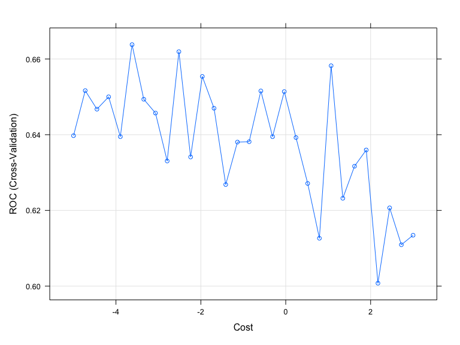

``` r
stopCluster(cl)
registerDoSEQ()

svml.fit$bestTune
```

    ##            C
    ## 6 0.02676421

``` r
#train error
train.pred.svml <- predict(svml.fit, newdata = train_class)
train.error.svml = 1-sum(train_class$recovery_time == train.pred.svml)/length(train_data$recovery_time)
sprintf("The train error for Support vector classifier is %.3f", train.error.svml)
```

    ## [1] "The train error for Support vector classifier is 0.292"

``` r
#test error
test.pred.svml <- predict(svml.fit, newdata = test_class)
test.error.svml = 1-sum(test_class$recovery_time == test.pred.svml)/length(test_class$recovery_time)
sprintf("The test error for Support vector classifier is %.3f", test.error.svml)
```

    ## [1] "The test error for Support vector classifier is 0.294"

### SVM with radial kernel

``` r
svmr.grid <- expand.grid(C = exp(seq(-1,5,len=20)),
                         sigma = exp(seq(-10,-2,len=10)))

# parallel computing
no_cores <- detectCores() - 1
cl <- makePSOCKcluster(no_cores)
registerDoParallel(cl)

# tunes over both cost and sigma
set.seed(2337)             
svmr.fit <- train(recovery_time ~ . , 
                  data = train_class,
                  method = "svmRadialSigma",
                  tuneGrid = svmr.grid,
                  trControl = ctrl_class)
```

    ## Warning in train.default(x, y, weights = w, ...): The metric "Accuracy" was not
    ## in the result set. ROC will be used instead.

    ## Warning in nominalTrainWorkflow(x = x, y = y, wts = weights, info = trainInfo,
    ## : There were missing values in resampled performance measures.

``` r
stopCluster(cl)
registerDoSEQ()


myCol<- rainbow(25)
myPar <- list(superpose.symbol = list(col = myCol),
              superpose.line = list(col = myCol))

plot(svmr.fit, highlight = TRUE, par.settings = myPar)
```

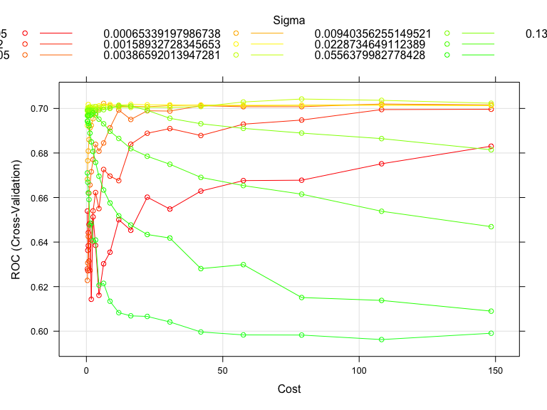

``` r
svmr.fit$bestTune
```

    ##          sigma        C
    ## 176 0.00386592 78.91892

``` r
#train error
train.pred.svmr <- predict(svmr.fit, newdata = train_class)
train.error.svmr = 1-sum(train_class$recovery_time == train.pred.svmr)/length(train_class$recovery_time)
sprintf("The train error for Support vector Machine with radial kernel is %.3f", train.error.svmr)
```

    ## [1] "The train error for Support vector Machine with radial kernel is 0.252"

``` r
#test error
test.pred.svmr <- predict(svmr.fit, newdata = test_class)
test.error.svmr = 1-sum(test_class$recovery_time == test.pred.svmr)/length(test_class$recovery_time)
sprintf("The test error for Support vector Machine with radial kernel is %.3f", test.error.svmr)
```

    ## [1] "The test error for Support vector Machine with radial kernel is 0.288"

After tuning, the cost in this range achieves local maximum accuracy.
The value is not on the boundary, hence the local maximum accuracy is
achieved. It takes a long time (aprox 30 min) to run so it may be hard
to refine into a smaller grid.

## Resampling Results and Model Selection

``` r
# parallel computing
no_cores <- detectCores() - 1
cl <- makePSOCKcluster(no_cores)
registerDoParallel(cl)

set.seed(2337)
resamp_class <- resamples(list(enet_logistic = model.glmn,
                         gam = model.gam,
                         mars = mars.fit,
                         lda = lda_model,
                         rf = rf_class_model,
                         boosting = gbmA.fit,
                         linear_svm = svml.fit,
                         radial_svm = svmr.fit))
stopCluster(cl)
registerDoSEQ()

summary(resamp_class)
```

    ## 
    ## Call:
    ## summary.resamples(object = resamp_class)
    ## 
    ## Models: enet_logistic, gam, mars, lda, rf, boosting, linear_svm, radial_svm 
    ## Number of resamples: 10 
    ## 
    ## ROC 
    ##                    Min.   1st Qu.    Median      Mean   3rd Qu.      Max. NA's
    ## enet_logistic 0.6378682 0.6902541 0.6988395 0.7043575 0.7102212 0.7767234    0
    ## gam           0.6582269 0.6979388 0.7078518 0.7137858 0.7137554 0.7971455    0
    ## mars          0.6541527 0.6992141 0.7135143 0.7135352 0.7187120 0.7921348    0
    ## lda           0.6377164 0.6883298 0.6975023 0.7035379 0.7099743 0.7763438    0
    ## rf            0.6540389 0.6831443 0.7005770 0.7057080 0.7063120 0.7725104    0
    ## boosting      0.6484531 0.6867057 0.7033979 0.7094265 0.7205468 0.7817454    0
    ## linear_svm    0.6208250 0.6432502 0.6679673 0.6637873 0.6821406 0.7217947    0
    ## radial_svm    0.6667932 0.6859264 0.6986712 0.7042262 0.7150980 0.7666262    0
    ## 
    ## Sens 
    ##                    Min.   1st Qu.    Median      Mean   3rd Qu.      Max. NA's
    ## enet_logistic 0.8483146 0.9129213 0.9245810 0.9214331 0.9325843 0.9606742    0
    ## gam           0.8707865 0.9002809 0.9103791 0.9163832 0.9314622 0.9775281    0
    ## mars          0.8483146 0.8946629 0.9047769 0.9107683 0.9325843 0.9719101    0
    ## lda           0.8707865 0.9269663 0.9325843 0.9298443 0.9413408 0.9719101    0
    ## rf            1.0000000 1.0000000 1.0000000 1.0000000 1.0000000 1.0000000    0
    ## boosting      0.9213483 0.9396067 0.9523727 0.9500471 0.9649426 0.9662921    0
    ## linear_svm    0.9775281 0.9887797 0.9971910 0.9938265 1.0000000 1.0000000    0
    ## radial_svm    0.8876404 0.9298616 0.9438202 0.9433118 0.9622199 0.9943820    0
    ## 
    ## Spec 
    ##                     Min.   1st Qu.    Median        Mean    3rd Qu.       Max.
    ## enet_logistic 0.12162162 0.1898371 0.2094595 0.208237690 0.24315068 0.26027397
    ## gam           0.20270270 0.2465753 0.2652721 0.274916698 0.29729730 0.36986301
    ## mars          0.18918919 0.2465753 0.2635135 0.266753054 0.27397260 0.35616438
    ## lda           0.13513514 0.1808589 0.1972418 0.201351351 0.23898556 0.27027027
    ## rf            0.00000000 0.0000000 0.0000000 0.000000000 0.00000000 0.00000000
    ## boosting      0.09459459 0.1491577 0.1631803 0.171584598 0.18641244 0.28767123
    ## linear_svm    0.00000000 0.0000000 0.0000000 0.006812292 0.01013514 0.04109589
    ## radial_svm    0.09459459 0.1330063 0.1643836 0.172861903 0.20830248 0.25675676
    ##               NA's
    ## enet_logistic    0
    ## gam              0
    ## mars             0
    ## lda              0
    ## rf               0
    ## boosting         0
    ## linear_svm       0
    ## radial_svm       0

``` r
parallelplot(resamp_class, metric = "ROC")
```

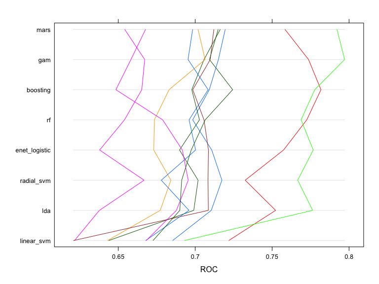

``` r
bwplot(resamp_class, metric = "ROC")
```

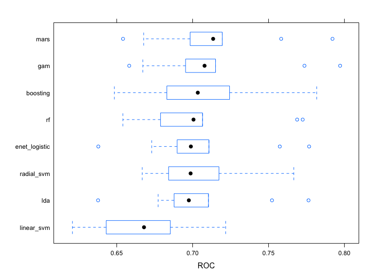
