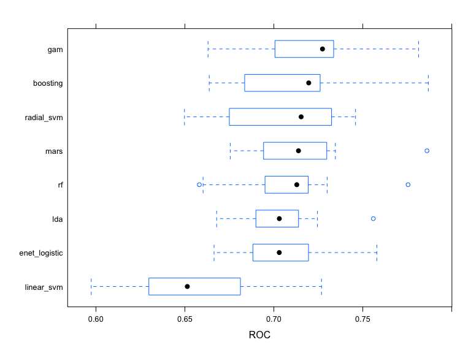

model_result_008
================
Yi Huang
2023-05-09

## Load data, data partition

``` r
# load data
load("data/covid_recovery.Rdata")

#Split data into 70-300, using the third member's uni
set.seed(2337)
indexTrain <- createDataPartition(y = data$recovery_time, p = 0.7, list = FALSE)

# training data
train_data <- data[indexTrain,]
# matrix of predictors
train_x <- model.matrix(recovery_time~.,train_data)[,-1]
# vector of response
train_y <- train_data$recovery_time

# test data
test_data <- data[-indexTrain,]
# matrix of predictors
test_x <- model.matrix(recovery_time~.,test_data)[,-1]
# vector of response
test_y <- test_data$recovery_time

# 10-fold cv
ctrl <- trainControl(method = "cv",
                     number = 10)
```

## Regression

## primary analysis (Regression)

- **Linear regression**
- **K-Nearest Neighbors (KNN)**
- **Elastic net**
- **Partial least squares (PLS)**
- **Generalized Additive Model (GAM)**
- **Multivariate Adaptive Regression Splines (MARS)**
- **Boosting**
- **Random forest**

### Linear regression

``` r
## fit linear model on train data
set.seed(8)
linear_model <- train(train_x,
                      train_y,
                      method = "lm", 
                      trControl = ctrl)
summary(linear_model)
```

    ## 
    ## Call:
    ## lm(formula = .outcome ~ ., data = dat)
    ## 
    ## Residuals:
    ##     Min      1Q  Median      3Q     Max 
    ## -73.848 -13.472  -1.414   9.399 257.759 
    ## 
    ## Coefficients:
    ##                 Estimate Std. Error t value Pr(>|t|)    
    ## (Intercept)   -2.743e+03  1.295e+02 -21.171  < 2e-16 ***
    ## age           -1.353e-02  1.177e-01  -0.115 0.908505    
    ## gender1       -4.538e+00  9.432e-01  -4.812 1.59e-06 ***
    ## race2          5.460e-01  2.166e+00   0.252 0.800997    
    ## race3         -1.639e+00  1.193e+00  -1.374 0.169550    
    ## race4         -9.671e-01  1.653e+00  -0.585 0.558518    
    ## smoking1       3.052e+00  1.066e+00   2.863 0.004236 ** 
    ## smoking2       7.843e+00  1.563e+00   5.018 5.58e-07 ***
    ## height         1.608e+01  7.612e-01  21.120  < 2e-16 ***
    ## weight        -1.733e+01  8.043e-01 -21.541  < 2e-16 ***
    ## bmi            5.195e+01  2.300e+00  22.587  < 2e-16 ***
    ## hypertension1  3.229e+00  1.560e+00   2.070 0.038547 *  
    ## diabetes1     -2.210e-01  1.277e+00  -0.173 0.862608    
    ## SBP            3.232e-04  1.012e-01   0.003 0.997453    
    ## LDL           -1.013e-02  2.499e-02  -0.405 0.685287    
    ## vaccine1      -8.167e+00  9.684e-01  -8.434  < 2e-16 ***
    ## severity1      5.717e+00  1.534e+00   3.726 0.000199 ***
    ## studyB         4.315e+00  1.215e+00   3.552 0.000389 ***
    ## studyC        -3.479e-01  1.500e+00  -0.232 0.816566    
    ## ---
    ## Signif. codes:  0 '***' 0.001 '**' 0.01 '*' 0.05 '.' 0.1 ' ' 1
    ## 
    ## Residual standard error: 23.58 on 2498 degrees of freedom
    ## Multiple R-squared:  0.2754, Adjusted R-squared:  0.2702 
    ## F-statistic: 52.75 on 18 and 2498 DF,  p-value: < 2.2e-16

``` r
# view performance on the test set (RMSE)
lm_test_pred <- predict(linear_model, newdata = test_x) # test dataset
lm_test_rmse <- sqrt(mean((lm_test_pred - test_y)^2))
sprintf("test error for lm is: %.3f",lm_test_rmse)
```

    ## [1] "test error for lm is: 23.569"

### K-Nearest Neighbors (KNN)

``` r
set.seed(8)
# fit knn on train data use caret
kGrid <- expand.grid(k = seq(1, to = 40, by = 1))
knn_model <- train(train_x,
                   train_y,
                   method = "knn",
                   trControl = ctrl,
                   tuneGrid = kGrid)
ggplot(knn_model, highlight = TRUE)
```


``` r
# knn with K = 18 was selected as the final model

# view performance on the test set (RMSE)
knn_test_pred <- predict(knn_model, newdata = test_x) # test dataset
knn_test_rmse <- sqrt(mean((knn_test_pred - test_y)^2))
sprintf("test error for K-Nearest Neighbors is: %.3f", knn_test_rmse)
```

    ## [1] "test error for K-Nearest Neighbors is: 25.181"

### Enet

``` r
#tuning glmnet alpha 0 and 0.05 have large RMSE. So alpha start from 0.1
set.seed(8)
enet.fit.min <- train(train_x, train_y,
                  method = "glmnet",
                  tuneGrid = expand.grid(alpha = seq(0.1, 1, length = 21), 
                                         lambda = exp(seq(-10, -5, length = 100))),
                  trControl = ctrl)
enet.fit.min$bestTune
```

    ##     alpha     lambda
    ## 289  0.19 0.00386592

``` r
plot(enet.fit.min)
```


``` r
# view performance on the test set (RMSE)
enet_test_pred <- predict(enet.fit.min, newdata = test_x) # test dataset
enet_test_rmse <- sqrt(mean((enet_test_pred - test_y)^2))
sprintf("test error for enet is: %.3f",enet_test_rmse)
```

    ## [1] "test error for enet is: 23.523"

### PLS

``` r
set.seed(8)
pls_model <- train(train_x,
                   train_y,
                   method = "pls",
                   tuneGrid = data.frame(ncomp = 1:16),
                   trControl = ctrl,
                   preProcess = c("center", "scale"))
ggplot(pls_model, highlight = TRUE)
```


``` r
ggsave(file = "image/pls_number_of_component.png", width = 10, height = 7)

# view performance on the test set (RMSE)
pls_test_pred <- predict(pls_model, newdata = test_x) # test dataset
pls_test_rmse <- sqrt(mean((pls_test_pred - test_y)^2))
sprintf("test error for pls is: %.3f",pls_test_rmse)
```

    ## [1] "test error for pls is: 23.569"

### Generalised additive regression (GAM)

``` r
# gam use caret
# fit GAM model using all predictors
# parallel computing
no_cores <- detectCores() - 1
cl <- makePSOCKcluster(no_cores)
registerDoParallel(cl)
set.seed(8)
gam_model <- train(train_x, train_y, # training dataset
                   method = "gam",
                   trControl = ctrl,
                   control = gam.control(maxit = 200)) 
stopCluster(cl)
registerDoSEQ()

gam_model$bestTune
```

    ##   select method
    ## 2   TRUE GCV.Cp

``` r
gam_model$finalModel
```

    ## 
    ## Family: gaussian 
    ## Link function: identity 
    ## 
    ## Formula:
    ## .outcome ~ gender1 + race2 + race3 + race4 + smoking1 + smoking2 + 
    ##     hypertension1 + diabetes1 + vaccine1 + severity1 + studyB + 
    ##     studyC + s(age) + s(SBP) + s(LDL) + s(bmi) + s(height) + 
    ##     s(weight)
    ## 
    ## Estimated degrees of freedom:
    ## 0.00 0.00 0.00 7.78 2.65 4.50  total = 27.93 
    ## 
    ## GCV score: 448.2538

``` r
plot(gam_model)
```


``` r
summary(gam_model$finalModel)
```

    ## 
    ## Family: gaussian 
    ## Link function: identity 
    ## 
    ## Formula:
    ## .outcome ~ gender1 + race2 + race3 + race4 + smoking1 + smoking2 + 
    ##     hypertension1 + diabetes1 + vaccine1 + severity1 + studyB + 
    ##     studyC + s(age) + s(SBP) + s(LDL) + s(bmi) + s(height) + 
    ##     s(weight)
    ## 
    ## Parametric coefficients:
    ##               Estimate Std. Error t value Pr(>|t|)    
    ## (Intercept)    43.7183     1.3232  33.040  < 2e-16 ***
    ## gender1        -4.6981     0.8434  -5.570 2.82e-08 ***
    ## race2           0.5405     1.9332   0.280 0.779829    
    ## race3          -1.5605     1.0659  -1.464 0.143332    
    ## race4          -2.6252     1.4791  -1.775 0.076054 .  
    ## smoking1        4.3355     0.9556   4.537 5.98e-06 ***
    ## smoking2        8.0325     1.3975   5.748 1.01e-08 ***
    ## hypertension1   3.0143     0.8471   3.558 0.000380 ***
    ## diabetes1       0.6857     1.1425   0.600 0.548453    
    ## vaccine1       -7.7120     0.8649  -8.916  < 2e-16 ***
    ## severity1       5.9722     1.3716   4.354 1.39e-05 ***
    ## studyB          4.1736     1.0846   3.848 0.000122 ***
    ## studyC         -0.6406     1.3400  -0.478 0.632678    
    ## ---
    ## Signif. codes:  0 '***' 0.001 '**' 0.01 '*' 0.05 '.' 0.1 ' ' 1
    ## 
    ## Approximate significance of smooth terms:
    ##                 edf Ref.df       F p-value    
    ## s(age)    1.123e-06      9   0.000 0.55847    
    ## s(SBP)    8.397e-07      9   0.000 0.68712    
    ## s(LDL)    1.176e-06      9   0.000 0.51661    
    ## s(bmi)    7.775e+00      9 111.700 < 2e-16 ***
    ## s(height) 2.649e+00      9   1.019 0.00269 ** 
    ## s(weight) 4.501e+00      9   1.049 0.04744 *  
    ## ---
    ## Signif. codes:  0 '***' 0.001 '**' 0.01 '*' 0.05 '.' 0.1 ' ' 1
    ## 
    ## R-sq.(adj) =  0.418   Deviance explained = 42.5%
    ## GCV = 448.25  Scale est. = 443.28    n = 2517

``` r
# view performance on the test set (RMSE)
gam_test_pred <- predict(gam_model, newdata = test_x) # test dataset
gam_test_rmse <- sqrt(mean((gam_test_pred - test_y)^2))
sprintf("test error for Generalised additive regression is: %.3f", knn_test_rmse)
```

    ## [1] "test error for Generalised additive regression is: 25.181"

### Multivariate adaptive regression

``` r
set.seed(8)

# create dummy variables for categorical variables
df_dummies <- data.frame(model.matrix(~ . - 1, 
                                      # exclude ID and continuous variables
                                      data = data[, c("gender", "race", "smoking", "hypertension", "diabetes",
                                                     "vaccine", "severity", "study")]), 
                         # add continuous variables back to the data frame
                         age = data$age,
                         height = data$height,
                         weight = data$weight,
                         bmi = data$bmi,
                         SBP = data$SBP,
                         LDL = data$LDL,
                         recovery_time = data$recovery_time) 

# rename df_dummies dataset as dat
dat_mars <- df_dummies

# training data
dat_train_mars <- dat_mars[indexTrain, ]
x_mars <- model.matrix(recovery_time~.,dat_mars)[indexTrain,-1]
y_mars <- dat_mars$recovery_time[indexTrain]

# test data
dat_test_mars <- dat_mars[-indexTrain, ]
x2_mars <- model.matrix(recovery_time~.,dat_mars)[-indexTrain,-1]
y2_mars <- dat_mars$recovery_time[-indexTrain]


# create grid of all possible pairs that can take degree and nprune values
mars_grid <- expand.grid(degree = 1:3, # number of possible product hinge functions in 1 term
                         nprune = 2:20) # upper bound of number of terms in model
# parallel computing
cl <- makePSOCKcluster(no_cores)
registerDoParallel(cl)

mars_model <- train(x_mars, y_mars, # training dataset
                  method = "earth",
                  tuneGrid = mars_grid,
                  trControl = ctrl)

stopCluster(cl)
registerDoSEQ()

ggplot(mars_model)
```


``` r
print(plot(mars_model))
```


``` r
summary(mars_model$finalModel)
```

    ## Call: earth(x=matrix[2517,19], y=c(14,36,50,65,3...), keepxy=TRUE, degree=2,
    ##             nprune=5)
    ## 
    ##                      coefficients
    ## (Intercept)             -1.264634
    ## vaccine1                -7.897168
    ## h(bmi-25.9)              8.611315
    ## h(32.6-bmi)              5.699561
    ## studyB * h(bmi-32.6)    41.724058
    ## 
    ## Selected 5 of 24 terms, and 3 of 19 predictors (nprune=5)
    ## Termination condition: Reached nk 39
    ## Importance: studyB, bmi, vaccine1, gender0-unused, gender1-unused, ...
    ## Number of terms at each degree of interaction: 1 3 1
    ## GCV 413.5903    RSS 1031928    GRSq 0.4574914    RSq 0.4617953

``` r
# view performance on the test set (RMSE)
mars_test_pred <- predict(mars_model, newdata = x2_mars) # test dataset
mars_test_rmse <- sqrt(mean((mars_test_pred - test_y)^2))
sprintf("test error for MARS is: %.3f", mars_test_rmse)
```

    ## [1] "test error for MARS is: 22.586"

### Random Forest - Regression

``` r
set.seed(8)
rf.grid <- expand.grid(mtry = 1:14,
                       splitrule = "variance",
                       min.node.size = seq(from = 1, to = 50, by = 5))

# parallel computing
no_cores <- detectCores() - 1
cl <- makePSOCKcluster(no_cores)
registerDoParallel(cl)

set.seed(8)
rf_model <- train(recovery_time ~ . , 
                  train_data, 
                  method = "ranger",
                  tuneGrid = rf.grid,
                  trControl = ctrl)

stopCluster(cl)
registerDoSEQ()
ggplot(rf_model, highlight = TRUE)
```

    ## Warning: The shape palette can deal with a maximum of 6 discrete values because
    ## more than 6 becomes difficult to discriminate; you have 10. Consider
    ## specifying shapes manually if you must have them.

    ## Warning: Removed 56 rows containing missing values (`geom_point()`).


``` r
rf_model$bestTune
```

    ##     mtry splitrule min.node.size
    ## 122   13  variance             6

``` r
# variable importance
rf.final.per <- ranger(recovery_time ~ . , 
                       train_data,
                       mtry = rf_model$bestTune[[1]], 
                       splitrule = "variance",
                       min.node.size = rf_model$bestTune[[3]],
                       importance = "permutation",
                       scale.permutation.importance = TRUE) 

barplot(sort(ranger::importance(rf.final.per), decreasing = FALSE), 
        las = 2, horiz = TRUE, cex.names = 0.7,
        col = colorRampPalette(colors = c("cyan","blue"))(19))
```


``` r
# view performance on the test set (RMSE)
rf_test_pred <- predict(rf_model, newdata = test_data) # test dataset
rf_test_rmse <- sqrt(mean((rf_test_pred - test_y)^2))
sprintf("test error for Random Forest is: %.3f", rf_test_rmse)
```

    ## [1] "test error for Random Forest is: 21.965"

### Boosting

``` r
gbm.grid <- expand.grid(n.trees = c(500,1000,2000,3000,4000,5000),
                        interaction.depth = 1:5,
                        shrinkage = c(0.005,0.01),
                        n.minobsinnode = c(1))
no_cores <- detectCores() - 1
cl <- makePSOCKcluster(no_cores)
registerDoParallel(cl)
set.seed(8)
gbm.fit = train(recovery_time~. ,
                  train_data,
                  tuneGrid = gbm.grid,
                  trControl = ctrl,
                  method = "gbm",
                  verbose = FALSE)
stopCluster(cl)
registerDoSEQ()

ggplot(gbm.fit, highlight = TRUE)
```


``` r
gbm.fit$bestTune
```

    ##    n.trees interaction.depth shrinkage n.minobsinnode
    ## 15    2000                 3     0.005              1

``` r
# test error
gbm.fit.predict = predict(gbm.fit, newdata = test_data)
RMSE(gbm.fit.predict, test_y)
```

    ## [1] 21.36644

## resampling on train

``` r
# parallel computing
no_cores <- detectCores() - 1
cl <- makePSOCKcluster(no_cores)
registerDoParallel(cl)
set.seed(8)

resamp <- resamples(list(lm = linear_model,
                         knn = knn_model,
                         enet = enet.fit.min,
                         pls = pls_model,
                         gam = gam_model,
                         mars = mars_model,
                         rf = rf_model,
                         boosting = gbm.fit))

stopCluster(cl)
registerDoSEQ()

summary(resamp)
```

    ## 
    ## Call:
    ## summary.resamples(object = resamp)
    ## 
    ## Models: lm, knn, enet, pls, gam, mars, rf, boosting 
    ## Number of resamples: 10 
    ## 
    ## MAE 
    ##              Min.  1st Qu.   Median     Mean  3rd Qu.     Max. NA's
    ## lm       13.76934 15.43334 15.76924 15.80693 16.17432 18.11764    0
    ## knn      14.06701 15.73153 16.09257 16.03670 16.46648 17.89633    0
    ## enet     13.69102 15.32867 15.68785 15.72506 16.12487 18.10713    0
    ## pls      13.76888 15.43393 15.76897 15.80691 16.17445 18.11772    0
    ## gam      13.19262 14.38982 14.82480 14.68947 15.13537 15.73301    0
    ## mars     12.27144 14.08073 14.54892 14.38932 14.86938 15.47013    0
    ## rf       13.28202 13.87283 14.49171 14.30696 14.74181 15.15497    0
    ## boosting 12.32434 13.76258 14.07635 13.93779 14.36728 15.05691    0
    ## 
    ## RMSE 
    ##              Min.  1st Qu.   Median     Mean  3rd Qu.     Max. NA's
    ## lm       18.88430 22.10438 22.77336 23.52201 24.82757 31.01445    0
    ## knn      20.00557 22.68863 24.49846 24.76979 25.77652 31.87127    0
    ## enet     18.77573 22.05979 22.71284 23.51269 24.86986 31.21659    0
    ## pls      18.88388 22.10432 22.77337 23.52193 24.82749 31.01461    0
    ## gam      19.48652 20.31487 20.88715 21.80966 23.40153 25.55548    0
    ## mars     17.21334 19.26111 20.02599 20.54374 22.01000 23.98902    0
    ## rf       17.79759 19.40633 20.60269 20.76831 22.42284 23.59035    0
    ## boosting 16.89195 19.27883 20.37222 20.28145 21.75394 23.36495    0
    ## 
    ## Rsquared 
    ##                Min.   1st Qu.    Median      Mean   3rd Qu.      Max. NA's
    ## lm       0.15262099 0.2417259 0.2664909 0.2612246 0.2814750 0.3695876    0
    ## knn      0.06890501 0.1229402 0.1601685 0.1838074 0.1914104 0.3999299    0
    ## enet     0.15157916 0.2419275 0.2660519 0.2606718 0.2821525 0.3650478    0
    ## pls      0.15266199 0.2417286 0.2664926 0.2612288 0.2814784 0.3695807    0
    ## gam      0.19032422 0.3458940 0.3645476 0.3822057 0.4249498 0.6033048    0
    ## mars     0.17813209 0.3790794 0.4295123 0.4310183 0.5145510 0.5980581    0
    ## rf       0.23449216 0.3940702 0.4288848 0.4227968 0.4520670 0.6156429    0
    ## boosting 0.21179764 0.4242251 0.4766269 0.4578489 0.5023122 0.6160659    0

``` r
parallelplot(resamp, metric = "RMSE")
```


``` r
bwplot(resamp, metric = "RMSE")
```


## Classification

### Data Manipulation

We consider time to recovery as a binary outcome as long(\>30 days) and
short (\<= 30 days).

``` r
#consider time to recovery as a binary outcome (>30 days vs. <= 30 days) and develop a prediction model for this binary outcome.
train_class = 
  train_data %>% 
  mutate(recovery_time = ifelse(recovery_time>30, "long", "short")) 
test_class = 
  test_data %>% 
  mutate(recovery_time = ifelse(recovery_time>30, "long", "short")) 

# matrix of predictors
x_train_class <- model.matrix(recovery_time~.,train_class)[,-1]
# vector of response
y_train_class <- train_class$recovery_time


# matrix of predictors
x_test_class <- model.matrix(recovery_time~.,test_class)[,-1]
# vector of response
y_test_class <- test_class$recovery_time


# ctrl for class
ctrl_class <- trainControl(method = "cv",
                     summaryFunction = twoClassSummary,
                     classProbs = TRUE)
```

#### Modeling Strategy

- **Penalized logistic regression**
- **Generalized additive model (GAM)**
- **Multivariate adaptive regression splines (MARS)**
- **Linear discriminant analysis (LDA)**
- **Classification and Regression Tree (CART)**
- **Random Forest**
- **Boosting**
- **Support Vector Machine (SVM with Linear and Radial Kernels)**

### Penalized logistic regression

``` r
glmnGrid <- expand.grid(.alpha = seq(0, 1, length = 21),
                        .lambda = exp(seq(-12, -7, length = 50)))
set.seed(8)
model.glmn <- train(x = x_train_class,
                    y = y_train_class,
                    method = "glmnet",
                    tuneGrid = glmnGrid,
                    metric = "ROC",
                    trControl = ctrl_class)

model.glmn$bestTune
```

    ##     alpha       lambda
    ## 524   0.5 6.422865e-05

``` r
myCol<- rainbow(25)
myPar <- list(superpose.symbol = list(col = myCol),
              superpose.line = list(col = myCol))

plot(model.glmn, par.settings = myPar, xTrans = function(x) log(x))
```


``` r
# view performance on the test set (accuracy)
glmn_class_test_pred <- predict(model.glmn, newdata=x_test_class) # test dataset
glmn_class_test_acc <- sum(glmn_class_test_pred==y_test_class)/length(y_test_class)
sprintf("test error for penalized logistic is: %.3f",1-glmn_class_test_acc)
```

    ## [1] "test error for penalized logistic is: 0.286"

Since the boundary value for $\lambda$ is exp(-10)=4.54e-5 and
exp(-5)=0.007, and the optimal lambda is not on the boundary. So local
minimum is achieved.

### Gam

``` r
# gam
set.seed(8)
model.gam <- train(x = x_train_class,
                   y = y_train_class,
                   method = "gam",
                   tuneGrid = data.frame(method = "GCV.Cp", select = c(TRUE,FALSE)),
                   metric = "ROC",
                   trControl = ctrl_class)

model.gam$bestTune
```

    ##   select method
    ## 2   TRUE GCV.Cp

``` r
model.gam$finalModel
```

    ## 
    ## Family: binomial 
    ## Link function: logit 
    ## 
    ## Formula:
    ## .outcome ~ gender1 + race2 + race3 + race4 + smoking1 + smoking2 + 
    ##     hypertension1 + diabetes1 + vaccine1 + severity1 + studyB + 
    ##     studyC + s(age) + s(SBP) + s(LDL) + s(bmi) + s(height) + 
    ##     s(weight)
    ## 
    ## Estimated degrees of freedom:
    ## 0.0002 3.0898 0.1982 3.8717 1.9808 0.0001  total = 22.14 
    ## 
    ## UBRE score: 0.07604226

``` r
#discover bmi and recovery time
plot(model.gam$finalModel, select = 4)
```


``` r
#train error
train.pred.gam <- predict(model.gam, newdata = x_train_class)
train.error.gam = 1-sum(train_class$recovery_time == train.pred.gam)/length(train_data$recovery_time)
sprintf("The train error for GAM is %.3f", train.error.gam)
```

    ## [1] "The train error for GAM is 0.266"

``` r
#test error
test.pred.gam <- predict(model.gam, newdata = x_test_class)
test.error.gam = 1-sum(test_class$recovery_time == test.pred.gam)/length(test_class$recovery_time)
sprintf("The test error for GAM is %.3f", test.error.gam)
```

    ## [1] "The test error for GAM is 0.283"

### MARS

``` r
set.seed(8)
mars.fit = train(x = x_train_class,
                        y =  y_train_class,
                         method = "earth",
                         tuneGrid = expand.grid(degree = 1:3, 
                                                nprune = 2:20),
                         metric = "ROC",
                         trControl = ctrl_class)
plot(mars.fit)
```


``` r
#train error
train.pred.mars = predict(mars.fit , newdata = x_train_class)
train.error.mars = 1-sum(train_class$recovery_time == train.pred.mars)/length(train_data$recovery_time)
sprintf("The train error for MARS is %.3f", train.error.mars)
```

    ## [1] "The train error for MARS is 0.265"

``` r
#test error
test.pred.mars = predict(mars.fit , newdata = x_test_class)
test.error.mars = 1-sum(test_class$recovery_time == test.pred.mars)/length(test_class$recovery_time)
sprintf("The test error for MARS is %.3f", test.error.mars)
```

    ## [1] "The test error for MARS is 0.280"

### Linear discriminant analysis (LDA)

``` r
set.seed(8)
# Using MASS
lda.fit <- lda(recovery_time~., 
               data = train_class)
plot(lda.fit)
```


``` r
lda.fit$scaling
```

    ##                        LD1
    ## age           -0.005230071
    ## gender1        0.582852115
    ## race2          0.111644453
    ## race3         -0.015332625
    ## race4          0.078103928
    ## smoking1      -0.395459244
    ## smoking2      -0.628005874
    ## height        -0.497778576
    ## weight         0.538847538
    ## bmi           -1.636992668
    ## hypertension1 -0.368808467
    ## diabetes1     -0.053193708
    ## SBP            0.010681574
    ## LDL           -0.003381055
    ## vaccine1       0.854566384
    ## severity1     -0.726871127
    ## studyB         1.410574304
    ## studyC        -0.044449352

``` r
set.seed(8)
# Using caret
lda_model <- train(x_train_class, #train x
                   y_train_class, #train y 
                   method = "lda", 
                   metric = "ROC", 
                   trControl = ctrl_class)
summary(lda_model)
```

    ##             Length Class      Mode     
    ## prior        2     -none-     numeric  
    ## counts       2     -none-     numeric  
    ## means       36     -none-     numeric  
    ## scaling     18     -none-     numeric  
    ## lev          2     -none-     character
    ## svd          1     -none-     numeric  
    ## N            1     -none-     numeric  
    ## call         3     -none-     call     
    ## xNames      18     -none-     character
    ## problemType  1     -none-     character
    ## tuneValue    1     data.frame list     
    ## obsLevels    2     -none-     character
    ## param        0     -none-     list

``` r
#train error
train.pred.lda <- predict(lda_model, newdata = x_train_class)
train.error.lda = 1 - sum(train_class$recovery_time == train.pred.lda)/length(train_data$recovery_time)
sprintf("The train error for LDA is %.3f", train.error.lda)
```

    ## [1] "The train error for LDA is 0.277"

``` r
#test error
test.pred.lda <- predict(lda_model, newdata = x_test_class)
test.error.lda = 1 - sum(test_class$recovery_time == test.pred.lda)/length(test_class$recovery_time)
sprintf("The test error for LDA is %.3f", test.error.lda)
```

    ## [1] "The test error for LDA is 0.287"

### Random Forest - Classification

``` r
set.seed(8)
cl <- makePSOCKcluster(no_cores)
registerDoParallel(cl)
rf.grid <- expand.grid(mtry = 1:18,
                       splitrule = "gini",
                       min.node.size = seq(from = 1, to = 50, by = 5))

set.seed(8)
rf_class_model <- train(x_train_class,
                        y_train_class,
                        method = "ranger",
                        importance = "permutation",
                        tuneGrid = rf.grid,
                        metric = "ROC",
                        trControl = ctrl_class)
stopCluster(cl)
registerDoSEQ()

ggplot(rf_class_model, highlight = TRUE)
```

    ## Warning: The shape palette can deal with a maximum of 6 discrete values because
    ## more than 6 becomes difficult to discriminate; you have 10. Consider
    ## specifying shapes manually if you must have them.

    ## Warning: Removed 72 rows containing missing values (`geom_point()`).


``` r
rf_class_model$bestTune
```

    ##   mtry splitrule min.node.size
    ## 9    1      gini            41

``` r
#train error
train.pred.rf <- predict(lda_model, newdata = x_train_class)
train.error.ef = 1 - sum(train_class$recovery_time == train.pred.lda)/length(train_data$recovery_time)
sprintf("The train error for LDA is %.3f", train.error.lda)
```

    ## [1] "The train error for LDA is 0.277"

``` r
#test error
test.pred.rf <- predict(rf_class_model, newdata = x_test_class)
test.error.rf = 1 - sum(test_class$recovery_time == test.pred.rf)/length(test_class$recovery_time)
sprintf("The test error for Random Forest is %.3f", test.error.rf)
```

    ## [1] "The test error for Random Forest is 0.293"

### Boosting

``` r
gbmA.grid = expand.grid(n.trees = c(10000,20000,30000,40000),
                         interaction.depth = 1:3,
                         shrinkage = c(0.0003,0.0005,0.001),
                         n.minobsinnode = 1)

cl <- makePSOCKcluster(no_cores)
registerDoParallel(cl)
set.seed(8)
gbmA.fit = train(recovery_time~. ,
                  train_class,
                  tuneGrid = gbmA.grid,
                  trControl = ctrl_class,
                  method = "gbm",
                  distribution = "adaboost",
                  metric = "ROC",
                  verbose = FALSE)

stopCluster(cl)
registerDoSEQ()

ggplot(gbmA.fit, highlight = TRUE)
```


``` r
#train error
train.pred.boosting = predict(gbmA.fit , newdata = train_class, type = "raw")
train.error.boosting = 1-sum(train_class$recovery_time == train.pred.boosting)/length(train_data$recovery_time)
# sprintf("The train error for boosting is %.3f", train.pred.boosting)

#test error
test.pred.boosting = predict(gbmA.fit , newdata = test_class, type = "raw")
test.error.boosting = 1-sum(test_class$recovery_time == test.pred.boosting)/length(test_class$recovery_time)
# sprintf("The test error for boosting is %.3f", train.pred.boosting)
```

### linear SVM

``` r
# parallel computing
no_cores <- detectCores() - 1
cl <- makePSOCKcluster(no_cores)
registerDoParallel(cl)

# kernlab
set.seed(8)
svml.fit <- train(recovery_time ~ . , 
                  data = train_class, 
                  method = "svmLinear",
                  tuneGrid = data.frame(C = exp(seq(-5,3,len=30))),
                  trControl = ctrl_class)
```

    ## maximum number of iterations reached 0.008313212 0.00758091

``` r
plot(svml.fit, highlight = TRUE, xTrans = log)
```


``` r
stopCluster(cl)
registerDoSEQ()

svml.fit$bestTune
```

    ##            C
    ## 16 0.4222875

``` r
#train error
train.pred.svml <- predict(svml.fit, newdata = train_class)
train.error.svml = 1-sum(train_class$recovery_time == train.pred.svml)/length(train_data$recovery_time)
sprintf("The train error for Support vector classifier is %.3f", train.error.svml)
```

    ## [1] "The train error for Support vector classifier is 0.292"

``` r
#test error
test.pred.svml <- predict(svml.fit, newdata = test_class)
test.error.svml = 1-sum(test_class$recovery_time == test.pred.svml)/length(test_class$recovery_time)
sprintf("The test error for Support vector classifier is %.3f", test.error.svml)
```

    ## [1] "The test error for Support vector classifier is 0.292"

### SVM with radial kernel

``` r
svmr.grid <- expand.grid(C = exp(seq(-1,5,len=20)),
                         sigma = exp(seq(-10,-2,len=10)))

# parallel computing
no_cores <- detectCores() - 1
cl <- makePSOCKcluster(no_cores)
registerDoParallel(cl)

# tunes over both cost and sigma
set.seed(8)             
svmr.fit <- train(recovery_time ~ . , 
                  data = train_class,
                  method = "svmRadialSigma",
                  tuneGrid = svmr.grid,
                  trControl = ctrl_class)
```

    ## Warning in train.default(x, y, weights = w, ...): The metric "Accuracy" was not
    ## in the result set. ROC will be used instead.

    ## Warning in nominalTrainWorkflow(x = x, y = y, wts = weights, info = trainInfo,
    ## : There were missing values in resampled performance measures.

``` r
stopCluster(cl)
registerDoSEQ()


myCol<- rainbow(25)
myPar <- list(superpose.symbol = list(col = myCol),
              superpose.line = list(col = myCol))

plot(svmr.fit, highlight = TRUE, par.settings = myPar)
```


``` r
svmr.fit$bestTune
```

    ##          sigma        C
    ## 186 0.00386592 108.2248

``` r
#train error
train.pred.svmr <- predict(svmr.fit, newdata = train_class)
train.error.svmr = 1-sum(train_class$recovery_time == train.pred.svmr)/length(train_class$recovery_time)
sprintf("The train error for Support vector Machine with radial kernel is %.3f", train.error.svmr)
```

    ## [1] "The train error for Support vector Machine with radial kernel is 0.253"

``` r
#test error
test.pred.svmr <- predict(svmr.fit, newdata = test_class)
test.error.svmr = 1-sum(test_class$recovery_time == test.pred.svmr)/length(test_class$recovery_time)
sprintf("The test error for Support vector Machine with radial kernel is %.3f", test.error.svmr)
```

    ## [1] "The test error for Support vector Machine with radial kernel is 0.287"

After tuning, the cost in this range achieves local maximum accuracy.
The value is not on the boundary, hence the local maximum accuracy is
achieved. It takes a long time (aprox 30 min) to run so it may be hard
to refine into a smaller grid.

## Resampling Results and Model Selection

``` r
# parallel computing
no_cores <- detectCores() - 1
cl <- makePSOCKcluster(no_cores)
registerDoParallel(cl)

set.seed(8)
resamp_class <- resamples(list(enet_logistic = model.glmn,
                         gam = model.gam,
                         mars = mars.fit,
                         lda = lda_model,
                         rf = rf_class_model,
                         boosting = gbmA.fit,
                         linear_svm = svml.fit,
                         radial_svm = svmr.fit))
stopCluster(cl)
registerDoSEQ()

summary(resamp_class)
```

    ## 
    ## Call:
    ## summary.resamples(object = resamp_class)
    ## 
    ## Models: enet_logistic, gam, mars, lda, rf, boosting, linear_svm, radial_svm 
    ## Number of resamples: 10 
    ## 
    ## ROC 
    ##                    Min.   1st Qu.    Median      Mean   3rd Qu.      Max. NA's
    ## enet_logistic 0.6663845 0.6916323 0.7030456 0.7056743 0.7172502 0.7578955    0
    ## gam           0.6629983 0.7008386 0.7273357 0.7181658 0.7329373 0.7813544    0
    ## mars          0.6754859 0.6981644 0.7138398 0.7158095 0.7261717 0.7860613    0
    ## lda           0.6678467 0.6923371 0.7030800 0.7045736 0.7133253 0.7559217    0
    ## rf            0.6581385 0.6979566 0.7128826 0.7088842 0.7190473 0.7754327    0
    ## boosting      0.6636805 0.6886796 0.7195946 0.7130213 0.7257773 0.7868205    0
    ## linear_svm    0.5973526 0.6325420 0.6513609 0.6564019 0.6793198 0.7267970    0
    ## radial_svm    0.6497614 0.6808119 0.7153345 0.7049381 0.7314020 0.7458827    0
    ## 
    ## Sens 
    ##                    Min.   1st Qu.    Median      Mean   3rd Qu.      Max. NA's
    ## enet_logistic 0.8882682 0.9016854 0.9299793 0.9236991 0.9410112 0.9606742    0
    ## gam           0.8651685 0.8867303 0.9157303 0.9130532 0.9353933 0.9606742    0
    ## mars          0.8820225 0.9007046 0.9073034 0.9124663 0.9186649 0.9606742    0
    ## lda           0.8932584 0.9073034 0.9271703 0.9270667 0.9438202 0.9662921    0
    ## rf            1.0000000 1.0000000 1.0000000 1.0000000 1.0000000 1.0000000    0
    ## boosting      0.9325843 0.9455307 0.9662921 0.9629810 0.9719101 0.9943820    0
    ## linear_svm    0.9831461 0.9943899 1.0000000 0.9955182 1.0000000 1.0000000    0
    ## radial_svm    0.8882682 0.9035136 0.9269663 0.9338271 0.9592697 0.9887640    0
    ## 
    ## Spec 
    ##                     Min.    1st Qu.    Median        Mean    3rd Qu.       Max.
    ## enet_logistic 0.17567568 0.18085894 0.2313032 0.217752684 0.24315068 0.27027027
    ## gam           0.20270270 0.21959459 0.2448167 0.268196964 0.32427805 0.36986301
    ## mars          0.17567568 0.21695668 0.2584228 0.270936690 0.33214550 0.36986301
    ## lda           0.12162162 0.17627730 0.2313032 0.211014439 0.24315068 0.27027027
    ## rf            0.00000000 0.00000000 0.0000000 0.000000000 0.00000000 0.00000000
    ## boosting      0.06756757 0.08820807 0.1095890 0.117049241 0.13217327 0.18918919
    ## linear_svm    0.00000000 0.00000000 0.0000000 0.009570529 0.02392632 0.02739726
    ## radial_svm    0.10958904 0.13231211 0.1891892 0.179563125 0.21283784 0.26027397
    ##               NA's
    ## enet_logistic    0
    ## gam              0
    ## mars             0
    ## lda              0
    ## rf               0
    ## boosting         0
    ## linear_svm       0
    ## radial_svm       0

``` r
parallelplot(resamp_class, metric = "ROC")
```


``` r
bwplot(resamp_class, metric = "ROC")
```


